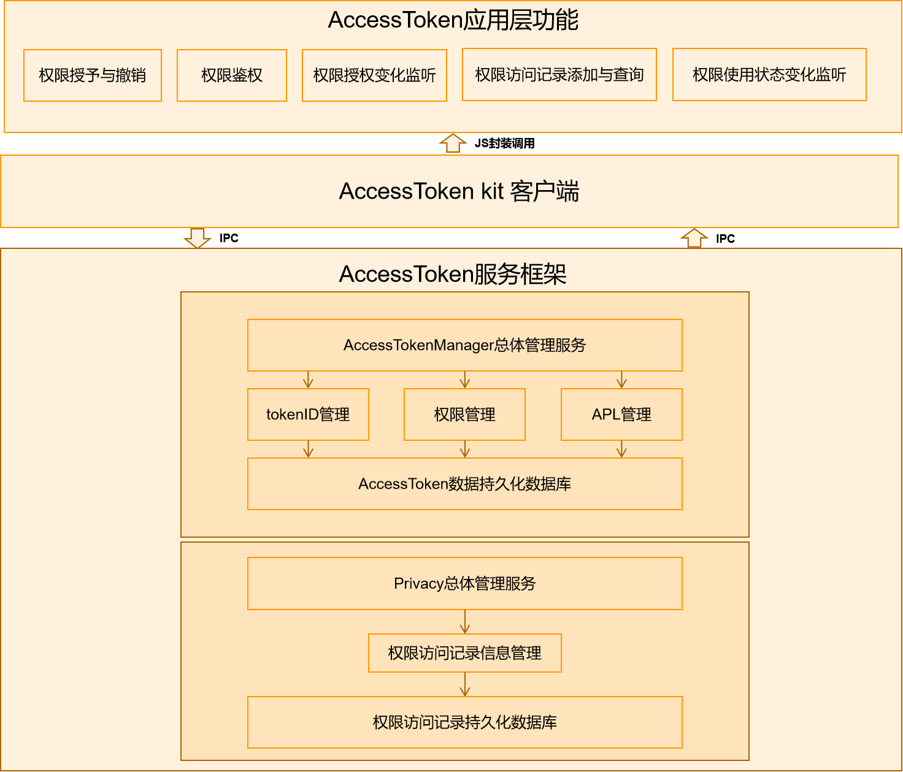

# 访问控制部件<a name="ZH-CN_TOPIC_0000001101239136"></a>

 - [简介<a name="section11660541593"></a>](#简介)
 - [目录<a name="section161941989596"></a>](#目录)
 - [使用<a name="section137768191623"></a>](#使用)
  - [接口说明<a name="section1551164914237"></a>](#接口说明)
  - [使用说明<a name="section129654513264"></a>](#使用说明)
   - [native进程](#native进程)
   - [应用hap](#应用hap)
 - [相关仓<a name="section1371113476307"></a>](#相关仓)

## 简介<a name="section11660541593"></a>

ATM(AccessTokenManager)是OpenHarmony上基于AccessToken构建的统一的应用权限管理能力。

应用的Accesstoken信息主要包括应用身份标识APPID、用户ID，应用分身索引、应用APL(Ability Privilege Level)等级、应用权限信息等。每个应用的Accesstoken信息由一个32bits的设备内唯一标识符TokenID(Token identity)来标识。

ATM模块主要提供如下功能：
-   提供基于TokenID的应用权限校验机制，应用访问敏感数据或者API时可以检查是否有对应的权限。
-   提供基于TokenID的Accesstoken信息查询，应用可以根据TokenID查询自身的APL等级等信息。

ATM部件的架构图如下所示：


## 目录<a name="section161941989596"></a>

```
/base/security/access_token
├── frameworks                  # 框架层，基础功能代码存放目录
│   ├── accesstoken             # Accesstoken管理框架代码存放目录
│   ├── common                  # 框架公共代码存放目录
│   ├── privacy                 # privacy管理框架代码存放目录
│   └── tokensync               # Accesstoken信息同步框架代码存放目录
├── interfaces                  # 接口层
│   └── innerkits               # 内部接口层
│   │   ├── accesstoken         # Accesstoken内部接口代码存放目录
│   │   ├── nativetoken         # nativetoken内部接口代码存放目录
│   │   ├── privacy             # privacy内部接口代码存放目录
│   │   ├── token_callback      # 回调内部接口代码存放目录
│   │   ├── token_setproc       # tokenid内核交互内部接口代码存放目录
│   │   └── tokensync           # Accesstoken信息同步内部接口代码存放目录
│   └── kits                    # 外部接口层
│   │   ├── accesstoken         # Accesstoken外部接口代码存放目录
│   │   ├── common              # 外部接口公共代码存放目录
│   │   └── privacy             # privacy信息外部接口代码存放目录
└── services                    # 服务层
    ├── accesstokenmanager      # Accesstoken管理服务代码存放目录
    ├── privacymanager          # privacy管理服务代码存放目录
    └── tokensyncmanager        # Accesstoken信息同步服务代码存放目录

```

## 使用<a name="section137768191623"></a>
### 接口说明<a name="section1551164914237"></a>

| **接口申明** | **接口描述** |
| --- | --- |
| AccessTokenIDEx AllocHapToken(const HapInfoParams& info, const HapPolicyParams& policy); | 为应用进程分配一个tokenID |
| AccessTokenID AllocLocalTokenID(const std::string& remoteDeviceID, AccessTokenID remoteTokenID); | 为远端设备的应用进程分配一个本地tokenID |
| int UpdateHapToken(AccessTokenID tokenID, const std::string& appIDDesc, int32_t apiVersion, const HapPolicyParams& policy); | 更新tokenId对应的tokenInfo信息 |
| int DeleteToken(AccessTokenID tokenID); | 删除应用tokenID及其对应的tokenInfo信息 |
| int GetTokenType(AccessTokenID tokenID); | 查询指定tokenID的类型 |
| int CheckNativeDCap(AccessTokenID tokenID, const std::string& dcap); | 检测指定tokenID对应的native进程是否具有指定的分布式能力 |
| AccessTokenID GetHapTokenID(int userID, const std::string& bundleName, int instIndex); | 查询指定应用的tokenId |
| int GetHapTokenInfo(AccessTokenID tokenID, HapTokenInfo& hapTokenInfoRes); | 查询指定tokenID对应的hap包的tokenInfo信息 |
| int GetNativeTokenInfo(AccessTokenID tokenID, NativeTokenInfo& nativeTokenInfoRes); | 查询指定tokenID对应的native的tokenInfo信息 |
| int VerifyAccessToken(AccessTokenID tokenID, const std::string& permissionName); | 检查指定tokenID是否具有指定权限 |
| int GetDefPermission(const std::string& permissionName, PermissionDef& permissionDefResult); | 查询指定权限的权限定义信息 |
| int GetDefPermissions(AccessTokenID tokenID, std::vector<PermissionDef>& permList); | 查询指定tokenID对应的hap包的权限定义集合 |
| int GetReqPermissions(AccessTokenID tokenID, std::vector<PermissionStateFull>& reqPermList, bool isSystemGrant); | 查询指定tokenID对应的hap包申请的权限状态集合 |
| int GetPermissionFlag(AccessTokenID tokenID, const std::string& permissionName); | 查询指定tokenID的应用的指定权限 |
| int GrantPermission(AccessTokenID tokenID, const std::string& permissionName, int flag); | 授予指定tokenID的应用的指定权限 |
| int RevokePermission(AccessTokenID tokenID, const std::string& permissionName, int flag); | 撤销指定tokenID的应用的指定权限 |
| int ClearUserGrantedPermissionState(AccessTokenID tokenID); | 清空指定tokenID的应用的user_grant权限状态 |
| uint64_t GetAccessTokenId(const char *processname, const char **dcap, int32_t dacpNum, const char *aplStr); | 创建获取native进程的tokenId |

### 使用说明<a name="section129654513264"></a>
ATM提供了统一的应用权限访问控制功能，支持应用程序或者SA查询校验应用权限、APL等信息。从使用者角度，可以分为基于native进程启动的SA和应用Hap两类使用者。

#### native进程
-  在native进程拉起前，需要调用GetAccessTokenId函数，获取该native进程的TokenID；再调用SetSelfTokenID将进程TokenID设置到内核中。
-  在native进程运行过程中，可以通过调用GetNativeTokenInfo、CheckNativeDCap来查验对应进程所具备的token信息，包括分布式能力、APL等级等信息。

#### 应用hap
-  在应用安装时，需要调用AllocHapToken创建获取该应用的TokenID。
-  在应用运行过程中，需要进行鉴权等操作时，可调用VerifyAccessToken、GetReqPermissions等函数查询校验应用权限、APL等信息。
-  在应用卸载时，需要调用DeleteToken函数删除系统中管理的对应Accesstoken信息。

## 相关仓<a name="section1371113476307"></a>

[startup\_init\_lite](https://gitee.com/openharmony/startup_init_lite/blob/master/README_zh.md)

[security\_device\_auth](https://gitee.com/openharmony/security_device_auth/blob/master/README_zh.md)

**[security\_access\_token](https://gitee.com/openharmony/security_access_token/blob/master/README_zh.md)**
