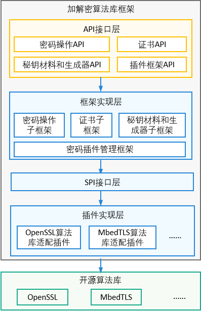

# 加解密算法库框架

## 简介
加解密算法库框架是一个屏蔽了第三方密码学算法库实现差异的算法框架，提供加解密、签名验签、消息验证码、哈希、安全随机数和证书等相关功能。开发者可以通过调用加解密算法库框架，忽略底层不同三方算法库的差异，实现迅捷开发。
**图 1**  加解密算法库框架-架构图




其中，

-   API接口层：对外提供统一的JS接口，提供的能力包括：密码操作、证书、秘钥材料和生成器等。
-   框架实现层：通过灵活加载插件层的插件，适配并屏蔽三方算法库的差异。
-   插件实现层：实现针对具体三方算法库的功能。

## 目录
```
base/security/crypto_framwork
├── build                    # 配置构建相关
├── interfaces               # 对外接口目录
├── test                     # unitest
├── common                   # 内部依赖的公共方法
├── plugin                   # 算法适配的插件实现
│   └── openssl_plugin       # openssl 插件
├── frameworks               # 框架实现层
│   ├── spi                  # SPI的接口
│   ├── js
│       └── napi             # 通过napi封装的JS接口代码实现
│   ├── algorithm_parameter  # 算法参数
│   ├── certificate          # 证书
│   ├── crypto_operation     # 算法操作，包括mac、md、加解密、签名验签、秘钥协商
│   ├── key                  # 秘钥材料
│   └── rand                 # 随机数
```

## 约束
- [加解密算法库框架-overview-约束与限制](https://gitee.com/openharmony/docs/blob/master/zh-cn/application-dev/security/cryptoFramework-overview.md)
- [证书-overview-约束与限制](https://gitee.com/openharmony/docs/blob/master/zh-cn/application-dev/security/cert-overview.md)

## 说明

### 接口说明
- [加解密算法库框架-API参考](https://gitee.com/openharmony/docs/blob/master/zh-cn/application-dev/reference/apis/js-apis-cryptoFramework.md)

- [证书-API参考](https://gitee.com/openharmony/docs/blob/master/zh-cn/application-dev/reference/apis/js-apis-cert.md)

### 使用说明
- [加解密算法库框架-开发指南](https://gitee.com/openharmony/docs/blob/master/zh-cn/application-dev/security/cryptoFramework-guidelines.md)

- [证书-开发指南](https://gitee.com/openharmony/docs/blob/master/zh-cn/application-dev/security/cert-guidelines.md)

## 相关仓

**安全子系统**

[security\_crypto\_framework](https://gitee.com/openharmony/security_crypto_framework)