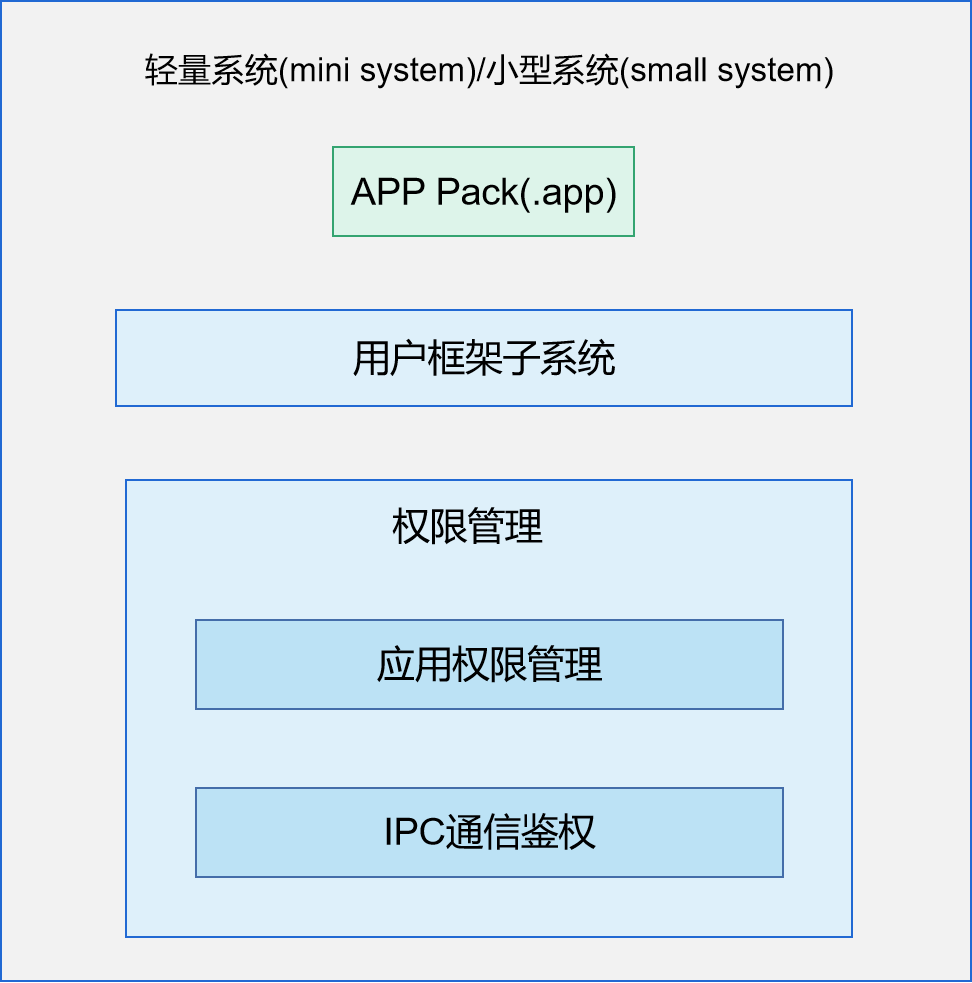

# 应用权限管理<a name="ZH-CN_TOPIC_0000001101239136"></a>

## 简介<a name="section11660541593"></a>

OpenHarmony中应用和系统服务均运行在独立的沙箱中，进程空间和程序数据都是相互隔离的，以保护应用数据的安全性；但是运行在独立沙箱中的服务或应用同时需要对外提供一些API以实现所需功能，其他独立沙箱中的应用在跨进程访问这些API时，需要系统提供一种权限管理机制对这些API的访问者进行授权。

-   应用权限管理提供了权限定义机制，允许系统服务和应用为自己的敏感API定义新的权限，其他应用必须申请此权限才能访问此敏感API；

-   应用权限管理提供了权限申请机制，允许应用申请权限，这些权限由系统或者其他应用定义，权限申请通过后就能访问这个权限相关的系统或其他应用提供的敏感API；
-   应用权限管理也为用户提供了一些必须的功能，方便用户查看和管理权限授予情况。

**图 1**  应用权限管理架构<a name="fig4460722185514"></a>




应用权限管理为用户程序框架子系统提供权限管理功能，并且为上层应用提供权限申请和授权状态查询接口。本次开源的应用权限管理功能适用于轻量系统、小型系统和标准系统。

-   轻量系统（mini system）面向MCU类处理器例如Arm Cortex-M、RISC-V 32位的设备，硬件资源极其有限，参考内存≥128KiB，可以提供多种轻量级网络协议，轻量级的图形框架，以及丰富的IOT总线读写部件等。可支撑的产品如智能家居领域的连接类模组、传感器设备、穿戴类设备等。
-   小型系统（small system）面向应用处理器例如Arm Cortex-A的设备，参考内存≥1MiB，可以提供更高的安全能力、标准的图形框架、视频编解码的多媒体能力。可支撑的产品如智能家居领域的IP Camera、电子猫眼、路由器以及智慧出行域的行车记录仪等。

## 目录<a name="section161941989596"></a>

```
/base/security/permission_lite
├── interfaces                         # 接口层
│   ├── innerkits                      # 内部接口层
│   └── kits                           # 外部接口层
└── services                           # 服务层
    ├── ipc_auth                       # IPC通信鉴权
    ├── js_api                         # JS API封装
    ├── pms                            # 权限管理逻辑和服务端
    ├── pms_base                       # 服务注册
    └── pms_client                     # 权限管理服务的客户端
```

## 使用<a name="section137768191623"></a>

### 接口说明<a name="section1551164914237"></a>

**轻量系统、小型系统应用权限管理**：当前仅供系统应用和系统服务调用，具体API接口如下：

<a name="table9789027162518"></a>
<table><thead align="left"><tr id="row9789427112518"><th class="cellrowborder" valign="top" width="55.66%" id="mcps1.1.3.1.1"><p id="p9790102717251"><a name="p9790102717251"></a><a name="p9790102717251"></a>接口名</p>
</th>
<th class="cellrowborder" valign="top" width="44.34%" id="mcps1.1.3.1.2"><p id="p779032715251"><a name="p779032715251"></a><a name="p779032715251"></a>描述</p>
</th>
</tr>
</thead>
<tbody><tr id="row187901627112516"><td class="cellrowborder" valign="top" width="55.66%" headers="mcps1.1.3.1.1 "><p id="p138014275353"><a name="p138014275353"></a><a name="p138014275353"></a>int CheckPermission(int uid, const char *permissionName)</p>
</td>
<td class="cellrowborder" valign="top" width="44.34%" headers="mcps1.1.3.1.2 "><p id="p57901727202510"><a name="p57901727202510"></a><a name="p57901727202510"></a>检查指定UID的应用进程是否具有访问系统服务API的权限</p>
</td>
</tr>
<tr id="row19341734164410"><td class="cellrowborder" valign="top" width="55.66%" headers="mcps1.1.3.1.1 "><p id="p123453412448"><a name="p123453412448"></a><a name="p123453412448"></a>int CheckSelfPermission(const char *permissionName)</p>
</td>
<td class="cellrowborder" valign="top" width="44.34%" headers="mcps1.1.3.1.2 "><p id="p937645212447"><a name="p937645212447"></a><a name="p937645212447"></a>检查调用者是否具有访问系统服务API的权限</p>
</td>
</tr>
<tr id="row879032715258"><td class="cellrowborder" valign="top" width="55.66%" headers="mcps1.1.3.1.1 "><p id="p13071135133514"><a name="p13071135133514"></a><a name="p13071135133514"></a>int QueryPermission(const char *identifier, PermissionSaved **permissions, int *permNum)</p>
</td>
<td class="cellrowborder" valign="top" width="44.34%" headers="mcps1.1.3.1.2 "><p id="p1379072718259"><a name="p1379072718259"></a><a name="p1379072718259"></a>查询应用申请的所有权限，并检查权限是否被授予</p>
</td>
</tr>
<tr id="row877239193516"><td class="cellrowborder" valign="top" width="55.66%" headers="mcps1.1.3.1.1 "><p id="p878133903516"><a name="p878133903516"></a><a name="p878133903516"></a>int GrantPermission(const char *identifier, const char *permName)</p>
</td>
<td class="cellrowborder" valign="top" width="44.34%" headers="mcps1.1.3.1.2 "><p id="p678143943515"><a name="p678143943515"></a><a name="p678143943515"></a>将指定权限授予应用程序</p>
</td>
</tr>
<tr id="row3616164223510"><td class="cellrowborder" valign="top" width="55.66%" headers="mcps1.1.3.1.1 "><p id="p1617142163517"><a name="p1617142163517"></a><a name="p1617142163517"></a>int RevokePermission(const char *identifier, const char *permName)</p>
</td>
<td class="cellrowborder" valign="top" width="44.34%" headers="mcps1.1.3.1.2 "><p id="p06171242143517"><a name="p06171242143517"></a><a name="p06171242143517"></a>收回应用程序的指定权限</p>
</td>
</tr>
<tr id="row13790122742516"><td class="cellrowborder" valign="top" width="55.66%" headers="mcps1.1.3.1.1 "><p id="p23273123365"><a name="p23273123365"></a><a name="p23273123365"></a>int GrantRuntimePermission(int uid, const char *permissionName)</p>
</td>
<td class="cellrowborder" valign="top" width="44.34%" headers="mcps1.1.3.1.2 "><p id="p177908273259"><a name="p177908273259"></a><a name="p177908273259"></a>应用运行时动态授予指定权限</p>
</td>
</tr>
<tr id="row18566191217452"><td class="cellrowborder" valign="top" width="55.66%" headers="mcps1.1.3.1.1 "><p id="p169891916194512"><a name="p169891916194512"></a><a name="p169891916194512"></a>int RevokeRuntimePermission(int uid, const char *permissionName)</p>
</td>
<td class="cellrowborder" valign="top" width="44.34%" headers="mcps1.1.3.1.2 "><p id="p937132011440"><a name="p937132011440"></a><a name="p937132011440"></a>应用运行时动态撤销指定权限</p>
</td>
</tr>
<tr id="row18566191217452"><td class="cellrowborder" valign="top" width="55.66%" headers="mcps1.1.3.1.1 "><p id="p169891916194512"><a name="p169891916194512"></a><a name="p169891916194512"></a>int UpdatePermissionFlags(const char *identifier, const char *permissionName, const int flags)</p>
</td>
<td class="cellrowborder" valign="top" width="44.34%" headers="mcps1.1.3.1.2 "><p id="p937132011440"><a name="p937132011440"></a><a name="p937132011440"></a>更新应用程序指定的应用权限的标记</p>
</td>
</tr>
</tbody>
</table>


**轻量系统、小型系统IPC通信鉴权**：

<a name="table10494122145517"></a>

<table><thead align="left"><tr id="row1494152195511"><th class="cellrowborder" valign="top" width="50%" id="mcps1.1.3.1.1"><p id="p14941221135515"><a name="p14941221135515"></a><a name="p14941221135515"></a>接口名</p>
</th>
<th class="cellrowborder" valign="top" width="50%" id="mcps1.1.3.1.2"><p id="p8494172116555"><a name="p8494172116555"></a><a name="p8494172116555"></a>描述</p>
</th>
</tr>
</thead>
<tbody><tr id="row1849482118555"><td class="cellrowborder" valign="top" width="50%" headers="mcps1.1.3.1.1 "><p id="p1414381815720"><a name="p1414381815720"></a><a name="p1414381815720"></a>int GetCommunicationStrategy(RegParams params, PolicyTrans **policies, unsigned int *policyNum)</p>
</td>
<td class="cellrowborder" valign="top" width="50%" headers="mcps1.1.3.1.2 "><p id="p749582195510"><a name="p749582195510"></a><a name="p749582195510"></a>服务注册过程中查询调用接口对应的访问策略，仅供Samgr调用</p>
</td>
</tr>
<tr id="row8495521115517"><td class="cellrowborder" valign="top" width="50%" headers="mcps1.1.3.1.1 "><p id="p966319247576"><a name="p966319247576"></a><a name="p966319247576"></a>int IsCommunicationAllowed(AuthParams params)</p>
</td>
<td class="cellrowborder" valign="top" width="50%" headers="mcps1.1.3.1.2 "><p id="p134951921115511"><a name="p134951921115511"></a><a name="p134951921115511"></a>检查访问主体进程是否有权限调用受访客体进程的接口，仅供Samgr调用</p>
</td>
</tr>
</tbody>
</table>

### 使用说明<a name="section129654513264"></a>

**轻量系统、小型系统应用权限管理**：

使用说明：以包管理器的应用权限开发为例进行讲解。开发过程中，首先需要明确涉及的敏感权限，并在config.json中声明该权限，在安装应用程序时，包管理器会调用应用权限管理组件的接口检查该权限是否被授予，若授予，安装流程正常进行，否则安装失败。

1.  在开发过程中，包管理器明确需要安装应用的权限（ohos.permission.INSTALL\_BUNDLE），并声明该权限；
    FA模型：需要在config.json中声明权限，示例：
    ```json
    {
      "module": {
          "package": "ohos.demo.kitframework",
          "deviceType": [
              "phone", "tv","tablet", "car","smartWatch","sportsWatch","smartCamera", "smartVision"
          ],
          "reqPermissions": [{
            "name": "ohos.permission.INSTALL_BUNDLE",
            "reason": "install bundle",
            "usedScene": {
              "ability": [
                "KitFramework"
                ],
              "when": "always"
            }
          },
          {
            "name": "ohos.permission.LISTEN_BUNDLE_CHANGE",
            "reason": "install bundle",
            "usedScene": {
              "ability": [
                "KitFramework"
                ],
              "when": "always"
            }
          },
          {
            "name": "ohos.permission.GET_BUNDLE_INFO",
            "reason": "install bundle",
            "usedScene": {
              "ability": [
                "KitFramework"
                ],
              "when": "always"
            }
          }
        ]
      }
    }
    ```
    Stage模型：需要在module.json5中声明权限，示例：
    ```json
    {
      "module": {
        "requestPermissions": [{
          "name": "ohos.permission.INSTALL_BUNDLE",
          "reason": "install bundle",
          "usedScene": {
            "ability": [
              "KitFramework"
            ],
            "when": "always"
          }
        },
        {
          "name": "ohos.permission.LISTEN_BUNDLE_CHANGE",
          "reason": "install bundle",
          "usedScene": {
            "ability": [
              "KitFramework"
            ],
            "when": "always"
          }
        },
        {
          "name": "ohos.permission.GET_BUNDLE_INFO",
          "reason": "install bundle",
          "usedScene": {
            "ability": [
              "KitFramework"
            ],
            "when": "always"
          }
        }]
      }
    }
    ```

2.  当包管理器开发应用安装功能接口时，会调用权限管理相关接口检查自身是否具有安装应用程序的权限，例如：以安装应用的权限名"ohos.permission.INSTALL\_BUNDLE"作为入参，调用CheckPermission接口检查包管理器是否具有安装应用的权限，如果有权限，安装流程继续执行，否则返回安装失败；

    ```c++
    constexpr static char PERMISSION_INSTALL_BUNDLE[] = "ohos.permission.INSTALL_BUNDLE";
    
    bool Install(const char *hapPath, const InstallParam *installParam, InstallerCallback installerCallback)
    {
        if ((hapPath == nullptr) || (installerCallback == nullptr) || (installParam == nullptr)) {
            HILOG_ERROR(HILOG_MODULE_APP, "BundleManager install failed due to nullptr parameters");
            return false;
        }
        // 检查ohos.permission.INSTALL_BUNDLE权限是否被授予
        if (CheckPermission(0, static_cast<const char *>(PERMISSION_INSTALL_BUNDLE)) != GRANTED) {
            HILOG_ERROR(HILOG_MODULE_APP, "BundleManager install failed due to permission denied");
            return false;  // 返回安装失败
        }
        // 安装流程
        ...
    }
    ```


**轻量系统、小型系统IPC通信鉴权**：

使用说明：以BMS服务通过IPC通信方式对外开放接口为例，讲解如何通过IPC通信鉴权组件配置对应接口的访问策略。这里BMS在Samgr中注册的service为bundlems，为开放的接口注册的Feature为BmsFeature。

1.  在源码路径下的头文件base/security/permission\_lite/services/ipc\_auth/include/policy\_preset.h中配置相应的访问策略，访问策略主要有三种类型：

    （1）type为RANGE类型：允许某个特定范围UID的进程访问，需要指定uidMin和uidMax；

    （2）type为FIXED类型：允许指定的几个UID的进程访问，需要指定fixedUid，最多配置8个；

    （3）type为BUNDLENAME类型：只允许特定的应用访问，需要指定bundleName（包名）；

    ```c++
    FeaturePolicy bmsFeature[] = {
        {
            "BmsFeature",
            {
                {
                    .type=FIXED,    // 允许指定UID的进程访问的方式
                    .fixedUid={2, 3, 8}
                },
                {
                    .type=RANGE,    // 允许特定范围内的UID的进程访问的方式
                    .uidMin=100,
                    .uidMax=__INT_MAX__,
                },
            }
        },
        {
            "BmsInnerFeature",
            {
                {
                    .type=FIXED,     // 允许指定UID的进程访问的方式
                    .fixedUid={2, 3, 8}
                },
                {
                    .type=RANGE,
                    .uidMin=100,
                    .uidMax=999,
                },
            }
        },
    };
    ```

2.  将步骤1中定义的Feature的策略加配到全局策略中，需要配置feature数量；

    ```c++
    static PolicySetting g_presetPolicies[] = {
        {"permissionms", pmsFeature, 1},
        {"abilityms", amsFeature, 2},
        {"bundlems", bmsFeature, 2},  // 步骤1定义的BMS的feature，数量为2
        {"dtbschedsrv", dmsFeature, 1},
        {"samgr", samgrFeature, 1},
        {"appspawn", appspawnFeature, 1},
        {"WMS", wmsFeature, 1},
        {"bundle_daemon", bdsFeature, 1},
    };
    ```

3.  将步骤1中定义的BmsFeature注册到Samgr；

    ```c++
    const char BMS_SERVICE[] = "bundlems";
    const char BMS_FEATURE[] = "BmsFeature";
    static void Init()
    {
        SamgrLite *sm = SAMGR_GetInstance();
        if (sm == nullptr) {
            return;
        }
        // 注册服务到Samgr
        sm->RegisterFeature(BMS_SERVICE, reinterpret_cast<Feature *>(BundleMsFeature::GetInstance()));
        sm->RegisterFeatureApi(BMS_SERVICE, BMS_FEATURE,
            GetBmsFeatureApi(reinterpret_cast<Feature *>(BundleMsFeature::GetInstance())));
        HILOG_DEBUG(HILOG_MODULE_APP, "BundleMS feature start success");
    }
    APP_FEATURE_INIT(Init);
    ```


完成以上开发步骤后，开发者在Samgr注册服务时，Samgr会调用IPC通信鉴权组件的GetCommunicationStrategy接口获取服务的访问策略；当其他服务或应用通过IPC方式访问这些服务时，Samgr会调用IPC通信鉴权组件的IsCommunicationAllowed接口检查调用者服务的权限，如果满足访问策略，则可以访问开发者接口，否则拒绝访问。

## 相关仓<a name="section1371113476307"></a>
安全子系统
**[security\_permission\_lite](https://gitee.com/openharmony/security_permission_lite/blob/master/README_zh.md)**
