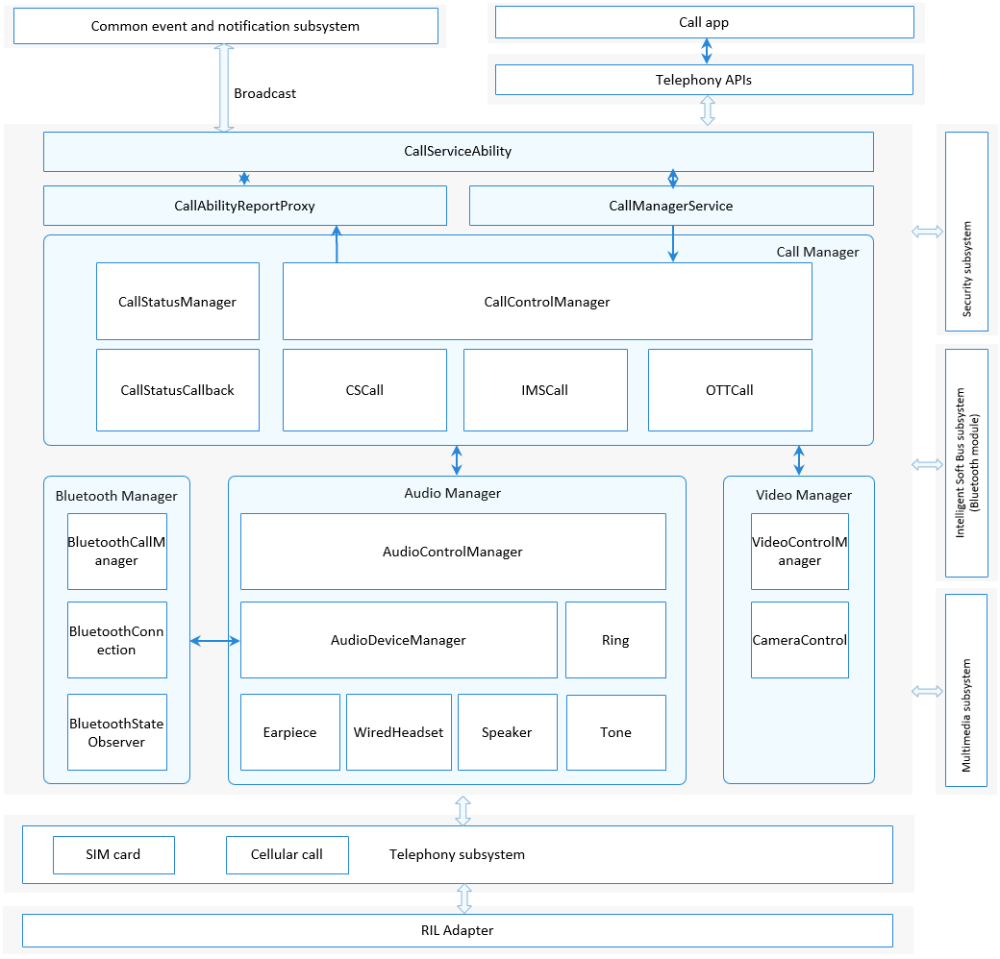

# Call Manager<a name="EN-US_TOPIC_0000001105058232"></a>


## Introduction<a name="section117mcpsimp"></a>

The Call Manager module mainly manages three types of calls: circuit switched \(CS\), IP multimedia subsystem \(IMS\), and over the top \(OTT\) calls. It is responsible for applying for the audio and video resources required for a call and resolving conflicts in a multi-channel call. The module consists of six parts: UI interaction \(CallServiceAbility\), service management \(CallManagerService\), call management \(Call Manager\), audio management \(Audio Manager\), video management \(Video Manager\), and Bluetooth management \(Bluetooth Manager\).

1.  CallServiceAbility: Implements interaction with the call UI, for example, launching the keypad UI for dialup and reporting the incoming call status to the UI.
2.  CallManagerService: starts and initializes the Call Manager.
3.  Call Manager: processes downlink call operations \(such as dialup, answer, and onhook\) and uplink call status \(such as incoming call status and call waiting status\), and resolves conflicts that occur in a call.
4.  Audio Manager: applies for audio resources for a call and releases the resources after the call ends. This part depends on the multimedia subsystem and needs to call its APIs to perform audio-related operations.
5.  Video Manager: applies for video resources for a call and releases the resources after the call ends. This part depends on the multimedia subsystem and needs to call its APIs to perform video-related operations.
6.  Bluetooth Manager: applies for Bluetooth resources for a call and releases the resources after the call ends. Besides, this part processes call operations initiated by Bluetooth devices, such as answering and ending calls.

The following figure shows the architecture of the Call Manager module.

**Figure  1**  Architecture of the Call Manager module<a name="fig11440121615591"></a>




## Directory Structure<a name="section128mcpsimp"></a>

```
/base/telephony/call_manager
├─ figures                                 # Figures of readme files
├─ frameworks                              # Frameworks
│  ├─ js                                   # JS code
│  └─ native                               # Native code
├─ interfaces                              # APIs
│  ├─ innerkits                            # Internal APIs
│  └─ kits                                 # External APIs (such as JS APIs)
├─ sa_profile                              # SA profile
├─ services                                # Service code
│  ├─ audio                                # Audio management
│  ├─ bluetooth                            # Bluetooth call management
│  ├─ call                                 # Call service
│  ├─ call_manager_service                 # Call Manager service
│  ├─ call_report                          # Call status reporting
│  ├─ call_setting                         # Call setting
│  ├─ telephony_interaction                # Telephony core service interaction
│  └─ video                                # Video Manager code
├─ test                                    # Test code
│  ├─ fuzztest                             # Fuzzy test
│  ├─ mock                                 # Simulation test
│  └─ unittest                             # Unit test
└─ utils                                   # Utilities
```

## Constraints<a name="section131mcpsimp"></a>

-   Programming language: JavaScript
-   In terms of software, this module needs to work with the Security subsystem, Multimedia subsystem, and Intelligent Soft Bus subsystem \(Bluetooth module\), as well as the telephony core service \(core\_service\) and cellular call module \(cellular\_call\).
-   In terms of hardware, the accommodating device must be equipped with a speaker or earphone, and a headset.

## Available APIs<a name="section136mcpsimp"></a>

**Table  1**  External API provided by the Call Manager module

<a name="table137mcpsimp"></a>
<table><thead align="left"><tr id="row143mcpsimp"><th class="cellrowborder" valign="top" width="33.33333333333333%" id="mcps1.2.4.1.1"><p id="entry144mcpsimpp0"><a name="entry144mcpsimpp0"></a><a name="entry144mcpsimpp0"></a>Description</p>
</th>
<th class="cellrowborder" valign="top" width="33.33333333333333%" id="mcps1.2.4.1.2"><p id="entry145mcpsimpp0"><a name="entry145mcpsimpp0"></a><a name="entry145mcpsimpp0"></a>Description</p>
</th>
<th class="cellrowborder" valign="top" width="33.33333333333333%" id="mcps1.2.4.1.3"><p id="entry146mcpsimpp0"><a name="entry146mcpsimpp0"></a><a name="entry146mcpsimpp0"></a>Required Permission</p>
</th>
</tr>
</thead>
<tbody><tr id="row147mcpsimp"><td class="cellrowborder" valign="top" width="33.33333333333333%" headers="mcps1.2.4.1.1 "><p id="p143312519577"><a name="p143312519577"></a><a name="p143312519577"></a>function dial(phoneNumber: string, options: DialOptions, callback: AsyncCallback&lt;boolean&gt;): void;</p>
</td>
<td class="cellrowborder" valign="top" width="33.33333333333333%" headers="mcps1.2.4.1.2 "><p id="entry149mcpsimpp0"><a name="entry149mcpsimpp0"></a><a name="entry149mcpsimpp0"></a>Performs dialup operations.</p>
</td>
<td class="cellrowborder" valign="top" width="33.33333333333333%" headers="mcps1.2.4.1.3 "><p id="entry150mcpsimpp0"><a name="entry150mcpsimpp0"></a><a name="entry150mcpsimpp0"></a>ohos.permission.PLACE_CALL</p>
</td>
</tr>
</tbody>
</table>

**Table  2**  Parameters of the Dial API

<a name="table18488202215170"></a>
<table><thead align="left"><tr id="row748952217179"><th class="cellrowborder" valign="top" width="50%" id="mcps1.2.3.1.1"><p id="p1948942271710"><a name="p1948942271710"></a><a name="p1948942271710"></a>Parameter</p>
</th>
<th class="cellrowborder" valign="top" width="50%" id="mcps1.2.3.1.2"><p id="p1648972215173"><a name="p1648972215173"></a><a name="p1648972215173"></a>Description</p>
</th>
</tr>
</thead>
<tbody><tr id="row749092213171"><td class="cellrowborder" valign="top" width="50%" headers="mcps1.2.3.1.1 "><p id="p14901222191720"><a name="p14901222191720"></a><a name="p14901222191720"></a>phoneNumber: string</p>
</td>
<td class="cellrowborder" valign="top" width="50%" headers="mcps1.2.3.1.2 "><p id="p34906228170"><a name="p34906228170"></a><a name="p34906228170"></a>Phone number</p>
</td>
</tr>
<tr id="row549011221176"><td class="cellrowborder" valign="top" width="50%" headers="mcps1.2.3.1.1 "><p id="p44902223175"><a name="p44902223175"></a><a name="p44902223175"></a>options: DialOptions</p>
</td>
<td class="cellrowborder" valign="top" width="50%" headers="mcps1.2.3.1.2 "><p id="p11490162241718"><a name="p11490162241718"></a><a name="p11490162241718"></a>Dialup options (For details, see the following table.)</p>
</td>
</tr>
<tr id="row149072216176"><td class="cellrowborder" valign="top" width="50%" headers="mcps1.2.3.1.1 "><p id="p5490152211715"><a name="p5490152211715"></a><a name="p5490152211715"></a>callback: AsyncCallback&lt;boolean&gt;</p>
</td>
<td class="cellrowborder" valign="top" width="50%" headers="mcps1.2.3.1.2 "><p id="p649002291718"><a name="p649002291718"></a><a name="p649002291718"></a>Asynchronous execution result. Value <strong id="b1400386820"><a name="b1400386820"></a><a name="b1400386820"></a>true</strong> indicates that the dialup is successful, and value <strong id="b022154719814"><a name="b022154719814"></a><a name="b022154719814"></a>false</strong> indicates that the dialup has failed.</p>
</td>
</tr>
</tbody>
</table>

**Table  3**  Parameter description of options: DialOptions

<a name="table1322739190"></a>
<table><thead align="left"><tr id="row193221031194"><th class="cellrowborder" valign="top" width="20%" id="mcps1.2.6.1.1"><p id="p203224311917"><a name="p203224311917"></a><a name="p203224311917"></a>Parameter</p>
</th>
<th class="cellrowborder" valign="top" width="20%" id="mcps1.2.6.1.2"><p id="p1639614810198"><a name="p1639614810198"></a><a name="p1639614810198"></a>Type</p>
</th>
<th class="cellrowborder" valign="top" width="20%" id="mcps1.2.6.1.3"><p id="p113221730191"><a name="p113221730191"></a><a name="p113221730191"></a>Description</p>
</th>
<th class="cellrowborder" valign="top" width="20%" id="mcps1.2.6.1.4"><p id="p153221330197"><a name="p153221330197"></a><a name="p153221330197"></a>Mandatory</p>
</th>
<th class="cellrowborder" valign="top" width="20%" id="mcps1.2.6.1.5"><p id="p632220310199"><a name="p632220310199"></a><a name="p632220310199"></a>Default Value</p>
</th>
</tr>
</thead>
<tbody><tr id="row123238311920"><td class="cellrowborder" valign="top" width="20%" headers="mcps1.2.6.1.1 "><p id="p932310311197"><a name="p932310311197"></a><a name="p932310311197"></a>extras</p>
</td>
<td class="cellrowborder" valign="top" width="20%" headers="mcps1.2.6.1.2 "><p id="p73966801911"><a name="p73966801911"></a><a name="p73966801911"></a>boolean</p>
</td>
<td class="cellrowborder" valign="top" width="20%" headers="mcps1.2.6.1.3 "><p id="p19821612162118"><a name="p19821612162118"></a><a name="p19821612162118"></a><strong id="b345117841310"><a name="b345117841310"></a><a name="b345117841310"></a>false</strong>: audio; <strong id="b1701410181319"><a name="b1701410181319"></a><a name="b1701410181319"></a>true</strong>: video</p>
</td>
<td class="cellrowborder" valign="top" width="20%" headers="mcps1.2.6.1.4 "><p id="p33231931191"><a name="p33231931191"></a><a name="p33231931191"></a>No</p>
</td>
<td class="cellrowborder" valign="top" width="20%" headers="mcps1.2.6.1.5 "><p id="p12323232197"><a name="p12323232197"></a><a name="p12323232197"></a>false</p>
</td>
</tr>
</tbody>
</table>

## Usage Guidelines<a name="section163mcpsimp"></a>

### Calling the dial API to Place a Call<a name="section113291522113518"></a>

1.  Construct the  **phoneNumber**  and  **options**  parameters.
2.  Call the  **Dial**  API in callback or Promise mode.
3.  Obtain the dialup result. The  **Dial**  API works in asynchronous mode. The dialup result is returned through the callback.

    ```
    import call from "@ohos.telephony.call";

    let phoneNumber = "12312312312";

    // Call the API in callback mode.
    call.dial(phoneNumber, {extras: false}, (err, value) => {
      if (err) {
        // If the API call failed, err is not empty.
        console.error(`failed to dial because ${err.message}`);
        return;
      }
      // If the API call succeeded, err is empty.
      console.log(`success to dial: ${value}`);
    });

    // Call the API in Promise mode.
    let promise = call.dial(phoneNumber, {extras: false});
    promise.then((value) => {
      // The API call succeeded.
      console.log(`success to dial: ${value}`);
    }).catch((err) => {
      // The API call failed.
      console.error(`failed to dial because ${err.message}`);
    });
    ```


## Repositories Involved<a name="section227mcpsimp"></a>

[Telephony](https://gitee.com/openharmony/docs/blob/master/en/readme/telephony.md)

**telephony_call_manager**

[telephony_core_service](https://gitee.com/openharmony/telephony_core_service/blob/master/README.md)

[telephony_cellular_call](https://gitee.com/openharmony/telephony_cellular_call/blob/master/README.md)

[telephony_state_registry](https://gitee.com/openharmony/telephony_state_registry/blob/master/README.md)
