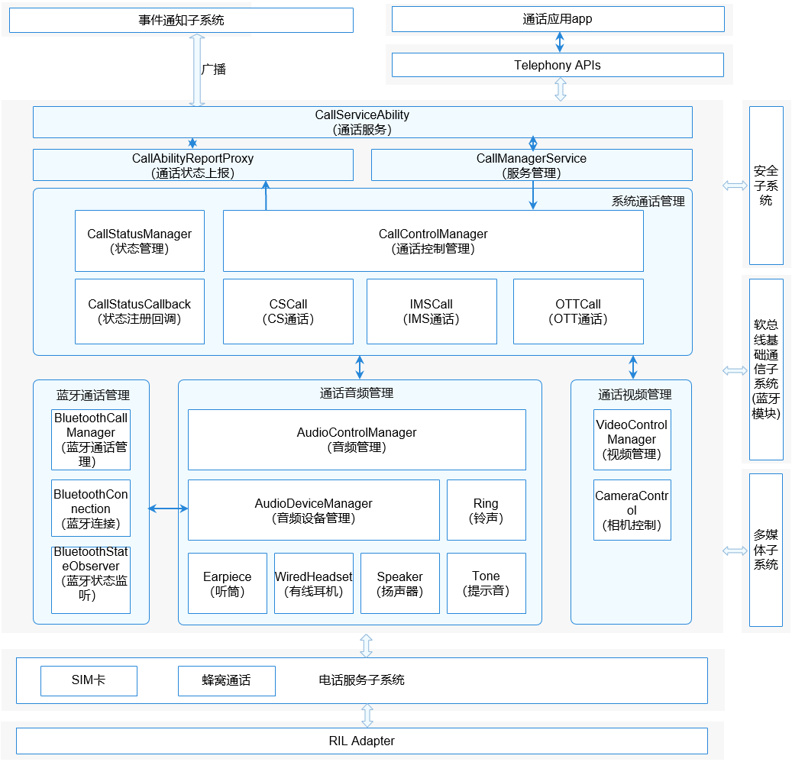

# 通话管理<a name="ZH-CN_TOPIC_0000001105058232"></a>

-   [简介](#section117mcpsimp)
-   [目录](#section128mcpsimp)
-   [约束](#section131mcpsimp)
-   [接口说明](#section136mcpsimp)
-   [使用说明](#section163mcpsimp)
    -   [拨打电话接口调用流程及示例代码](#section113291522113518)

-   [相关仓](#section227mcpsimp)

## 简介<a name="section117mcpsimp"></a>

通话管理模块主要管理CS（Circuit Switch，电路交换）、IMS（IP Multimedia Subsystem，IP多媒体子系统）和OTT（over the top，OTT解决方案）三种类型的通话，负责申请通话所需要的音视频资源，并处理多路通话时产生的各种冲突。通话管理主要分为UI交互、服务管理、系统通话管理、通话音频管理、通话视频管理和蓝牙通话管理六大模块，各模块简介如下：

1.  UI交互模块：负责和通话UI交互，如UI调用接口拨号，上报来电等状态给UI。
2.  服务管理模块：负责启动和初始化系统通话管理服务。
3.  系统通话管理模块：负责处理通话下行操作（如拨号、接听、挂断等）和上行状态（来电状态、呼叫等待状态等）的处理，并解决通话过程中产生的冲突。
4.  通话音频管理模块：负责通话时需要的音频资源的申请和释放，依赖多媒体子系统，需要调用多媒体子系统接口进行音频相关的操作。
5.  通话视频管理模块：负责通话时需要的视频资源的申请和释放，依赖多媒体子系统，需要调用多媒体子系统接口进行视频相关的操作。
6.  蓝牙通话管理模块：负责通话时需要的蓝牙资源的申请和释放，并处理蓝牙设备发起的通话操作，如接听和挂断等。

其主要的结构及流程如下图所示：

**图 1**  通话管理模块架构图<a name="fig11440121615591"></a>




## 目录<a name="section128mcpsimp"></a>

```
/base/telephony/call_manager
├─ figures                                 # Readme资源文件
├─ frameworks                              # 框架层目录
│  ├─ js                                   # js相关代码
│  └─ native                               # native相关代码
├─ interfaces                              # 接口目录
│  ├─ innerkits                            # 部件间的内部接口
│  └─ kits                                 # 对应用提供的接口（例如JS接口）
├─ sa_profile                              # 启动配置文件
├─ services                                # 服务内部代码
│  ├─ audio                                # 音频管理相关代码
│  ├─ bluetooth                            # 蓝牙通话相关代码
│  ├─ call                                 # 通话业务相关代码
│  ├─ call_manager_service                 # 进程服务管理相关代码
│  ├─ call_report                          # 通话状态等信息上报相关代码
│  ├─ call_setting                         # 通话设置相关代码
│  ├─ telephony_interaction                # 电话核心服务交互相关代码
│  └─ video                                # 视频管理相关代码
├─ test                                    # 测试相关代码
│  ├─ fuzztest                             # 模糊测试相关代码
│  ├─ mock                                 # 模拟测试相关代码
│  └─ unittest                             # 单元测试相关代码
└─ utils                                   # 通用工具代码目录
```

## 约束<a name="section131mcpsimp"></a>

-   开发语言：JavaScript。
-   软件上，需要与以下子系统和服务配合使用：安全子系统，多媒体子系统，软总线基础通信子系统\(蓝牙模块\)，Telephony核心服务（core\_service），蜂窝通话服务（cellular\_call）。
-   硬件上，需要搭载的设备支持以下硬件：扬声器或听筒、麦克风。

## 接口说明<a name="section136mcpsimp"></a>

**表 1**  通话管理对外提供的接口

<a name="table137mcpsimp"></a>
<table><thead align="left"><tr id="row143mcpsimp"><th class="cellrowborder" valign="top" width="33.33333333333333%" id="mcps1.2.4.1.1"><p id="entry144mcpsimpp0"><a name="entry144mcpsimpp0"></a><a name="entry144mcpsimpp0"></a>接口内容</p>
</th>
<th class="cellrowborder" valign="top" width="33.33333333333333%" id="mcps1.2.4.1.2"><p id="entry145mcpsimpp0"><a name="entry145mcpsimpp0"></a><a name="entry145mcpsimpp0"></a>接口描述</p>
</th>
<th class="cellrowborder" valign="top" width="33.33333333333333%" id="mcps1.2.4.1.3"><p id="entry146mcpsimpp0"><a name="entry146mcpsimpp0"></a><a name="entry146mcpsimpp0"></a>所需权限</p>
</th>
</tr>
</thead>
<tbody><tr id="row147mcpsimp"><td class="cellrowborder" valign="top" width="33.33333333333333%" headers="mcps1.2.4.1.1 "><p id="p143312519577"><a name="p143312519577"></a><a name="p143312519577"></a>function dial(phoneNumber: string, options: DialOptions, callback: AsyncCallback&lt;boolean&gt;): void;</p>
</td>
<td class="cellrowborder" valign="top" width="33.33333333333333%" headers="mcps1.2.4.1.2 "><p id="entry149mcpsimpp0"><a name="entry149mcpsimpp0"></a><a name="entry149mcpsimpp0"></a>拨号接口，调用此接口可以进行拨号操作</p>
</td>
<td class="cellrowborder" valign="top" width="33.33333333333333%" headers="mcps1.2.4.1.3 "><p id="entry150mcpsimpp0"><a name="entry150mcpsimpp0"></a><a name="entry150mcpsimpp0"></a>ohos.permission.PLACE_CALL</p>
</td>
</tr>
</tbody>
</table>

**表 2**  拨号接口参数说明

<a name="table18488202215170"></a>
<table><thead align="left"><tr id="row748952217179"><th class="cellrowborder" valign="top" width="50%" id="mcps1.2.3.1.1"><p id="p1948942271710"><a name="p1948942271710"></a><a name="p1948942271710"></a>参数</p>
</th>
<th class="cellrowborder" valign="top" width="50%" id="mcps1.2.3.1.2"><p id="p1648972215173"><a name="p1648972215173"></a><a name="p1648972215173"></a>描述</p>
</th>
</tr>
</thead>
<tbody><tr id="row749092213171"><td class="cellrowborder" valign="top" width="50%" headers="mcps1.2.3.1.1 "><p id="p14901222191720"><a name="p14901222191720"></a><a name="p14901222191720"></a>phoneNumber: string</p>
</td>
<td class="cellrowborder" valign="top" width="50%" headers="mcps1.2.3.1.2 "><p id="p34906228170"><a name="p34906228170"></a><a name="p34906228170"></a>电话号码</p>
</td>
</tr>
<tr id="row549011221176"><td class="cellrowborder" valign="top" width="50%" headers="mcps1.2.3.1.1 "><p id="p44902223175"><a name="p44902223175"></a><a name="p44902223175"></a>options: DialOptions</p>
</td>
<td class="cellrowborder" valign="top" width="50%" headers="mcps1.2.3.1.2 "><p id="p11490162241718"><a name="p11490162241718"></a><a name="p11490162241718"></a>扩展参数（详见下表）</p>
</td>
</tr>
<tr id="row149072216176"><td class="cellrowborder" valign="top" width="50%" headers="mcps1.2.3.1.1 "><p id="p5490152211715"><a name="p5490152211715"></a><a name="p5490152211715"></a>callback: AsyncCallback&lt;boolean&gt;</p>
</td>
<td class="cellrowborder" valign="top" width="50%" headers="mcps1.2.3.1.2 "><p id="p649002291718"><a name="p649002291718"></a><a name="p649002291718"></a>异步执行结果，true表示执行成功，false表示执行失败</p>
</td>
</tr>
</tbody>
</table>

**表 3**  options: DialOptions参数说明

<a name="table1322739190"></a>
<table><thead align="left"><tr id="row193221031194"><th class="cellrowborder" valign="top" width="20%" id="mcps1.2.6.1.1"><p id="p203224311917"><a name="p203224311917"></a><a name="p203224311917"></a>参数</p>
</th>
<th class="cellrowborder" valign="top" width="20%" id="mcps1.2.6.1.2"><p id="p1639614810198"><a name="p1639614810198"></a><a name="p1639614810198"></a>类型</p>
</th>
<th class="cellrowborder" valign="top" width="20%" id="mcps1.2.6.1.3"><p id="p113221730191"><a name="p113221730191"></a><a name="p113221730191"></a>描述</p>
</th>
<th class="cellrowborder" valign="top" width="20%" id="mcps1.2.6.1.4"><p id="p153221330197"><a name="p153221330197"></a><a name="p153221330197"></a>是否必填</p>
</th>
<th class="cellrowborder" valign="top" width="20%" id="mcps1.2.6.1.5"><p id="p632220310199"><a name="p632220310199"></a><a name="p632220310199"></a>默认值</p>
</th>
</tr>
</thead>
<tbody><tr id="row123238311920"><td class="cellrowborder" valign="top" width="20%" headers="mcps1.2.6.1.1 "><p id="p932310311197"><a name="p932310311197"></a><a name="p932310311197"></a>extras</p>
</td>
<td class="cellrowborder" valign="top" width="20%" headers="mcps1.2.6.1.2 "><p id="p73966801911"><a name="p73966801911"></a><a name="p73966801911"></a>boolean</p>
</td>
<td class="cellrowborder" valign="top" width="20%" headers="mcps1.2.6.1.3 "><p id="p19821612162118"><a name="p19821612162118"></a><a name="p19821612162118"></a>false：音频 true：视频</p>
</td>
<td class="cellrowborder" valign="top" width="20%" headers="mcps1.2.6.1.4 "><p id="p33231931191"><a name="p33231931191"></a><a name="p33231931191"></a>否</p>
</td>
<td class="cellrowborder" valign="top" width="20%" headers="mcps1.2.6.1.5 "><p id="p12323232197"><a name="p12323232197"></a><a name="p12323232197"></a>false</p>
</td>
</tr>
</tbody>
</table>

完整的JS API说明以及实例代码请参考：[拨打电话](https://gitee.com/openharmony/docs/blob/master/zh-cn/application-dev/reference/apis/js-apis-call.md)。
## 使用说明<a name="section163mcpsimp"></a>

### 拨打电话接口调用流程及示例代码<a name="section113291522113518"></a>

1.  构造phoneNumber和options参数；
2.  可以通过callback或者Promise的方式调用dial接口。
3.  该接口为异步接口，相关执行结果会从callback中返回。

    ```
    import call from "@ohos.telephony.call";

    let phoneNumber = "12312312312";

    // 调用接口【callback方式】
    call.dial(phoneNumber, {extras: false}, (err, value) => {
      if (err) {
        // 接口调用失败，err非空
        console.error(`failed to dial because ${err.message}`);
        return;
      }
      // 接口调用成功，err为空
      console.log(`success to dial: ${value}`);
    });

    // 调用接口【Promise方式】
    let promise = call.dial(phoneNumber, {extras: false});
    promise.then((value) => {
      // 接口调用成功，此处可以实现成功场景分支代码。
      console.log(`success to dial: ${value}`);
    }).catch((err) => {
      // 接口调用失败，此处可以实现失败场景分支代码。
      console.error(`failed to dial because ${err.message}`);
    });
    ```


## 相关仓<a name="section227mcpsimp"></a>

[电话服务子系统](https://gitee.com/openharmony/docs/blob/master/zh-cn/readme/%E7%94%B5%E8%AF%9D%E6%9C%8D%E5%8A%A1%E5%AD%90%E7%B3%BB%E7%BB%9F.md)

**telephony_call_manager**

[telephony_core_service](https://gitee.com/openharmony/telephony_core_service/blob/master/README_zh.md)

[telephony_cellular_call](https://gitee.com/openharmony/telephony_cellular_call/blob/master/README_zh.md)

[telephony_state_registry](https://gitee.com/openharmony/telephony_state_registry/blob/master/README_zh.md)