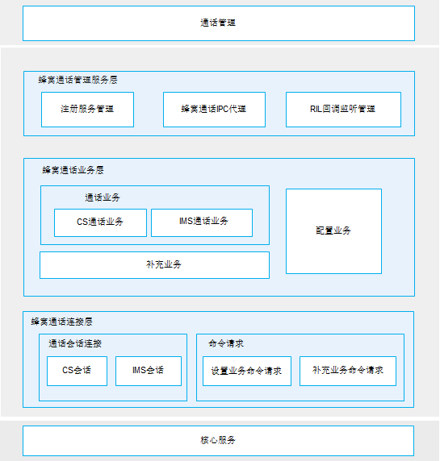

# 蜂窝通话<a name="ZH-CN_TOPIC_0000001105379632"></a>

-   [简介](#section117mcpsimp)
-   [目录](#section127mcpsimp)
-   [约束](#section131mcpsimp)
-   [相关仓](#section204mcpsimp)

## 简介<a name="section117mcpsimp"></a>

蜂窝通话支持基于运营商网络的基础通话实现，包含基于2G/3G的CS（Circuit Switch，电路交换）通话和基于4G/5G的IMS（IP Multimedia Subsystem，IP多媒体子系统）通话，包含VoLTE/ VoWIFI/ VoNR语音、视频、会议，支持CS和IMS通话之间的域选控制和切换，支持紧急通话。支持主流modem芯片平台。

其主要的结构及流程如下图所示：

**图 1**  蜂窝通话模块架构图<a name="fig970511919486"></a>




蜂窝通话模块由蜂窝通话管理层、蜂窝通话业务处理层、蜂窝通话连接层三大部分组成，其中：

1.  蜂窝通话管理层（CellularCallService）：由CellularCallRegister（提供通话信息变化订阅功能）、CellularCallProxy（提供蜂窝通话对外接口实现的代理）、CellularCallHandler（处理RIL Adapter上报的消息）组成。
2.  蜂窝通话业务层（CellularCallStub）：由CSControl（处理CS通话）&IMSControl（处理IMS通话）、CellularCallConfig（配置业务）、CellularCallSupplement（补充业务）组成。
3.  蜂窝通话连接层（Connection）：由BaseConnection（会话连接）、ConfigRequest（配置业务命令请求）、SupplementRequest（补充业务命令请求）组成。

## 目录<a name="section127mcpsimp"></a>

```
/base/telephony/cellular_call     # 蜂窝通话子组件
├─ figures                        # Readme资源文件
├─ interfaces                     # 接口目录
│  └─ innerkits                   # IMS通话接口定义
├─ sa_profile                     # sa文件
├─ services                       # 服务内部代码
│  ├─ common                      # 工具仓
│  ├─ connection                  # 连接层
│  ├─ control                     # 控制业务层
│  ├─ ims_service_interaction     # IMS通话服务交互层
│  └─ manager                     # 管理层
├─ test                           # 测试相关代码
│  └─ unittest                    # 单元测试相关代码
└─  vendor                        # IMS通话服务实现层示例代码
   └─ ims                         # IMS通话业务逻辑相关代码
```

## 约束<a name="section131mcpsimp"></a>

-   开发语言：C++。
-   软件约束：需要与以下服务配合使用：Telephony核心服务（core\_service）、通话管理（call\_manager）。
-   硬件约束：需要搭载的设备支持以下硬件：扬声器或听筒、麦克风，可以进行独立蜂窝通信的Modem以及SIM卡。

>**说明：**
>蜂窝通话不对外暴露接口，由通话管理直接调用。

## 相关仓<a name="section204mcpsimp"></a>

[电话服务子系统](https://gitee.com/openharmony/docs/blob/master/zh-cn/readme/%E7%94%B5%E8%AF%9D%E6%9C%8D%E5%8A%A1%E5%AD%90%E7%B3%BB%E7%BB%9F.md)

**telephony_cellular_call**

[telephony_core_service](https://gitee.com/openharmony/telephony_core_service/blob/master/README_zh.md)

[telephony_call_manager](https://gitee.com/openharmony/telephony_call_manager/blob/master/README_zh.md)
