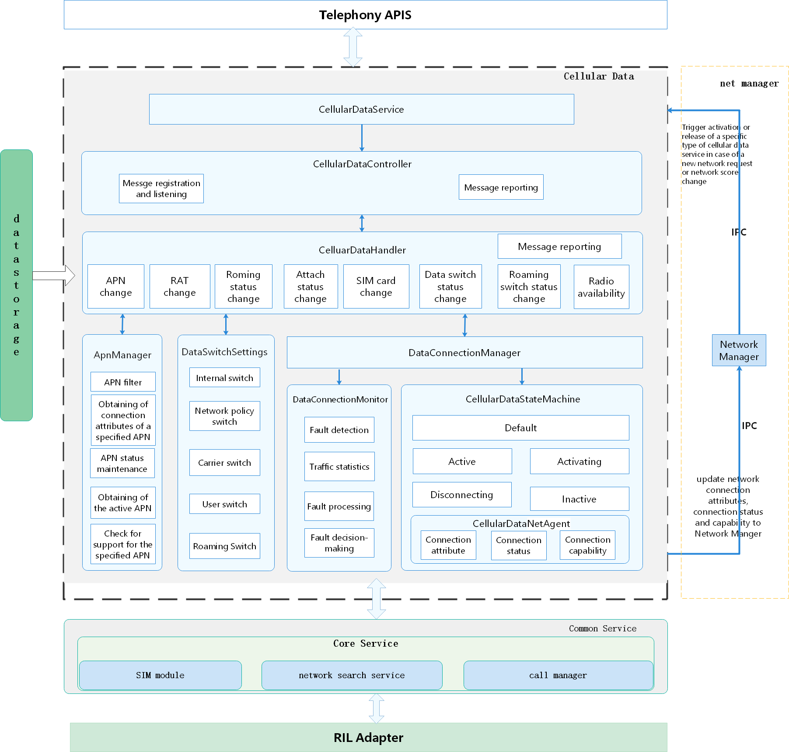

# Cellular Data<a name="EN-US_TOPIC_0000001105538940"></a>

-   [Introduction](#section117mcpsimp)
-   [Directory Structure](#section121mcpsimp)
-   [Constraints](#section125mcpsimp)
-   [Available APIs](#section131mcpsimp)
-   [Usage Guidelines](#section160mcpsimp)
    -   [Checking the Cellular Data Status](#section192mcpsimp)
    -   [Obtaining the Cellular Data Status](#section213mcpsimp)

-   [Repositories Involved](#section234mcpsimp)

## Introduction<a name="section117mcpsimp"></a>

The cellular data module is a tailorable component of the Telephony subsystem. It depends on the telephony core service \(core\_service\) and RIL Adapter \(ril\_adapter\). The module provides functions such as cellular data activation, cellular data fault detection and rectification, cellular data status management, cellular data switch management, cellular data roaming management, APN management, and network management and interaction.

**Figure  1**  Architecture of the cellular data module<a name="fig332493822512"></a>


## Directory Structure<a name="section121mcpsimp"></a>

```
base/telephony/cellular_data/
├── figures
├── frameworks
│   ├── js
│   │   └── napi
│   │       ├── include                  #  js head files
│   │       └── src                      #  js source files
│   └── native
├── interfaces                           # externally exposed interface
│   ├── innerkits
│   └── kits
│       └── js
│           └── declaration              # external JS API interfaces
├── sa_profile                           # SA profiles
├── services
│   ├── include                          # head files
│   │   ├── apn_manager
│   │   ├── common
│   │   ├── state_machine
│   │   └── utils
│   └── src                              # source files
│       ├── apn_manager
│       ├── state_machine
│       └── utils
└── test
    └── unit_test                        # unit test code

```

## Constraints<a name="section125mcpsimp"></a>

-   Programming language: JavaScript
-   In terms of software, this module needs to work with the telephony core service \(core\_service\) and RIL Adapter \(call\_manger\).
-   In terms of hardware, the accommodating device must be equipped with a modem and a SIM card capable of independent cellular communication.

## Available APIs<a name="section131mcpsimp"></a>

**Table  1**  External APIs provided by the cellular data module

<a name="table133mcpsimp"></a>

| API                                                          | Description                                 | Required Permission              |
| ------------------------------------------------------------ | ------------------------------------------- | -------------------------------- |
| function isCellularDataEnabled(callback: AsyncCallback\<boolean>): void; | Checks whether the cellular data is enabled | ohos.permission.GET_NETWORK_INFO |
| function getCellularDataState(callback: AsyncCallback\<DataConnectState>): void; | Obtains the cellular data status.           | ohos.permission.GET_NETWORK_INFO |


## Usage Guidelines<a name="section160mcpsimp"></a>

### Checking the Cellular Data Status<a name="section192mcpsimp"></a>

1.  Call the  **IsCellularDataEnabled**  method in callback or Promise mode to check whether the cellular data is enabled.
2.  This method works in asynchronous mode. The execution result is returned through the callback.

    ```
    import data from "@ohos.telephony.data";
    
    // Call the API in callback mode.
    data.isCellularDataEnabled((err, value) => {
      if (err) {
        // If the API call failed, err is not empty.
        console.error(`failed to isCellularDataEnabled because ${err.message}`);
        return;
      }
      // If the API call succeeded, err is empty.
      console.log(`success to isCellularDataEnabled: ${value}`);
    });
    
    // Call the API in Promise mode.
    let promise = data.isCellularDataEnabled();
    promise.then((value) => {
      // The API call succeeded.
      console.log(`success to isCellularDataEnabled: ${value}`);
    }).catch((err) => {
      // The API call failed.
      console.error(`failed to isCellularDataEnabled because ${err.message}`);
    });
    ```


### Obtaining the Cellular Data Status<a name="section213mcpsimp"></a>

**Table  2**  Description of DataConnectState enum values

<a name="table21531410101919"></a>

| Name                    | ValueDescription |              |
| ----------------------- | ---------------- | ------------ |
| DATA_STATE_UNKNOWN      | -1               | Unknown      |
| DATA_STATE_DISCONNECTED | 0                | Disconnected |
| DATA_STATE_CONNECTING   | 1                | Connecting   |
| DATA_STATE_CONNECTED    | 2                | Connected    |
| DATA_STATE_SUSPENDED    | 3                | Suspended    |


1.  Call the  **getCellularDataState**  method in callback or Promise mode to obtain the cellular data status.
2.  This method works in asynchronous mode. The execution result is returned through the callback.

    ```
    import data from "@ohos.telephony.data";
    
    // Call the API in callback mode.
    data.getCellularDataState((err, value) => {
      if (err) {
        // If the API call failed, err is not empty.
        console.error(`failed to getCellularDataState because ${err.message}`);
        return;
      }
      // If the API call succeeded, err is empty.
      console.log(`success to getCellularDataState: ${value}`);
    });
    
    // Call the API in Promise mode.
    let promise = data.getCellularDataState();
    promise.then((value) => {
      // The API call succeeded.
      console.log(`success to getCellularDataState: ${value}`);
    }).catch((err) => {
      // The API call failed.
      console.error(`failed to getCellularDataState because ${err.message}`);
    });
    ```


## Repositories Involved<a name="section234mcpsimp"></a>

Telephony

telephony_cellular_data

telephony_core_service

telephony_ril_adapter
