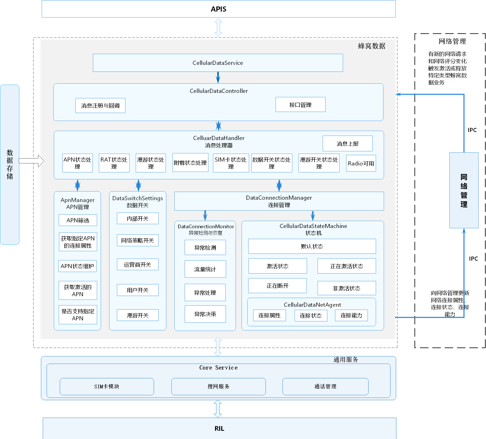

# 蜂窝数据<a name="ZH-CN_TOPIC_0000001105538940"></a>

-   [简介](#section117mcpsimp)
-   [目录](#section121mcpsimp)
-   [约束](#section125mcpsimp)
-   [接口说明](#section131mcpsimp)
-   [使用说明](#section160mcpsimp)
    -   [获取蜂窝数据开关是否打开](#section192mcpsimp)
    -   [获取蜂窝数据状态](#section213mcpsimp)

-   [相关仓](#section234mcpsimp)

## 简介<a name="section117mcpsimp"></a>

蜂窝数据模块作为电话子系统可裁剪部件，依赖于core\_service核心服务、ril\_adapter。 具有蜂窝数据激活、蜂窝数据异常检测与恢复、蜂窝数据状态管理、蜂窝数据开关管理、蜂窝数据漫游管理、APN管理、网络管理交互等功能。

**图 1**  蜂窝数据模块架构图<a name="fig332493822512"></a>


## 目录<a name="section121mcpsimp"></a>

```
base/telephony/cellular_data/
├── figures                              # Readme资源文件
├── frameworks                           # 框架层目录
│   ├── js                               # js相关代码
│   └── native                           # native相关代码
├── interfaces                           # 接口目录
│   ├── innerkits                        # 部件间的内部接口
│   └── kits                             # 对应用提供的接口（例如JS接口）
├── sa_profile                           # SA配置
├── services                             # 蜂窝数据服务代码目录
│   ├── include                          # 蜂窝数据服务头文件目录
│   └── src                              # 蜂窝数据服务实现代码目录
│       ├── apn_manager                  # APN管理代码目录
│       ├── state_machine                # 数据连接状态机代码目录
│       └── utils                        # 蜂窝数据工具代码目录
└── test                                 # 蜂窝数据测试代码目录
    └── unit_test                        # 单元测试相关代码
```

## 约束<a name="section125mcpsimp"></a>

-   开发语言：Java Script。
-   软件上，需要与以下服务配合使用：Telephony核心服务（core\_service）、RIL适配（ril\_adapter）。
-   硬件上，需要搭载的设备支持以下硬件：可以进行独立蜂窝通信的Modem以及SIM卡。

## 接口说明<a name="section131mcpsimp"></a>

**表 1**  蜂窝数据对外提供的接口

<a name="table133mcpsimp"></a>

| 接口名称                                                     | 接口描述                 | 所需权限                         |
| ------------------------------------------------------------ | ------------------------ | -------------------------------- |
| function isCellularDataEnabled(callback: AsyncCallback\<boolean>): void; | 获取蜂窝数据开关是否打开 | ohos.permission.GET_NETWORK_INFO |
| function getCellularDataState(callback: AsyncCallback\<DataConnectState>): void; | 获取蜂窝数据状态         | ohos.permission.GET_NETWORK_INFO |

完整的JS API说明以及实例代码请参考：[蜂窝数据](https://gitee.com/openharmony/docs/blob/master/zh-cn/application-dev/reference/apis/js-apis-telephony-data.md)。

## 使用说明<a name="section160mcpsimp"></a>

### 获取蜂窝数据开关是否打开<a name="section192mcpsimp"></a>

1.  可以通过callback或者Promise的方式调用IsCellularDataEnabled获取蜂窝数据开关是否打开。
2.  该接口为异步接口，相关执行结果会从callback中返回。

    ```
    import data from "@ohos.telephony.data";

    // 调用接口【callback方式】
    data.isCellularDataEnabled((err, value) => {
      if (err) {
        // 接口调用失败，err非空
        console.error(`failed to isCellularDataEnabled because ${err.message}`);
        return;
      }
      // 接口调用成功，err为空
      console.log(`success to isCellularDataEnabled: ${value}`);
    });
    
    // 调用接口【Promise方式】
    let promise = data.isCellularDataEnabled();
    promise.then((value) => {
      // 接口调用成功，此处可以实现成功场景分支代码。
      console.log(`success to isCellularDataEnabled: ${value}`);
    }).catch((err) => {
      // 接口调用失败，此处可以实现失败场景分支代码。
      console.error(`failed to isCellularDataEnabled because ${err.message}`);
    });
    ```


### 获取蜂窝数据状态<a name="section213mcpsimp"></a>

**表 2**  DataConnectState枚举值

<a name="table21531410101919"></a>

| 名称                    | 值   | 说明     |
| ----------------------- | ---- | -------- |
| DATA_STATE_UNKNOWN      | -1   | 未知     |
| DATA_STATE_DISCONNECTED | 0    | 连接断开 |
| DATA_STATE_CONNECTING   | 1    | 连接中   |
| DATA_STATE_CONNECTED    | 2    | 已连接   |
| DATA_STATE_SUSPENDED    | 3    | 已挂起   |


1.  可以通过callback或者Promise的方式调用getCellularDataState获取蜂窝数据状态。
2.  该接口为异步接口，相关执行结果会从callback中返回。

    ```
    import data from "@ohos.telephony.data";
    
    // 调用接口【callback方式】
    data.getCellularDataState((err, value) => {
      if (err) {
        // 接口调用失败，err非空
        console.error(`failed to getCellularDataState because ${err.message}`);
        return;
      }
      // 接口调用成功，err为空
      console.log(`success to getCellularDataState: ${value}`);
    });
    
    // 调用接口【Promise方式】
    let promise = data.getCellularDataState();
    promise.then((value) => {
      // 接口调用成功，此处可以实现成功场景分支代码。
      console.log(`success to getCellularDataState: ${value}`);
    }).catch((err) => {
      // 接口调用失败，此处可以实现失败场景分支代码。
      console.error(`failed to getCellularDataState because ${err.message}`);
    });
    ```

## 相关仓<a name="section234mcpsimp"></a>

[电话服务子系统](https://gitee.com/openharmony/docs/blob/master/zh-cn/readme/电话服务子系统.md)

telephony_cellular_data

[telephony_core_service](https://gitee.com/openharmony/telephony_core_service/blob/master/README_zh.md)

[telephony_ril_adapter](https://gitee.com/openharmony/telephony_ril_adapter/blob/master/README_zh.md)

