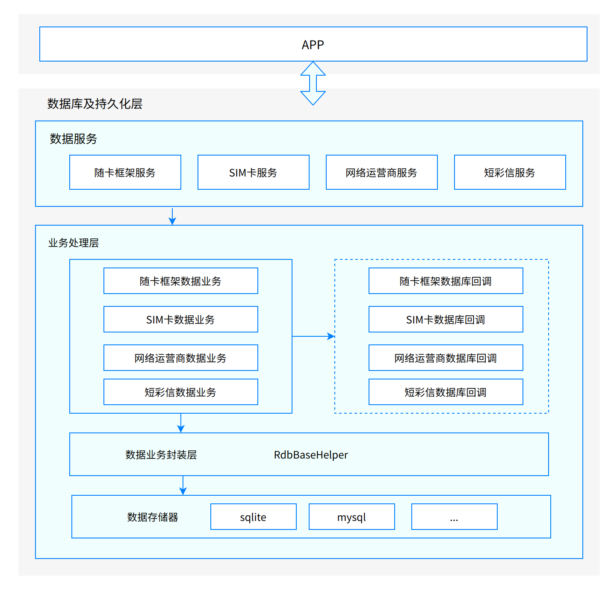

# 数据库及持久化<a name="ZH-CN_TOPIC_0000001152064139"></a>

-   [简介](#section117mcpsimp)
-   [目录](#section124mcpsimp)
-   [约束](#section128mcpsimp)
-   [接口说明](#section136mcpsimp)

-   [使用说明](#section163mcpsimp)
    -   [插入接口参数说明](#section1099113151207)
    -   [删除接口参数说明](#section1098113151208)
    -   [更新接口参数说明](#section1099113151207)
    -   [查询接口参数说明](#section1096113151208)
    -   [接口调用代码示例](#section1558565082915)

-   [相关仓](#section206mcpsimp)

## 简介<a name="section117mcpsimp"></a>

数据库及持久化模块负责电话服务子系统中的SIM卡/短彩信等模块持久化数据存储，提供DataAbility访问接口。

**图 1**  数据库及持久化架构图<a name="fig13267152558"></a>



## 目录<a name="section124mcpsimp"></a>

```
/base/telephony/data_storage     # 数据库及持久化
├─ common                           # 通用文件
│  ├─ include                      # 头文件目录
│  └─ src                          # 实现代码目录
├─ config                           # config.json配置文件
├─ figures                          # Readme资源文件
├─ opkey                            # 随卡框架
│  ├─ include　　　　              # 头文件目录
│  └─ src　　　　　　              # 实现代码目录
├─ pdp_profile                      # 网络运营商
│  ├─ include                      # 头文件目录
│  └─ src                          # 实现代码目录
├─ signature                        # 签名文件
├─ sim                              # sim卡
│  ├─ include                      # 头文件目录
│  └─ src                          # 实现代码目录
├─ sms_mms                          # 短彩信
│  ├─ include                      # 头文件目录
│  └─ src                          # 实现代码目录
└─ test                             # 测试相关
   └── unit_test                   # 单元测试相关代码
```

## 约束<a name="section128mcpsimp"></a>

- 开发语言：C++

- 软件约束：需要与以下服务配合使用：公共基础子库系统，应用框架子系统。

- 硬件约束：无

- 使用场景：当用户需要获取电话服务子系统中的SIM卡/短彩信等模块持久化数据时,可通过DataAbilityHelper提供的增/删/改/查接口来获取数据。

  访问时需要提供对应的权限和URI。

### 接口说明<a name="section136mcpsimp"></a>

**表 1**  增/删/改/查接口

<a name="table165976561598"></a>

| 接口定义                                                     | **接口描述** |
| ------------------------------------------------------------ | ------------ |
| int Insert(const Uri &uri, const NativeRdb::ValuesBucket &value) | 插入数据     &nbsp;&nbsp;&nbsp;&nbsp;&nbsp;|
| int Delete(const Uri &uri, const NativeRdb::DataAbilityPredicates &predicates) | 删除数据     &nbsp;&nbsp;&nbsp;&nbsp;&nbsp;|
| int Update( const Uri &uri, const NativeRdb::ValuesBucket &value, const NativeRdb::DataAbilityPredicates &predicates) | 更新数据     &nbsp;&nbsp;&nbsp;&nbsp;&nbsp;|
| std::shared_ptr\<NativeRdb::AbsSharedResultSet\> Query( const Uri &uri, const std::vector\<std::string\> &columns, const NativeRdb::DataAbilityPredicates &predicates) | 查询数据     &nbsp;&nbsp;&nbsp;&nbsp;&nbsp;|

**表 2**  权限说明

<a name="table165976561598"></a>

| 模块           | **所需权限**                                                 |
| -------------- | ------------------------------------------------------------ |
| 短彩信模块     | ohos.permission.READ_MESSAGES                                |
| SIM卡模块      | ohos.permission.GET_TELEPHONY_STATE<br />ohos.permission.SET_TELEPHONY_STATE |
| 网络运营商模块 | ohos.permission.GET_TELEPHONY_STATE<br />ohos.permission.SET_TELEPHONY_STATE |
| 随卡框架模块 | ohos.permission.GET_TELEPHONY_STATE<br />ohos.permission.SET_TELEPHONY_STATE |

## 使用说明<a name="section163mcpsimp"></a>

### 插入接口参数说明<a name="section1099113151207"></a>

**表 3**  Insert接口参数说明

<a name="table1234838197"></a>

| 参数  | **说明**                              |
| ----- | ------------------------------------- |
| uri   | 资源路径                              |
| value | 数据集合,字段对应当前操作的表结构字段 |

### 删除接口参数说明<a name="section1098113151208"></a>

**表 4**  Delete接口参数说明

<a name="table1234838197"></a>

| 参数       | 说明                                  |
| ---------- | ------------------------------------- |
| uri        | 资源路径                              |
| value      | 数据集合,字段对应当前操作的表结构字段 |
| predicates | 删除条件                              |

### 更新接口参数说明<a name="section1097113151210"></a>

**表 5**  Update接口参数说明

<a name="table1234838197"></a>

| 参数       | 说明     |
| ---------- | -------- |
| uri        | 资源路径 |
| predicates | 更新条件 |

### 查询接口参数说明<a name="section1096113151208"></a>

**表 6**  Query接口参数说明

<a name="table1234838197"></a>

| 参数       | 说明           |
| ---------- | -------------- |
| uri        | 资源路径       |
| columns    | 查询返回的字段 |
| predicates | 查询条件       |

### 接口调用代码示例<a name="section1558565082915"></a>

以查询/插入/删除/更新短彩信数据为例，主要步骤和代码如下：

1. 使用SystemAbilityManagerClient获得SystemAbilityManager对象。
2. 使用saManager获得指定服务Id的IRemoteObject对象。
3. 使用IRemoteObject创建DataAbilityHelper对象。
4. 调用DataAbilityHelper::Query接口访问，并接收处理返回的数据。  

   创建DataAbilityHelper:
   ```
   std::shared_ptr<AppExecFwk::DataAbilityHelper> CreateDataAHelper(int32_t systemAbilityId)
   {
       //通过SystemAbilityManagerClient获得SystemAbilityManager
       auto saManager = SystemAbilityManagerClient::GetInstance().GetSystemAbilityManager();
       if (saManager == nullptr) {
           DATA_STORAGE_LOGE("DataSimRdbHelper Get system ability mgr failed.");
           return nullptr;
       }
       // 获得IRemoteObject
       auto remoteObj = saManager->GetSystemAbility(systemAbilityId);
       while (remoteObj == nullptr) {
           DATA_STORAGE_LOGE("DataSimRdbHelper GetSystemAbility Service Failed.");
           return nullptr;
       }
       // 创建DataAbilityHelper
       return AppExecFwk::DataAbilityHelper::Creator(remoteObj);
   }
   ```
   查询短彩信信息:
   ```
   std::shared_ptr<NativeRdb::AbsSharedResultSet> SmsSelect(std::shared_ptr<AppExecFwk::DataAbilityHelper> helper)
   {	
       // 资源路径
       Uri uri("dataability:///com.ohos.smsmmsability/sms_mms/sms_mms_info");
       //查询返回的字段
       std::vector<std::string> colume;
       // 发送者号码
       colume.push_back("sender_number");
       // 消息标题
       colume.push_back("msg_title");
       // 消息内容
       colume.push_back("msg_content");
       // 查询谓词
       NativeRdb::DataAbilityPredicates predicates;
       // 调用DataAbilityHelper::Query接口查询
       return helper->Query(uri, colume, predicates);
   }
   ```
   插入短彩信信息:
   ```
   int SmsInsert(std::shared_ptr<AppExecFwk::DataAbilityHelper> helper)
   {
       Uri uri("dataability:///com.ohos.smsmmsability/sms_mms/sms_mms_info");
       NativeRdb::ValuesBucket value;
       // 接收者号码
       value.PutString(SmsMmsInfo::RECEIVER_NUMBER, "138XXXXXXXX");
       // 消息内容
       value.PutString(SmsMmsInfo::MSG_CONTENT, "ceshi");
       value.PutInt(SmsMmsInfo::GROUP_ID, 1);
       return helper->Insert(uri, value);
   }
   ```
   删除短彩信信息:
   ```
    int SmsDelete(std::shared_ptr<AppExecFwk::DataAbilityHelper> helper)
    {
        Uri uri("dataability:///com.ohos.smsmmsability/sms_mms/sms_mms_info");
        NativeRdb::DataAbilityPredicates predicates;
        // 删除MSG_ID为1的信息
        predicates.EqualTo(SmsMmsInfo::MSG_ID, "1");
        return helper->Delete(uri, predicates);
    }
   ```
   更新短彩信信息：
   ```
   int SmsUpdate(std::shared_ptr<AppExecFwk::DataAbilityHelper> helper)
   {
       Uri uri("dataability:///com.ohos.smsmmsability/sms_mms/sms_mms_info");
       NativeRdb::ValuesBucket values;
       // 信息内容
       values.PutString(SmsMmsInfo::MSG_CONTENT, "hi ohos");
       NativeRdb::DataAbilityPredicates predicates;
       // 信息Id
       predicates.EqualTo(SmsMmsInfo::MSG_ID, "1");
       return helper->Update(uri, values, predicates);
   }
   ```


## 相关仓<a name="section206mcpsimp"></a>

[电话服务子系统](https://gitee.com/openharmony/docs/blob/master/zh-cn/readme/%E7%94%B5%E8%AF%9D%E6%9C%8D%E5%8A%A1%E5%AD%90%E7%B3%BB%E7%BB%9F.md)

**telephony_data_storage**

[telephony_core_service](https://gitee.com/openharmony/telephony_core_service/blob/master/README_zh.md)

[telephony_sms_mms](https://gitee.com/openharmony/telephony_sms_mms/blob/master/README_zh.md)

[telephony_cellular_call](https://gitee.com/openharmony/telephony_cellular_call/blob/master/README_zh.md)

[telephony_call_manager](https://gitee.com/openharmony/telephony_call_manager/blob/master/README_zh.md)

