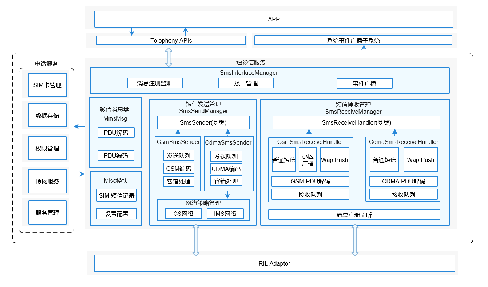

# 短彩信<a name="ZH-CN_TOPIC_0000001105544742"></a>


- [简介<a name="section117mcpsimp"></a>](#简介)
- [目录<a name="section125mcpsimp"></a>](#目录)
- [约束<a name="section129mcpsimp"></a>](#约束)
- [接口说明<a name="section134mcpsimp"></a>](#接口说明)
- [使用说明<a name="section170mcpsimp"></a>](#使用说明)
  - [发送短信<a name="section172mcpsimp"></a>](#发送短信)
  - [创建ShortMessage对象<a name="section181mcpsimp"></a>](#创建shortmessage对象)
- [相关仓<a name="section189mcpsimp"></a>](#相关仓)

## 简介<a name="section117mcpsimp"></a>

短彩信模块为移动数据用户提供短信收发和彩信编解码功能，主要功能有GSM/CDMA短信收发、短信PDU（Protocol data unit，协议数据单元）编解码、Wap Push接收处理 、小区广播接收、彩信通知、 彩信编解码和SIM卡短信记录增删改查等。

**图 1**  短彩信模块架构图<a name="fig420553511549"></a>


短彩信模块由接口管理类、短信发送管理类、短信接收管理类，和彩信编解码工具类组成。其中：

-   接口管理类：SmsInterfaceManager 负责对外提供短信发送、SIM卡短信记录操作和配置相关接口，负责创建SmsSendManager 、SmsReceiveManager和smsMiscManager 对象。
-   短信发送管理类： SmsSendManager创建GSM\(GsmSmsSender\) 、CDMA\(CdmaSmsSender\) 和网络策略管理(SmsNetworkPolicyManager)对象，并根据网络制式调度对应的GSM或CDMA对象发送短信。
-   短信接收管理类： SmsReceiveManager 负责短信接收，监听来自RIL层的新短信信息；创建GSM\(GsmSmsReceiveHandler\) 和CDMA\(CdmaSmsReceiveHandler\) 对象；创建SmsWapPushHandler 和SmsCellBroadcastHandler 对象。
-   彩信编解码类：负责彩信PDU的编解码处理。
-   Misc管理类：负责Sim卡短信操作、小区广播配置、短信服务中心地址配置和默认卡槽配置等。
-   IMS短信管理类：ImsSmsClient 负责IMS短信发送，及设置/获取IMS短信配置信息。

## 目录<a name="section125mcpsimp"></a>

```
/base/telephony/sms_mms
├─ common                       # 内部公共代码
├─ figures                      # Readme资源文件
├─ frameworks                   # 短彩信内部框架接口层
│  ├─ js                        # js相关代码
│  └─ native                    # native相关代码
├─ interfaces                   # 接口目录
│  ├─ innerkits                 # 部件间的内部接口
│  │ └─  ims                    # IMS短信接口定义
│  └─ kits                      # 对应用提供的接口（例如JS接口）
├─ sa_profile                   # 短信服务的启动文件目录
├─ services                     # 短彩信服务实现代码
│  ├─ ims_service_interaction   # IMS短信服务交互层
│  ├─ include                   # 头文件目录
│  ├─ cdma                      # CDMA制式源文件
│  └─ gsm                       # GSM制式源文件
├─ test                         # 单元测试目录
│  ├─ fuzztest                  # 模糊测试相关代码
│  ├─ gtest                     # 自动化测试相关代码
│  └─ unittest                  # 单元测试相关代码
└─ utils                        # 通用工具相关
```

## 约束<a name="section129mcpsimp"></a>

-   开发语言：JavaScript。
-   软件约束，需要与以下服务配合使用：Telephony核心服务（core\_service）；依赖[glib](https://gitlab.gnome.org/GNOME/glib)库。
-   硬件约束，需要搭载的设备支持以下硬件：可以进行独立蜂窝通信的Modem以及SIM卡。

## 接口说明<a name="section134mcpsimp"></a>

**表 1**  短彩信对外提供的接口

| 接口名称                                                     | 接口描述                                                     | 所需权限                            |
| ------------------------------------------------------------ | ------------------------------------------------------------ | ----------------------------------- |
| function sendMessage(options: SendMessageOptions): void;     | 发送短信，通过callback异步获取短信发送结果。                 | SystemPermission.SEND_MESSAGES      |
| function createMessage(pdu: Array\<number>, specification: string, callback: AsyncCallback、\<ShortMessage>): void; | 根据协议数据单元（PDU）和指定的短信协议创建短信实例，使用callback方式异步返回创建的短信实例。 | 无                                  |
| function createMessage(pdu: Array\<number>, specification: string): Promise\<ShortMessage> | 根据协议数据单元（PDU）和指定的短信协议创建短信实例，使用Promise方式异步返回创建的短信实例。 | 无                                  |
| function getDefaultSmsSlotId(callback: AsyncCallback\<number>): void | 获取发送短信的默认SIM卡槽，使用callback方式异步返回默认SIM卡槽。 | 无                                  |
| function getDefaultSmsSlotId():Promise\<number>              | 获取发送短信的默认SIM卡，使用Promise方式异步返回默认SIM卡槽。 | 无                                  |
| function setSmscAddr(slotId: number, smscAddr: string, callback: AsyncCallback\<void>): void | 设置短信服务中心地址，使用callback方式异步返回undefined。    | ohos.permission.SET_TELEPHONY_STATE |
| function setSmscAddr(slotId: number, smscAddr: string): Promise\<void> | 设置短信服务中心地址，使用Promise方式异步返回undefined。     | ohos.permission.SET_TELEPHONY_STATE |
| function getSmscAddr(slotId: number, callback: AsyncCallback\<string>): void | 获取短信服务中心地址，使用callback方式异步返回短信服务中心地址。 | ohos.permission.GET_TELEPHONY_STATE |
| function getSmscAddr(slotId: number): Promise\<string>       | 获取短信服务中心地址，使用Promise方式异步返回短信服务中心地址。 | ohos.permission.GET_TELEPHONY_STATE |

**表 2**  发送短信接口参数SendMessageOptions说明

| 参数             | 类型                                          | 描述             | 是否必填         |
| ---------------- | --------------------------------------------- | ---------------- | ---------------- |
| slotId           | number                                        | 卡槽id           | 是               |
| destinationHost  | string                                        | 接收端的电话号码 | 是               |
| serviceCenter    | string                                        | 短信中心服务地址 | 否               |
| content          | content \| Array\<number>                     | 短信内容         | 是               |
| destinationPort  | number                                        | 接收端端口号     | 发送数据短信必填 |
| sendCallback     | AsyncCallback\<ISendShortMessageCallback>     | 发送结果回调     | 是               |
| deliveryCallback | AsyncCallback\<IDeliveryShortMessageCallback> | 送达报告回调     | 是               |

**表 3**  ISendShortMessageCallback类型说明

| 参数       | 类型          | 描述               |
| ---------- | ------------- | ------------------ |
| result     | SendSmsResult | 发送结果           |
| url        | string        | URL地址            |
| isLastPart | boolean       | 是否是最后一条短信 |

**表 4**  SendSmsResult枚举值

| 名称                                 | 值   | 描述                     |
| ------------------------------------ | ---- | ------------------------ |
| SEND_SMS_SUCCESS                     | 0    | 发送成功                 |
| SEND_SMS_FAILURE_UNKNOWN             | 1    | 发送失败，原因未知       |
| SEND_SMS_FAILURE_RADIO_OFF           | 2    | 发送失败，因为Modem关闭  |
| SEND_SMS_FAILURE_SERVICE_UNAVAILABLE | 3    | 发送失败，因为网络不可用 |

**表 5**  IDeliveryShortMessageCallback类型说明

| 参数 | 类型           | 描述                                        |
| ---- | -------------- | ------------------------------------------- |
| pdu  | Array\<number> | PDU（Protocol data unit，协议数据单元）数组 |

**表 6**  createMessage接口参数说明

| 参数          | 类型           | 描述                                        |
| ------------- | -------------- | ------------------------------------------- |
| pdu           | Array\<number> | PDU（Protocol data unit，协议数据单元）数组 |
| specification | string         | 协议类型（3gpp或3gpp2）                     |

**表 7**  getDefaultSmsSlotId接口参数说明

| 参数     | 类型                   | 描述                      |
| -------- | ---------------------- | ------------------------- |
| callback | AsyncCallback\<number> | 回调函数。0：卡槽1：卡槽2 |

**表 8**  setSmscAddr接口参数说明

| 参数名   | 类型                 | 必填 | 说明                       |
| -------- | -------------------- | ---- | -------------------------- |
| slotId   | number               | 是   | SIM卡槽ID：0：卡槽1：卡槽2 |
| smscAddr | string               | 是   | 短信服务中心（SMSC）地址。 |
| callback | AsyncCallback\<void> | 是   | 回调函数。                 |

**表 9**  getSmscAddr接口参数说明

| 参数名   | 类型                   | 必填 | 说明                       |
| -------- | ---------------------- | ---- | -------------------------- |
| slotId   | number                 | 是   | SIM卡槽ID：0：卡槽1：卡槽2 |
| callback | AsyncCallback\<string> | 是   | 回调函数。                 |

**表 10**  创建短信异步回调ShortMessage说明

| 变量                     | 类型                                                         | 说明                                                         |
| ------------------------ | ------------------------------------------------------------ | ------------------------------------------------------------ |
| emailAddress             | string                                                       | 电子邮件地址。                                               |
| emailMessageBody         | string                                                       | 电子邮件正文。                                               |
| hasReplyPath             | boolean                                                      | 收到的短信是否包含“TP-回复路径”，默认为false。“TP-回复路径”：移动电话可循发送SMS消息的短消息中心进行回复。 |
| isEmailMessage           | boolean                                                      | 收到的短信是否为电子邮件。                                   |
| isReplaceMessage         | boolean                                                      | 收到的短信是否为“替换短信”，默认为false。“替换短信”有关详细信息，参见 “3GPP TS 23.040 9.2.3.9”。 |
| isSmsStatusReportMessage | boolean                                                      | 当前消息是否为“短信状态报告”，默认为false。“短信状态报告”是一种特定格式的短信，被用来从Service Center到Mobile Station传送状态报告。 |
| messageClass             | [ShortMessageClass](https://gitee.com/openharmony/telephony_sms_mms#section141712166453) | 短信类型。                                                   |
| pdu                      | Array\<number>                                               | SMS消息中的协议数据单元 （PDU）。                            |
| protocolId               | number                                                       | 发送短信时使用的协议标识。                                   |
| scAddress                | string                                                       | 短信服务中心（SMSC）地址。                                   |
| scTimestamp              | number                                                       | SMSC时间戳。                                                 |
| status                   | number                                                       | SMS-STATUS-REPORT消息中的短信状态指示短信服务中心（SMSC）发送的短信状态。 |
| userRawData              | Array\<number>                                               | 除协议头部的用户数据，即未解码的短信内容。                   |
| visibleMessageBody       | string                                                       | 短信正文。                                                   |
| visibleRawAddress        | string                                                       | 发送者地址。                                                 |


完整的JS API说明以及实例代码请参考：[收发短信](https://gitee.com/openharmony/docs/blob/master/zh-cn/application-dev/reference/apis/js-apis-sms.md)

## 使用说明<a name="section170mcpsimp"></a>

### 发送短信<a name="section172mcpsimp"></a>

以发送普通文本短信为例，主要步骤和代码如下：

1.  构造SendMessageOptions对象，传入必要的参数；若关注发送结果或送达报告，需要传入sendCallback或deliveryCallback对象。
2.  可以通过callback或者Promise的方式调用sendMessage接口。
3.  该接口为异步接口，相关执行结果会从callback中返回。

    ```
    import sms from "@ohos.telephony.sms";

    let msg: SendMessageOptions = {
      slotId: 0,
      destinationHost: '123xxxxxxxx',
      content: '这是一封短信',
      sendCallback: (err, data) => {
        if (err) {
          // 接口调用失败，err非空
          console.error(`failed to send message because ${err.message}`);
          return;
        }
        // 接口调用成功，err为空
        console.log(`success to send message: ${data.result}`);
      }
    }

    // 调用接口
    sms.sendMessage(msg);
    ```


### 创建ShortMessage对象<a name="section181mcpsimp"></a>

以解析3gpp类型的PDU，调用createMessage为例，主要步骤和代码如下：

1.  构造短信的PDU，指定协议类型为3gpp或者3gpp2。
2.  可以通过callback或者Promise的方式调用createMessage接口。
3.  该接口为异步接口，成功后获取ShortMessage 对象属性来得到解析后的短信息数据。

    ```
    import sms from "@ohos.telephony.sms";

    let pdu = [80, 80, 80]; // 这里只是表示是短信PDU，并非真实短信
    let specification = "3gpp";

    // 调用接口【callback方式】
    sms.createMessage(pdu, specification, (err, value) => {
      if (err) {
        // 接口调用失败，err非空
        console.error(`failed to createMessage because ${err.message}`);
        return;
      }
      // 接口调用成功，err为空
      console.log(`success to createMessage: ${value}`);
    });

    // 调用接口【Promise方式】
    let promise = sms.createMessage(pdu, specification);
    promise.then((value) => {
      // 接口调用成功，此处可以实现成功场景分支代码。
      console.log(`success to createMessage: ${value}`);
    }).catch((err) => {
      // 接口调用失败，此处可以实现失败场景分支代码。
      console.error(`failed to createMessage because ${err.message}`);
    });
    ```


## 相关仓<a name="section189mcpsimp"></a>

[电话服务子系统](https://gitee.com/openharmony/docs/blob/master/zh-cn/readme/%E7%94%B5%E8%AF%9D%E6%9C%8D%E5%8A%A1%E5%AD%90%E7%B3%BB%E7%BB%9F.md)

**telephony_sms_mms**

[telephony_core_service](https://gitee.com/openharmony/telephony_core_service/blob/master/README_zh.md)
