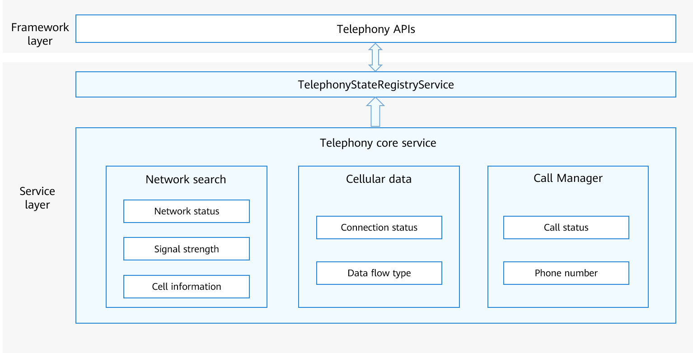

# State Registry<a name="EN-US_TOPIC_0000001152064139"></a>


## Introduction<a name="section117mcpsimp"></a>

The state registry module provides APIs to register and deregister an observer that listens for various callback events of the telephony subsystem. Such events include but are not limited to the following: network status change, signal strength change, cell information change, cellular data connection status change, and call status change.

**Figure  1**  Architecture of the state registry module<a name="fig13267152558"></a>


## Directory Structure<a name="section124mcpsimp"></a>

```
/base/telephony/state_registry      # State registry service
├─ figures                          # Figures of readme files
├─ frameworks                       # Framework layer
│  ├─ js                            # JS code
│  └─ native                        # Native code
├─ interfaces                       # APIs
│  ├─ innerkits                     # Internal APIs
│  └─ kits                          # External APIs \(such as JS APIs\)
├─ sa_profile                       # SA profile
├─ service                          # Service code
└─ test                             # Test code
   ├─ mock                          # Simulation test
   └─ unittest                      # Unit test
```

## Constraints<a name="section128mcpsimp"></a>

-   Programming language: JavaScript
-   Software constraints: this service needs to work with the telephony core service \(core\_service\).
-   Hardware constraints: the accommodating device must be equipped with a modem and a SIM card capable of independent cellular communication.
-   The API for registering an observer for the SIM card status takes effect only when SIM cards are in position. If SIM cards are removed, no callback events will be received. Your application can call the  **getSimState**  API to check whether SIM cards are in position.

## Usage<a name="section134mcpsimp"></a>

### Available APIs<a name="section136mcpsimp"></a>

**Table  1**  Registration APIs

<a name="table165976561598"></a>

| API                                                          | Description              |
| ------------------------------------------------------------ | ------------------------ |
| function on(type: String, options: { slotId?: number }, callback: AsyncCallback\<T\>): void; | Registers an observer.   |
| function off(type: String, callback?: AsyncCallback\<T\>): void; | Deregisters an observer. |

## Usage Guidelines<a name="section163mcpsimp"></a>

### Parameters of C APIs<a name="section1099113151207"></a>

Different subscription events are distinguished by the  **type**  parameter. The following table lists the related  **type**  parameters.

**Table  2**  Description of type parameters

<a name="table1234838197"></a>

| Parameter                         | Description                                                  | Required Permission              |
| --------------------------------- | ------------------------------------------------------------ | -------------------------------- |
| networkStateChange                | Network status change event                                  | ohos.permission.GET_NETWORK_INFO |
| signalInfoChange                  | Signal change event                                          | None                             |
| cellInfoChange                    | Cell information change event                                | ohos.permission.LOCATION and ohos.permission.APPROXIMATELY_LOCATION         |
| cellularDataConnectionStateChange | Cellular data connection status change event                 | None                             |
| cellularDataFlowChange            | Cellular data flow change event                              | None                             |
| callStateChange                   | Call status change event, in which the value of **phoneNumber** is empty if the user does not have the required permission. | ohos.permission.READ_CALL_LOG    |

### Sample Code<a name="section1558565082915"></a>

The function of registering an observer for call status change events is used as an example. The process is as follows:

1.  Call the  **on**  method with the  **type**  parameter specified to register an observer for different types of events.
2.  Check whether the registration is successful. If  **err**  is empty in the received callback, the registration is successful. If  **err**  is not empty, the registration has failed. Obtain the required data from  **value**  if the registration is successful.
3.  Call the  **off**  method to deregister the observer. After the observer is deregistered, no callback will be received.

    ```
    // Import the observer package.
    import observer from '@ohos.telephony.observer';

    // Registers an observer.
    observer.on('callStateChange', {slotId: 1}, (err, value) => {
      if (err) {
        // If the API call failed, err is not empty.
        console.error(`failed, because ${err.message}`);
        return;
      }
      // If the API call succeeded, err is empty.
      console.log(`success on. number is ` + value.number + ", state is " + value.state);
    });

    // Deregister the observer.
    observer.off('callStateChange', (err, value) => {
      if (err) {
        // If the API call failed, err is not empty.
        console.error(`failed, because ${err.message}`);
        return;
      }
      // If the API call succeeded, err is empty.
      console.log(`success off`);
    });
    ```


## Repositories Involved<a name="section206mcpsimp"></a>

[Telephony](https://gitee.com/openharmony/docs/blob/master/en/readme/telephony.md)

**telephony_state_registry**

[telephony_core_service](https://gitee.com/openharmony/telephony_core_service/blob/master/README.md)

[telephony_cellular_call](https://gitee.com/openharmony/telephony_cellular_call/blob/master/README.md)

[telephony_call_manager](https://gitee.com/openharmony/telephony_call_manager/blob/master/README.md)
