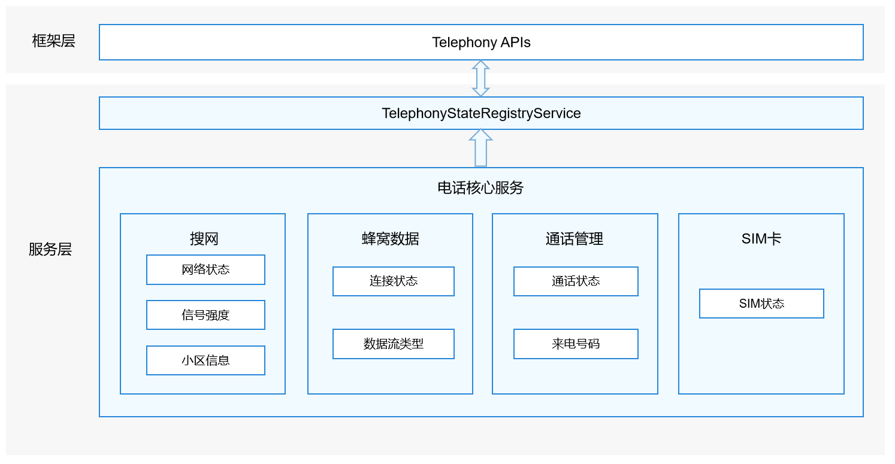

# 状态注册<a name="ZH-CN_TOPIC_0000001152064139"></a>

-   [简介](#section117mcpsimp)
-   [目录](#section124mcpsimp)
-   [约束](#section128mcpsimp)
-   [说明](#section134mcpsimp)
    -   [接口说明](#section136mcpsimp)

-   [使用说明](#section163mcpsimp)
    -   [订阅接口参数说明](#section1099113151207)
    -   [接口调用代码示例](#section1558565082915)

-   [相关仓](#section206mcpsimp)

## 简介<a name="section117mcpsimp"></a>

状态注册主要负责提供电话服务子系统各种消息事件的订阅以及取消订阅的API。事件类型包括网络状态变化、信号强度变化、小区信息变化、蜂窝数据连接状态变化、通话状态变化等等。

**图 1**  状态注册架构图<a name="fig13267152558"></a>


## 目录<a name="section124mcpsimp"></a>

```
/base/telephony/state_registry      # 状态注册转发服务
├─ figures                          # Readme资源文件
├─ frameworks                       # 框架层目录
│  ├─ js                            # js相关代码
│  └─ native                        # native相关代码
├─ interfaces                       # 接口目录
│  ├─ innerkits                     # 部件间的内部接口
│  └─ kits                          # 对应用提供的接口（例如JS接口）
├─ sa_profile                       # 启动配置文件
├─ service                          # 服务内部代码
└─ test                             # 测试相关
   ├─ mock                          # 模拟测试相关代码
   └─ unittest                      # 单元测试相关代码
```

## 约束<a name="section128mcpsimp"></a>

-   开发语言：JavaScript。
-   软件约束：需要与以下服务配合使用：Telephony核心服务（core\_service）。
-   硬件约束：需要搭载的设备支持以下硬件：可以进行独立蜂窝通信的Modem以及SIM卡。
-   使用场景：注册获取SIM卡状态接口仅针对有SIM卡在位场景生效，若用户拔出SIM卡，则接收不到回调事件。应用可通过调用getSimState接口来确定当前卡槽是否有卡在位。

## 说明<a name="section134mcpsimp"></a>

### 接口说明<a name="section136mcpsimp"></a>

**表 1**  注册接口

<a name="table165976561598"></a>

| 接口定义                                                     | **接口描述** |
| ------------------------------------------------------------ | ------------ |
| function on(type: String, options: { slotId?: number }, callback: AsyncCallback\<T\>): void; | 开启订阅     |
| function off(type: String, callback?: AsyncCallback\<T\>): void; | 关闭订阅     |

## 使用说明<a name="section163mcpsimp"></a>

### 订阅接口参数说明<a name="section1099113151207"></a>

不同订阅事件通过type进行区分，type列表如下：

**表 2**  type参数说明

<a name="table1234838197"></a>

| type参数                          | 说明                                                  | 所需权限                         |
| --------------------------------- | ----------------------------------------------------- | -------------------------------- |
| networkStateChange                | 网络状态变化事件                                      | ohos.permission.GET_NETWORK_INFO |
| signalInfoChange                  | 信号变化事件                                          | 无                               |
| cellInfoChange                    | 小区信息变化事件                                      | ohos.permission.LOCATION 和 ohos.permission.APPROXIMATELY_LOCATION         |
| cellularDataConnectionStateChange | 蜂窝数据连接状态事件                                  | 无                               |
| cellularDataFlowChange            | 蜂窝数据流变化事件                                    | 无                               |
| callStateChange                   | 通话状态变化事件                                      | ohos.permission.READ_CALL_LOG    |
| simStateChange                    | SIM卡状态变化事件                                    | ohos.permission.READ_SIM_STATE    |

### 接口调用代码示例<a name="section1558565082915"></a>

以订阅通话状态变化事件为例，主要步骤和代码如下：

1.  不同的事件指定不同的type，传入参数，调用on方法开启订阅。
2.  收到回调后，若err为空，则订阅成功，否则订阅失败。订阅成功则可以从value中获取数据。
3.  可以通过off方法取消订阅。取消订阅之后，不会再收到任何回调。

    ```
    // 引入包名
    import observer from '@ohos.telephony.observer';

    // 开启订阅
    observer.on('callStateChange', {slotId: 1}, (err, value) => {
      if (err) {
        // 接口调用失败，err非空
        console.error(`failed, because ${err.message}`);
        return;
      }
      // 接口调用成功，err为空
      console.log(`success on. number is ` + value.number + ", state is " + value.state);
    });

    // 关闭订阅
    observer.off('callStateChange', (err, value) => {
      if (err) {
        // 接口调用失败，err非空
        console.error(`failed, because ${err.message}`);
        return;
      }
      // 接口调用成功，err为空
      console.log(`success off`);
    });
    ```


## 相关仓<a name="section206mcpsimp"></a>

[电话服务子系统](https://gitee.com/openharmony/docs/blob/master/zh-cn/readme/%E7%94%B5%E8%AF%9D%E6%9C%8D%E5%8A%A1%E5%AD%90%E7%B3%BB%E7%BB%9F.md)

**telephony_state_registry**

[telephony_core_service](https://gitee.com/openharmony/telephony_core_service/blob/master/README_zh.md)

[telephony_cellular_call](https://gitee.com/openharmony/telephony_cellular_call/blob/master/README_zh.md)

[telephony_call_manager](https://gitee.com/openharmony/telephony_call_manager/blob/master/README_zh.md)