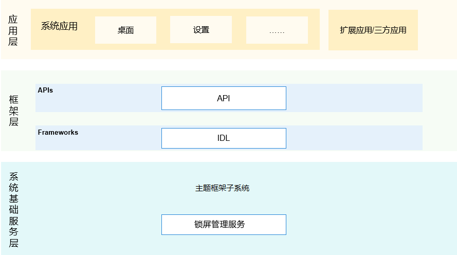

# theme_screenlock_mgr

#### Introduction
Provide three-party APP with the ability to request unlockScreen, query the screenlock status, and query whether to set the screenlock password. 
Provide screenOn callback, screenOff callback, screenSaver in and out callback, user switching callback, and screenlock manager service running status callback to the operation management

**subsystem architecture diagram**   

#### Warehouse path
/base/theme/screenlock_mgr

#### Introduction to framework code
/base/theme/screenlock_mgr
├── figures                  # architecture diagram
├── frameworks/innerkitsimpl # interface provided for app 
├── interfaces               # interface code provided by module
│   ├── innerkits            # inter service interface
│   └── kits                 # napi interface
├── sa_profile               # module contains the config files of system services and processes
├── services                 # implementation of screenlock manager service
├── test                     # unit test of interface
└── utils                    # module contains log printing and constants for ordered commonEvent

#### JS APIs and instructions
1.   JS APIs
function isScreenLocked(callback: AsyncCallback<boolean>): void; query the screenlock status，callback mode
function isScreenLocked(): Promise<boolean>; void; query the screenlock status，Promise mode

function isSecureMode(callback: AsyncCallback<boolean>): void; query whether to set screenlock password (gesture, digital password, pin, SIM)，callback mode
function isSecureMode(): Promise<boolean>; query whether to set screenlock password (gesture, digital password, pin, SIM)，Promise mode

function unlockScreen(callback: AsyncCallback<void>): void; request unlockScreen，callback mode
function unlockScreen(): Promise<void>; request unlockScreen，Promise mode

2.  JS APIs instructions
// Import module
import screenLock from '@ohos.screenLock';

// query the screenlock status asynchronously with a Promise
screenLock.isScreenLocked()    
      .then((value) => {        
          console.log(`success to screenLock.isScreenLocked: ${value}`);   
       }).catch((err) => {        
          console.error(`failed to screenLock.isScreenLocked because ${err.message}`)  
    });

// query the screenlock status asynchronously with a callback
screenLock.isScreenLocked((err, value) => {   
     if (err) {        
          console.error(`failed to screenLock.isScreenLocked because ${err.message}`);   
           return;   
         }    
       console.log(`success to screenLock.isScreenLocked: ${value}`);   
    });

#### Debugging method

1.   Compile command

./build.sh --product-name (Fill in the specific product name, such as：Hi3516DV300) --build-target screenlock_native

2.  push so file

in $root\out\ohos-arm-release\miscservices\screenlock_native，push libscreenlock_server.z.so libscreenlock_client.z.so 
libscreenlock_utils.z.so to system/lib，and push libscreenlockability.z.so to system/lib/module/app下.make sure the four so files is readable at least.

3.  reboot

#### Participation contribution

1. Fork warehouse
2. Submission code
3. Create a new pull request
4. Commit is complete

