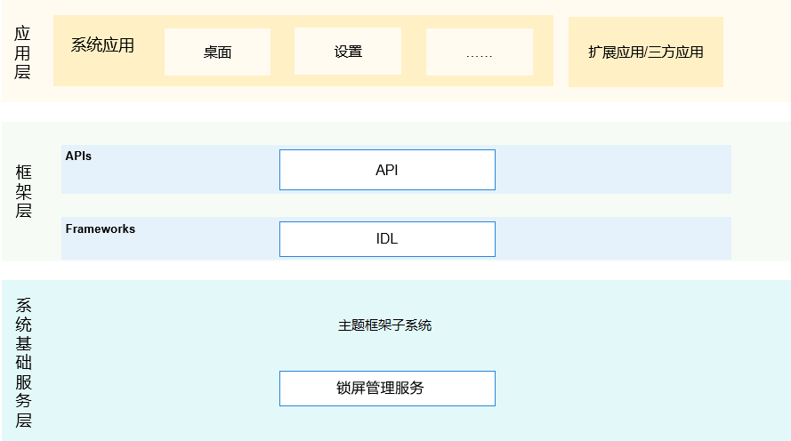

# 锁屏管理服务

## 简介
### 内容介绍
锁屏管理服务是OpenHarmony中系统服务，为锁屏应用提供注册亮屏、灭屏、开启屏幕、结束休眠、退出动画、请求解锁结果监听，并提供回调结果给锁屏应用。锁屏管理服务向三方应用提供请求解锁、查询锁屏状态、查询是否设置锁屏密码的能力。

**图 1** 架构图



### 框架图介绍 
1.三方应用支持操作请求解锁、查询锁屏状态、查询是否设置锁屏密码接口调用。\
2.锁屏应用注册亮屏、灭屏、开启屏幕、结束休眠、退出动画、请求解锁结果监听等事件 \
3.框架层API用来处理三方应用和锁屏应用的js接口请求处理，NAPI层进行js调用的处理 \
4.框架层IDL用来处理NAPI接口向锁屏管理服务之间的桥梁，进行IPC通讯 \
5.锁屏管理服务用来处理三方应用和锁屏应用接口请求，并作出对应处理，提供相应的返回结果。

## 目录

```
/base/theme/screenlock_mgr
├── figures                  # 构架图
├── frameworks/kitsimpl      # 对应用提供的接口
├── interfaces/kits          # 组件对外提供的接口代码
│   ├── jskits               # 服务间接口
│   └── napi                 # js接口解析成napi接口
├── sa_profile               # 组件包含的系统服务的配置文件和进程的配置文件
├── services                 # 锁屏管理服务实现
├── test                     # 接口的单元测试
└── utils                    # 组件包含日志打印和有序公共事件定义的常量
```

## 说明

### 接口说明

**表 1**   锁屏管理服务的主要方法说明

| 接口名                      | 描述                       |
| -------------------------- | -------------------------- |
| isScreenLocked(callback: AsyncCallback<boolean>): void; | 判断屏幕是否锁屏，callback方式 |
| isScreenLocked(): Promise<boolean>; | 判断屏幕是否锁屏，Promise方式 |
| isLocked(): boolean; | 判断屏幕是否锁屏。如果屏幕当前已锁定，则返回true，否则返回false，同步方式 |
| isSecureMode(callback: AsyncCallback<boolean>): void; | 判断当前设备的屏幕锁定是否安全(安全屏幕锁定意味着解锁屏幕需要密码、图案或其他用户身份识别)，callback方式 |
| isSecureMode(): Promise<boolean>; | 判断当前设备的屏幕锁定是否安全(安全屏幕锁定意味着解锁屏幕需要密码、图案或其他用户身份识别)，Promise方式 |
| isSecure(): boolean; | 判断当前设备的屏幕锁定是否安全(安全屏幕锁定意味着解锁屏幕需要密码、图案或其他用户身份识别)。如果当前设备的屏幕锁定安全，则返回true，否则返回false，同步方式 |
| unlockScreen(callback: AsyncCallback<void>): void; | 三方应用解锁屏幕，callback方式 |
| unlockScreen(): Promise<void>; | 三方应用解锁屏幕，Promise方式 |
| unlock(callback: AsyncCallback<boolean>): void; | 三方应用解锁屏幕，如果屏幕解锁成功。则返回true，否则返回false，callback方式 |
| unlock():Promise<boolean>; | 三方应用解锁屏幕，如果屏幕解锁成功。则返回true，否则返回false，Promise方式 |
| lock(callback: AsyncCallback<boolean>): void; | 系统API，锁定屏幕。如果屏幕锁定成功，则返回true，否则返回false，callback方式 |
| lock():Promise<boolean>; | 系统API，锁定屏幕。如果屏幕锁定成功，则返回true，否则返回false，Promise方式 |
| SystemEvent { eventType: EventType, params: string } | 定义了系统事件回调参数结构，包含事件类型以及string类型的参数 |
| onSystemEvent(callback: Callback<SystemEvent>): boolean; | 系统API，注册与系统屏幕锁定相关的系统事件。如果注册系统事件成功，则返回true，否则返回false，callback方式 |
| sendScreenLockEvent(event: String, parameter: number, callback: AsyncCallback<boolean>): void; | 系统API，锁屏应用给锁屏管理服务发送事件,callback方式 |
| sendScreenLockEvent(event: String, parameter: number): Promise<boolean>; | 系统API，锁屏应用给锁屏管理服务发送事件,promise方式 |


**表 2**   EventType-事件类型说明

| 事件类型                     | 描述                       |
| -------------------------- | -------------------------- |
| beginWakeUp | 表示开始唤醒监听事件 |
| endWakeUp | 表示结束唤醒监听事件 |
| beginScreenOn | 表示开始亮屏监听事件 |
| endScreenOn | 表示结束亮屏监听事件 |
| beginScreenOff | 表示开始灭屏监听事件 |
| endScreenOff | 表示结束灭屏监听事件 |
| unlockScreen | 表示请求解锁监听事件 |
| lockScreen | 表示请求锁定监听事件 |
| beginExitAnimation | 表示开始退场监听事件 |
| beginSleep | 表示开始休眠监听事件 |
| endSleep | 表示结束休眠监听事件 |
| changeUser | 表示切换用户监听事件 |
| screenlockEnabled | 表示锁屏是否启用监听事件 |
| serviceRestart | 表示服务重新启动监听事件 |

### JS 接口使用示例

三方应用向锁屏管理服务进行查询屏幕锁屏状态

```js
导入模块
import screenLock from '@ohos.screenlock';

//Promise方式，在异步回调里面获取锁屏状态结果
screenLock.isScreenLocked()
    .then((value) => {
        //异步回调打印查询锁屏状态的结果
        console.log(`success to screenLock.isScreenLocked: ${value}`);
    }).catch((err) => {
        //打印错误信息
        console.error(`failed to screenLock.isScreenLocked because ${err.message}`)
});

//callback方式，在异步回调里面获取锁屏状态结果
screenLock.isScreenLocked((err, value) => {
    if (err) {
        //打印错误信息
        console.error(`failed to screenLock.isScreenLocked because ${err.message}`);
        return;
        }
    //打印查询锁屏状态的结果
    console.log(`success to screenLock.isScreenLocked: ${value}`);
});

 //同步方式里面获取锁屏状态结果，如果屏幕当前已锁定，则返回true，否则返回false
 screenLock.isLocked();

```

判断当前设备的屏幕锁定是否安全

```js

//Promise方式，在异步回调里面获取是否安全结果
screenlock.isSecureMode().then((data) => {
    console.log('isSecureMode success: data->${JSON.stringify(data)}');
}).catch((err) => {
    console.error('isSecureMode fail, promise: err->${JSON.stringify(err)}');
});

//callback方式，在异步回调里面获取是否安全结果
screenlock.isSecureMode((err, data)=>{      
    if (err) {
        console.error('isSecureMode callback error -> ${JSON.stringify(err)}');
        return;    
    }
    console.info('isSecureMode callback success data -> ${JSON.stringify(err)}');
});

 //同步方式里面获取是否安全结果，如果当前设备的屏幕锁定安全，则返回true，否则返回false
screenlock.isSecure();

```

锁定屏幕

```js

//Promise方式，在异步回调里面获取是否安全结果
screenlock.lock().then(() => {
    console.log('lock success');
}).catch((err) => {
    console.error('lock fail, promise: err->${JSON.stringify(err)}');
});

//callback方式，在异步回调里面获取是否安全结果
screenlock.lock((err) => {      
    if (err) {
        console.error('lock callback error -> ${JSON.stringify(err)}');
        return;    
    }
    console.info('lock callback success');
});

```

锁屏应用注册事件说明:锁屏应用向锁屏管理服务注册相关监听事件

 ```js
let isSuccess = screenlock.onSystemEvent((err, event)=>{
    console.log(`onSystemEvent:callback:${event.eventType}`)
    if (err) {
        console.log(`onSystemEvent callback error -> ${JSON.stringify(err)}`);
    }
});
if (!isSuccess) {
    console.log(`onSystemEvent result is false`)
}
 ```

三方应用向锁屏管理服务发起解锁屏幕请求

 ```js

//三方应用callback方式调用请求解锁

screenLock.unlockScreen((err, data) => {
    console.log("Screenlock_Test_2300: send unlockScreen issue begin");
    if (err) {
    console.log("Screenlock_Test_2300: unlockScreen fail-->"+err);
    return;
    }
    console.log("Screenlock_Test_2300: unlockScreen success-->"+data);
});

screenlock.unlock((err,data) => {      
    if (err) {
        console.error('unlock  error -> ${JSON.stringify(err)}');
        return;    
    }
    console.info('unlock  success data -> ${JSON.stringify(data)}');
});

//三方应用Promise方式调用请求解锁

screenLock.unlockScreen().then((data) => {
    console.log("ScreenLock_Test_Promise_0500: unlockScreen success-->"+data);
}).catch((error) => {
    console.error("ScreenLock_Test_Promise_0500: unlockScreen fail--> " + error);
});

screenlock.unlock().then((data) => {
    console.log('unlock success');
}).catch((err) => {
    console.error('unlock fail, : err->${JSON.stringify(err)}');
});

```

## 相关仓

**主题框架子系统**

[theme\_screenlock_mgr](https://gitee.com/openharmony/theme_screenlock_mgr)

