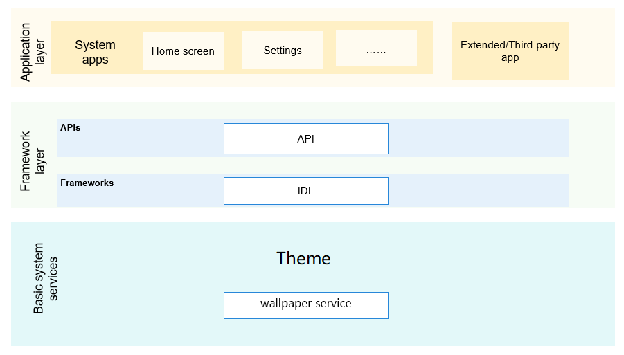

# wallpaper service

#### Introduction
1、Provide wallpaper service capability for the system, and support wallpaper display, setting, switching wallpaper and other functions;

2、Provide the framework and interface for developers to develop wallpaper, and develop wallpaper applications;

**subsystem architecture diagram**   


#### Warehouse path
/base/theme/wallpaper_mgr

#### Introduction to framework code
/base/theme/wallpaper_mgr
├── figures                  # architecture diagram
├── frameworks/innerkitsimpl # interface provided for app 
├── interfaces               # interface code provided by module
│   ├── innerkits            # inter service interface
│   └── kits                 # napi interface
├── sa_profile               # module contains the config files of system services and processes
├── services                 # implementation of wallpaper manager service
├── test                     # unit test of interface
└── utils                    # module contains log printing and constants for ordered commonEvent

#### Interface Introduction
**Table 1**  Main method of wallpaper service

<a name="table033515471012"></a>
<table><thead align="left"><tr id="row143351854201012"><th class="cellrowborder" valign="top" width="50%" id="mcps1.2.3.1.1"><p id="p103351154121010"><a name="p103351154121010"></a><a name="p103351154121010"></a>Interface Name</p>
</th>
<th class="cellrowborder" valign="top" width="50%" id="mcps1.2.3.1.2"><p id="p1033585416105"><a name="p1033585416105"></a><a name="p1033585416105"></a>Description</p>
</th>
</tr>
</thead>
<tbody><tr id="row204321219393"><td class="cellrowborder" valign="top" width="50%" headers="mcps1.2.3.1.1 "><p id="p1893413268144"><a name="p1893413268144"></a><a name="p1893413268144"></a>function getColors(wallpaperType: WallpaperType): Promise&lt;Array&lt;RgbaColor&gt;&gt;</p>
</td>
<td class="cellrowborder" valign="top" width="50%" headers="mcps1.2.3.1.2 "><p id="p18761104812149"><a name="p18761104812149"></a><a name="p18761104812149"></a>Obtains the wallpaper colors for the wallpaper of the specified type（system screen or lockscreen），Promise </p>
</td>
</tr>
<tr id="row13335054111018"><td class="cellrowborder" valign="top" width="50%" headers="mcps1.2.3.1.1 "><p id="p12832214151418"><a name="p12832214151418"></a><a name="p12832214151418"></a>function getId(wallpaperType: WallpaperType): Promise&lt;number&gt;</p>
</td>
<td class="cellrowborder" valign="top" width="50%" headers="mcps1.2.3.1.2 "><p id="p3335145451011"><a name="p3335145451011"></a><a name="p3335145451011"></a>Obtains the ID of the wallpaper of the specified type（system screen or lockscreen），Promise </p>
</td>
</tr>
<tr id="row204321219393"><td class="cellrowborder" valign="top" width="50%" headers="mcps1.2.3.1.1 "><p id="p1893413268144"><a name="p1893413268144"></a><a name="p1893413268144"></a>function getPixelMap(wallpaperType: WallpaperType): Promise&lt;image.PixelMap&gt;</p>
</td>
<td class="cellrowborder" valign="top" width="50%" headers="mcps1.2.3.1.2 "><p id="p18761104812149"><a name="p18761104812149"></a><a name="p18761104812149"></a>Obtains the default pixel map of a wallpaper of the specified type（system screen or lockscreen），Promise</p>
</td>
</tr>
<tr id="row204321219393"><td class="cellrowborder" valign="top" width="50%" headers="mcps1.2.3.1.1 "><p id="p1893413268144"><a name="p1893413268144"></a><a name="p1893413268144"></a>function setWallpaper(source: string | image.PixelMap, wallpaperType: WallpaperType): Promise&lt;void&gt;</p>
</td>
<td class="cellrowborder" valign="top" width="50%" headers="mcps1.2.3.1.2 "><p id="p18761104812149"><a name="p18761104812149"></a><a name="p18761104812149"></a>Sets a wallpaper of the specified type based on the uri path from a JPEG or PNG file or the pixel map of a PNG file（wallpaper path or pixelmap），Promise</p>
</td>
</tr>
<tr id="row204321219393"><td class="cellrowborder" valign="top" width="50%" headers="mcps1.2.3.1.1 "><p id="p1893413268144"><a name="p1893413268144"></a><a name="p1893413268144"></a>function on(type: 'colorChange', callback: (colors: Array&lt;RgbaColor&gt;, wallpaperType: WallpaperType) => void): void;
</p>
</td>
<td class="cellrowborder" valign="top" width="50%" headers="mcps1.2.3.1.2 "><p id="p18761104812149"><a name="p18761104812149"></a><a name="p18761104812149"></a>Registers a listener for wallpaper color changes to receive notifications about the changes，callback</p>
</td>
</tr>
<tr id="row204321219393"><td class="cellrowborder" valign="top" width="50%" headers="mcps1.2.3.1.1 "><p id="p1893413268144"><a name="p1893413268144"></a><a name="p1893413268144"></a>function off(type: 'colorChange', callback?: (colors: Array&lt;RgbaColor&gt;, wallpaperType: WallpaperType) => void): void;
</p>
</td>
<td class="cellrowborder" valign="top" width="50%" headers="mcps1.2.3.1.2 "><p id="p18761104812149"><a name="p18761104812149"></a><a name="p18761104812149"></a>Unregisters a listener for wallpaper color changes，callback</p>
</td>
</tr>
</tbody>
</table>

JS APIs instructions
```
//get pixelmap callback with callback
wallpaper.getPixelMap(WALLPAPER_SYSTEM, function (err, data) {
            console.info('wallpaperXTS ===> testGetPixelMapCallbackSystem err : ' + JSON.stringify(err));
            console.info('wallpaperXTS ===> testGetPixelMapCallbackSystem data : ' + JSON.stringify(data));
            if(err){
                expect(null).assertFail();
            }
            if((data != undefined) && (data != null) && (data != '')){
                expect(true).assertTrue();
            }
        })

//get pixelmap callback with Promise
wallpaper.getPixelMap(WALLPAPER_SYSTEM).then((data) => {
            console.info('wallpaperXTS ===> testGetPixelMapPromiseSystem data : ' + data);
            console.info('wallpaperXTS ===> testGetPixelMapPromiseSystem data : ' + JSON.stringify(data));
            if((data != undefined) && (data != null) && (data != '')){
                expect(true).assertTrue();
            }
        }).catch((err) => {
            console.info('wallpaperXTS ===> testGetPixelMapPromiseSystem err : ' + err);
            console.info('wallpaperXTS ===> testGetPixelMapPromiseSystem err : ' + JSON.stringify(err));
            if(err){
                expect(null).assertFail();
            }
        });

//set pixelmap callback with callback
wallpaper.setWallpaper(pixelmap, WALLPAPER_SYSTEM, function (err, data) {
                console.info('wallpaperXTS ===> testSetWallpaperPixelMapCallbackSystem err : ' + JSON.stringify(err));
                console.info('wallpaperXTS ===> testSetWallpaperPixelMapCallbackSystem data : ' + JSON.stringify(data));
                if(err){
                    expect(null).assertFail();
                }
                if((data != undefined) && (data != null) && (data != '')){
                    expect(true).assertTrue();
                }
            });

//set pixelmap callback with Promise
wallpaper.setWallpaper(pixelmap, WALLPAPER_SYSTEM).then((data) => {
                console.info('wallpaperXTS ===> testSetWallpaperPixelMapPromiseSystem data : ' + JSON.stringify(data));
                if((data != undefined) && (data != null) && (data != '')){
                    expect(true).assertTrue();
                }
            }).catch((err) => {
                console.info('wallpaperXTS ===> testSetWallpaperPixelMapPromiseSystem err : ' + JSON.stringify(err));
                if(err){
                    expect(null).assertFail();
                }
            });
```

#### Participation contribution

1. Fork warehouse
2. Submission code
3. Create a new pull request
4. Commit is complete


