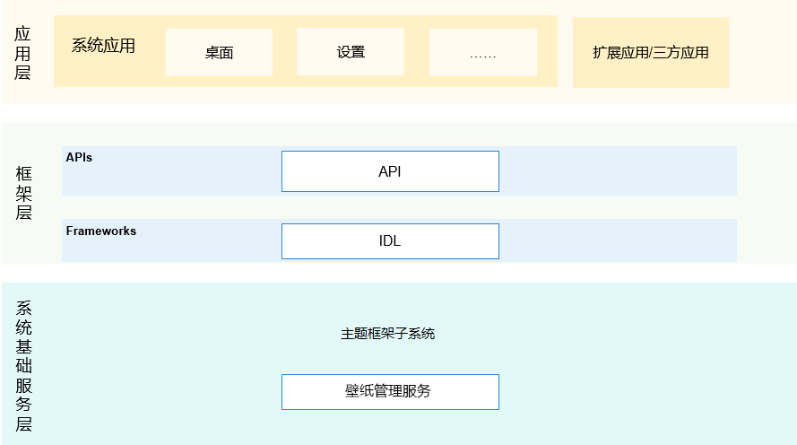

# 杂散子系统/壁纸管理服务

## 简介

### 内容介绍
该仓主要为系统提供壁纸管理服务能力，支持系统显示、设置、切换壁纸等功能。

### 架构图介绍
**图 1** 子系统架构图  


#### 仓路径

/base/theme/wallpaper_mgr

## 目录

```
/base/theme/wallpaper_mgr
├── figures                  # 构架图
├── frameworks/innerkitsimpl # 对应用提供的接口
├── interfaces/kits          # 组件对外提供的接口代码
│   ├── jskits               # 服务间接口
│   └── napi                 # js接口解析成napi接口
├── profile                  # 组件包含的系统服务的配置文件和进程的配置文件
├── services                 # 壁纸管理服务实现
├── test                     # 接口的单元测试
└── utils                    # 组件包含日志打印和有序公共事件定义的常量
```
## 说明

### 接口说明

**表 1**  壁纸管理服务开放的主要方法

<a name="table033515471012"></a>
<table><thead align="left"><tr id="row143351854201012"><th class="cellrowborder" valign="top" width="50%" id="mcps1.2.3.1.1"><p id="p103351154121010"><a name="p103351154121010"></a><a name="p103351154121010"></a>接口名</p>
</th>
<th class="cellrowborder" valign="top" width="50%" id="mcps1.2.3.1.2"><p id="p1033585416105"><a name="p1033585416105"></a><a name="p1033585416105"></a>描述</p>
</th>
</tr>
</thead>
<tbody><tr id="row204321219393"><td class="cellrowborder" valign="top" width="50%" headers="mcps1.2.3.1.1 "><p id="p1893413268144"><a name="p1893413268144"></a><a name="p1893413268144"></a>function getColors(wallpaperType: WallpaperType, callback: AsyncCallback&lt;Array&lt;RgbaColor&gt;&gt;): void</p>
</td>
<td class="cellrowborder" valign="top" width="50%" headers="mcps1.2.3.1.2 "><p id="p18761104812149"><a name="p18761104812149"></a><a name="p18761104812149"></a>获取壁纸图片主颜色（桌面或者锁屏壁纸），callback方式</p>
</td>
</tr>
<tr id="row13335054111018"><td class="cellrowborder" valign="top" width="50%" headers="mcps1.2.3.1.1 "><p id="p12832214151418"><a name="p12832214151418"></a><a name="p12832214151418"></a>function getColors(wallpaperType: WallpaperType): Promise&lt;Array&lt;RgbaColor&gt;&gt;</p>
</td>
<td class="cellrowborder" valign="top" width="50%" headers="mcps1.2.3.1.2 "><p id="p3335145451011"><a name="p3335145451011"></a><a name="p3335145451011"></a>获取壁纸图片主颜色（桌面或者锁屏壁纸），Promise方式</p>
</td>
</tr>
<tr id="row13335054111018"><td class="cellrowborder" valign="top" width="50%" headers="mcps1.2.3.1.1 "><p id="p12832214151418"><a name="p12832214151418"></a><a name="p12832214151418"></a>function getColorsSync(wallpaperType: WallpaperType): Array&lt;RgbaColor&gt;</p>
</td>
<td class="cellrowborder" valign="top" width="50%" headers="mcps1.2.3.1.2 "><p id="p3335145451011"><a name="p3335145451011"></a><a name="p3335145451011"></a>获取壁纸图片主颜色（桌面或者锁屏壁纸），同步方式</p>
</td>
</tr>
<tr id="row13335054111018"><td class="cellrowborder" valign="top" width="50%" headers="mcps1.2.3.1.1 "><p id="p12832214151418"><a name="p12832214151418"></a><a name="p12832214151418"></a>function getId(wallpaperType: WallpaperType, callback: AsyncCallback&lt;number&gt;): void</p>
</td>
<td class="cellrowborder" valign="top" width="50%" headers="mcps1.2.3.1.2 "><p id="p3335145451011"><a name="p3335145451011"></a><a name="p3335145451011"></a>获取壁纸id（桌面或者锁屏壁纸），callback方式</p>
</td>
</tr>
<tr id="row13335054111018"><td class="cellrowborder" valign="top" width="50%" headers="mcps1.2.3.1.1 "><p id="p12832214151418"><a name="p12832214151418"></a><a name="p12832214151418"></a>function getId(wallpaperType: WallpaperType): Promise&lt;number&gt;</p>
</td>
<td class="cellrowborder" valign="top" width="50%" headers="mcps1.2.3.1.2 "><p id="p3335145451011"><a name="p3335145451011"></a><a name="p3335145451011"></a>获取壁纸id（桌面或者锁屏壁纸），Promise方式</p>
</td>
</tr>
<tr id="row13335054111018"><td class="cellrowborder" valign="top" width="50%" headers="mcps1.2.3.1.1 "><p id="p12832214151418"><a name="p12832214151418"></a><a name="p12832214151418"></a>function getIdSync(wallpaperType: WallpaperType): number</p>
</td>
<td class="cellrowborder" valign="top" width="50%" headers="mcps1.2.3.1.2 "><p id="p3335145451011"><a name="p3335145451011"></a><a name="p3335145451011"></a>获取壁纸id（桌面或者锁屏壁纸），同步方式</p>
</td>
</tr>
<tr id="row13335054111018"><td class="cellrowborder" valign="top" width="50%" headers="mcps1.2.3.1.1 "><p id="p12832214151418"><a name="p12832214151418"></a><a name="p12832214151418"></a>function getFile(wallpaperType: WallpaperType, callback: AsyncCallback&lt;number&gt;): void</p>
</td>
<td class="cellrowborder" valign="top" width="50%" headers="mcps1.2.3.1.2 "><p id="p3335145451011"><a name="p3335145451011"></a><a name="p3335145451011"></a>获取指定类型的壁纸文件，callback方式</p>
</td>
</tr>
<tr id="row13335054111018"><td class="cellrowborder" valign="top" width="50%" headers="mcps1.2.3.1.1 "><p id="p12832214151418"><a name="p12832214151418"></a><a name="p12832214151418"></a>function getFile(wallpaperType: WallpaperType): Promise&lt;number&gt;</p>
</td>
<td class="cellrowborder" valign="top" width="50%" headers="mcps1.2.3.1.2 "><p id="p3335145451011"><a name="p3335145451011"></a><a name="p3335145451011"></a>获取指定类型的壁纸文件，Promise方式</p>
</td>
</tr>
<tr id="row13335054111018"><td class="cellrowborder" valign="top" width="50%" headers="mcps1.2.3.1.1 "><p id="p12832214151418"><a name="p12832214151418"></a><a name="p12832214151418"></a>function getFileSync(wallpaperType: WallpaperType): number</p>
</td>
<td class="cellrowborder" valign="top" width="50%" headers="mcps1.2.3.1.2 "><p id="p3335145451011"><a name="p3335145451011"></a><a name="p3335145451011"></a>获取指定类型的壁纸文件，同步方式</p>
</td>
</tr>
<tr id="row13335054111018"><td class="cellrowborder" valign="top" width="50%" headers="mcps1.2.3.1.1 "><p id="p12832214151418"><a name="p12832214151418"></a><a name="p12832214151418"></a>function getMinHeight(callback: AsyncCallback&lt;number&gt;): void</p>
</td>
<td class="cellrowborder" valign="top" width="50%" headers="mcps1.2.3.1.2 "><p id="p3335145451011"><a name="p3335145451011"></a><a name="p3335145451011"></a>获取壁纸的最小高度值，callback方式</p>
</td>
</tr>
<tr id="row13335054111018"><td class="cellrowborder" valign="top" width="50%" headers="mcps1.2.3.1.1 "><p id="p12832214151418"><a name="p12832214151418"></a><a name="p12832214151418"></a>function getMinHeight(): Promise&lt;number&gt;</p>
</td>
<td class="cellrowborder" valign="top" width="50%" headers="mcps1.2.3.1.2 "><p id="p3335145451011"><a name="p3335145451011"></a><a name="p3335145451011"></a>获取壁纸的最小高度值，Promise方式</p>
</td>
</tr>
<tr id="row13335054111018"><td class="cellrowborder" valign="top" width="50%" headers="mcps1.2.3.1.1 "><p id="p12832214151418"><a name="p12832214151418"></a><a name="p12832214151418"></a>function getMinHeightSync(): number</p>
</td>
<td class="cellrowborder" valign="top" width="50%" headers="mcps1.2.3.1.2 "><p id="p3335145451011"><a name="p3335145451011"></a><a name="p3335145451011"></a>获取壁纸的最小高度值，同步方式</p>
</td>
</tr>
<tr id="row13335054111018"><td class="cellrowborder" valign="top" width="50%" headers="mcps1.2.3.1.1 "><p id="p12832214151418"><a name="p12832214151418"></a><a name="p12832214151418"></a>function getMinWidth(callback: AsyncCallback&lt;number&gt;): void</p>
</td>
<td class="cellrowborder" valign="top" width="50%" headers="mcps1.2.3.1.2 "><p id="p3335145451011"><a name="p3335145451011"></a><a name="p3335145451011"></a>获取壁纸的最小宽度值，callback方式</p>
</td>
</tr>
<tr id="row13335054111018"><td class="cellrowborder" valign="top" width="50%" headers="mcps1.2.3.1.1 "><p id="p12832214151418"><a name="p12832214151418"></a><a name="p12832214151418"></a>function getMinWidth(): Promise&lt;number&gt;</p>
</td>
<td class="cellrowborder" valign="top" width="50%" headers="mcps1.2.3.1.2 "><p id="p3335145451011"><a name="p3335145451011"></a><a name="p3335145451011"></a>获取壁纸的最小宽度值，Promise方式</p>
</td>
</tr>
<tr id="row13335054111018"><td class="cellrowborder" valign="top" width="50%" headers="mcps1.2.3.1.1 "><p id="p12832214151418"><a name="p12832214151418"></a><a name="p12832214151418"></a>function getMinWidthSync(): number</p>
</td>
<td class="cellrowborder" valign="top" width="50%" headers="mcps1.2.3.1.2 "><p id="p3335145451011"><a name="p3335145451011"></a><a name="p3335145451011"></a>获取壁纸的最小宽度值，同步方式</p>
</td>
</tr>
<tr id="row13335054111018"><td class="cellrowborder" valign="top" width="50%" headers="mcps1.2.3.1.1 "><p id="p12832214151418"><a name="p12832214151418"></a><a name="p12832214151418"></a>function isChangePermitted(callback: AsyncCallback&lt;boolean&gt;): void</p>
</td>
<td class="cellrowborder" valign="top" width="50%" headers="mcps1.2.3.1.2 "><p id="p3335145451011"><a name="p3335145451011"></a><a name="p3335145451011"></a>是否允许应用改变当前用户的壁纸，callback方式</p>
</td>
</tr>
<tr id="row13335054111018"><td class="cellrowborder" valign="top" width="50%" headers="mcps1.2.3.1.1 "><p id="p12832214151418"><a name="p12832214151418"></a><a name="p12832214151418"></a>function isChangePermitted(): Promise&lt;boolean&gt;</p>
</td>
<td class="cellrowborder" valign="top" width="50%" headers="mcps1.2.3.1.2 "><p id="p3335145451011"><a name="p3335145451011"></a><a name="p3335145451011"></a>是否允许应用改变当前用户的壁纸，Promise方式</p>
</td>
</tr>
<tr id="row13335054111018"><td class="cellrowborder" valign="top" width="50%" headers="mcps1.2.3.1.1 "><p id="p12832214151418"><a name="p12832214151418"></a><a name="p12832214151418"></a>function isChangeAllowed(): boolean</p>
</td>
<td class="cellrowborder" valign="top" width="50%" headers="mcps1.2.3.1.2 "><p id="p3335145451011"><a name="p3335145451011"></a><a name="p3335145451011"></a>是否允许应用改变当前用户的壁纸，同步方式</p>
</td>
</tr>
<tr id="row13335054111018"><td class="cellrowborder" valign="top" width="50%" headers="mcps1.2.3.1.1 "><p id="p12832214151418"><a name="p12832214151418"></a><a name="p12832214151418"></a>function isOperationAllowed(callback: AsyncCallback&lt;boolean&gt;): void</p>
</td>
<td class="cellrowborder" valign="top" width="50%" headers="mcps1.2.3.1.2 "><p id="p3335145451011"><a name="p3335145451011"></a><a name="p3335145451011"></a>是否允许用户设置壁纸，callback方式</p>
</td>
</tr>
<tr id="row13335054111018"><td class="cellrowborder" valign="top" width="50%" headers="mcps1.2.3.1.1 "><p id="p12832214151418"><a name="p12832214151418"></a><a name="p12832214151418"></a>function isOperationAllowed(): Promise&lt;boolean&gt;</p>
</td>
<td class="cellrowborder" valign="top" width="50%" headers="mcps1.2.3.1.2 "><p id="p3335145451011"><a name="p3335145451011"></a><a name="p3335145451011"></a>是否允许用户设置壁纸，Promise方式</p>
</td>
</tr>
<tr id="row13335054111018"><td class="cellrowborder" valign="top" width="50%" headers="mcps1.2.3.1.1 "><p id="p12832214151418"><a name="p12832214151418"></a><a name="p12832214151418"></a>function isUserChangeAllowed(): boolean</p>
</td>
<td class="cellrowborder" valign="top" width="50%" headers="mcps1.2.3.1.2 "><p id="p3335145451011"><a name="p3335145451011"></a><a name="p3335145451011"></a>是否允许用户设置壁纸，同步方式</p>
</td>
</tr>
<tr id="row13335054111018"><td class="cellrowborder" valign="top" width="50%" headers="mcps1.2.3.1.1 "><p id="p12832214151418"><a name="p12832214151418"></a><a name="p12832214151418"></a>function reset(wallpaperType: WallpaperType, callback: AsyncCallback&lt;void&gt;): void</p>
</td>
<td class="cellrowborder" valign="top" width="50%" headers="mcps1.2.3.1.2 "><p id="p3335145451011"><a name="p3335145451011"></a><a name="p3335145451011"></a>移除指定类型的壁纸，恢复为默认显示的壁纸，callback方式</p>
</td>
</tr>
<tr id="row13335054111018"><td class="cellrowborder" valign="top" width="50%" headers="mcps1.2.3.1.1 "><p id="p12832214151418"><a name="p12832214151418"></a><a name="p12832214151418"></a>function reset(wallpaperType: WallpaperType): Promise&lt;void&gt;</p>
</td>
<td class="cellrowborder" valign="top" width="50%" headers="mcps1.2.3.1.2 "><p id="p3335145451011"><a name="p3335145451011"></a><a name="p3335145451011"></a>移除指定类型的壁纸，恢复为默认显示的壁纸，Promise方式</p>
</td>
</tr>
<tr id="row13335054111018"><td class="cellrowborder" valign="top" width="50%" headers="mcps1.2.3.1.1 "><p id="p12832214151418"><a name="p12832214151418"></a><a name="p12832214151418"></a>function restore(wallpaperType: WallpaperType, callback: AsyncCallback&lt;void&gt;): void</p>
</td>
<td class="cellrowborder" valign="top" width="50%" headers="mcps1.2.3.1.2 "><p id="p3335145451011"><a name="p3335145451011"></a><a name="p3335145451011"></a>移除指定类型的壁纸，恢复为默认显示的壁纸，callback方式</p>
</td>
</tr>
<tr id="row13335054111018"><td class="cellrowborder" valign="top" width="50%" headers="mcps1.2.3.1.1 "><p id="p12832214151418"><a name="p12832214151418"></a><a name="p12832214151418"></a>function restore(wallpaperType: WallpaperType): Promise&lt;void&gt;</p>
</td>
<td class="cellrowborder" valign="top" width="50%" headers="mcps1.2.3.1.2 "><p id="p3335145451011"><a name="p3335145451011"></a><a name="p3335145451011"></a>移除指定类型的壁纸，恢复为默认显示的壁纸，Promise方式</p>
</td>
</tr>
<tr id="row13335054111018"><td class="cellrowborder" valign="top" width="50%" headers="mcps1.2.3.1.1 "><p id="p12832214151418"><a name="p12832214151418"></a><a name="p12832214151418"></a>function setWallpaper(source: string | image.PixelMap, wallpaperType: WallpaperType, callback: AsyncCallback&lt;void&gt;): void</p>
</td>
<td class="cellrowborder" valign="top" width="50%" headers="mcps1.2.3.1.2 "><p id="p3335145451011"><a name="p3335145451011"></a><a name="p3335145451011"></a>将指定资源设置为指定类型的壁纸，callback方式</p>
</td>
</tr>
<tr id="row13335054111018"><td class="cellrowborder" valign="top" width="50%" headers="mcps1.2.3.1.1 "><p id="p12832214151418"><a name="p12832214151418"></a><a name="p12832214151418"></a>function setWallpaper(source: string | image.PixelMap, wallpaperType: WallpaperType): Promise&lt;void&gt;</p>
</td>
<td class="cellrowborder" valign="top" width="50%" headers="mcps1.2.3.1.2 "><p id="p3335145451011"><a name="p3335145451011"></a><a name="p3335145451011"></a>将指定资源设置为指定类型的壁纸，Promise方式</p>
</td>
</tr>
<tr id="row13335054111018"><td class="cellrowborder" valign="top" width="50%" headers="mcps1.2.3.1.1 "><p id="p12832214151418"><a name="p12832214151418"></a><a name="p12832214151418"></a>function setImage(source: string | image.PixelMap, wallpaperType: WallpaperType, callback: AsyncCallback&lt;void&gt;): void</p>
</td>
<td class="cellrowborder" valign="top" width="50%" headers="mcps1.2.3.1.2 "><p id="p3335145451011"><a name="p3335145451011"></a><a name="p3335145451011"></a>将指定资源设置为指定类型的壁纸，callback方式</p>
</td>
</tr>
<tr id="row13335054111018"><td class="cellrowborder" valign="top" width="50%" headers="mcps1.2.3.1.1 "><p id="p12832214151418"><a name="p12832214151418"></a><a name="p12832214151418"></a>function setImage(source: string | image.PixelMap, wallpaperType: WallpaperType): Promise&lt;void&gt;</p>
</td>
<td class="cellrowborder" valign="top" width="50%" headers="mcps1.2.3.1.2 "><p id="p3335145451011"><a name="p3335145451011"></a><a name="p3335145451011"></a>将指定资源设置为指定类型的壁纸，Promise方式</p>
</td>
</tr>
<tr id="row13335054111018"><td class="cellrowborder" valign="top" width="50%" headers="mcps1.2.3.1.1 "><p id="p12832214151418"><a name="p12832214151418"></a><a name="p12832214151418"></a>function getPixelMap(wallpaperType: WallpaperType, callback: AsyncCallback&lt;image.PixelMap&gt;): void</p>
</td>
<td class="cellrowborder" valign="top" width="50%" headers="mcps1.2.3.1.2 "><p id="p3335145451011"><a name="p3335145451011"></a><a name="p3335145451011"></a>获取指定类型的壁纸文件，callback方式</p>
</td>
</tr>
<tr id="row13335054111018"><td class="cellrowborder" valign="top" width="50%" headers="mcps1.2.3.1.1 "><p id="p12832214151418"><a name="p12832214151418"></a><a name="p12832214151418"></a>function getPixelMap(wallpaperType: WallpaperType): Promise&lt;image.PixelMap&gt;</p>
</td>
<td class="cellrowborder" valign="top" width="50%" headers="mcps1.2.3.1.2 "><p id="p3335145451011"><a name="p3335145451011"></a><a name="p3335145451011"></a>获取指定类型的壁纸文件，Promise方式</p>
</td>
</tr>
<tr id="row13335054111018"><td class="cellrowborder" valign="top" width="50%" headers="mcps1.2.3.1.1 "><p id="p12832214151418"><a name="p12832214151418"></a><a name="p12832214151418"></a>function getImage(wallpaperType: WallpaperType, callback: AsyncCallback&lt;image.PixelMap&gt;): void</p>
</td>
<td class="cellrowborder" valign="top" width="50%" headers="mcps1.2.3.1.2 "><p id="p3335145451011"><a name="p3335145451011"></a><a name="p3335145451011"></a>获取指定类型的壁纸文件，callback方式</p>
</td>
</tr>
<tr id="row13335054111018"><td class="cellrowborder" valign="top" width="50%" headers="mcps1.2.3.1.1 "><p id="p12832214151418"><a name="p12832214151418"></a><a name="p12832214151418"></a>function getImage(wallpaperType: WallpaperType): Promise&lt;image.PixelMap&gt;</p>
</td>
<td class="cellrowborder" valign="top" width="50%" headers="mcps1.2.3.1.2 "><p id="p3335145451011"><a name="p3335145451011"></a><a name="p3335145451011"></a>获取指定类型的壁纸文件，Promise方式</p>
</td>
</tr>
<tr id="row204321219393"><td class="cellrowborder" valign="top" width="50%" headers="mcps1.2.3.1.1 "><p id="p1893413268144"><a name="p1893413268144"></a><a name="p1893413268144"></a>function on(type: 'colorChange', callback: (colors: Array&lt;RgbaColor&gt;, wallpaperType: WallpaperType) => void): void;
</p>
</td>
<td class="cellrowborder" valign="top" width="50%" headers="mcps1.2.3.1.2 "><p id="p18761104812149"><a name="p18761104812149"></a><a name="p18761104812149"></a>监听壁纸图片主颜色变化，callback方式</p>
</td>
</tr>
<tr id="row204321219393"><td class="cellrowborder" valign="top" width="50%" headers="mcps1.2.3.1.1 "><p id="p1893413268144"><a name="p1893413268144"></a><a name="p1893413268144"></a>function off(type: 'colorChange', callback?: (colors: Array&lt;RgbaColor&gt;, wallpaperType: WallpaperType) => void): void;
</p>
</td>
<td class="cellrowborder" valign="top" width="50%" headers="mcps1.2.3.1.2 "><p id="p18761104812149"><a name="p18761104812149"></a><a name="p18761104812149"></a>取消监听壁纸图片主颜色变化，callback方式</p>
</td>
</tr>
</tbody>
</table>

**表 2**  应用extension的主要接口

<a name="table033515471012"></a>
<table><thead align="left"><tr id="row143351854201012"><th class="cellrowborder" valign="top" width="50%" id="mcps1.2.3.1.1"><p id="p103351154121010"><a name="p103351154121010"></a><a name="p103351154121010"></a>接口名</p>
</th>
<th class="cellrowborder" valign="top" width="50%" id="mcps1.2.3.1.2"><p id="p1033585416105"><a name="p1033585416105"></a><a name="p1033585416105"></a>描述</p>
</th>
</tr>
</thead>
<tbody><tr id="row204321219393"><td class="cellrowborder" valign="top" width="50%" headers="mcps1.2.3.1.1 "><p id="p1893413268144"><a name="p1893413268144"></a><a name="p1893413268144"></a>onCreated(want: object): void</p>
</td>
<td class="cellrowborder" valign="top" width="50%" headers="mcps1.2.3.1.2 "><p id="p18761104812149"><a name="p18761104812149"></a><a name="p18761104812149"></a>wallpaper extension 初始化的回调</p>
</td>
</tr>
<tr id="row13335054111018"><td class="cellrowborder" valign="top" width="50%" headers="mcps1.2.3.1.1 "><p id="p12832214151418"><a name="p12832214151418"></a><a name="p12832214151418"></a>onWallpaperChanged(wallpaperType: number): void</p>
</td>
<td class="cellrowborder" valign="top" width="50%" headers="mcps1.2.3.1.2 "><p id="p3335145451011"><a name="p3335145451011"></a><a name="p3335145451011"></a>壁纸发生了变化的回调</p>
</td>
</tr>
<tr id="row204321219393"><td class="cellrowborder" valign="top" width="50%" headers="mcps1.2.3.1.1 "><p id="p1893413268144"><a name="p1893413268144"></a><a name="p1893413268144"></a>setUiContent(url:string): void</p>
</td>
<td class="cellrowborder" valign="top" width="50%" headers="mcps1.2.3.1.2 "><p id="p18761104812149"><a name="p18761104812149"></a><a name="p18761104812149"></a>应用设置壁纸的布局文件路径</p>
</td>
</tr>
<tr id="row204321219393"><td class="cellrowborder" valign="top" width="50%" headers="mcps1.2.3.1.1 "><p id="p1893413268144"><a name="p1893413268144"></a><a name="p1893413268144"></a>onDestroy(): void
</p>
</td>
<td class="cellrowborder" valign="top" width="50%" headers="mcps1.2.3.1.2 "><p id="p18761104812149"><a name="p18761104812149"></a><a name="p18761104812149"></a>wallpaper extension 销毁回调</p>
</td>
</tr>
</tbody>
</table>

**表 3**  RgbaColor说明

<a name="table033515471012"></a>
<table><thead align="left"><tr id="row143351854201012"><th class="cellrowborder" valign="top" width="50%" id="mcps1.2.3.1.1"><p id="p103351154121010"><a name="p103351154121010"></a><a name="p103351154121010"></a>名称</p>
</th>
<th class="cellrowborder" valign="top" width="50%" id="mcps1.2.3.1.2"><p id="p1033585416105"><a name="p1033585416105"></a><a name="p1033585416105"></a>说明</p>
</th>
</tr>
</thead>
<tbody><tr id="row204321219393"><td class="cellrowborder" valign="top" width="50%" headers="mcps1.2.3.1.1 "><p id="p1893413268144"><a name="p1893413268144"></a><a name="p1893413268144"></a>red</p>
</td>
<td class="cellrowborder" valign="top" width="50%" headers="mcps1.2.3.1.2 "><p id="p18761104812149"><a name="p18761104812149"></a><a name="p18761104812149"></a>表示红色值，范围为&nbsp;0&nbsp;到&nbsp;255</p>
</td>
</tr>
<tr id="row13335054111018"><td class="cellrowborder" valign="top" width="50%" headers="mcps1.2.3.1.1 "><p id="p12832214151418"><a name="p12832214151418"></a><a name="p12832214151418"></a>green</p>
</td>
<td class="cellrowborder" valign="top" width="50%" headers="mcps1.2.3.1.2 "><p id="p3335145451011"><a name="p3335145451011"></a><a name="p3335145451011"></a>表示绿色值，范围为&nbsp;0&nbsp;到&nbsp;255</p>
</td>
</tr>
<tr id="row204321219393"><td class="cellrowborder" valign="top" width="50%" headers="mcps1.2.3.1.1 "><p id="p1893413268144"><a name="p1893413268144"></a><a name="p1893413268144"></a>blue</p>
</td>
<td class="cellrowborder" valign="top" width="50%" headers="mcps1.2.3.1.2 "><p id="p18761104812149"><a name="p18761104812149"></a><a name="p18761104812149"></a>表示蓝色值，范围为&nbsp;0&nbsp;到&nbsp;255</p>
</td>
</tr>
<tr id="row204321219393"><td class="cellrowborder" valign="top" width="50%" headers="mcps1.2.3.1.1 "><p id="p1893413268144"><a name="p1893413268144"></a><a name="p1893413268144"></a>alpha
</p>
</td>
<td class="cellrowborder" valign="top" width="50%" headers="mcps1.2.3.1.2 "><p id="p18761104812149"><a name="p18761104812149"></a><a name="p18761104812149"></a>表示&nbsp;alpha&nbsp;值，范围为&nbsp;0&nbsp;到&nbsp;255</p>
</td>
</tr>
</tbody>
</table>

### 使用说明

```js
导入模块
import screenLock from '@ohos.screenlock';

//获取指定类型壁纸的主要颜色信息callback方式
wallpaper.getColors(wallpaper.WallpaperType.WALLPAPER_SYSTEM, (error, data) => {
    if (error) {
        console.error(`failed to getColors because: ` + JSON.stringify(error));
        return;
    }
    console.log(`success to getColors.`);
});
//获取指定类型壁纸的主要颜色信息Promise方式
wallpaper.getColors(wallpaper.WallpaperType.WALLPAPER_SYSTEM).then((data) => {
    console.log(`success to getColors.`);
}).catch((error) => {
    console.error(`failed to getColors because: ` + JSON.stringify(error));
});
//获取指定类型壁纸的主要颜色信息同步方式
wallpaper.getColorsSync(wallpaper.WallpaperType.WALLPAPER_SYSTEM);

//获取指定类型壁纸的IDcallback方式
wallpaper.getId(wallpaper.WallpaperType.WALLPAPER_SYSTEM, (error, data) => {
    if (error) {
        console.error(`failed to getId because: ` + JSON.stringify(error));
        return;
    }
    console.log(`success to getId: ` + JSON.stringify(data));
});
//获取指定类型壁纸的IDPromise方式
wallpaper.getId(wallpaper.WallpaperType.WALLPAPER_SYSTEM).then((data) => {
    console.log(`success to getId: ` + JSON.stringify(data));
}).catch((error) => {
    console.error(`failed to getId because: ` + JSON.stringify(error));
});
//获取指定类型壁纸的ID同步方式
wallpaper.getIdSync(wallpaper.WallpaperType.WALLPAPER_SYSTEM);

//获取壁纸的最小高度值callback方式
wallpaper.getMinHeight((error, data) => {
    if (error) {
        console.error(`failed to getMinHeight because: ` + JSON.stringify(error));
        return;
    }
    console.log(`success to getMinHeight: ` + JSON.stringify(data));
});
//获取壁纸的最小高度值Promise方式
wallpaper.getMinHeight().then((data) => {
    console.log(`success to getMinHeight: ` + JSON.stringify(data));
}).catch((error) => {
    console.error(`failed to getMinHeight because: ` + JSON.stringify(error));
});
//获取壁纸的最小高度值同步方式
wallpaper.getMinHeightSync();

//获取壁纸的最小宽度值callback方式
wallpaper.getMinWidth((error, data) => {
    if (error) {
        console.error(`failed to getMinWidth because: ` + JSON.stringify(error));
        return;
    }
    console.log(`success to getMinWidth: ` + JSON.stringify(data));
});
//获取壁纸的最小宽度值Promise方式
wallpaper.getMinWidth().then((data) => {
    console.log(`success to getMinWidth: ` + JSON.stringify(data));
}).catch((error) => {
    console.error(`failed to getMinWidth because: ` + JSON.stringify(error));
});
//获取壁纸的最小宽度值同步方式
wallpaper.getMinWidthSync();

//是否允许应用改变当前用户的壁纸callback方式
wallpaper.isChangePermitted((error, data) => {
    if (error) {
        console.error(`failed to isChangePermitted because: ` + JSON.stringify(error));
        return;
    }
    console.log(`success to isChangePermitted: ` + JSON.stringify(data));
});
//是否允许应用改变当前用户的壁纸Promise方式
wallpaper.isChangePermitted().then((data) => {
    console.log(`success to isChangePermitted: ` + JSON.stringify(data));
}).catch((error) => {
    console.error(`failed to isChangePermitted because: ` + JSON.stringify(error));
});
//是否允许应用改变当前用户的壁纸同步方式
wallpaper.isChangeAllowed();

//是否允许用户设置壁纸callback方式
wallpaper.isOperationAllowed((error, data) => {
    if (error) {
        console.error(`failed to isOperationAllowed because: ` + JSON.stringify(error));
        return;
    }
    console.log(`success to isOperationAllowed: ` + JSON.stringify(data));
});
//是否允许用户设置壁纸Promise方式
wallpaper.isOperationAllowed().then((data) => {
    console.log(`success to isOperationAllowed: ` + JSON.stringify(data));
}).catch((error) => {
    console.error(`failed to isOperationAllowed because: ` + JSON.stringify(error));
});
//是否允许用户设置壁纸同步方式
wallpaper.isUserChangeAllowed();

//获取指定类型的壁纸文件callback方式
wallpaper.getFile(wallpaper.WallpaperType.WALLPAPER_SYSTEM, (error, data) => {
    if (error) {
        console.error(`failed to getFile because: ` + JSON.stringify(error));
        return;
    }
    console.log(`success to getFile: ` + JSON.stringify(data));
});
//获取指定类型的壁纸文件Promise方式
wallpaper.getFile(wallpaper.WallpaperType.WALLPAPER_SYSTEM).then((data) => {
    console.log(`success to getFile: ` + JSON.stringify(data));
}).catch((error) => {
    console.error(`failed to getFile because: ` + JSON.stringify(error));
});
//获取指定类型的壁纸文件同步方式
wallpaper.getFileSync(wallpaper.WallpaperType.WALLPAPER_SYSTEM);

//移除指定类型的壁纸，恢复为默认显示的壁纸callback方式
wallpaper.reset(wallpaper.WallpaperType.WALLPAPER_SYSTEM, (error, data) => {
    if (error) {
        console.error(`failed to reset because: ` + JSON.stringify(error));
        return;
    }
    console.log(`success to reset.`);
});
//移除指定类型的壁纸，恢复为默认显示的壁纸Promise方式
wallpaper.reset(wallpaper.WallpaperType.WALLPAPER_SYSTEM).then((data) => {
    console.log(`success to reset.`);
}).catch((error) => {
    console.error(`failed to reset because: ` + JSON.stringify(error));
});
//移除指定类型的壁纸，恢复为默认显示的壁纸callback方式
wallpaper.restore(wallpaper.WallpaperType.WALLPAPER_SYSTEM, (error, data) => {
    if (error) {
        console.error(`failed to restore because: ` + JSON.stringify(error));
        return;
    }
    console.log(`success to restore.`);
});
//移除指定类型的壁纸，恢复为默认显示的壁纸Promise方式
wallpaper.restore(wallpaper.WallpaperType.WALLPAPER_SYSTEM).then((data) => {
    console.log(`success to restore.`);
}).catch((error) => {
    console.error(`failed to restore because: ` + JSON.stringify(error));
});

//将指定资源设置为指定类型的壁纸callback方式
// source类型为string
let wallpaperPath = "/data/data/ohos.acts.aafwk.plrdtest.form/files/Cup_ic.jpg";
wallpaper.setWallpaper(wallpaperPath, wallpaper.WallpaperType.WALLPAPER_SYSTEM, (error, data) => {    
    if (error) {        
        console.error(`failed to setWallpaper because: ` + JSON.stringify(error));       
        return;   
    }    
    console.log(`success to setWallpaper.`);
});

// source类型为image.PixelMap
import image from '@ohos.multimedia.image';
let imageSource = image.createImageSource("file://" + wallpaperPath);
let opts = {
    "desiredSize": {
        "height": 3648,
        "width": 2736
    }
};
imageSource.createPixelMap(opts).then((pixelMap) => {      
    wallpaper.setWallpaper(pixelMap, wallpaper.WallpaperType.WALLPAPER_SYSTEM, (error, data) => {    
        if (error) {       
            console.error(`failed to setWallpaper because: ` + JSON.stringify(error));
            return;
        }    
        console.log(`success to setWallpaper.`);
    });
}).catch((error) => {       
    console.error(`failed to createPixelMap because: ` + JSON.stringify(error));
});
//将指定资源设置为指定类型的壁纸romise方式
// source类型为string
let wallpaperPath = "/data/data/ohos.acts.aafwk.plrdtest.form/files/Cup_ic.jpg";
wallpaper.setWallpaper(wallpaperPath, wallpaper.WallpaperType.WALLPAPER_SYSTEM).then((data) => {
    console.log(`success to setWallpaper.`);
}).catch((error) => {
    console.error(`failed to setWallpaper because: ` + JSON.stringify(error));
});

// source类型为image.PixelMap
import image from '@ohos.multimedia.image';
let imageSource = image.createImageSource("file://" + wallpaperPath);
let opts = {
    "desiredSize": {
        "height": 3648,
        "width": 2736
    }
};
imageSource.createPixelMap(opts).then((pixelMap) => {      
    wallpaper.setWallpaper(pixelMap, wallpaper.WallpaperType.WALLPAPER_SYSTEM).then((data) => {
        console.log(`success to setWallpaper.`);
    }).catch((error) => {
        console.error(`failed to setWallpaper because: ` + JSON.stringify(error));
    });
}).catch((error) => {       
    console.error(`failed to createPixelMap because: ` + JSON.stringify(error));
});
//将指定资源设置为指定类型的壁纸callback方式
// source类型为string
let wallpaperPath = "/data/data/ohos.acts.aafwk.plrdtest.form/files/Cup_ic.jpg";
wallpaper.setImage(wallpaperPath, wallpaper.WallpaperType.WALLPAPER_SYSTEM, (error, data) => {    
    if (error) {        
        console.error(`failed to setImage because: ` + JSON.stringify(error));       
        return;   
    }    
    console.log(`success to setImage.`);
});

// source类型为image.PixelMap
import image from '@ohos.multimedia.image';
let imageSource = image.createImageSource("file://" + wallpaperPath);
let opts = {
    "desiredSize": {
        "height": 3648,
        "width": 2736
    }
};
imageSource.createPixelMap(opts).then((pixelMap) => {      
    wallpaper.setImage(pixelMap, wallpaper.WallpaperType.WALLPAPER_SYSTEM, (error, data) => {    
        if (error) {       
            console.error(`failed to setImage because: ` + JSON.stringify(error));
            return;
        }    
        console.log(`success to setImage.`);
    });
}).catch((error) => {       
    console.error(`failed to createPixelMap because: ` + JSON.stringify(error));
});
//将指定资源设置为指定类型的壁纸Promise方式
// source类型为string
let wallpaperPath = "/data/data/ohos.acts.aafwk.plrdtest.form/files/Cup_ic.jpg";
wallpaper.setImage(wallpaperPath, wallpaper.WallpaperType.WALLPAPER_SYSTEM).then((data) => {
    console.log(`success to setImage.`);
}).catch((error) => {
    console.error(`failed to setImage because: ` + JSON.stringify(error));
});

// source类型为image.PixelMap
import image from '@ohos.multimedia.image';
let imageSource = image.createImageSource("file://" + wallpaperPath);
let opts = {
    "desiredSize": {
        "height": 3648,
        "width": 2736
    }
};
imageSource.createPixelMap(opts).then((pixelMap) => {      
    wallpaper.setImage(pixelMap, wallpaper.WallpaperType.WALLPAPER_SYSTEM).then((data) => {
        console.log(`success to setImage.`);
    }).catch((error) => {
        console.error(`failed to setImage because: ` + JSON.stringify(error));
    });
}).catch((error) => {       
    console.error(`failed to createPixelMap because: ` + JSON.stringify(error));
});

//获取壁纸图片的像素图callback方式
wallpaper.getPixelMap(wallpaper.WallpaperType.WALLPAPER_SYSTEM, function (err, data) {
    console.info('wallpaperXTS ===> testGetPixelMapCallbackSystem err : ' + JSON.stringify(err));
    console.info('wallpaperXTS ===> testGetPixelMapCallbackSystem data : ' + JSON.stringify(data));
});
//获取壁纸图片的像素图Promise方式
wallpaper.getPixelMap(wallpaper.WallpaperType.WALLPAPER_SYSTEM).then((data) => {
    console.info('wallpaperXTS ===> testGetPixelMapPromiseSystem data : ' + data);
    console.info('wallpaperXTS ===> testGetPixelMapPromiseSystem data : ' + JSON.stringify(data));
}).catch((err) => {
    console.info('wallpaperXTS ===> testGetPixelMapPromiseSystem err : ' + err);
    console.info('wallpaperXTS ===> testGetPixelMapPromiseSystem err : ' + JSON.stringify(err));
});
//获取壁纸图片的像素图callback方式
wallpaper.getImage(wallpaper.WallpaperType.WALLPAPER_SYSTEM, function (err, data) {
    console.info('wallpaperXTS ===> testgetImageCallbackSystem err : ' + JSON.stringify(err));
    console.info('wallpaperXTS ===> testgetImageCallbackSystem data : ' + JSON.stringify(data));
});
//获取壁纸图片的像素图Promise方式
wallpaper.getImage(wallpaper.WallpaperType.WALLPAPER_SYSTEM).then((data) => {
    console.info('wallpaperXTS ===> testgetImagePromiseSystem data : ' + data);
    console.info('wallpaperXTS ===> testgetImagePromiseSystem data : ' + JSON.stringify(data));
}).catch((err) => {
    console.info('wallpaperXTS ===> testgetImagePromiseSystem err : ' + err);
    console.info('wallpaperXTS ===> testgetImagePromiseSystem err : ' + JSON.stringify(err));
});

//订阅壁纸颜色变化结果上报事件callback方式
let listener = (colors, wallpaperType) => {
    console.log(`wallpaper color changed.`);
};
wallpaper.on('colorChange', listener);
// 取消订阅listener
wallpaper.off('colorChange', listener);
// 取消所有'colorChange'类型的订阅
wallpaper.off('colorChange');

```

js 应用接口使用说明

```js
import Extension from '@ohos.wallpaperextension'
import wallPaper from '@ohos.wallpaper'

export default class WallpaperExtAbility extends Extension {
    onCreated(want) {
        console.info(MODULE_TAG + 'ability on created start');
        super.setUiContent("pages/index");
        console.info(MODULE_TAG + 'ability on created end');
    }

    onWallpaperChanged(wallpaperType) {
        console.info(MODULE_TAG + "ability on wallpaper changed start, type is : " + wallpaperType);
        if (wallPaper) {
            this.sendPixelMapData();
        }
       console.info(MODULE_TAG + "ability on wallpaper changed end");
    }

    onDestroy() {
        console.info(MODULE_TAG + 'ability on destroy');
    }

    initWallpaperImage() {
        console.info(MODULE_TAG + 'ability init wallpaper image start');
        if (!wallPaper) {
            console.info(MODULE_TAG + "ability init wallpaper image failed as wallpaper is null");
            return;
        }
        this.sendPixelMapData()
        console.info(MODULE_TAG + 'ability init wallpaper image end');
    }

    sendPixelMapData() {
        // 0 is WallpaperType:WALLPAPER_SYSTEM, 1 isWallpaperType:WALLPAPER_LOCKSCREEN
        wallPaper.getPixelMap(0, (err, data) => {
            console.info(MODULE_TAG + "ability get pixel map data start");
            if (err) {
                console.info(MODULE_TAG + "ability get pixel map failed, error : " + JSON.stringify(err));
            } else {
                console.info(MODULE_TAG + "ability get pixel map, data : " + JSON.stringify(data));
                AppStorage.SetOrCreate('slPixelData', data);
            }
            console.info(MODULE_TAG + "ability get pixel map data end");
        });
    }
};

```

## 相关仓

**主题框架子系统**

[theme_wallpaper_mgr](https://gitee.com/openharmony/theme_wallpaper_mgr)

