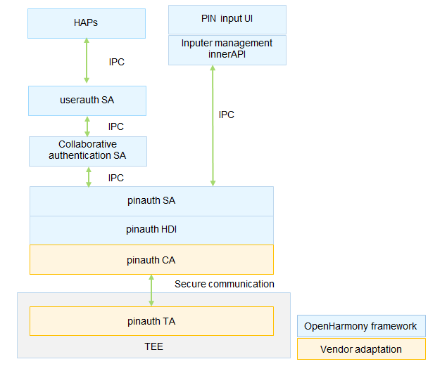

# PIN Authentication (pinauth)


## Introduction

The PIN authentication (pinauth) module allows users to set and delete their Personal Information Numbers (PINs) and supports authentication of these PINs. Working with the basic framework of the User IAM subsystem, the pinauth module supports PIN change.

pinauth is one of the basic user identity authentication executors of OpenHarmony. It registers resource information related to PIN authentication to the collaborative authentication framework based on the resource registration interface defined by collaborative authentication, and implements PIN setting, deletion, and authentication based on the scheduling of the collaborative authentication framework.

**Figure 1** pinauth architecture




PINs are core assets in the system. The following security measures are taken in PIN authentication for security purposes:

- The PIN input user interface (currently including the PIN setting and PIN authentication dialog boxes) is provided by the system-level application (<sup>Note 1</sup>). The dialog boxes involved in user settings are provided by the **Settings** application, and the PIN input dialog boxes involved in the screen unlock authentication are provided by the **Lock screen** application.
- Password data transmission: The raw PIN data is not transmitted across devices. After a user PIN is entered in the PIN input dialog box, the raw PIN data entered is transmitted to the pinauth Service ability only after unidirectional processing in the input model management innerAPI.
- Secure storage and comparison of PIN data: The pinauth HDI defines the adaptation interfaces for device vendors. Device vendors can implement secure PIN comparison and storage in a TEE. <sup>Note 2</sup>

Note 1: To implement the PIN input dialog box, the application needs to register the PIN input dialog box with the pinauth Service ability through the input dialog box management API. The input box management API requires a high-level access permission and can be invoked only by system users.

Note 2: The OpenHarmony framework provides pure software implementation of PIN authentication for developers to demonstrate the PIN authentication function. The pure software implementation does not include the secure storage capability.

## Directory Structure

```undefined
//base/useriam/pin_auth
├── frameworks			# Framework code
├── hdi					# APIs defined by device vendors for adaptation
├── interfaces			# Directory for storing external interfaces
│   └── inner_api		# Header files exposed to the internal subsystems
├── sa_profile			# Profile of the Service ability
├── services			# Implementation of the Service ability
├── unittest			# Directory for storing test code
├── bundle.json			# Component description file
└── pinauth.gni			# Build configuration
```


## Usage

### Available APIs

**Table 1** APIs for managing input dialog boxes

| API | Description                            |
| ------ | -------------------------------- |
| function registerInputer(inputer:IInputer) : boolean; | Registers the **inputer** callback with the pinauth Service ability.  |
| function unregisterInputer():void;                    | Unregisters the **inputer** callback from the pinauth Service ability.|

**Table 2** APIs for transferring data

| API| Description                      |
| ------ | -------------------------------- |
| onGetData : (callback:IInputData)=>void | Obtains the PIN data.|
| onSetData:(pinSubType:AuthSubType, data:Uint8Array)=>void | Transfers the PIN data from the PIN input dialog box to the pinauth Service ability.|

### Usage Guidelines

- The APIs defined in the header file ```driver\interface\pin_auth\IExecutor.idl``` must be implemented in a secure environment. The PIN related information must be protected with the highest security level (TEE or security chip).

## Repositories Involved

[useriam_user_auth_framework](https://gitee.com/openharmony/useriam_user_auth_framework)

[useriam_face_auth](https://gitee.com/openharmony/useriam_face_auth)

**[useriam_pin_auth](https://gitee.com/openharmony/useriam_pin_auth)**

[drivers_peripheral](https://gitee.com/openharmony/drivers_peripheral)

[drivers_interface](https://gitee.com/openharmony/drivers_interface)
