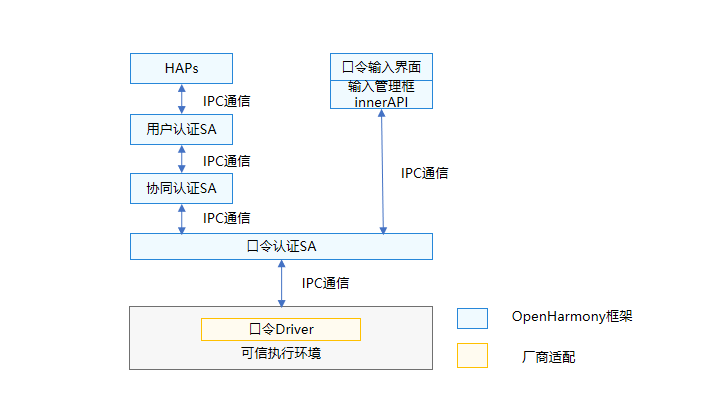

# 口令认证

- [简介](#简介)
- [目录](#目录)
- [说明](#说明)
  - [接口说明](#接口说明)
  - [使用说明](#使用说明)
- [相关仓](#相关仓)


## 简介

**口令认证**（pinauth）模块支持用户口令的设置，删除和认证功能。与用户IAM子系统基础框架配合，也可以支持用户口令修改的功能。

口令认证作为OpenHarmony最基础的用户身份认证执行器，按照协同认证定义的资源注册接口，将口令认证相关资源信息注册到协同认证框架，并根据协同认证框架的调度，完成口令的设置，删除和认证功能。

**图1** 口令认证架构图




用户口令是系统内的核心资产，在口令认证的处理过程中，我们对用户输入的口令信息实施了如下安全保护措施：

1. 口令输入界面（当前分为口令设置界面和口令认证界面）由系统级应用提供<sup>注1</sup>，在用户设置过程中涉及的界面均由设置应用提供，在用户锁屏认证过程中的口令输入界面由锁屏应用提供。
2. 口令数据传输：口令数据原文不跨设备传输，口令输入界面获取用户输入的口令数据原文后，在输入模型管理innerAPI内经过单向处理后才传入口令认证SA。
3. 口令数据安全存储和比对：口令认证HDI中定义了南向厂商适配的接口，南向厂商可以自行在可信执行环境内完成口令数据的安全存储的比对。<sup>注2</sup>

*注1：应用实现口令输入界面，需要通过输入框管理接口，将口令输入界面注册到口令认证SA，输入框管理接口定义较高的访问权限，只允许系统用户调用。*

*注2：OpenHarmony开源框架内提供了口令认证的纯软件实现，供开发者demo口令认证功能，纯软件实现部分未包含安全存储能力。*

## 目录

```undefined
//base/useriam/pin_auth
├── frameworks			# 框架代码
├── interfaces			# 对外接口存放目录
│   └── inner_api		# 对内部子系统暴露的头文件，供系统服务使用
├── sa_profile			# Service Ability 配置文件
├── services			# Service Ability 服务实现
├── unittest			# 测试代码存入目录
├── bundle.json			# 组件描述文件
└── pinauth.gni			# 构建配置
```


## 说明

### 接口说明

**表1** 输入框管理接口

| 接口名  | 描述                             |
| ------ | -------------------------------- |
| function registerInputer(inputer:IInputer) : boolean; | 口令输入框注册接口，通过此接口注册inputer回调到口令认证SA   |
| function unregisterInputer():void;                    | 口令输入框反注册接口，通过此接口从口令认证SA删除inputer回调 |

**表2** 数据获取和传输接口

| 接口名 | 描述                       |
| ------ | -------------------------------- |
| onGetData: (callback:IInputData)=>void | inputer回调函数，口令认证SA调用此接口获取口令数据 |
| onSetData: (pinSubType:AuthSubType, data:Uint8Array)=>void | inputerDate回调函数，口令输入界面通过此接口传输口令数据到口令认证SA |

### 使用说明

- 需在尽可能安全的环境中实现头文件```driver\interface\pin_auth\IExecutor.idl``` 中定义的接口，保证用户口令相关信息的安全保护达到系统内可以提供的最高安全级别（可信执行环境/安全芯片）的保护。

## 相关仓

[useriam_user_auth_framework](https://gitee.com/openharmony/useriam_user_auth_framework)

[useriam_face_auth](https://gitee.com/openharmony/useriam_face_auth)

**[useriam_pin_auth](https://gitee.com/openharmony/useriam_pin_auth)**

[drivers_peripheral](https://gitee.com/openharmony/drivers_peripheral)

[drivers_interface](https://gitee.com/openharmony/drivers_interface)