# NiobeU4开发板


## 简介
NiobeU4是基于ESP32U4WDH推出的物联网设备开发套件，集成2.4GHz Wifi和蓝牙双模，具有超高的射频性能、稳定性、通用性和可靠性，以及超低的功耗，适用于各种应用场景；NiobeU4开发套件还支持NFC非接触式通讯功能，工作频率13.56MHz，适用于低功耗、低电压和低成本要求的非接触读写器应用；NiobeU4开发套件还支持锂电池供电和充放电管理；开发套件提供一个开箱即用的智能硬件解决方案，方便开发者验证和开发自己的软件和功能，缩短产品研发周期并快速推向市场。

**图1** 开发板整体外观视图

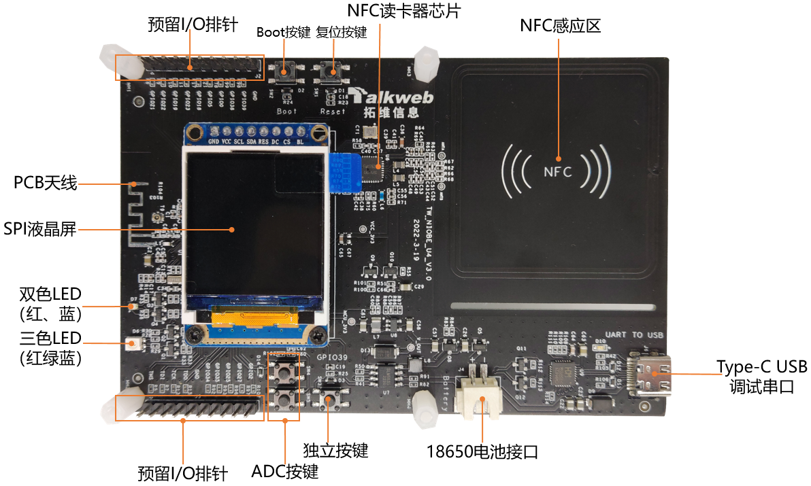


**图2** NiobeU4开发板底板图

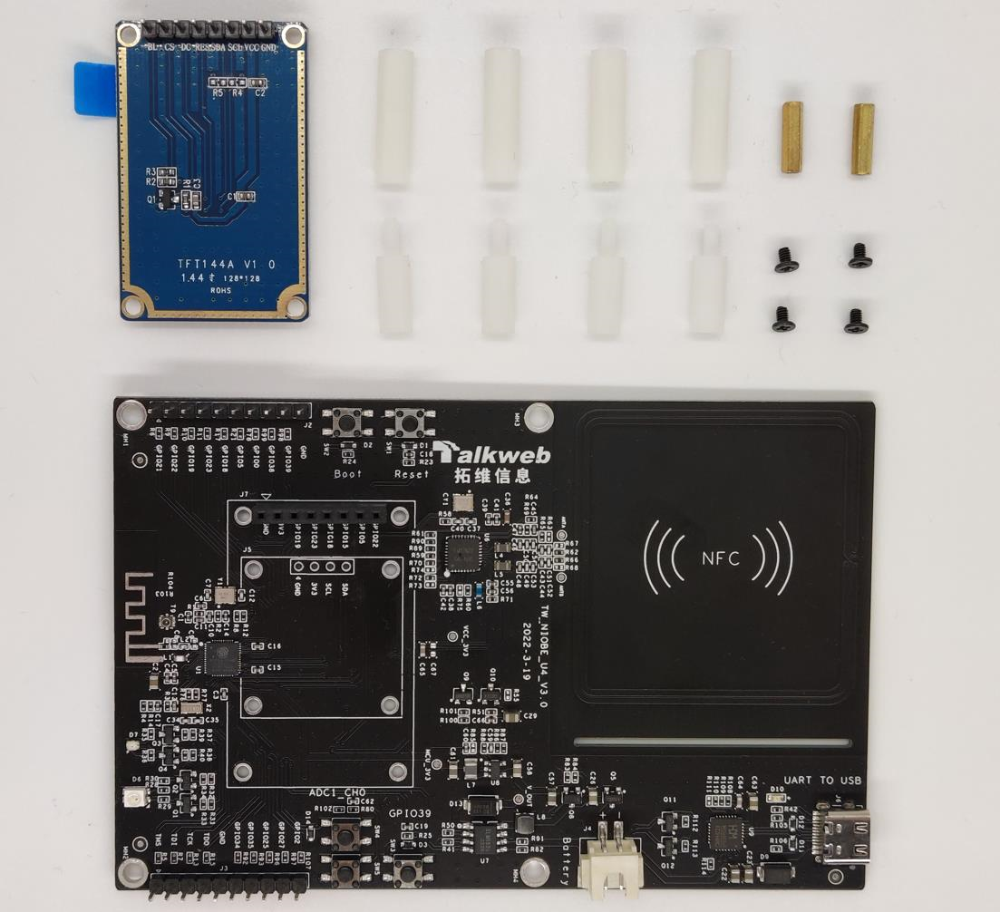

### 硬件结构与功能框图

NiobeU4开发套件采用单面元器件的单板形式，板上主控的绝大部分管脚均已引出到排针上，开发人员可根据实际需求，轻松通过跳线连接多种外围器件。功能示意框图如下。

**图3** NiobeU4开发板功能框图

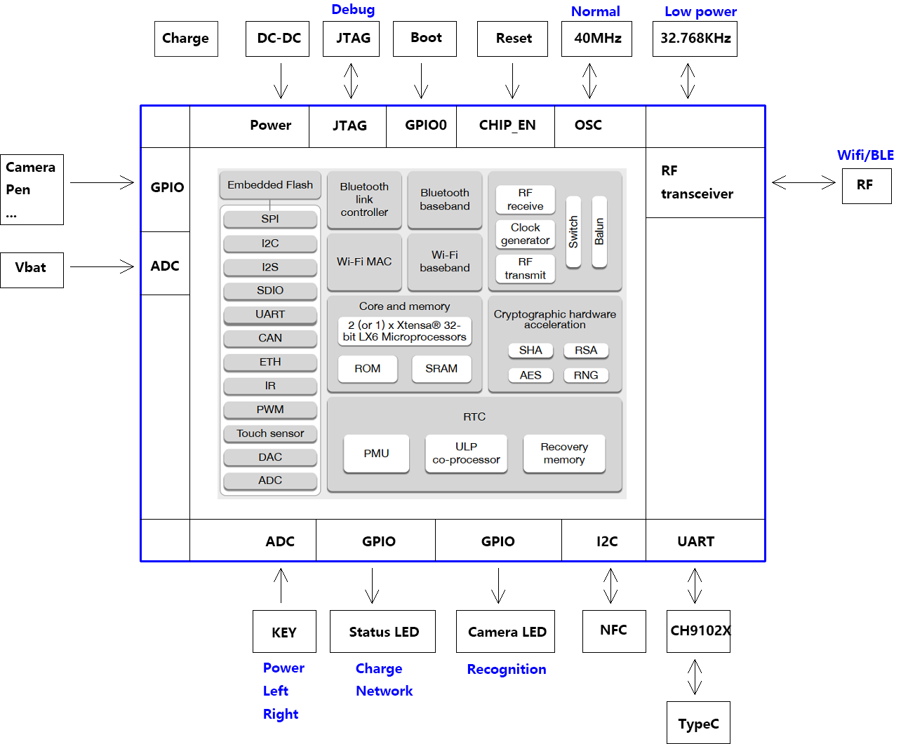

## 资源和约束

NiobeU4开发板资源十分有限，整板共4MB FLASH，448KB ROM以及520KB SRAM。在编写业务代码时，需注意内存资源的合理使用。

## 开发板规格

**表1** NiobeU4开发板规格清单

| 规格类型         | 规格清单                                                     |
| ---------------- | ------------------------------------------------------------ |
| 最小系统         | - 高性能 Xtensa® 32-bit LX6微处理器，最大工作频率160MHz<br/>\- 内嵌448 KB ROM、520 KB SRAM<br/>\- 内嵌 4MB Flash |
| I/O接口          | 10PIN*2的扩展排针扩展20个外接IO口，用户可以对ESP32进行编程，可实现PWM、ADC、DAC、I2C、SPI、RMII、SDIO3.0等复用功能。 |
| WIFI特性         | - 802.11 b/g/n<br/>- 802.11 n (2.4 GHz) 速度高达 150 Mbps<br/>- 无线多媒体 (WMM)<br/>- 帧聚合 (TX/RX A-MPDU, RX A-MSDU)<br/>- 立即块确认 (Immediate Block ACK)<br/>- 重组 (Defragmentation)<br/>- 802.11 b/g/n<br/>- 802.11 n (2.4 GHz) 速度高达 150 Mbps<br/>- 无线多媒体 (WMM)<br/>- 帧聚合 (TX/RX A-MPDU, RX A-MSDU)<br/>- 立即块确认 (Immediate Block ACK)<br/>- 重组 (Defragmentation) |
| 蓝牙特性         | - 蓝牙 v4.2 完整标准，包含传统蓝牙 (BR/EDR) 和低功耗蓝牙 (BLE)<br/>- 支持标准 Class-1、 Class-2 和 Class-3，且无需外部功率放大器<br/>- 增强型功率控制 (Enhanced Power Control)<br/>- 输出功率高达 +9 dBm<br/>- NZIF 接收器具有–94 dBm 的 BLE 接收灵敏度<br/>- 自适应跳频 (AFH)<br/>- 基于 SDIO/SPI/UART 接口的标准 HCI<br/>- 高速 UART HCI，最高可达 4 Mbps<br/>- 支持蓝牙 4.2 BR/EDR 和 BLE 双模 controller<br/>- 同步面向连接/扩展同步面向连接 (SCO/eSCO)<br/>- CVSD 和 SBC 音频编解码算法<br/>- 蓝牙微微网 (Piconet) 和散射网 (Scatternet)<br/>- 支持传统蓝牙和低功耗蓝牙的多设备连接<br/>- 支持同时广播和扫描 |
| NFC感应          | 采用高度集成的工作在13.56MHz下支持LPCD功能的非接触通讯芯片，支持读、写卡功能 |
| USB 接口         | 可用作开发板的供电电源，同时支持USB转串口，可用作串口调试或者固件下载 |
| 锂电池接口       | 可外挂锂电池同时支持板载对电池充电<br/>3A同步降压型锂电池充电管理芯片，800KHz固定频率，高达92%以上的充电效率，集成防反灌保护、输出短路保护、芯片及电池温度保护等多种功能 |
| 显示屏接口       | 默认使用1.44寸 SPI彩色LCD，同时也可选0.96寸I2C单色OLED       |
| 按键             | Boot按键一个、复位按键一个，可供用户使用的独立按键一个、ADC按键两个 |
| 电气特性         | 工作温度：-40℃～85℃<br/>芯片典型供电电压： 3.3V<br/>典型IO电压： 3.3V |
| 不同模式功耗情况 | WIFI 11B TX模式：AVG≤240mA @ 3.3V<br/>Modem-sleep: AVG≤44mA @ 3.3V<br/>Deep-sleep: AVG≤150uA @ 3.3V |

OpenHarmony基于ESP32平台提供了多种开放能力，提供的关键组件如下表所示。

## 关键特性

**表 2** 关键特性列表

| 特性名       | 能力介绍                                                     |
| ------------ | ------------------------------------------------------------ |
| WLAN服务     | 提供WLAN服务能力。包括：station和hotspot模式的连接、断开、状态查询等。 |
| 蓝牙服务     | 提供蓝牙服务能力。包括：蓝牙打开、扫描、蓝牙连接、蓝牙通信等。 |
| 模组外设控制 | 提供操作外设的能力。包括：GPIO、I2C、ADC、UART、GPIO、PWM、FLASH等。 |
| 设备安全绑定 | 提供在设备互联场景中，数据在设备之间的安全流转的能力。       |
| 基础加解密   | 提供密钥管理、加解密等能力。                                 |
| 系统服务管理 | 系统服务管理基于面向服务的架构，提供了OpenHarmony统一化的系统服务开发框架。 |
| 启动引导     | 提供系统服务的启动入口标识。在系统服务管理启动时，调用bootstrap标识的入口函数，并启动系统服务。 |
| 系统属性     | 提供获取与设置系统属性的能力。                               |
| 基础库       | 提供公共基础库能力。包括：文件操作、KV存储管理等。           |
| DFX          | 提供DFX能力。包括：流水日志、时间打点等。                    |

## 搭建开发环境

系统环境要求：建议[Ubuntu20.04版本](https://mirrors.aliyun.com/oldubuntu-releases/releases/20.04.3/)及以上（若使用18.04版本，需将Python3.6升级为Python3.8）。

### 更新Ubuntu源

- 打开`sources.list`文件。

```
sudo gedit /etc/apt/sources.list
```

- 将与系统对应版本源复制并覆盖至上述打开的文件中，保存关闭，执行如下命令。（建议使用[ubuntu源](https://developer.aliyun.com/mirror/ubuntu)）。

```
sudo apt update
```

### 安装依赖工具与库

- 安装ccache（用于加速编译）。

```shell
sudo apt install ccache
```

- 安装git工具并配置用户名和邮箱。

```
sudo apt install git git-lfs
git config --global user.email "xxx"
git config --global user.name "xxx"
```

- 设置Python软链接为Python3.8。

```shell
sudo update-alternatives --install /usr/bin/python python /usr/bin/python3.8 1
```

- 安装并升级Python包管理工具(pip3)。

```
sudo apt-get install python3-setuptools python3-pip -y
sudo pip3 install --upgrade pip
```

- 安装Python3工具包。

```
pip3 install --trusted-host mirrors.aliyun.com -i http://mirrors.aliyun.com/pypi/simple jinja2 ohos-build==0.4.6 esptool
```

- 将hb工具添加至环境变量。

```
gedit ~/.bashrc  #打开环境配置文件
export PATH=$PATH:~/.local/bin  #添加该语句至文件末尾，保存退出
source ~/.bashrc #使环境配置文件生效
```

### 安装repo工具

如果已经安装并拉取过OpenHarmony代码，请忽略该步骤。

如果是通过apt install安装的repo，请卸载后按照下述步骤重新安装。

```shell
sudo apt install curl -y
curl -s https://gitee.com/oschina/repo/raw/fork_flow/repo-py3 > repo
chmod a+x repo
sudo mv repo /usr/local/bin/
```

### 安装交叉编译工具链

新建一个目录，用来存放下载的编译工具链。

```shell
mkdir -p ~/download && cd ~/download
```

下载交叉编译工具链压缩包。

```shell
wget https://dl.espressif.com/dl/xtensa-esp32-elf-gcc8_4_0-esp-2021r2-linux-amd64.tar.gz
```

将交叉编译工具添加至环境变量。

- 解压工具链。

```shell
sudo tar axvf xtensa-esp32-elf-gcc8_4_0-esp-2021r2-linux-amd64.tar.gz -C /opt/ 
```

- 打开配置文件。

```shell
gedit ~/.bashrc
```

- 在文件末尾添加。

```shell      
export PATH=$PATH:/opt/xtensa-esp32-elf/bin
```

- 使配置生效。

```shell
source ~/.bashrc
```

## 获取源码

```shell
mkdir niobeu4_src && cd niobeu4_src
repo init -u https://gitee.com/openharmony/manifest.git -b master -m chipsets/niobeu4.xml -g ohos:mini
repo sync -c
```

## 构建源码

- 进入源码根目录，执行`hb set`命令并选择openvalley下项目`iotlink`。

  ```shell
  hb set
  ```

- 执行`hb build -f`脚本构建产生固件。

  ```shell
  hb build -f
  ```

  构建成功会提示类似如下信息。

  ```          
  [OHOS INFO] iotlink build success
  [OHOS INFO] cost time: 0:00:28
  ```

- 查看生成的固件。

  ```shell
  ls out/niobeu4/iotlink/bin/
  ```

  | 固件名称       | 用途                    |
  | -------------- | ----------------------- |
  | OHOS_Image.bin | OpenHarmony内核及应用镜像文件 |
  | bootloader.bin | 启动引导镜像文件        |
  | partitions.bin | 分区表镜像文件          |

## 烧录镜像

Windows下可以使用`Flash_Download_Tool`工具进行烧录，点击[这里](https://www.espressif.com.cn/sites/default/files/tools/flash_download_tool_3.9.2_0.zip)开始下载。

- 在windows下解压flash_download_tool_3.9.2.rar。
- 双击解压后得到的烧录工具flash_download_tool_3.9.2.exe，chipType选择 ESP32, workMode选择 develop，进入主界面。

**图4** `Flash_Download_Tool`打开页面图

 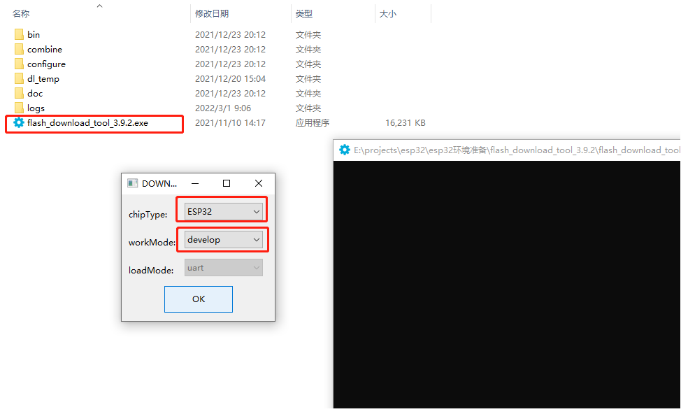

- 连接开发板的TypeC口到PC，查看设备管理器，确定串口端口号。

**图5** 设备管理器图

 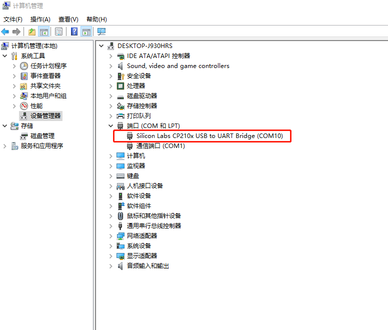

- 进入下载页面，填入需要烧录的 bin 文件和对应的烧录地址，并根据自己实际 需求填入 SPI SPEED、SPI MODE、COM 及 BAUD。

固件对应烧录地址如下。

```
//out/niobeu4/iotlink/bin/bootloader.bin ---------->  0x1000
//out/niobeu4/iotlink/bin/partitions.bin ---------->  0x8000
//out/niobeu4/iotlink/OHOS_Image.bin ---------->  0x10000
```

**图6** 烧录设置页面图

 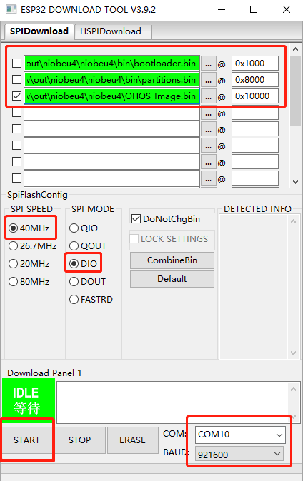

- 点击 START 开始下载。下载过程中，下载工具会读取 flash 的信息和芯片的 MAC 地址。我们可以通过勾选框选择是否烧录该文件，一般我们在首次烧录时会全部烧录，为了加快开发效率，调试时只需烧录`OHOS_Image.bin`即可。下载完成后，可以看到如下提示。

**图7** 烧录成功页面图

 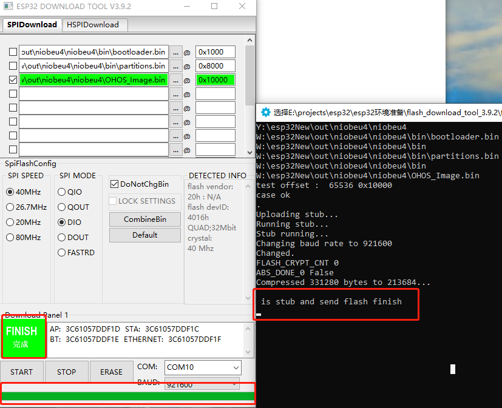

## 运行镜像

烧录完成后需要按下复位键复位设备，程序才会启动。

推荐使用`xshell`进行串口调试，点击[这里](https://www.xshell.com/zh/free-for-home-school/)进行下载。

- 新建会话（菜单栏->文件->新建），设置会话名称并选择协议为`SERIAL`。

**图8** `xshell`页面新建会话图

 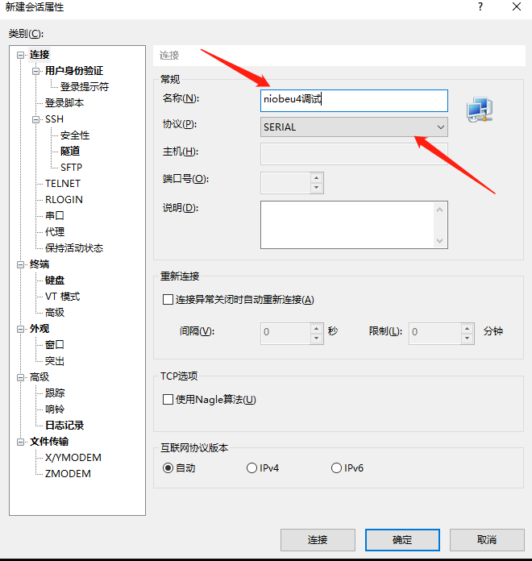

- 配置串口参数，选择正确的端口号，波特率设置为115200，如下图所示。

**图9** `xshell`页面串口参数配置图

 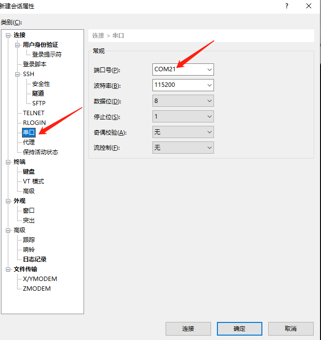

- 由于系统打印信息中没有使用`\r\n`换行，会导致log显示不对齐。需要设置终端属性，用CR+LF接收LF(R)。

**图10** `xshell`页面设置终端属性图

 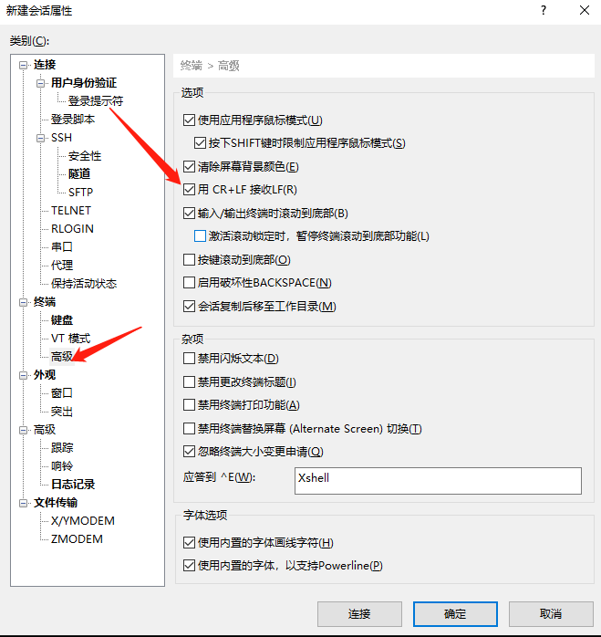

- 复位设备，日志打印如下所示。

**图11** 日志打印图

 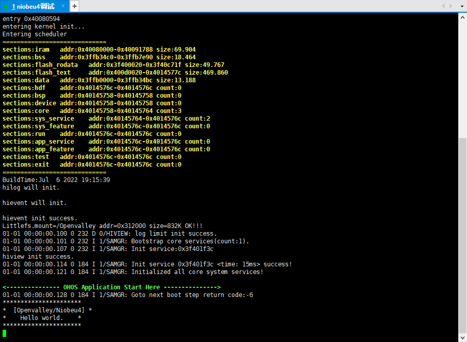

## 联系

如果您在开发过程中有问题，请在仓库[issues](https://gitee.com/openharmony/device_board_openvalley/issues)中提问。
