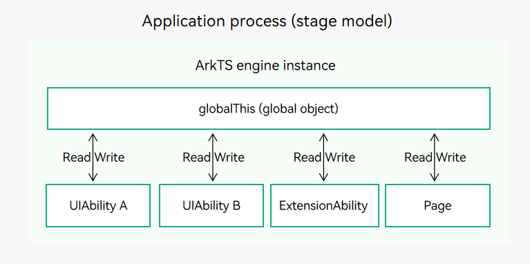
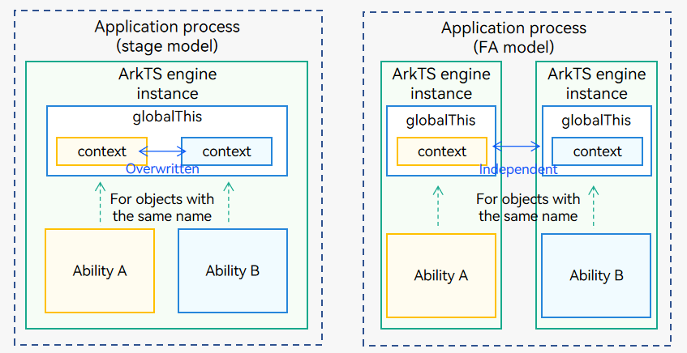

# Data Synchronization Between UIAbility and UI Page


Based on the OpenHarmony application model, you can use any of the following ways to implement data synchronization between UIAbility components and UI pages:

- [Using EventHub for Data Synchronization](#using-eventhub-for-data-synchronization): The **EventHub** object is provided by the base class **Context**. It allows events to be transferred using the publish/subscribe (pub/sub) pattern. Specifically, after subscribing to an event, your application will receive the event and process it accordingly when the event is published.
- [Using globalThis for Data Synchronization](#using-globalthis-for-data-synchronization): **globalThis** is a global object inside the ArkTS engine instance and can be accessed by the UIAbility components, ExtensionAbility components, and ArkUI pages inside the instance.
- [Using AppStorage or LocalStorage for Data Synchronization](#using-appstorage-or-localstorage-for-data-synchronization): ArkUI provides two application-level state management solutions: AppStorage and LocalStorage, which implement application- and UIAbility-level data synchronization, respectively.


## Using EventHub for Data Synchronization

[EventHub](../reference/apis/js-apis-inner-application-eventHub.md) provides an event mechanism for the UIAbility component so that they can subscribe to, unsubscribe from, and trigger events.

Before using the APIs provided by **EventHub**, you must obtain an **EventHub** object, which is provided by the [base class Context](application-context-stage.md).

1. Call [eventHub.on()](../reference/apis/js-apis-inner-application-eventHub.md#eventhubon) in the UIAbility in either of the following ways to register a custom event **event1**.

   ```ts
   import UIAbility from '@ohos.app.ability.UIAbility';

   const TAG: string = '[Example].[Entry].[EntryAbility]';

   export default class EntryAbility extends UIAbility {
     func1(...data) {
       // Trigger the event to complete the service operation.
       console.info(TAG, '1. ' + JSON.stringify(data));
     }

     onCreate(want, launch) {
       // Obtain an eventHub object.
       let eventhub = this.context.eventHub;
       // Subscribe to the event.
       eventhub.on('event1', this.func1);
       eventhub.on('event1', (...data) => {
         // Trigger the event to complete the service operation.
         console.info(TAG, '2. ' + JSON.stringify(data));
       });
     }
   }
   ```

2. Call [eventHub.emit()](../reference/apis/js-apis-inner-application-eventHub.md#eventhubemit) on the UI page to trigger the event, and pass in the parameters as required.

   ```ts
   import common from '@ohos.app.ability.common';

   @Entry
   @Component
   struct Index {
     private context = getContext(this) as common.UIAbilityContext;

     eventHubFunc() {
       // Trigger the event without parameters.
       this.context.eventHub.emit('event1');
       // Trigger the event with one parameter.
       this.context.eventHub.emit('event1', 1);
       // Trigger the event with two parameters.
       this.context.eventHub.emit('event1', 2, 'test');
       // You can design the parameters based on your service requirements.
     }

     // UI page display.
     build() {
       ...
     }
   }
   ```

3. Obtain the event trigger result from the subscription callback of the UIAbility. The run log result is as follows:

   ```ts
   []

   [1]

   [2,'test']
   ```

4. When **event1** is not needed, call [eventHub.off()](../reference/apis/js-apis-inner-application-eventHub.md#eventhuboff) to unsubscribe from the event.

   ```ts
   // context is the AbilityContext of the UIAbility instance.
   this.context.eventHub.off('event1');
   ```


## Using globalThis for Data Synchronization

**globalThis** is a global object inside the [ArkTS engine instance](thread-model-stage.md) and can be used by UIAbility, ExtensionAbility, and UI page inside the engine. Therefore, you can use **globalThis** for data synchronization.

**Figure 1** Using globalThis for data synchronization



The following describes how to use **globalThis** in three scenarios. Precautions are provided as well.

- [Using globalThis Between UIAbility and UI Page](#using-globalthis-between-uiability-and-ui-page)
- [Using globalThis Between UIAbility and UIAbility](#using-globalthis-between-uiability-and-uiability)
- [Using globalThis Between UIAbility and ExtensionAbility](#using-globalthis-between-uiability-and-extensionability)
- [Precautions for Using globalThis](#precautions-for-using-globalthis)

### Using globalThis Between UIAbility and UI Page

To implement data synchronization between the UIAbility component and UI page, you can bind attributes or methods to **globalThis**. For example, if you bind the **want** parameter in the UIAbility component, you can use the **want** parameter information on the UI page corresponding to the UIAbility component.

1. When [startAbility()](../reference/apis/js-apis-inner-application-uiAbilityContext.md#uiabilitycontextstartability) is called to start a UIAbility instance, the [onCreate()](../reference/apis/js-apis-app-ability-uiAbility.md#uiabilityoncreate) callback is invoked, and the **want** parameter can be passed in the callback. Bind the **want** parameter to **globalThis**.

   ```ts
   import UIAbility from '@ohos.app.ability.UIAbility';

   export default class EntryAbility extends UIAbility {
     onCreate(want, launch) {
       globalThis.entryAbilityWant = want;
       ...
     }

     ...
   }
   ```

2. Use **globalThis** on the UI page to obtain the **want** parameter information.

   ```ts
   let entryAbilityWant;

   @Entry
   @Component
   struct Index {
     aboutToAppear() {
       entryAbilityWant = globalThis.entryAbilityWant;
     }

     // UI page display.
     build() {
       ...
     }
   }
   ```


### Using globalThis Between UIAbility and UIAbility

To implement data synchronization between two UIAbility components in the same application, you can bind data to **globalThis**. For example, you can save data in **globalThis** in UIAbilityA and obtain the data from UIAbilityB.

1. Save data in UIAbilityA and bind it to **globalThis**.

   ```ts
   import UIAbility from '@ohos.app.ability.UIAbility'

   export default class UIAbilityA extends UIAbility {
     onCreate(want, launch) {
       globalThis.entryAbilityStr = 'UIAbilityA'; // UIAbilityA stores the string "UIAbilityA" to globalThis.
       ...
     }
   }
   ```

2. Obtain the data from UIAbilityB.

   ```ts
   import UIAbility from '@ohos.app.ability.UIAbility'

   export default class UIAbilityB extends UIAbility {
     onCreate(want, launch) {
       // UIAbilityB reads name from globalThis and outputs it.
       console.info('name from entryAbilityStr: ' + globalThis.entryAbilityStr);
       ...
     }
   }
   ```


### Using globalThis Between UIAbility and ExtensionAbility

To implement data synchronization between the UIAbility and ExtensionAbility components in the same application, you can bind data to **globalThis**. For example, you can save data in **globalThis** in UIAbilityA and obtain the data from ServiceExtensionAbility.

1. Save data in UIAbilityA and bind it to **globalThis**.

   ```ts
   import UIAbility from '@ohos.app.ability.UIAbility'

   export default class UIAbilityA extends UIAbility {
     onCreate(want, launch) {
       // UIAbilityA stores the string "UIAbilityA" to globalThis.
       globalThis.entryAbilityStr = 'UIAbilityA';
       ...
     }
   }
   ```

2. Obtain the data from ExtensionAbility.

   ```ts
   import Extension from '@ohos.app.ability.ServiceExtensionAbility'

   export default class ServiceExtAbility extends Extension {
     onCreate(want) {
       / / ServiceExtAbility reads name from globalThis and outputs it.
       console.info('name from entryAbilityStr: ' + globalThis.entryAbilityStr);
       ...
     }
   }
   ```


### Precautions for Using globalThis

**Figure 2** Precautions for using globalThis


- In the stage model, all the UIAbility components in a process share one ArkTS engine instance. When using **globalThis**, do not store objects with the same name. For example, if UIAbilityA and UIAbilityB use **globalThis** to store two objects with the same name, the object stored earlier will be overwritten.

- **globalThis** cannot be used across processes. The UIAbility and ExtensionAbility components of different processes cannot use **globalThis** to share data. For details about the process model and inter-process communication, see [Process Model Overview](./process-model-stage.md#process-model-overview).

- This problem does not occur in the FA model because each UIAbility component uses an independent engine.

- The lifecycle of an object bound to **globalThis** is the same as that of the ArkTS engine instance. To minimize memory usage, you are advised to assign the value **null** to the object when it is not in use.

The following provides an example to describe the object overwritten problem in the stage model.

1. In the UIAbilityA file, use **globalThis** to store [UIAbilityContext](../reference/apis/js-apis-inner-application-uiAbilityContext.md).

   ```ts
   import UIAbility from '@ohos.app.ability.UIAbility'

   export default class UIAbilityA extends UIAbility {
     onCreate(want, launch) {
       globalThis.context = this.context; // UIAbilityA stores the context in globalThis.
       ...
     }
   }
   ```

2. Obtain and use [UIAbilityContext](../reference/apis/js-apis-inner-application-uiAbilityContext.md) on the UI page of UIAbilityA. When the UIAbilityA instance is not in use, switch it to the background.

   ```ts
   @Entry
   @Component
   struct Index {
     onPageShow() {
       let ctx = globalThis.context; // Obtain the context from globalThis and use it.
     }
     // UI page display.
     build() {
       ...
     }
   }
   ```

3. In the UIAbilityB file, use **globalThis** to store [UIAbilityContext](../reference/apis/js-apis-inner-application-uiAbilityContext.md), which is named the same as that in the UIAbilityA file.

   ```ts
   import UIAbility from '@ohos.app.ability.UIAbility'

   export default class UIAbilityB extends UIAbility {
     onCreate(want, launch) {
       // UIAbilityB overwrites the context stored by UIAbilityA in globalThis.
       globalThis.context = this.context;
       ...
     }
   }
   ```

4. Obtain [UIAbilityContext](../reference/apis/js-apis-inner-application-uiAbilityContext.md) from the UI page of UIAbilityB and use it. The obtained **globalThis.context** is the value of [UIAbilityContext](../reference/apis/js-apis-inner-application-uiAbilityContext.md) in UIAbilityB.

   ```ts
   @Entry
   @Component
   struct Index {
     onPageShow() {
       let ctx = globalThis.context; // Obtain the context from globalThis and use it.
     }
     // UI page display.
     build() {
       ...
     }
   }
   ```

5. Switch the UIAbilityB instance to the background and switch the UIAbilityA instance to the foreground. In this case, UIAbilityA will not enter the **onCreate()** lifecycle again.

   ```ts
   import UIAbility from '@ohos.app.ability.UIAbility'

   export default class UIAbilityA extends UIAbility {
     onCreate(want, launch) { // UIAbilityA will not enter this lifecycle.
       globalThis.context = this.context;
       ...
     }
   }
   ```

6. When the UI page of UIAbilityA is displayed, the obtained **globalThis.context** is the value of [UIAbilityContext](../reference/apis/js-apis-inner-application-uiAbilityContext.md) of UIAbilityB instead of UIAbilityA. An error occurs.

   ```ts
   @Entry
   @Component
   struct Index {
     onPageShow() {
       let ctx = globalThis.context; // The context in globalThis is the context of UIAbilityB.
     }
     // UI page display.
     build() {
       ...
     }
   }
   ```

## Using AppStorage or LocalStorage for Data Synchronization

ArkUI provides AppStorage and LocalStorage to implement application- and UIAbility-level data synchronization, respectively. Both solutions can be used to manage the application state, enhance application performance, and improve user experience. The AppStorage is a global state manager that manages state data shared among multiple UIAbilities. The LocalStorage is a local state manager that manages state data used inside a single UIAbility. They help you control the application state more flexibly and improve the maintainability and scalability of applications. For details, see [State Management of Application-Level Variables](../quick-start/arkts-application-state-management-overview.md).
