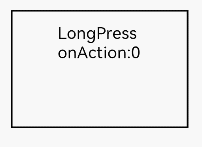
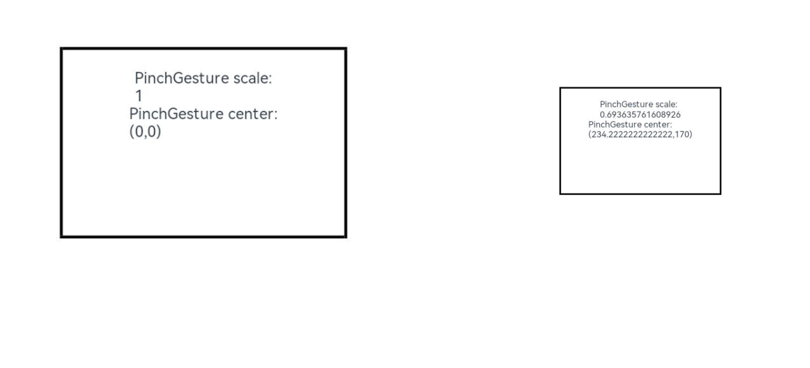
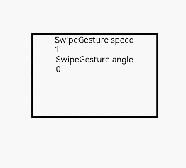

# Single Gesture


## TapGesture


```ts
TapGesture(value?:{count?:number; fingers?:number})
```


Triggers a tap gesture with one or more taps. This API has two optional parameters:


- **count**: number of consecutive taps required for gesture recognition. The default value is 1. A value less than 1 evaluates to the default value **1**. If multi-tap is configured, the timeout interval between a lift and the next tap is 300 ms.

- **fingers**: number of fingers required for gesture recognition. The value ranges from 1 to 10. The default value is **1**. If the number of fingers used for the tap is less than the specified one within 300 ms after the first finger is tapped, the gesture fails to be recognized. Gesture recognition also fails if the number of fingers used for the tap exceeds the value of **fingers**.
    The following example binds a double-tap gesture (a tap gesture whose **count** value is **2**) to the **\<Text>** component:

  ```ts
  // xxx.ets
  @Entry
  @Component
  struct Index {
    @State value: string = "";
    
    build() {
      Column() {
        Text('Click twice').fontSize(28)
          .gesture(
            // Bind a tap gesture whose count value is 2.
            TapGesture({ count: 2 })
              .onAction((event: GestureEvent) => {
                this.value = JSON.stringify(event.fingerList[0]);
              }))
        Text(this.value)
      }
      .height(200)
      .width(250)
      .padding(20)
      .border({ width: 3 })
      .margin(30)
    }
  }
  ```

  


## LongPressGesture


```ts
LongPressGesture(value?:{fingers?:number; repeat?:boolean; duration?:number})
```


Triggers a long press gesture, which requires one or more fingers with a minimum 500 ms hold-down time. This API has three optional parameters:


- **fingers**: minimum number of fingers required for gesture recognition. The value ranges from 1 to 10. The default value is **1**.

- **repeat**: whether to continuously trigger the event callback. The default value is **false**.

- **duration**: minimum hold-down time, in ms. The default value is **500**.


The following exemplifies how to bind a long press gesture that can be repeatedly triggered to the **\<Text>** component:


```ts
// xxx.ets
@Entry
@Component
struct Index {
  @State count: number = 0;

  build() {
    Column() {
      Text('LongPress OnAction:' + this.count).fontSize(28)
        .gesture(
          // Bind the long press gesture that can be triggered repeatedly.
          LongPressGesture({ repeat: true })
            .onAction((event: GestureEvent) => {
              if (event.repeat) {
                this.count++;
              }
            })
            .onActionEnd(() => {
              this.count = 0;
            })
        )
    }
    .height(200)
    .width(250)
    .padding(20)
    .border({ width: 3 })
    .margin(30)
  }
}
```





## PanGesture


```ts
PanGestureOptions(value?:{ fingers?:number; direction?:PanDirection; distance?:number})
```


Triggers a pan gesture, which requires the minimum movement distance (5 vp by default) of a finger on the screen. This API has three optional parameters:


- **fingers**: minimum number of fingers required for gesture recognition. The value ranges from 1 to 10. The default value is **1**.

- **direction**: pan direction. The enumerated value supports the AND (&amp;) and OR (\|) operations. The default value is **Pandirection.All.**

- **distance**: minimum pan distance required for gesture recognition, in vp. The default value is **5**.


The following exemplifies how to bind a pan gesture to the **\<Text>** component. You can pan a component by modifying the layout and position information of the component in the **PanGesture** callback.


```ts
// xxx.ets
@Entry
@Component
struct Index {
  @State offsetX: number = 0;
  @State offsetY: number = 0;
  @State positionX: number = 0;
  @State positionY: number = 0;

  build() {
    Column() {
      Text('PanGesture Offset:\nX: ' + this.offsetX + '\n' + 'Y: ' + this.offsetY)
        .fontSize(28)
        .height(200)
        .width(300)
        .padding(20)
        .border({ width: 3 })
          // Bind the layout and position information to the component.
        .translate({ x: this.offsetX, y: this.offsetY, z: 0 })
        .gesture(
          // Bind the pan gesture to the component.
          PanGesture()
            .onActionStart((event: GestureEvent) => {
              console.info('Pan start');
            })
              // When the drag gesture is triggered, modify the layout and position information of the component based on the callback.
            .onActionUpdate((event: GestureEvent) => {
              this.offsetX = this.positionX + event.offsetX;
              this.offsetY = this.positionY + event.offsetY;
            })
            .onActionEnd(() => {
              this.positionX = this.offsetX;
              this.positionY = this.offsetY;
            })
        )
    }
    .height(200)
    .width(250)
  }
}
```


>**NOTE**
>
>Most slidable components, such as **\<List>**, **\<Grid>**, **\<Scroll>**, and **\<Tab>**, slide through the pan gesture. Therefore, binding the [pan gesture](#pangesture) or [swipe gesture](#swipegesture) to child components will cause gesture competition.
>
>When a child component is bound to the pan gesture, sliding in the child component area triggers only the pan gesture of the child component. If the parent component needs to respond, you need to modify the gesture binding method or transfer messages from the child component to the parent component, or modify the **PanGesture** parameter distance of the parent and child components to make the panning more sensitive. When a child component is bound to the swipe gesture, you need to modify the parameters of **PanGesture** and **SwipeGesture** to achieve the required effect because the triggering conditions of **PanGesture** and **SwipeGesture** are different.


## PinchGesture


```ts
PinchGesture(value?:{fingers?:number; distance?:number})
```


The pinch gesture is used to trigger a pinch gesture event. A minimum quantity of fingers that trigger the pinch gesture is two fingers, a maximum quantity of fingers that trigger the pinch gesture is five fingers, a minimum recognition distance is 3vp, and there are two optional parameters:


- fingers: specifies the minimum number of fingers required to trigger a pinch gesture. This parameter is optional. The minimum value is 2 and the maximum value is 5. The default value is 2.

- distance: specifies the minimum distance for triggering the pinch gesture. This parameter is optional. The unit is vp. The default value is 3.


For example, to bind a three-finger pinch gesture to the Column component, you can obtain the zoom ratio from the function callback of the pinch gesture to zoom out or zoom in the component.


```ts
// xxx.ets
@Entry
@Component
struct Index {
  @State scaleValue: number = 1;
  @State pinchValue: number = 1;
  @State pinchX: number = 0;
  @State pinchY: number = 0;

  build() {
    Column() {
      Column() {
        Text('PinchGesture scale:\n' + this.scaleValue)
        Text('PinchGesture center:\n(' + this.pinchX + ',' + this.pinchY + ')')
      }
      .height(200)
      .width(300)
      .border({ width: 3 })
      .margin({ top: 100 })
      // Bind the zoom ratio to the component. You can change the zoom ratio to zoom out or zoom in the component.
      .scale({ x: this.scaleValue, y: this.scaleValue, z: 1 })
      .gesture(
        // Bind the pinch gesture triggered by three fingers to the widget.
        PinchGesture({ fingers: 3 })
          .onActionStart((event: GestureEvent) => {
            console.info('Pinch start');
          })
            // When the pinch gesture is triggered, the callback function can be used to obtain the zoom ratio to change the zoom ratio of the component.
          .onActionUpdate((event: GestureEvent) => {
            this.scaleValue = this.pinchValue * event.scale;
            this.pinchX = event.pinchCenterX;
            this.pinchY = event.pinchCenterY;
          })
          .onActionEnd(() => {
            this.pinchValue = this.scaleValue;
            console.info('Pinch end');
          })
      )
    }
  }
}
```





## RotationGesture


```ts
RotationGesture(value?:{fingers?:number; angle?:number})
```


The rotation gesture is used to trigger a rotation gesture event. A minimum quantity of fingers that trigger the rotation gesture is two fingers, a maximum quantity of fingers that trigger the rotation gesture is five fingers, a minimum change degree is one degree, and there are two optional parameters:


- **fingers**: minimum number of fingers required to trigger a rotation gesture. This parameter is optional. The minimum value is 2 and the maximum value is 5. The default value is 2.

- **angle**: minimum change degree for triggering the rotation gesture. This parameter is optional. The unit is deg. The default value is 1.


For example, a rotation gesture is bound to a **\<Text>** component to implement rotation of the component. A rotation angle may be obtained from a callback function of the rotation gesture, so as to implement rotation of the component:


```ts
// xxx.ets
@Entry
@Component
struct Index {
  @State angle: number = 0;
  @State rotateValue: number = 0;

  build() {
    Column() {
      Text('RotationGesture angle:' + this.angle).fontSize(28)
        // Bind the rotation layout to the component. You can change the rotation angle to rotate the component.
        .rotate({ angle: this.angle })
        .gesture(
          RotationGesture()
            .onActionStart((event: GestureEvent) => {
              console.info('RotationGesture is onActionStart');
            })
              // When the rotation gesture takes effect, the rotation angle is obtained by using the callback function of the rotation gesture, so as to modify the rotation angle of the component.
            .onActionUpdate((event: GestureEvent) => {
              this.angle = this.rotateValue + event.angle;
              console.info('RotationGesture is onActionEnd');
            })
              // Angle of the fixed component at the end of the rotation when the rotation ends and the handle is raised
            .onActionEnd(() => {
              this.rotateValue = this.angle;
              console.info('RotationGesture is onActionEnd');
            })
            .onActionCancel(() => {
              console.info('RotationGesture is onActionCancel');
            })
        )
    }
    .height(200)
    .width(250)
  }
}
```


## SwipeGesture


```ts
SwipeGesture(value?:{fingers?:number; direction?:SwipeDirection; speed?:number})
```


Swipe gestures are used to trigger swipe events. A swipe gesture is recognized when the swipe speed is 100 vp/s or higher. There are three optional parameters:


- **fingers**: minimum number of fingers required to trigger a swipe gesture. TThe minimum value is 1 and the maximum value is 10. The default value is 1.

- **direction**: swipe direction. The enumerated values support the AND and OR operations. The default value is **SwipeDirection.All**.

- **speed**: minimum speed of the swipe gesture, in vp/s. The default value is **100**.


The following describes how to bind a sliding gesture to the Column component to rotate the component:


```ts
// xxx.ets
@Entry
@Component
struct Index {
  @State rotateAngle: number = 0;
  @State speed: number = 1;

  build() {
    Column() {
      Column() {
        Text("SwipeGesture speed\n" + this.speed)
        Text("SwipeGesture angle\n" + this.rotateAngle)
      }
      .border({ width: 3 })
      .width(300)
      .height(200)
      .margin(100)
      // Bind rotation to the Column component and change the rotation angle based on the sliding speed and angle of the sliding gesture.
      .rotate({ angle: this.rotateAngle })
      .gesture(
        // Bind the sliding gesture and restrict it to be triggered only when the user slides in the vertical direction.
        SwipeGesture({ direction: SwipeDirection.Vertical })
          // When the swipe gesture is triggered, the swipe speed and angle are obtained, which can be used to modify the layout parameters.
          .onAction((event: GestureEvent) => {
            this.speed = event.speed;
            this.rotateAngle = event.angle;
          })
      )
    }
  }
}
```





>**NOTE**
>
>When SwipeGesture and PanGesture are bound at the same time, competition occurs if they are bound in default mode or mutually exclusive mode. The trigger condition of SwipeGesture is that the sliding speed reaches 100 vp/s. The trigger condition of PanGesture is that the sliding distance reaches 5 vp and the trigger condition is met first. You can modify the parameters of SwipeGesture and PanGesture to achieve different effects.
