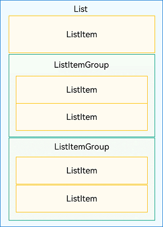
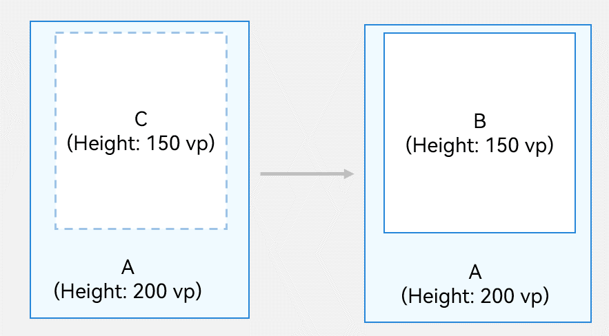
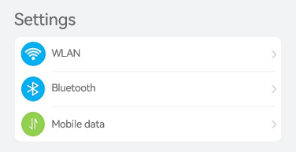
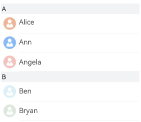
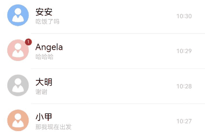

# Creating a List (List)


## Overview

A list is a container that displays a collection of items. If the list items go beyond the screen, the list can scroll to reveal the content off the screen. A list is applicable for presenting similar data types or data type sets, such as images and text. For example, it can be used to present a collection of contacts, songs, and items to shop.

Use lists to easily and efficiently display structured, scrollable information. You can provide a single view of rows or columns by arranging the [\<ListItemGroup>](../reference/arkui-ts/ts-container-listitemgroup.md) or [\<ListItem>](../reference/arkui-ts/ts-container-listitem.md) child components linearly in a vertical or horizontal direction in the [\<List>](../reference/arkui-ts/ts-container-list.md) component, or use [ForEach](../quick-start/arkts-rendering-control-foreach.md) to iterate over a group of rows or columns, or mix any number of single views and **ForEach** structures to build a list. The **\<List>** component supports the generation of child components in various [rendering](../quick-start/arkts-rendering-control-overview.md) modes, including conditional rendering, rendering of repeated content, and lazy data loading.


## Layout and Constraints

A list automatically arranges child components in the direction it scrolls. Adding or removing child components from the list will trigger re-arrangement of the child components.

As shown in the following figure, in a vertical list, **\<ListItemGroup>** or **\<ListItem>** components are automatically arranged vertically.

**\<ListItemGroup>** is used to display list data by group. Its child component is also **\<ListItem>**. **\<ListItem>** represents a list item, which can contain a single child component.

  **Figure 1** Relationships between \<List>, \<ListItemGroup>, and \<ListItem> 



>**NOTE**
>
>A **\<List>** component can contain only **\<ListItemGroup>** or **\<ListItem>** as its child components. **\<ListItemGroup>** and **\<ListItem>** must be used together with **\<List>**.


### Layout

Apart from the aforementioned features, the list is also able to adapt to the number of elements in the cross axis direction.

When used in vertical layout, the list can contain one or more scrollable columns, as shown below.

  **Figure 2** Vertical scrolling list (left: one column; right: multiple columns) 


When used in horizontal layout, the list can contain one or more scrollable rows, as shown below.

  **Figure 3** Horizontal scrolling list (left: one column; right: multiple columns) 


### Constraints

The main axis direction of a list refers to the direction in which the child component columns are laid out and in which the list scrolls. An axis perpendicular to the main axis is referred to as a cross axis, and the direction of the cross axis is perpendicular to a direction of the main axis.

As shown below, the main axis of a vertical list is in the vertical direction, and the cross axis is in the horizontal direction. The main axis of a horizontal list is in the horizontal direction, and the cross axis is in the horizontal direction.

  **Figure 4** Main axis and cross axis of the list 


If a size is set for the main axis or cross axis of the **\<List>** component, it is used as the size of the component in the corresponding direction.

If no size is set for the main axis of the **\<List>** component, the size of the **\<List>** component in the main axis direction automatically adapts to the total size of its child components, as long as the total size of the child components in the main axis direction does not exceed the size of the parent component of **\<List>**.

In the example shown below, no height is set for vertical list B, and the height of its parent component A is 200 vp. If the total height of all child components C is 150 vp, the height of list B is 150 vp.

  **Figure 5** Main axis height constraint example 1 (A: parent component of \<List>; B: \<List> component; C: all child components of \<List>) 



If the total size of the child components in the main axis direction is greater than the size of the parent component of **\<List>**, the size of the **\<List>** component in the main axis direction automatically adapts to the size of its parent component.

In the example shown below, still no height is set for vertical list B, and the height of its parent component A is 200 vp. If the total height of all child components C is 300 vp, the height of list B is 200 vp.

  **Figure 6** Main axis height constraint example 2 (A: parent component of \<List>; B: \<List> component; C: all child components of \<List>) 


If no size is set for the cross axis of the **\<List>** component, the size of the **\<List>** component in the cross axis direction automatically adapts to the size of its parent component.


## Developing the Layout


### Setting the Main Axis Direction

By default, the main axis of the **\<List>** component runs in the vertical direction. This means that you can create a vertical scrolling list without the need to manually set the list direction.

To create a horizontal scrolling list, set the **listDirection** attribute to **Axis.Horizontal**. The default value of **listDirection** is **Axis.Vertical**.


```ts
List() {
  ...
}
.listDirection(Axis.Horizontal)
```


### Setting the Cross Axis Layout

The cross axis layout of the **\<List>** component can be set using the **lanes** and **alignListItem** attributes. The **lanes** attribute controls the number of list items along the cross axis, and the **alignListItem** attribute controls the alignment mode of child components along the cross axis.

The lanes attribute of the **\<List>** component is useful in building a list that auto-adapts the numbers of rows or columns on devices of different sizes. Its value type is number or [LengthConstrain](../reference/arkui-ts/ts-types.md#lengthconstrain). If you are building a two-column vertical list shown on the right in Figure 2, set the **lanes** attribute to **2**. The default value of **lanes** is **1**.


```ts
List() {
  ...
}
.lanes(2)
```

If set to a value of the LengthConstrain type, the **lanes** attribute determines the number of rows or columns based on the LengthConstrain settings and the size of the **\<List>** component.


```ts
List() {
  ...
}
.lanes({ minLength: 200, maxLength: 300 })
```

For example, if the **lanes** attribute is set to **{ minLength: 200, maxLength: 300 }** for a vertical list, then:

- When the list width is 300 vp, the list contains one column, because **minLength** is 200 vp.

- When the list width changes to 400 vp, which is twice that of the **minLength** value, the list is automatically adapted to two-column.

>**NOTE**
>
>When the **lanes** attribute is set to a value of the LengthConstrain type, the value is used only to calculate the number of rows or columns in the list and does not affect the size of the list items.

With regard to a vertical list, when the **alignListItem** attribute is set to **ListItemAlign.Center**, list items are center-aligned horizontally; when the **alignListItem** attribute is at its default value **ListItemAlign.Start**, list items are aligned toward the start edge of the cross axis in the list.


```ts
List() {
  ...
}
.alignListItem(ListItemAlign.Center)
```


## Displaying Data in the List

The list displays a collection of items horizontally or vertically and can scroll to reveal content off the screen. In the simplest case, a **\<List>** component is statically made up of **\<ListItem>** components.

  **Figure 7** Example of a city list 


```ts
@Component
struct CityList {
  build() {
    List() {
      ListItem() {
        Text('Beijing').fontSize(24)
      }

      ListItem() {
        Text('Hangzhou').fontSize(24)
      }

      ListItem() {
        Text('Shanghai').fontSize(24)
      }
    }
    .backgroundColor('#FFF1F3F5')
    .alignListItem(ListItemAlign.Center)
  }
}
```

Each **\<ListItem>** component can contain only one root child component. Therefore, it does not allow use of child components in tile mode. If tile mode is required, you need to encapsulate the child components into a container or create a custom component.

  **Figure 8** Example of a contacts list 


As shown above, as a list item, each contact has a profile picture and a name. To present it, you can encapsulate **\<Image>** and **\<Text>** components into a **\<Row>** container.


```ts
List() {
  ListItem() {
    Row() {
      Image($r('app.media.iconE'))
        .width(40)
        .height(40)
        .margin(10)

      Text ('Tom')
        .fontSize(20)
    }
  }

  ListItem() {
    Row() {
      Image($r('app.media.iconF'))
        .width(40)
        .height(40)
        .margin(10)

      Text ('Tracy')
        .fontSize(20)
    }
  }
}
```


## Iterating List Content

Compared with a static list, a dynamic list is more common in applications. You can use [ForEach](../quick-start/arkts-rendering-control-foreach.md) to obtain data from the data source and create components for each data item.

For example, when creating a contacts list, you can store the contact name and profile picture data in a **Contact** class structure to the **contacts** array, and nest **ListItem**s in **ForEach**, thereby reducing repeated code needed for tiling similar list items.


```ts
import util from '@ohos.util';

class Contact {
  key: string = util.generateRandomUUID(true);
  name: string;
  icon: Resource;

  constructor(name: string, icon: Resource) {
    this.name = name;
    this.icon = icon;
  }
}

@Entry
@Component
struct SimpleContacts {
  private contacts = [
    new Contact ('Tom', $r ("app.media.iconA")),
    new Contact ('Tracy', $r ("app.media.iconB")),
    ...
  ]

  build() {
    List() {
      ForEach(this.contacts, (item: Contact) => {
        ListItem() {
          Row() {
            Image(item.icon)
              .width(40)
              .height(40)
              .margin(10)
            Text(item.name).fontSize(20)
          }
          .width('100%')
          .justifyContent(FlexAlign.Start)
        }
      }, item => item.key)
    }
    .width('100%')
  }
}
```

In the **\<List>** component, **ForEach** can be used to render **\<ListItemGroup>** items as well as **\<ListItem>** items. For details, see [Adding Grouping Support](#adding-grouping-support).


## Customizing the List Style


### Setting the Spacing

When initializing a list, you can use the **space** parameter to add spacing between list items. In the following example, a 10vp spacing is added between list items along the main axis:


```ts
List({ space: 10 }) {
  ...
}
```


### Adding Dividers

A divider separates UI items to make them easier to identify. In the following figure, a divider is added between the setting items. Note that since the icons are easy to identify in their own right, the divers do not extend below the icons.

  **Figure 9** Using dividers between the setting items 



To add dividers between items in a **\<List>** component, you can use its **divider** attribute, sprucing up the dividers with the following style attributes:<br> **strokeWidth** and **color**: indicate the stroke width and color of the diver, respectively.

**startMargin** and **endMargin**: indicate the distance between the divider and the start edge and end edge of the list, respectively.


```ts
List() {
  ...
}
.divider({
  strokeWidth: 1,
  startMargin: 60,
  endMargin: 10,
  color: '#ffe9f0f0'
})
```

This example draws a divider with a stroke thickness of 1 vp from a position 60 vp away from the start edge of the list to a position 10 vp away from the end edge of the list. The effect is shown in Figure 8.

>**NOTE**
>
>1. The stroke width of the divider causes some space between list items. If the content spacing set for the list is smaller than the stroke width of the divider, the latter is used instead.
>
>2. When a list contains multiple columns, the **startMargin** and **endMargin** attributes of the divider apply to each column.
>
>3. The divider is drawn between list items. No divider is drawn above the first list item and below the last list item.


### Adding a Scrollbar

When the total height (width) of list items exceeds the screen height (width), the list can scroll vertically (horizontally). The scrollbar of a list enables users to quickly navigate the list content, as shown below.

  **Figure 10** Scrollbar of a list


When using the **\<List>** component, you can use the **scrollBar** attribute to control the display of the list scrollbar. The value type of **scrollBar** is [BarState](../reference/arkui-ts/ts-appendix-enums.md#barstate). When the value is **BarState.Auto**, the scrollbar is displayed as required: It is displayed when the scrollbar area is touched and becomes thicker when being dragged; it automatically disappears after 2 seconds of inactivity.


```ts
List() {
  ...
}
.scrollBar(BarState.Auto)
```


## Adding Grouping Support

By allowing data to be displayed in groups in the list, you make the list easier to scan and navigate. Grouping is common in real-world applications. For example, the contacts list below use grouping.

  **Figure 11** Contacts list with grouping



You can use **\<ListItemGroup>** to group items in the **\<List>** component to build a two-dimensional list.

A **\<List>** component allows one or more **\<ListItemGroup>** child components. By default, the width of **\<ListItemGroup>** is equal to that of **\<List>**. When initializing **\<ListItemGroup>**, you can use the **header** parameter to set its header.


```ts
@Component
struct ContactsList {
  ...
  
  @Builder itemHead(text: string) {
    // Header of the list group, corresponding to the group A and B locations.
    Text(text)
      .fontSize(20)
      .backgroundColor('#fff1f3f5')
      .width('100%')
      .padding(5)
  }

  build() {
    List() {
      ListItemGroup({ header: this.itemHead('A') }) {
        // Render the repeated list items of group A.
        ...
      }
      ...

      ListItemGroup({ header: this.itemHead('B') }) {
        // Render the repeated list items of group B.
        ...
      }
      ...
    }
  }
}
```

If the structures of multiple **\<ListItemGroup>** components are similar, you can combine the data of these components into an array and use **ForEach** to render them cyclically. For example, in the contacts list, the **contacts** data of each group (for details, see [Iterating List Content](#iterating-list-content)) and the **title** data of the corresponding group are combined and defined as the **contactsGroups** array.


```ts
contactsGroups: object[] = [
  {
    title: 'A',
    contacts: [
      new Contact('Alice', $r('app.media.iconA')),
      new Contact ('Ann', $r ('app.media.iconB')),
      new Contact('Angela', $r('app.media.iconC')),
    ],
  },
  {
    title: 'B',
    contacts: [
      new Contact ('Ben', $r ('app.media.iconD')),
      new Contact ('Bryan', $r ('app.media.iconE')),
    ],
  },
  ...
]
```

Then, with rendering of **contactsGroups** in **ForEach**, a contact list with multiple groups is implemented.


```ts
List() {
  // Render the <ListItemGroup> components cyclically. contactsGroups is the data set of contacts and titles of multiple groups.
  ForEach(this.contactsGroups, item => {
    ListItemGroup({ header: this.itemHead(item.title) }) {
      // Render <ListItem> components cyclically.
      ForEach(item.contacts, (contact) => {
        ListItem() {
          ...
        }
      }, item => item.key)
    }
    ...
  })
}
```


## Adding a Sticky Header

The sticky header is a common pattern for keeping the header in the same place on the screen while the user scrolls down the list. As shown in the following figure, when you scroll through group A in the contacts list, the header of group B is always below group A. When you start scrolling through group B, the header of group B is fixed at the top of the screen. After group B has been scrolled to the bottom, the header of group B is replaced by the header of next group.

Sticky headers not only signify the representation and usage of data in the respective groups, but also help users navigate through a large amount of information, thereby avoiding unnecessary scrolling between the top of the area where the header is located and the area of interest.

  **Figure 12** Sticky header 


You can set a sticky header or footer for a **\<ListItemGroup>** component by setting the **sticky** attribute of its parent **\<List>** component.

Setting the **sticky** attribute to **StickyStyle.Header** implements a sticky header. To implement a sticky footer, use the **footer** parameter to initialize the footer of **\<ListItemGroup>** and set the **sticky** attribute to **StickyStyle.Footer**.


```ts
@Component
struct ContactsList {
  // Define the contactsGroups array.
  ...
 
  @Builder itemHead(text: string) {
    // Header of the list group, corresponding to the group A and B locations.
    Text(text)
      .fontSize(20)
      .backgroundColor('#fff1f3f5')
      .width('100%')
      .padding(5)
  }

  build() {
    List() {
      // Render the <ListItemGroup> components cyclically. contactsGroups is the data set of contacts and titles of multiple groups.
      ForEach(this.contactsGroups, item => {
        ListItemGroup({ header: this.itemHead(item.title) }) {
          // Render <ListItem> components cyclically.
          ForEach(item.contacts, (contact) => {
            ListItem() {
              ...
            }
          }, item => item.key)
        }
        ...
      })
    }
    .sticky(StickyStyle.Header) // Set a sticky header.
  }
}
```


## Controlling the Scrolling Position

In some cases you may want to control the scrolling position of a list. For example, when there are a huge number of items in the news page list, you may want to allow users to quickly jump to the top or bottom of the list after they have scrolled to a certain point. Below is an example.

  **Figure 13** Returning to the top of the list 


When the **\<List>** component is initialized, you can use the **scroller** parameter to bind a [Scroller](../reference/arkui-ts/ts-container-scroll.md#scroller) object to control the scrolling of the list. In this example of a news page list, the **scrollToIndex** API of the **Scroller** object is used to scroll the list to the list item with the specified index. This allows the user to return to the top of the list by clicking a specific button.

First, you need to create a **Scroller** object **listScroller**.


```ts
private listScroller: Scroller = new Scroller();
```

Then, use **listScroller** to initialize the **scroller** parameter to bind it with the **\<List>** component. Set **scrollToIndex** to **0**, meaning to return to the top of the list.


```ts
Stack({ alignContent: Alignment.BottomEnd }) {
  // use listScroller to initialize the scroller parameter to bind it with the <List> component.
  List({ space: 20, scroller: this.listScroller }) {
    ...
  }
  ...

  Button() {
    ...
  }
  .onClick(() => {
    // Specify where e to jump when the specific button is clicked, which is the top of the list in this example.
    this.listScroller.scrollToIndex(0)
  })
  ...
}
```


## Responding to the Scrolling Position

Many applications need to listen for the scrolling position change of the list and respond. For example, with regard to a contacts list, if scrolling spans more than one group, the alphabetical index bar at one side of the list also needs to be updated to highlight the letter corresponding to the current group.

Another common example is a scrolling list working with a multi-level index bar, as in the case of a product category page in a shopping application.

**Figure 14** Alphabetical index bar's response to contacts list scrolling 


As shown above, when the contacts list scrolls from group A to B, the alphabetical index bar on the right also changes from A to B. This scenario can be implemented by listening for the **onScrollIndex** event of the **\<List>** component. The alphabet index bar is implemented using the [\<AlphabetIndexer>](../reference/arkui-ts/ts-container-alphabet-indexer.md) component.

When the list scrolls, the **selectedIndex** value of the letter to highlight in the alphabet index bar is recalculated based on the **firstIndex** value of the item to which the list has scrolled. In the **\<AlphabetIndexer>** component, the index of the highlighted item is set through the **selected** attribute. When the value of **selectedIndex** changes, the **\<AlphabetIndexer>** component is re-rendered to highlight the corresponding letter.


```ts
...
const alphabets = ['#', 'A', 'B', 'C', 'D', 'E', 'F', 'G', 'H', 'I', 'J', 'K',
  'L', 'M', 'N', 'O', 'P', 'Q', 'R', 'S', 'T', 'U', 'V', 'W', 'X', 'Y', 'Z'];

@Entry
@Component
struct ContactsList {
  @State selectedIndex: number = 0;
  private listScroller: Scroller = new Scroller();
  ...

  build() {
    Stack({ alignContent: Alignment.End }) {
      List({ scroller: this.listScroller }) {
        ...
      }
      .onScrollIndex((firstIndex: number) => {
        // Recalculate the value of this.selectedIndex in the alphabetical index bar based on the index of the item to which the list has scrolled.
        ...
      })
      ...

      // <AlphabetIndexer> component
      AlphabetIndexer({ arrayValue: alphabets, selected: 0 })
        .selected(this.selectedIndex)
      ...
    }
  }
}
```

>**NOTE**
>
>During index calculation, each **\<ListItemGroup>** component is taken as a whole and assigned an index, and the indexes of the list items within are not included in the calculation.


## Responding to Swipe on List Items

Swipe menus are common in many applications. For example, a messaging application generally provides a swipe-to-delete feature for its message list. This feature allows users to delete a message by swiping left on it in the list and touching the delete button, as shown in the following figure.

**Figure 15** Swipe-to-delete feature 



To implement the swipe feature, you can use the **swipeAction** attribute of **\<ListItem>**. In initialization of the **swipeAction** attribute, the **SwipeActionOptions** parameter is mandatory, wherein the **start** parameter indicates the component that appears from the start edge when the list item slides right, and the **end** parameter indicates the component that appears from the end edge when the list item slides left.

In the example of the message list, the **end** parameter is set to a custom delete button. In initialization of the **end** attribute, the index of the sliding list item is passed to the delete button. When the user touches the delete button, the data corresponding to the list item is deleted based on the index.


```ts
@Entry
@Component
struct MessageList {
  @State messages: object[] = [
    // Initialize the message list data.
    ...
  ];

  @Builder itemEnd(index: number) {
    // Set the component that appears from the end edge when the list item slides left.
    Button({ type: ButtonType.Circle }) {
      Image($r('app.media.ic_public_delete_filled'))
        .width(20)
        .height(20)
    }
    .onClick(() => {
      this.messages.splice(index, 1);
    })
    ...
  }

  build() {
    ...
      List() {
        ForEach(this.messages, (item, index) => {
          ListItem() {
            ...
          }
          .swipeAction({ end: this.itemEnd.bind(this, index) }) // Set the swipe attributes.
        }, item => item.id.toString())
      }
    ...
  }
}
```


## Adding a Mark to a List Item

A mark is an intuitive, unintrusive visual indicator to draw attention and convey a specific message. For example, when a new message is received in the message list, a mark is displayed in the upper right corner of the contact's profile picture, indicating that there is a new message from that contact, as shown in the following figure.

  **Figure 16** Adding a mark to a list item 


To add a mark, you can use the [\<Badge>](../reference/arkui-ts/ts-container-badge.md) component in **\<ListItem>**. The **\<Badge>** component is a container that can be attached to another component for tagging.

In this example, when implementing the **\<Image>** component for presenting the profile picture of a list item, add it to **\<Badge>** as a child component.

In the **\<Badge>** component, the **count** and **position** parameters are used to set the number of notifications and the position to display the badge, respectively. You can also use the **style** parameter to spruce up the mark.


```ts
Badge({
  count: 1,
  position: BadgePosition.RightTop,
  style: { badgeSize: 16, badgeColor: '#FA2A2D' }
}) {
  // The <Image> component implements the contact profile picture.
  ...
}
...
```


## Implementing Pull-Down-to-Refresh and Pull-Up-to-Load

The pull-down-to-refresh and pull-up-to-load features are widely used in mobile applications, such as news applications. In effect, the implementation of these two features follows the same process: (1) As response to a [touch event](../reference/arkui-ts/ts-universal-events-touch.md), a refresh or load view is displayed at the top or bottom of the page; (2) when the refresh or load is complete, the refresh or load view is hidden.

The following describes the implementation of the pull-and-refresh feature:

1. Listen for the finger press event and record the value of the initial position.

2. Listen for the finger movement event, and record and calculate the difference between the value of the current position and the initial value. If the difference is greater than 0, the finger moves downward. Set the maximum value for the movement.

3. Listen for the finger lift event. If the movement reaches the maximum value, trigger data loading and display the refresh view. After the loading is complete, hide the view.

 You can also use the third-party component [PullToRefresh](https://gitee.com/openharmony-sig/PullToRefresh) to implement this feature.


## Editing a List

The list editing mode is frequently used in various scenarios, such as to-do list management, file management, and note management. In editing mode, adding and deleting list items are the most basic functions. The core is to add and delete data in the data set corresponding to the list items.

The following uses to-do list management as an example to describe how to quickly add and delete list items.


### Adding a List Item

As shown below, when a user touches **Add**, a page is displayed for the user to set options for the new list item. After the user touches **OK**, the corresponding item is added to the list.

  **Figure 17** Adding a to-do task 


The process of implementing the addition feature is as follows:

1. Define the list item data structure and initialize the list data to build the overall list layout and list items.
   In this example, first define the to-do data structure.

   ```ts
   import util from '@ohos.util';

   export class ToDo {
     key: string = util.generateRandomUUID(true);
     name: string;

     constructor(name: string) {
       this.name = name;
     }
   }
   ```

    Then, initialize the to-do list data and options:

   ```ts
   @State toDoData: ToDo[] = [];
   private availableThings: string[] = ['Reading', 'Fitness', 'Travel','Music','Movie', 'Singing'];
   ```

   Finally, build the list layout and list items:

   ```ts
   List({ space: 10 }) {
     ForEach(this.toDoData, (toDoItem) => {
       ListItem() {
         ...
       }
     }, toDoItem => toDoItem.key)
   }
   ```

2. Provide the entry for adding a list item, that is, add a click event to the add button.

3. Respond to the user's confirmation of adding and update the list data.
   The code snippet for steps 2 and 3 is as follows:

   ```ts
   Text('+')
     .onClick(() => {
       TextPickerDialog.show({
         range: this.availableThings,
         onAccept: (value: TextPickerResult) => {
            this.toDoData.push(new ToDo(this.availableThings[value.index])); // Add the list item data.
         },
       })
     })
   ```


### Deleting a List Item

As shown below, when the user long presses a list item to enter the deletion mode, a page is displayed for the user to delete the list item. After the user selects the list item and touches the delete button, the list item is deleted.

  **Figure 18** Deleting a to-do task 


The process of implementing the deletion feature is as follows:

1. Generally, the deletion feature is available only after the list enters the editing mode. Therefore, the entry to the editing mode needs to be provided.
   In this example, by listening for the long press event of a list item, the list enters the editing mode when the user long presses a list item.

   ```ts
   // ToDoListItem.ets

   Flex({ justifyContent: FlexAlign.SpaceBetween, alignItems: ItemAlign.Center }) {
     ...
   }
   .gesture(
   GestureGroup(GestureMode.Exclusive,
     LongPressGesture()
       .onAction(() => {
         if (!this.isEditMode) {
           this.isEditMode = true; // Enter the editing mode.
           this.selectedItems.push(this.toDoItem); // Record the list item selected when the user long presses the button.
         }
       })
     )
   )
   ```

2. Respond to the selection by the user and record the list items to be deleted.
   In this example of the to-do list, respond to the selection by correctly displaying the check mark and record all the selected list items.

   ```ts
   // ToDoListItem.ets

   if (this.isEditMode) {
     Checkbox()
       .onChange((isSelected) => {
         if (isSelected) {
           this.selectedItems.push(this.toDoItem) // When an item is selected, record the selected item.
         } else {
           let index = this.selectedItems.indexOf(this.toDoItem)
           if (index !== -1) {
             this.selectedItems.splice(index, 1) // When an item is deselected, delete the item from the selectedItems array.
           }
         }
       })
       ...
   }
   ```

3. Respond to the user's clicking the delete button and delete the corresponding items from the list.

   ```ts
   // ToDoList.ets

   Button ('Delete')
     .onClick(() => {
       // Delete the toDoData data corresponding to the selected list items.
       let leftData = this.toDoData.filter((item) => {
         return this.selectedItems.find((selectedItem) => selectedItem !== item);
       })

       this.toDoData = leftData;
       this.isEditMode = false;
     })
     ...
   ```


## Handling a Long List

[ForEach](../quick-start/arkts-rendering-control-foreach.md) is applicable to short lists. With regard to a long list with a large number of list items, using **ForEach** will greatly slow down page loading, as it loads all list items at a time. Therefore, for better list performance, use [LazyForEach](../quick-start/arkts-rendering-control-lazyforeach.md) instead to implement on-demand iterative data loading.

For details about the implementation, see the example in [LazyForEach: Lazy Data Loading](../quick-start/arkts-rendering-control-lazyforeach.md).

When the list is rendered in lazy loading mode, to improve the list scrolling experience and minimize white blocks during list scrolling, you can use the **cachedCount** parameter of the **\<List>** component. This parameter sets the number of list items preloaded outside of the screen and is valid only in **LazyForEach**.


```ts
List() {
  LazyForEach(this.dataSource, item => {
    ListItem() {
      ...
    }
  })
}.cachedCount(3)
```

The following uses a vertical list as an example:

- If lazy loading is used for list items and the list contains only one column, the number of the list items to cache before and after the currently displayed one equals the value of **cachedCount**. If the list contains multiple columns, the number of the list items to cache is the value of **cachedCount** multiplied by the number of columns.

- If lazy loading is used for list item groups, the number of the list item groups to cache before and after the currently displayed one equals the value of **cachedCount**, regardless of the number of columns.

>**NOTE**
>
>1. A greater **cachedCount** value may result in higher CPU and memory overhead of the UI. Adjust the value by taking into account both the comprehensive performance and user experience.
>
>2. When a list uses data lazy loading, all list items except the list items in the display area and the cached list items are destroyed.

