# Linear Layout (Row/Column)


## Overview

Linear layout is the most frequently used layout in development, built with the [\<Row>](../reference/arkui-ts/ts-container-row.md) and [\<Column>](../reference/arkui-ts/ts-container-column.md) linear containers. The linear layout is the basis of other layouts. Its child components are arranged in sequence linearly in the horizontal direction, as in a **\<Row>** container, or vertical direction, as in a **\<Column>** container.  


  **Figure 1** Child component arrangement in a \<Column> container 


  **Figure 2** Child component arrangement in a \<Row> container 


## Basic Concepts

- Layout container: container component that is able to lay out other elements as its child elements. The layout container calculates the size of its child elements and arranges the layout.

- Layout child element: element inside the layout container.

- Main axis: axis along which child elements are laid out by default in the linear layout container. The main axis is horizontal for the **\<Row>** container and vertical for the **\<Column>** container.

- Cross axis: axis that runs perpendicular to the main axis. The cross axis is vertical for the **\<Row>** container and horizontal for the **\<Column>** container.

- Spacing: vertical distance between child elements.


## Spacing of Layout Child Elements in Arrangement Direction

In the layout container, use the **space** attribute to equally space child elements in the arrangement direction.


### In \<Column> Container

  **Figure 3** Layout child element spacing in the arrangement direction in the \<Column> container 


```ts
Column({ space: 20 }) {
  Text('space: 20').fontSize(15).fontColor(Color.Gray).width('90%')
  Row().width('90%').height(50).backgroundColor(0xF5DEB3)
  Row().width('90%').height(50).backgroundColor(0xD2B48C)
  Row().width('90%').height(50).backgroundColor(0xF5DEB3)
}.width('100%')
```


### In \<Row> Container

  **Figure 4** Layout child element spacing in the arrangement direction in the \<Row> container 


```ts
Row({ space: 35 }) {
  Text('space: 35').fontSize(15).fontColor(Color.Gray)
  Row().width('10%').height(150).backgroundColor(0xF5DEB3)
  Row().width('10%').height(150).backgroundColor(0xD2B48C)
  Row().width('10%').height(150).backgroundColor(0xF5DEB3)
}.width('90%')
```

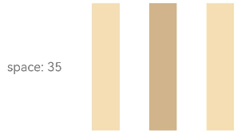


## Alignment of Layout Child Elements Along Cross Axis

In the layout container, use the **alignItems** attribute to set the alignment mode of child elements along the cross axis. The alignment performance is consistent across screens of various sizes. The value is of the [VerticalAlign Type](../reference/arkui-ts/ts-appendix-enums.md#verticalalign) type when the cross axis is in the vertical direction and the [HorizontalAlign](../reference/arkui-ts/ts-appendix-enums.md#horizontalalign) type when the cross axis is in the horizontal direction.

The layout container also provides the **alignSelf** attribute to control the alignment mode of a single child element along the main axis. This attribute has a higher priority than the **alignItems** attribute. This means that, if **alignSelf** is set, it will overwrite the **alignItems** setting on the corresponding child element.


### Horizontal Alignment of Layout Child Elements in \<Column> Container

  **Figure 5** Horizontal alignment of layout child elements in the \<Column> container 


- **HorizontalAlign.Start**: Child elements are left aligned horizontally.

  ```ts
  Column({}) {
    Column() {
    }.width('80%').height(50).backgroundColor(0xF5DEB3)

    Column() {
    }.width('80%').height(50).backgroundColor(0xD2B48C)

    Column() {
    }.width('80%').height(50).backgroundColor(0xF5DEB3)
  }.width('100%').alignItems(HorizontalAlign.Start).backgroundColor('rgb(242,242,242)')
  ```

  

- **HorizontalAlign.Center**: Child elements are center-aligned horizontally.

  ```ts
  Column({}) {
    Column() {
    }.width('80%').height(50).backgroundColor(0xF5DEB3)

    Column() {
    }.width('80%').height(50).backgroundColor(0xD2B48C)

    Column() {
    }.width('80%').height(50).backgroundColor(0xF5DEB3)
  }.width('100%').alignItems(HorizontalAlign.Center).backgroundColor('rgb(242,242,242)')
  ```

  

- **HorizontalAlign.End**: Child elements are right-aligned horizontally.

  ```ts
  Column({}) {
    Column() {
    }.width('80%').height(50).backgroundColor(0xF5DEB3)

    Column() {
    }.width('80%').height(50).backgroundColor(0xD2B48C)

    Column() {
    }.width('80%').height(50).backgroundColor(0xF5DEB3)
  }.width('100%').alignItems(HorizontalAlign.End).backgroundColor('rgb(242,242,242)')
  ```

  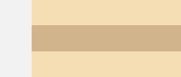


### Vertical Alignment of Layout Child Elements in \<Row> Container

  **Figure 6** Vertical alignment of layout child elements in \<Row> container 


- **VerticalAlign.Top**: Child elements are top-aligned vertically.

  ```ts
  Row({}) {
    Column() {
    }.width('20%').height(30).backgroundColor(0xF5DEB3)

    Column() {
    }.width('20%').height(30).backgroundColor(0xD2B48C)

    Column() {
    }.width('20%').height(30).backgroundColor(0xF5DEB3)
  }.width('100%').height(200).alignItems(VerticalAlign.Top).backgroundColor('rgb(242,242,242)')
  ```

  

- **VerticalAlign.Center**: Child elements are center-aligned vertically.

  ```ts
  Row({}) {
    Column() {
    }.width('20%').height(30).backgroundColor(0xF5DEB3)

    Column() {
    }.width('20%').height(30).backgroundColor(0xD2B48C)

    Column() {
    }.width('20%').height(30).backgroundColor(0xF5DEB3)
  }.width('100%').height(200).alignItems(VerticalAlign.Center).backgroundColor('rgb(242,242,242)')
  ```

  

- **VerticalAlign.Bottom**: Child elements are bottom-aligned vertically.

  ```ts
  Row({}) {
    Column() {
    }.width('20%').height(30).backgroundColor(0xF5DEB3)

    Column() {
    }.width('20%').height(30).backgroundColor(0xD2B48C)

    Column() {
    }.width('20%').height(30).backgroundColor(0xF5DEB3)
  }.width('100%').height(200).alignItems(VerticalAlign.Bottom).backgroundColor('rgb(242,242,242)')
  ```

  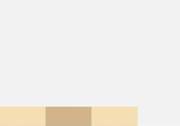


## Arrangement of Layout Child Elements Along Main Axis

In the layout container, you can use the **justifyContent** attribute to set the arrangement mode of child elements along the main axis. The arrangement may begin from the start point or end point of the main axis, or the space of the main axis can be evenly divided.


### In \<Column> Container

  **Figure 7** Arrangement of layout child elements along main axis in the \<Column> container


- **justifyContent(FlexAlign.Start)**: The items are aligned with each other toward the start edge of the container along the main axis.

  ```ts
  Column({}) {
    Column() {
    }.width('80%').height(50).backgroundColor(0xF5DEB3)

    Column() {
    }.width('80%').height(50).backgroundColor(0xD2B48C)

    Column() {
    }.width('80%').height(50).backgroundColor(0xF5DEB3)
  }.width('100%').height(300).backgroundColor('rgb(242,242,242)').justifyContent(FlexAlign.Start)
  ```

  

- **justifyContent(FlexAlign.Center)**: The elements are aligned with each other toward the center of the container along the main axis. The space between the first component and the main-start is the same as that between the last component and the main-end.

  ```ts
  Column({}) {
    Column() {
    }.width('80%').height(50).backgroundColor(0xF5DEB3)

    Column() {
    }.width('80%').height(50).backgroundColor(0xD2B48C)

    Column() {
    }.width('80%').height(50).backgroundColor(0xF5DEB3)
  }.width('100%').height(300).backgroundColor('rgb(242,242,242)').justifyContent(FlexAlign.Center)
  ```

  

- **justifyContent(FlexAlign.End)**: The elements are aligned with each other toward the end edge of the container along the main axis.

  ```ts
  Column({}) {
    Column() {
    }.width('80%').height(50).backgroundColor(0xF5DEB3)

    Column() {
    }.width('80%').height(50).backgroundColor(0xD2B48C)

    Column() {
    }.width('80%').height(50).backgroundColor(0xF5DEB3)
  }.width('100%').height(300).backgroundColor('rgb(242,242,242)').justifyContent(FlexAlign.End)
  ```

  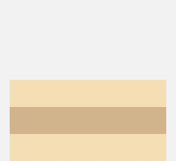

- **justifyContent(FlexAlign.Spacebetween)**: The elements are evenly distributed along the main axis. The space between any two adjacent elements is the same. The first element is aligned with the main-start, the last element is aligned with the main-end, and the remaining elements are distributed so that the space between any two adjacent elements is the same.

  ```ts
  Column({}) {
    Column() {
    }.width('80%').height(50).backgroundColor(0xF5DEB3)

    Column() {
    }.width('80%').height(50).backgroundColor(0xD2B48C)

    Column() {
    }.width('80%').height(50).backgroundColor(0xF5DEB3)
  }.width('100%').height(300).backgroundColor('rgb(242,242,242)').justifyContent(FlexAlign.SpaceBetween)
  ```

  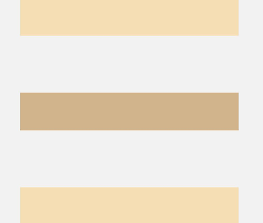

- **justifyContent(FlexAlign.SpaceAround)**: The elements are evenly distributed along the main axis. The space between any two adjacent elements is the same. The space between the first element and main-start, and that between the last element and cross-main are both half the size of the space between two adjacent elements.

  ```ts
  Column({}) {
    Column() {
    }.width('80%').height(50).backgroundColor(0xF5DEB3)

    Column() {
    }.width('80%').height(50).backgroundColor(0xD2B48C)

    Column() {
    }.width('80%').height(50).backgroundColor(0xF5DEB3)
  }.width('100%').height(300).backgroundColor('rgb(242,242,242)').justifyContent(FlexAlign.SpaceAround)
  ```

  

- **justifyContent(FlexAlign.SpaceEvenly)**: The elements are evenly distributed along the main axis. The space between the first element and main-start, the space between the last element and main-end, and the space between any two adjacent elements are the same.

  ```ts
  Column({}) {
    Column() {
    }.width('80%').height(50).backgroundColor(0xF5DEB3)

    Column() {
    }.width('80%').height(50).backgroundColor(0xD2B48C)

    Column() {
    }.width('80%').height(50).backgroundColor(0xF5DEB3)
  }.width('100%').height(300).backgroundColor('rgb(242,242,242)').justifyContent(FlexAlign.SpaceEvenly)
  ```

  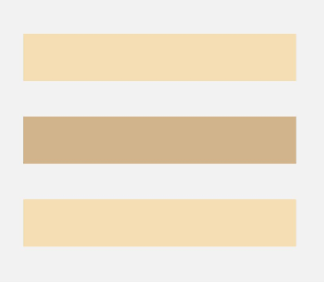


### In \<Row> Container

  **Figure 8** Arrangement of layout child elements along main axis in the \<Row> container 


- **justifyContent(FlexAlign.Start)**: The items are aligned with each other toward the start edge of the container along the main axis.

  ```ts
  Row({}) {
    Column() {
    }.width('20%').height(30).backgroundColor(0xF5DEB3)

    Column() {
    }.width('20%').height(30).backgroundColor(0xD2B48C)

    Column() {
    }.width('20%').height(30).backgroundColor(0xF5DEB3)
  }.width('100%').height(200).backgroundColor('rgb(242,242,242)').justifyContent(FlexAlign.Start)
  ```

  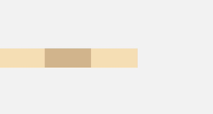

- **justifyContent(FlexAlign.Center)**: The elements are aligned with each other toward the center of the container along the main axis. The space between the first component and the main-start is the same as that between the last component and the main-end.

  ```ts
  Row({}) {
    Column() {
    }.width('20%').height(30).backgroundColor(0xF5DEB3)

    Column() {
    }.width('20%').height(30).backgroundColor(0xD2B48C)

    Column() {
    }.width('20%').height(30).backgroundColor(0xF5DEB3)
  }.width('100%').height(200).backgroundColor('rgb(242,242,242)').justifyContent(FlexAlign.Center)
  ```

  

- **justifyContent(FlexAlign.End)**: The elements are aligned with each other toward the end edge of the container along the main axis.

  ```ts
  Row({}) {
    Column() {
    }.width('20%').height(30).backgroundColor(0xF5DEB3)

    Column() {
    }.width('20%').height(30).backgroundColor(0xD2B48C)

    Column() {
    }.width('20%').height(30).backgroundColor(0xF5DEB3)
  }.width('100%').height(200).backgroundColor('rgb(242,242,242)').justifyContent(FlexAlign.End)
  ```

  

- **justifyContent(FlexAlign.Spacebetween)**: The elements are evenly distributed along the main axis. The space between any two adjacent elements is the same. The first element is aligned with the main-start, the last element is aligned with the main-end, and the remaining elements are distributed so that the space between any two adjacent elements is the same.

  ```ts
  Row({}) {
    Column() {
    }.width('20%').height(30).backgroundColor(0xF5DEB3)

    Column() {
    }.width('20%').height(30).backgroundColor(0xD2B48C)

    Column() {
    }.width('20%').height(30).backgroundColor(0xF5DEB3)
  }.width('100%').height(200).backgroundColor('rgb(242,242,242)').justifyContent(FlexAlign.SpaceBetween)
  ```

  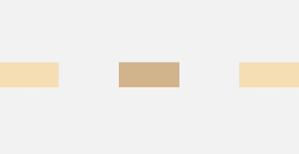

- **justifyContent(FlexAlign.SpaceAround)**: The elements are evenly distributed along the main axis. The space between any two adjacent elements is the same. The space between the first element and main-start, and that between the last element and cross-main are both half the size of the space between two adjacent elements.

  ```ts
  Row({}) {
    Column() {
    }.width('20%').height(30).backgroundColor(0xF5DEB3)

    Column() {
    }.width('20%').height(30).backgroundColor(0xD2B48C)

    Column() {
    }.width('20%').height(30).backgroundColor(0xF5DEB3)
  }.width('100%').height(200).backgroundColor('rgb(242,242,242)').justifyContent(FlexAlign.SpaceAround)
  ```

  

- **justifyContent(FlexAlign.SpaceEvenly)**: The elements are evenly distributed along the main axis. The space between the first element and main-start, the space between the last element and main-end, and the space between any two adjacent elements are the same.

  ```ts
  Row({}) {
    Column() {
    }.width('20%').height(30).backgroundColor(0xF5DEB3)

    Column() {
    }.width('20%').height(30).backgroundColor(0xD2B48C)

    Column() {
    }.width('20%').height(30).backgroundColor(0xF5DEB3)
  }.width('100%').height(200).backgroundColor('rgb(242,242,242)').justifyContent(FlexAlign.SpaceEvenly)
  ```

  


## Adaptive Stretching

In linear layout, adaptive stretching is achieved by using the [\<Blank>](../reference/arkui-ts/ts-basic-components-blank.md) component, which automatically fills the empty spaces in the container – **\<Row>** or **\<Column>** – along the main axis. Just add the width and height as a percentage, and then when the screen width and height change, adaptive stretching takes effect.


```ts
@Entry
@Component
struct BlankExample {
  build() {
    Column() {
      Row() {
        Text('Bluetooth').fontSize(18)
        Blank()
        Toggle({ type: ToggleType.Switch, isOn: true })
      }.backgroundColor(0xFFFFFF).borderRadius(15).padding({ left: 12 }).width('100%')
    }.backgroundColor(0xEFEFEF).padding(20).width('100%')
  }
}
```

  **Figure 9** Portrait mode 


  **Figure 10** Landscape mode 


## Adaptive Scaling

Adaptive scaling means that the size of a child component is automatically adjusted according to a preset ratio to fit into the container across devices of various screen sizes. In linear layout, adaptive scaling can be achieved using either of the following methods:


- When the container size is determined, use **layoutWeight** to set the weight of a child component during layout. The container space is then allocated along the main axis among the component and sibling components based on the set layout weight, and the component size setting is ignored.

  ```ts
  @Entry
  @Component
  struct layoutWeightExample {
    build() {
      Column() {
        Text('1:2:3').width('100%')
        Row() {
          Column() {
            Text('layoutWeight(1)')
              .textAlign(TextAlign.Center)
          }.layoutWeight(2).backgroundColor(0xF5DEB3).height('100%')

          Column() {
            Text('layoutWeight(2)')
              .textAlign(TextAlign.Center)
          }.layoutWeight(4).backgroundColor(0xD2B48C).height('100%')

          Column() {
            Text('layoutWeight(6)')
              .textAlign(TextAlign.Center)
          }.layoutWeight(6).backgroundColor(0xF5DEB3).height('100%')

        }.backgroundColor(0xffd306).height('30%')

        Text('2:5:3').width('100%')
        Row() {
          Column() {
            Text('layoutWeight(2)')
              .textAlign(TextAlign.Center)
          }.layoutWeight(2).backgroundColor(0xF5DEB3).height('100%')

          Column() {
            Text('layoutWeight(5)')
              .textAlign(TextAlign.Center)
          }.layoutWeight(5).backgroundColor(0xD2B48C).height('100%')

          Column() {
            Text('layoutWeight(3)')
              .textAlign(TextAlign.Center)
          }.layoutWeight(3).backgroundColor(0xF5DEB3).height('100%')
        }.backgroundColor(0xffd306).height('30%')
      }
    }
  }
  ```

    **Figure 11** Landscape mode 

  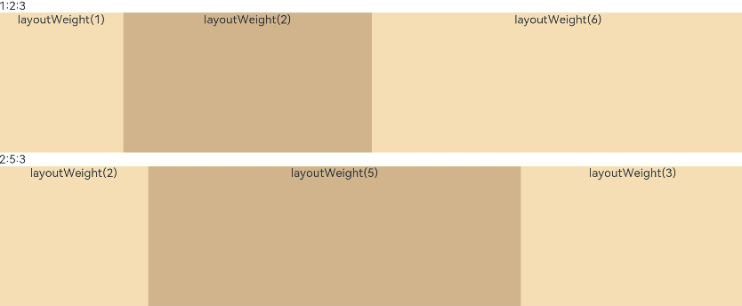

    **Figure 12** Portrait mode 

  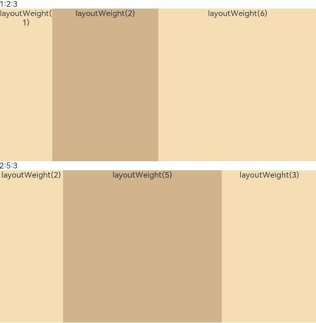

- When the container size is determined, set the width of a child component in percentage. The container space is then allocated among the component and sibling components based on the set percentage.

  ```ts
  @Entry
  @Component
  struct WidthExample {
    build() {
      Column() {
        Row() {
          Column() {
            Text('left width 20%')
              .textAlign(TextAlign.Center)
          }.width('20%').backgroundColor(0xF5DEB3).height('100%')

          Column() {
            Text('center width 50%')
              .textAlign(TextAlign.Center)
          }.width('50%').backgroundColor(0xD2B48C).height('100%')

          Column() {
            Text('right width 30%')
              .textAlign(TextAlign.Center)
          }.width('30%').backgroundColor(0xF5DEB3).height('100%')
        }.backgroundColor(0xffd306).height('30%')
      }
    }
  }
  ```

    **Figure 13** Landscape mode 

  

    **Figure 14** Portrait mode 

  


## Adaptive Extension

Adaptive extension allows users to drag the scrollbar to display the page content outside the screen. It is applicable to the scenario where the content extends beyond the viewport in linear layout. Below are the methods to implement adaptive extension in linear layout:

- [Add a scrollbar to a \<List> component](arkts-layout-development-create-list.md#adding-a-scrollbar): If the list items cannot be fully displayed on one screen, you can place the child elements in different components and employ a scrollbar to display them. Use the **scrollBar** attribute to set the scrollbar status and the **edgeEffect** attribute to set the rebound effect when the scrollbar has reached the edge.

- Use a **\<Scroll>** component: When one screen is not able to accommodate the full content, you can wrap a **\<Scroll>** component at the outer layer of the **\<Column>** or **\<Row>** component to implement.
    Example of using a **\<Scroll>** component in the vertical layout:

  ```ts
  @Entry
  @Component
  struct ScrollExample {
    scroller: Scroller = new Scroller();
    private arr: number[] = [0, 1, 2, 3, 4, 5, 6, 7, 8, 9];
  
    build() {
      Scroll(this.scroller) {
        Column() {
          ForEach(this.arr, (item) => {
            Text(item.toString())
              .width('90%')
              .height(150)
              .backgroundColor(0xFFFFFF)
              .borderRadius(15)
              .fontSize(16)
              .textAlign(TextAlign.Center)
              .margin({ top: 10 })
          }, item => item)
        }.width('100%')
      }
      .backgroundColor(0xDCDCDC)
      .scrollable(ScrollDirection.Vertical) // Vertical scrolling.
      .scrollBar(BarState.On) // The scrollbar is always displayed.
      .scrollBarColor(Color.Gray) // The scrollbar color is gray.
      .scrollBarWidth(10) // The scrollbar width is 10.
      .edgeEffect(EdgeEffect.Spring) // The spring effect is produced when the scrollbar has reached the edge.
    }
  }
  ```

  

  Example of using a **\<Scroll>** component in the horizontal layout:


  ```ts
  @Entry
  @Component
  struct ScrollExample {
    scroller: Scroller = new Scroller();
    private arr: number[] = [0, 1, 2, 3, 4, 5, 6, 7, 8, 9];
  
    build() {
      Scroll(this.scroller) {
        Row() {
          ForEach(this.arr, (item) => {
            Text(item.toString())
              .height('90%')
              .width(150)
              .backgroundColor(0xFFFFFF)
              .borderRadius(15)
              .fontSize(16)
              .textAlign(TextAlign.Center)
              .margin({ left: 10 })
          })
        }.height('100%')
      }
      .backgroundColor(0xDCDCDC)
      .scrollable(ScrollDirection.Horizontal) // Horizontal scrolling.
      .scrollBar(BarState.On) // The scrollbar is always displayed.
      .scrollBarColor(Color.Gray) // The scrollbar color is gray.
      .scrollBarWidth(10) // The scrollbar width is 10.
      .edgeEffect(EdgeEffect.Spring) // The spring effect is produced when the scrollbar has reached the edge.
    }
  }
  ```

  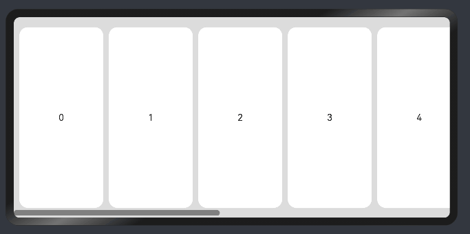
