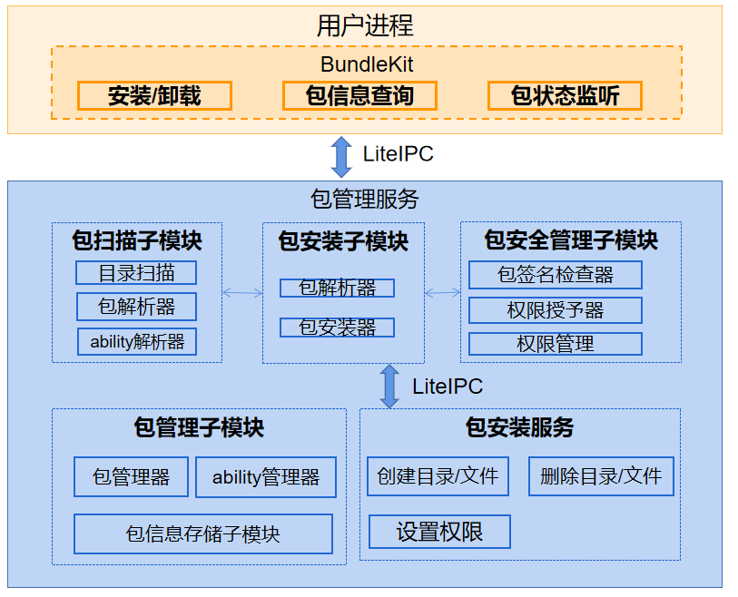

# 包管理子系统<a name="ZH-CN_TOPIC_0000001061838370"></a>

-   [简介](#section11660541593)
-   [目录](#section1464106163817)
-   [编译构建/使用方法](#section1464106163819)
-   [使用说明](#section1464106163820)
-   [相关仓](#section93061357133720)

## 简介<a name="section11660541593"></a>

**包管理子系统**是OpenHarmony为开发者提供的应用安装包的管理框架，该模块实现的功能包括了应用的安装，卸载，升级，应用信息的查询和应用状态监听。当前仅支持在OpenHarmony的轻量级设备上运行，支持的设备包括穿戴手表，Hi3516DV300等。包管理子系统由如下模块组成：

**图 1**  包管理子系统架构图<a name="fig1047932418305"></a>  


-   **BundleKit**：是包管理服务对外提供的接口，有安装/卸载接口、包信息查询接口、包状态变化监听接口。
-   **包扫描子模块**：用来解析本地预制或者安装的安装包，提取里面的各种信息，供管理子模块进行管理，持久化。

-   **包安装子模块**：负责安装，卸载，升级一个包。
-   **包安装服务**：一个单独进程的用于创建删除安装目录，具有较高的权限。

-   **包管理子模块**：管理安装包相关的信息，存储持久化包信息。

-   **包安全管理子模块**：签名检查、权限授予、权限管理。

## 目录<a name="section1464106163817"></a>

```
/foundation/bundlemanager/bundle_framework_lite
     ├── frameworks
     │      └── bundle_lite                # 管理BundleKit与包管理服务通信的客户端代码
     ├── interfaces
     │      ├── kits
     │      │     └── bundle_lite         # BundleKit为开发者提供的接口
     │      └── inner_api
     │             └── bundlemgr_lite      # BundleKit实现的核心代码，及包管理服务为其它子系统提供的接口
     ├── services
     │      └── bundlemgr_lite             # 包管理服务的实现代码
     └── utils
             └── bundle_lite                # 包管理服务实现中用到的工具性的代码
```

## 编译构建/使用方法 <a name="section1464106163819"></a>

-  当前OpenHarmony使用hb工具进行编译，需在代码的根目录下执行，编译的命令如下：
```
hb set                    # 选择需要烧录的设备类型
hb build -f               # 编译全量的代码
hb build -T bundlems      # 编译单个模块
```
-  使用bm工具可以安装指定的hap包（以hispark\_taurus为例，bm工具在系统构建后放置在out/hispark\_taurus/ipcamera\_hispark\_taurus/dev\_tools/bin下）：

```
./bin/bm install -p /nfs/xxxx.hap      # 安装xxxx.hap
```
-  使用bm工具查询应用的信息，具体执行命令如下：

```
./bin/bm dump -n 包名     # 查询对应包名的应用的包信息
./bin/bm dump -l          # 查询所有应用的包信息
```

## 使用说明 <a name="section1464106163820"></a>

-   包管理服务为BundleMs，服务运行于foudation进程中；
-   系统启动后，BundleMs会随系统启动而启动；
-   BundleMs注册到sa\_manager中，sa\_manager运行于foundation进程中，sa\_manager为BundleMs创建线程运行环境。具体创建BundleMs服务的方式以及使用该服务的方式，可参考系统服务框架子系统；


## 相关仓<a name="section93061357133720"></a>

[ability\_ability\_lite](https://gitee.com/openharmony/ability_ability_lite/blob/master/README_zh.md)

**bundlemanager\_bundle\_framework\_lite**

