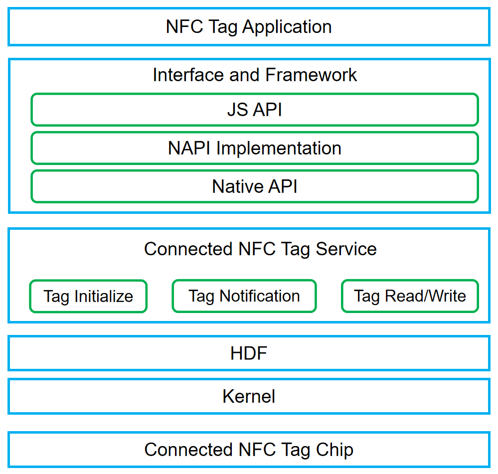

# Connected NFC Tag<a name="EN-US_TOPIC_0000001133207781"></a>

-   [Introduction](#section13587125816351)
-   [Architecture](#section13587185873516)
-   [Directory Structure](#section161941989596)
-   [Constraints](#section119744591305)
-   [Usage](#section1312121216216)
-   [Repositories Involved](#section1371113476307)

## Introduction<a name="section13587125816351"></a>

Near-field communication \(NFC\) is a non-contact identification and interconnection technology for short-distance wireless communication between mobile devices, consumer electronic products, PCs, and smart devices.

For the devices has connected nfc tag chip, this component provides tag reading and writing.

## Architecture<a name="section13587185873516"></a>

**Figure  1**  Connected NFC Tag Architecture<a name="fig4460722185514"></a>  




## Directory Structure<a name="section161941989596"></a>

```
/foundation/communication/connected_nfc_tag
├── interfaces                        # Interface
│   └── inner_api                     # System inner interface
├── frameworks                        # Framework interface
│   └── js                            # Implementation of JS API
│       └── napi                      # Napi implementation of JS API
├── services                          # Service implementation
├── test                              # Test code
├── BUILD.gn                          # Build entry
└── bundle.json                       # Component description
```

## Constraints<a name="section119744591305"></a>

-   Devices must has the connected nfc tag chip.

## Usage<a name="section1312121216216"></a>

-  connected nfc tag reading and writing.

Please reference: docs/zh-cn/application-dev/reference/apis/js-apis-connectedTag.md

## Repositories Involved<a name="section1371113476307"></a>

hmf/communication/connected_nfc_tag

