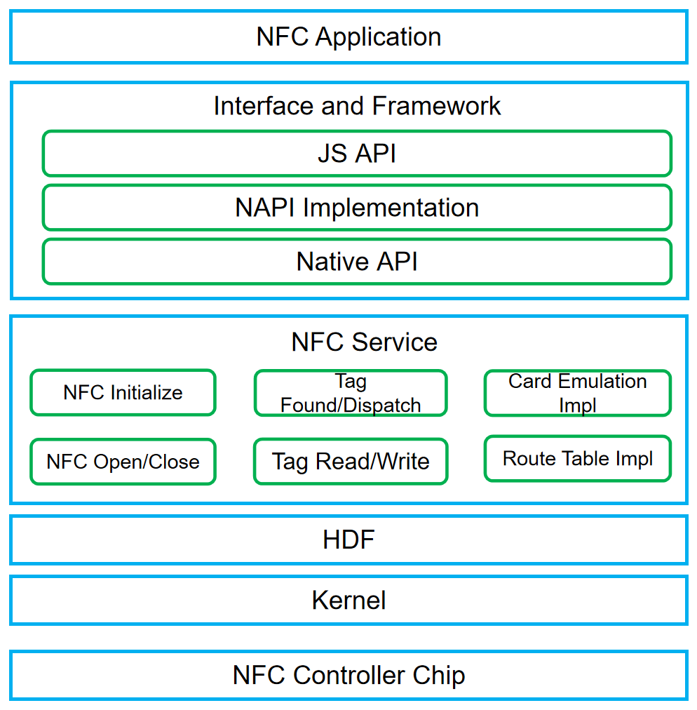

# NFC<a name="EN-US_TOPIC_0000001133207781"></a>

-   [Introduction](#section13587125816351)
-   [Architecture](#section13587185873516)
-   [Directory Structure](#section161941989596)
-   [Constraints](#section119744591305)
-   [Usage](#section1312121216216)
-   [Repositories Involved](#section1371113476307)

## Introduction<a name="section13587125816351"></a>

Near-field communication \(NFC\) is a non-contact identification and interconnection technology for short-distance wireless communication between mobile devices, consumer electronic products, PCs, and smart devices.

NFC service provides NFC switch control, NFC tag discovery and dispatch, NFC tag reading and writing, NFC card emulation functions.

## Architecture<a name="section13587185873516"></a>

**Figure  1**  NFC architecture<a name="fig4460722185514"></a>




## Directory Structure<a name="section161941989596"></a>

```
/foundation/communication/nfc
├── interfaces                        # Interface
│   └── inner_api                     # System inner interface
├── frameworks                        # Framework interface
│   └── js                            # Implementation of JS API
│       └── napi                      # Napi implementation of JS API
├── services                          # Service implementation
├── test                              # Test code
├── BUILD.gn                          # Build entry
└── bundle.json                       # Component description
```

## Constraints<a name="section119744591305"></a>

-   The device must have an NFC controller chip to use NFC services.

## Usage<a name="section1312121216216"></a>

-  NFC switch

Please reference: docs/zh-cn/application-dev/reference/apis/js-apis-nfcController.md。

-  NFC tag reading and writing

Please reference: docs/zh-cn/application-dev/reference/apis/js-apis-nfcTag.md。

-  NFC card emulation

Please reference: docs/zh-cn/application-dev/reference/apis/js-apis-cardEmulation.md。

## Repositories Involved<a name="section1371113476307"></a>

hmf/communication/nfc

