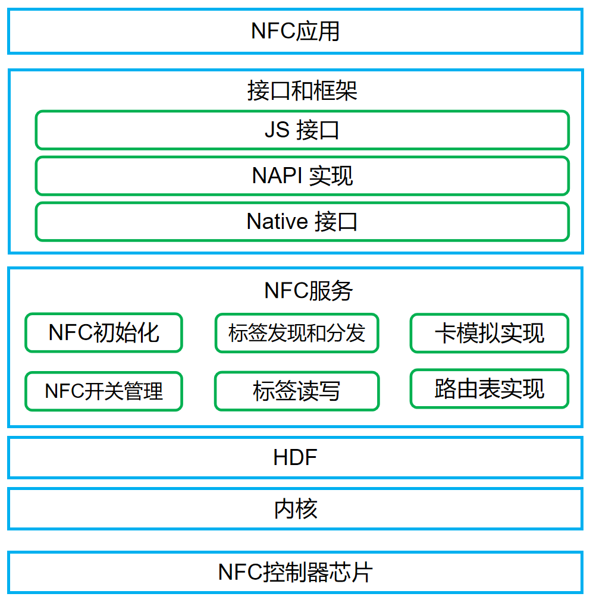

# NFC组件<a name="ZH-CN_TOPIC_0000001124412109"></a>

-   [简介](#section11660541593)
-   [系统架构](#section342962219551)
-   [目录](#section161941989596)
-   [约束](#section119744591305)
-   [说明](#section1312121216216)
-   [使用说明](#section129654513264)
-   [相关仓](#section1371113476307)

## 简介<a name="section11660541593"></a>

近距离无线通信技术\(Near Field Communication，NFC\) ，是一种非接触式识别和互联技术，可以在移动设备、消费类电子产品、PC和智能设备间进行近距离无线通信。

NFC服务提供NFC开关控制、NFC标签发现和分发、NFC标签读写、NFC卡模拟等业务功能。

## 系统架构<a name="section342962219551"></a>

**图 1**  NFC服务组件架构图<a name="fig444313176464"></a>  




<a name="table1716174620235"></a>
<table><thead align="left"></thead>
<tbody></tbody>
</table>

## 目录<a name="section161941989596"></a>

```
/foundation/communication/nfc
├── interfaces                        # 接口
│   └── inner_api                     # 系统内部件间接口
├── frameworks                        # 框架层接口
│   └── js                            # JS API的实现
│       └── napi                      # 通过napi封装的JS接口代码实现
├── services                          # NFC服务进程的实现
├── test                              # 测试代码
├── BUILD.gn                          # 编译入口
└── bundle.json                       # 部件描述文件
```

## 约束<a name="section119744591305"></a>

设备必须具备NFC控制器芯片，才能使用NFC服务。

## 说明<a name="section1312121216216"></a>

### 使用说明<a name="section129654513264"></a>

-  NFC开关

参考开发指南: docs/zh-cn/application-dev/reference/apis/js-apis-nfcController.md。

-  NFC标签读写

参考开发指南: docs/zh-cn/application-dev/reference/apis/js-apis-nfcTag.md。

-  NFC卡模拟

参考开发指南: docs/zh-cn/application-dev/reference/apis/js-apis-cardEmulation.md。

## 相关仓<a name="section1371113476307"></a>

hmf/communication/nfc

