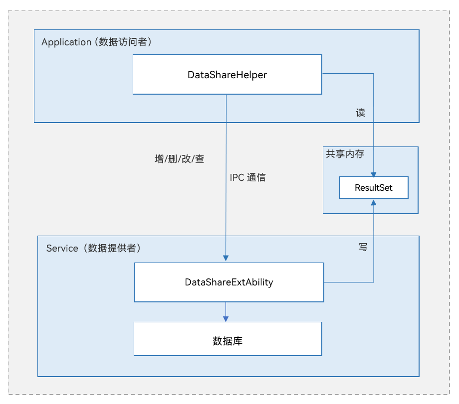

# 数据共享部件

## 简介

**数据共享（Data Share）** 部件提供了向其他应用共享以及管理其数据的方法，支持同个设备上不同应用之间的数据共享。

在许多应用场景中都需要用到数据共享，比如将电话簿、短信、媒体库中的数据共享给其他应用等。当然，不是所有的数据都允许其他应用访问，比如帐号、密码等；有些数据也只允许其他应用查询而不允许其删改，比如短信等。所以对于各种数据共享场景，DataShare这样一个安全、便捷的可以跨应用的数据共享机制是十分必需的。

数据提供者无需进行繁琐的封装，可直接使用DataShare框架向其他应用共享数据；对数据访问方来说，因DataShare的访问方式不会因数据提供的方式而不同，只需要学习和使用一套接口即可，大大减少了学习时间和开发难度。

### 基本概念

- 数据提供方

提供数据及实现相关业务的应用程序，也称为生产者或服务端。

- 数据访问方

访问数据提供方所提供的数据或业务的应用程序，也称为消费者或客户端。

- 数据集

用户要插入的数据集合，可以是一条或多条数据。数据集以键值对的形式存在，键为字符串类型，值支持数字、字符串、布尔值、无符号整型数组等多种数据类型。

- 结果集

用户查询之后的结果集合，其提供了灵活的数据访问方式，以便用户获取各项数据。

- 谓词

用户访问数据库中的数据所使用的筛选条件，经常被应用在更新数据、删除数据和查询数据等场景。

**图 1**  逻辑架构图



- DataShareExtAbility模块为数据提供方，实现跨应用数据共享的相关业务。
- DataShareHelper模块为数据访问方，提供各种访问数据的接口，包括增删改查等。
- 数据访问方与提供方通过IPC进行通信，数据提供方可以通过数据库实现，也可以通过其他数据存储方式实现。
- ResultSet模块通过共享内存实现，用于存储查询数据得到的结果集，并提供了遍历结果集的方法。

## 目录

```
/foundation/distributeddatamgr/data_share
├── frameworks                                   # 框架代码
│   ├── js
│   │   └── napi                                 # NAPI代码存放目录
│   │       ├── common                           # 公用NAPI代码存放目录
│   │       ├── dataShare                        # 客户端NAPI代码存放目录
│   │       ├── datashare_ext_ability            # DataShareExtentionAbility模块JS代码存放目录
│   │       └── datashare_ext_ability_context    # DataShareExtentionAbilityContext模块JS代码存放目录
│   └── native
│       ├── common
│       ├── consumer
│       └── provider
└── interfaces                                   # 对外接口存放目录
    └── inner_api                                # 对内部子系统暴露的头文件存放目录
        ├── common                               # 公用对内部子系统暴露的头文件存放目录
        ├── consumer                             # 客户端对内部子系统暴露的头文件存放目录
        └── provider                             # 服务端对内部子系统暴露的头文件存放目录
```


## 约束

- DataShare受到数据提供方所使用数据库的一些限制。例如支持的数据模型、Key的长度、Value的长度、每个应用程序支持同时打开数据库的最大数量等，都会受到使用的数据库的限制。
- 因DataShare内部实现依赖于IPC通信，所以数据集、谓词、结果集等的载荷受到IPC通信的约束与限制。

## 相关仓

[分布式数据管理子系统](https://gitee.com/openharmony/docs/blob/master/zh-cn/readme/分布式数据管理子系统.md)

[**distributeddatamgr_data_share**](https://gitee.com/openharmony/distributeddatamgr_data_share/blob/master/README_zh.md)