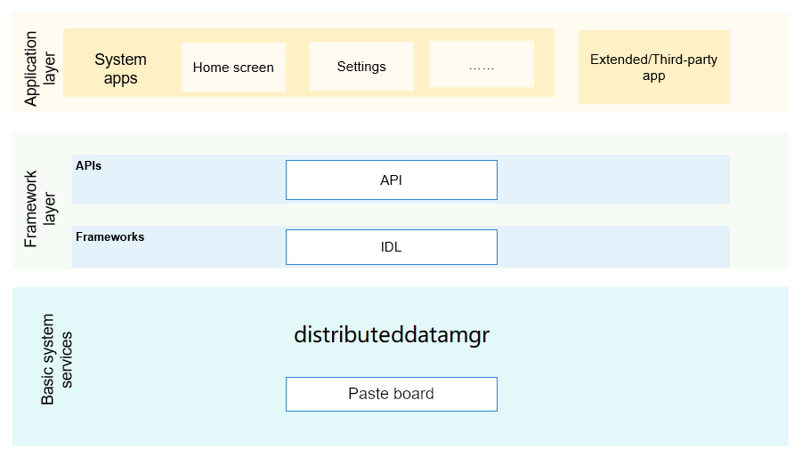

# pasteBoardService

## Introduction

​     As a functional component of the stray subsystem, the clipboard service provides the ability to manage the system clipboard and supports the system copy and paste functions. The system clipboard supports package text, hypertext, URIs and other content operations.

**picture 1**  Subsystem Architecture Diagram


​		The clipboard service provides functions that support application developers to use clipboard-related services conveniently and efficiently. Its main components include clipboard management client and clipboard service. The clipboard management client is responsible for clipboard interface management, providing clipboard northbound JS API to applications; creating clipboard data on the application framework side, requesting clipboard SA to perform clipboard creation, deletion, query, text conversion, configuration, etc. The clipboard service is responsible for clipboard event management, manages the life cycle of clipboard SA (startup, destruction, multi-user, etc.); executes application requests, notifies clipboard data management, and returns the results to the clipboard management client.


## Directory Structure

```
/foundation/distributeddatamgr/pasteboard
├── etc         # Configuration files for the processes contained in the component
├── figures     # Framework diagram
├── framework   # innerKit interface
├── interfaces  # The interface code provided by the component externally
│   └── kits    # Interface provided to the application
├── profile     # Configuration files for system services contained in the component
├── services    # clipboard service implementation
│    └── core   # Core code implementation
│    └── test   # native test code
│    └── zidl   # Cross-process communication code implementation
├── utils       # Tests or services use mocked data
└──README.md    # Instructions for use
```

## illustrate

### Interface Description

**list 1**   PasteBoard open main method

<table><thead align="left"><tr id="row143351854201012"><th class="cellrowborder" valign="top" width="50%" id="mcps1.2.3.1.1"><p id="p103351154121010"><a name="p103351154121010"></a><a name="p103351154121010"></a>interface name</p>
</th>
<th class="cellrowborder" valign="top" width="50%" id="mcps1.2.3.1.2"><p id="p1033585416105"><a name="p1033585416105"></a><a name="p1033585416105"></a>describe</p>
</th>
</tr>
</thead>
<tbody><tr id="row204321219393"><td class="cellrowborder" valign="top" width="50%" headers="mcps1.2.3.1.1 "><p id="p1893413268144"><a name="p1893413268144"></a><a name="p1893413268144"></a>createHtmlData(htmlText: string): PasteData;</p>
</td>
<td class="cellrowborder" valign="top" width="50%" headers="mcps1.2.3.1.2 "><p id="p18761104812149"><a name="p18761104812149"></a><a name="p18761104812149"></a>Create a PasteData object of type MIMETYPE_TEXT_HTML for HTML type data</p>
</td>
</tr>
<tr id="row13335054111018"><td class="cellrowborder" valign="top" width="50%" headers="mcps1.2.3.1.1 "><p id="p12832214151418"><a name="p12832214151418"></a><a name="p12832214151418"></a>createWantData(want: Want): PasteData;</p>
</td>
<td class="cellrowborder" valign="top" width="50%" headers="mcps1.2.3.1.2 "><p id="p3335145451011"><a name="p3335145451011"></a><a name="p3335145451011"></a>Create a PasteData object of type MIMETYPE_TEXT_WANT for data of type want</p>
</td>
</tr>
<tr id="row204321219393"><td class="cellrowborder" valign="top" width="50%" headers="mcps1.2.3.1.1 "><p id="p1893413268144"><a name="p1893413268144"></a><a name="p1893413268144"></a>createPlainTextData(text: string): PasteData</p>
</td>
<td class="cellrowborder" valign="top" width="50%" headers="mcps1.2.3.1.2 "><p id="p18761104812149"><a name="p18761104812149"></a><a name="p18761104812149"></a>Create a PasteData object of type MIMETYPE_TEXT_PLAIN for plain text data</p>
</td>
</tr>
<tr id="row204321219393"><td class="cellrowborder" valign="top" width="50%" headers="mcps1.2.3.1.1 "><p id="p1893413268144"><a name="p1893413268144"></a><a name="p1893413268144"></a>createUriData(uri: string): PasteData;</p>
</td>
<td class="cellrowborder" valign="top" width="50%" headers="mcps1.2.3.1.2 "><p id="p18761104812149"><a name="p18761104812149"></a><a name="p18761104812149"></a>Create a PasteData object of type MIMETYPE_TEXT_URI for data of type URI</p>
</td>
</tr>
<tr id="row204321219393"><td class="cellrowborder" valign="top" width="50%" headers="mcps1.2.3.1.1 "><p id="p1893413268144"><a name="p1893413268144"></a><a name="p1893413268144"></a>createHtmlTextRecord(htmlText: string): PasteDataRecord;</p>
</td>
<td class="cellrowborder" valign="top" width="50%" headers="mcps1.2.3.1.2 "><p id="p18761104812149"><a name="p18761104812149"></a><a name="p18761104812149"></a>Create a PasteDataRecord object of type RecordMIMETYPE_TEXT_HTML for hypertext type data</p>
</td>
</tr>
<tr id="row204321219393"><td class="cellrowborder" valign="top" width="50%" headers="mcps1.2.3.1.1 "><p id="p1893413268144"><a name="p1893413268144"></a><a name="p1893413268144"></a>createWantRecord(want: Want): PasteDataRecord;</p>
</td>
<td class="cellrowborder" valign="top" width="50%" headers="mcps1.2.3.1.2 "><p id="p18761104812149"><a name="p18761104812149"></a><a name="p18761104812149"></a>Create a PasteDataRecord object of type MIMETYPE_TEXT_WANT for data of type want</p>
</td>
</tr>
<tr id="row204321219393"><td class="cellrowborder" valign="top" width="50%" headers="mcps1.2.3.1.1 "><p id="p1893413268144"><a name="p1893413268144"></a><a name="p1893413268144"></a>createPlainTextRecord(text: string): PasteDataRecord;</p>
</td>
<td class="cellrowborder" valign="top" width="50%" headers="mcps1.2.3.1.2 "><p id="p18761104812149"><a name="p18761104812149"></a><a name="p18761104812149"></a>Create a PasteDataRecord object of type MIMETYPE_TEXT_PLAIN for plain text data</p>
</td>
</tr>
<tr id="row204321219393"><td class="cellrowborder" valign="top" width="50%" headers="mcps1.2.3.1.1 "><p id="p1893413268144"><a name="p1893413268144"></a><a name="p1893413268144"></a>createUriRecord(uri: string): PasteDataRecord;</p>
</td>
<td class="cellrowborder" valign="top" width="50%" headers="mcps1.2.3.1.2 "><p id="p18761104812149"><a name="p18761104812149"></a><a name="p18761104812149"></a>Create a PasteDataRecord object of type MIMETYPE_TEXT_URI for data of type URI</p>
</td>
</tr>
<tr id="row204321219393"><td class="cellrowborder" valign="top" width="50%" headers="mcps1.2.3.1.1 "><p id="p1893413268144"><a name="p1893413268144"></a><a name="p1893413268144"></a>getSystemPasteboard(): SystemPasteboard</p>
</td>
<td class="cellrowborder" valign="top" width="50%" headers="mcps1.2.3.1.2 "><p id="p18761104812149"><a name="p18761104812149"></a><a name="p18761104812149"></a>Get system clipboard</p>
</td>
</tr>
</tbody>
</table>


**list 2**  SystemPasteboard open main method

<table><thead align="left"><tr id="row143351854201012"><th class="cellrowborder" valign="top" width="50%" id="mcps1.2.3.1.1"><p id="p103351154121010"><a name="p103351154121010"></a><a name="p103351154121010"></a>interface name</p>
</th>
<th class="cellrowborder" valign="top" width="50%" id="mcps1.2.3.1.2"><p id="p1033585416105"><a name="p1033585416105"></a><a name="p1033585416105"></a>describe</p>
</th>
</tr>
</thead>
<tbody><tr id="row204321219393"><td class="cellrowborder" valign="top" width="50%" headers="mcps1.2.3.1.1 "><p id="p1893413268144"><a name="p1893413268144"></a><a name="p1893413268144"></a>on(type:'update', callback: () => void): void;</p>
</td>
<td class="cellrowborder" valign="top" width="50%" headers="mcps1.2.3.1.2 "><p id="p18761104812149"><a name="p18761104812149"></a><a name="p18761104812149"></a>Callback called when the open pasteboard content changes</p>
</td>
</tr>
<tr id="row13335054111018"><td class="cellrowborder" valign="top" width="50%" headers="mcps1.2.3.1.1 "><p id="p12832214151418"><a name="p12832214151418"></a><a name="p12832214151418"></a>off(type: 'update', callback?: () => void): void</p>
</td>
<td class="cellrowborder" valign="top" width="50%" headers="mcps1.2.3.1.2 "><p id="p3335145451011"><a name="p3335145451011"></a><a name="p3335145451011"></a>Callback called when the content of the pasteboard is closed</p>
</td>
</tr>
<tr id="row204321219393"><td class="cellrowborder" valign="top" width="50%" headers="mcps1.2.3.1.1 "><p id="p1893413268144"><a name="p1893413268144"></a><a name="p1893413268144"></a>clear(callback: AsyncCallback<void>): void</p>
</td>
<td class="cellrowborder" valign="top" width="50%" headers="mcps1.2.3.1.2 "><p id="p18761104812149"><a name="p18761104812149"></a><a name="p18761104812149"></a>clear clipboard</p>
</td>
</tr>
<tr id="row204321219393"><td class="cellrowborder" valign="top" width="50%" headers="mcps1.2.3.1.1 "><p id="p1893413268144"><a name="p1893413268144"></a><a name="p1893413268144"></a>clear(): Promise<void>;</p>
</td>
<td class="cellrowborder" valign="top" width="50%" headers="mcps1.2.3.1.2 "><p id="p18761104812149"><a name="p18761104812149"></a><a name="p18761104812149"></a>clear clipboard</p>
</td>
</tr>
<tr id="row204321219393"><td class="cellrowborder" valign="top" width="50%" headers="mcps1.2.3.1.1 "><p id="p1893413268144"><a name="p1893413268144"></a><a name="p1893413268144"></a>getPasteData(callback: AsyncCallback&lt;PasteData&gt;): void</p>
</td>
<td class="cellrowborder" valign="top" width="50%" headers="mcps1.2.3.1.2 "><p id="p18761104812149"><a name="p18761104812149"></a><a name="p18761104812149"></a>Get system clipboard data object</p>
</td>
</tr>
<tr id="row204321219393"><td class="cellrowborder" valign="top" width="50%" headers="mcps1.2.3.1.1 "><p id="p1893413268144"><a name="p1893413268144"></a><a name="p1893413268144"></a>getPasteData():Promise&lt;PasteData&gt;</p>
</td>
<td class="cellrowborder" valign="top" width="50%" headers="mcps1.2.3.1.2 "><p id="p18761104812149"><a name="p18761104812149"></a><a name="p18761104812149"></a>Get system clipboard data object</p>
</td>
</tr>
<tr id="row204321219393"><td class="cellrowborder" valign="top" width="50%" headers="mcps1.2.3.1.1 "><p id="p1893413268144"><a name="p1893413268144"></a><a name="p1893413268144"></a>hasPasteData(callback: AsyncCallback&lt;boolean&gt:void;</p>
</td>
<td class="cellrowborder" valign="top" width="50%" headers="mcps1.2.3.1.2 "><p id="p18761104812149"><a name="p18761104812149"></a><a name="p18761104812149"></a>Check if there is content in the pasteboard</p>
</td>
</tr>
<tr id="row204321219393"><td class="cellrowborder" valign="top" width="50%" headers="mcps1.2.3.1.1 "><p id="p1893413268144"><a name="p1893413268144"></a><a name="p1893413268144"></a>hasPasteData(): Promise&lt;boolean&gt;</p>
</td>
<td class="cellrowborder" valign="top" width="50%" headers="mcps1.2.3.1.2 "><p id="p18761104812149"><a name="p18761104812149"></a><a name="p18761104812149"></a>Check if there is content in the pasteboard</p>
</td>
</tr>
<tr id="row204321219393"><td class="cellrowborder" valign="top" width="50%" headers="mcps1.2.3.1.1 "><p id="p1893413268144"><a name="p1893413268144"></a><a name="p1893413268144"></a>setPasteData(data: PasteData, callback: AsyncCallback&lt;void&gt:void;</p>
</td>
<td class="cellrowborder" valign="top" width="50%" headers="mcps1.2.3.1.2 "><p id="p18761104812149"><a name="p18761104812149"></a><a name="p18761104812149"></a>Write PasteData to the pasteboard</p>
</td>
</tr>
<tr id="row204321219393"><td class="cellrowborder" valign="top" width="50%" headers="mcps1.2.3.1.1 "><p id="p1893413268144"><a name="p1893413268144"></a><a name="p1893413268144"></a>setPasteData(data: PasteData): Promise&lt;void&gt;</p>
</td>
<td class="cellrowborder" valign="top" width="50%" headers="mcps1.2.3.1.2 "><p id="p18761104812149"><a name="p18761104812149"></a><a name="p18761104812149"></a>Write PasteData to the pasteboard</p>
</td>
</tr>
</tbody>
</table>


**list 3**  PasteData open main method

<table><thead align="left"><tr id="row143351854201012"><th class="cellrowborder" valign="top" width="50%" id="mcps1.2.3.1.1"><p id="p103351154121010"><a name="p103351154121010"></a><a name="p103351154121010"></a>interface name</p>
</th>
<th class="cellrowborder" valign="top" width="50%" id="mcps1.2.3.1.2"><p id="p1033585416105"><a name="p1033585416105"></a><a name="p1033585416105"></a>describe</p>
</th>
</tr>
</thead>
<tbody><tr id="row204321219393"><td class="cellrowborder" valign="top" width="50%" headers="mcps1.2.3.1.1 "><p id="p1893413268144"><a name="p1893413268144"></a><a name="p1893413268144"></a>addHtmlRecord(htmlText: string): void;</p>
</td>
<td class="cellrowborder" valign="top" width="50%" headers="mcps1.2.3.1.2 "><p id="p18761104812149"><a name="p18761104812149"></a><a name="p18761104812149"></a>Add the HTML text record to the PasteData object and update the MIME type to PasteData#MIMETYPE_TEXT_HTML in the DataProperty.</p>
</td>
</tr>
<tr id="row13335054111018"><td class="cellrowborder" valign="top" width="50%" headers="mcps1.2.3.1.1 "><p id="p12832214151418"><a name="p12832214151418"></a><a name="p12832214151418"></a>addWantRecord(want: Want): void;</p>
</td>
<td class="cellrowborder" valign="top" width="50%" headers="mcps1.2.3.1.2 "><p id="p3335145451011"><a name="p3335145451011"></a><a name="p3335145451011"></a>Add want record to PasteData object and update MIME type to PasteData#MIMETYPE_TEXT_WANT in DataProperty</p>
</td>
</tr>
<tr id="row204321219393"><td class="cellrowborder" valign="top" width="50%" headers="mcps1.2.3.1.1 "><p id="p1893413268144"><a name="p1893413268144"></a><a name="p1893413268144"></a>addRecord(record: PasteDataRecord): void;</p>
</td>
<td class="cellrowborder" valign="top" width="50%" headers="mcps1.2.3.1.2 "><p id="p18761104812149"><a name="p18761104812149"></a><a name="p18761104812149"></a>Add PasteRecord to paste data object and update MIME type in data attribute</p>
</td>
</tr>
<tr id="row204321219393"><td class="cellrowborder" valign="top" width="50%" headers="mcps1.2.3.1.1 "><p id="p1893413268144"><a name="p1893413268144"></a><a name="p1893413268144"></a>addTextRecord(text: string): void;;</p>
</td>
<td class="cellrowborder" valign="top" width="50%" headers="mcps1.2.3.1.2 "><p id="p18761104812149"><a name="p18761104812149"></a><a name="p18761104812149"></a>Add plain text records to PasteData object and update MIME type to PasteData#MIMETYPE_TEXT_PLAIN in DataProperty</p>
</td>
</tr>
<tr id="row204321219393"><td class="cellrowborder" valign="top" width="50%" headers="mcps1.2.3.1.1 "><p id="p1893413268144"><a name="p1893413268144"></a><a name="p1893413268144"></a>addUriRecord(uri: string): void;</p>
</td>
<td class="cellrowborder" valign="top" width="50%" headers="mcps1.2.3.1.2 "><p id="p18761104812149"><a name="p18761104812149"></a><a name="p18761104812149"></a>Add URI record to PasteData object and update MIME type to PasteData#MIMETYPE_TEXT_URI in DataProperty</p>
</td>
</tr>
<tr id="row204321219393"><td class="cellrowborder" valign="top" width="50%" headers="mcps1.2.3.1.1 "><p id="p1893413268144"><a name="p1893413268144"></a><a name="p1893413268144"></a>getMimeTypes(): Array&lt;string&gt;</p>
</td>
<td class="cellrowborder" valign="top" width="50%" headers="mcps1.2.3.1.2 "><p id="p18761104812149"><a name="p18761104812149"></a><a name="p18761104812149"></a>MIME type of everything on the pasteboard</p>
</td>
</tr>
<tr id="row204321219393"><td class="cellrowborder" valign="top" width="50%" headers="mcps1.2.3.1.1 "><p id="p1893413268144"><a name="p1893413268144"></a><a name="p1893413268144"></a>getPrimaryHtml(): string;</p>
</td>
<td class="cellrowborder" valign="top" width="50%" headers="mcps1.2.3.1.2 "><p id="p18761104812149"><a name="p18761104812149"></a><a name="p18761104812149"></a>HTML text of the main record in the PasteData object</p>
</td>
</tr>
<tr id="row204321219393"><td class="cellrowborder" valign="top" width="50%" headers="mcps1.2.3.1.1 "><p id="p1893413268144"><a name="p1893413268144"></a><a name="p1893413268144"></a>getPrimaryWant(): Want;</p>
</td>
<td class="cellrowborder" valign="top" width="50%" headers="mcps1.2.3.1.2 "><p id="p18761104812149"><a name="p18761104812149"></a><a name="p18761104812149"></a>The want of the master record in the PasteData object</p>
</td>
</tr>
<tr id="row204321219393"><td class="cellrowborder" valign="top" width="50%" headers="mcps1.2.3.1.1 "><p id="p1893413268144"><a name="p1893413268144"></a><a name="p1893413268144"></a>getPrimaryMimeType(): string;</p>
</td>
<td class="cellrowborder" valign="top" width="50%" headers="mcps1.2.3.1.2 "><p id="p18761104812149"><a name="p18761104812149"></a><a name="p18761104812149"></a>The MIME type of the master record in the PasteData object</p>
</td>
</tr>
<tr id="row204321219393"><td class="cellrowborder" valign="top" width="50%" headers="mcps1.2.3.1.1 "><p id="p1893413268144"><a name="p1893413268144"></a><a name="p1893413268144"></a>getPrimaryUri(): string;</p>
</td>
<td class="cellrowborder" valign="top" width="50%" headers="mcps1.2.3.1.2 "><p id="p18761104812149"><a name="p18761104812149"></a><a name="p18761104812149"></a>URI of the master record in the PasteData object</p>
</td>
</tr>
<tr id="row204321219393"><td class="cellrowborder" valign="top" width="50%" headers="mcps1.2.3.1.1 "><p id="p1893413268144"><a name="p1893413268144"></a><a name="p1893413268144"></a>getProperty(): PasteDataProperty;</p>
</td>
<td class="cellrowborder" valign="top" width="50%" headers="mcps1.2.3.1.2 "><p id="p18761104812149"><a name="p18761104812149"></a><a name="p18761104812149"></a>Get the properties of the clipboard data object</p>
</td>
</tr>
<tr id="row204321219393"><td class="cellrowborder" valign="top" width="50%" headers="mcps1.2.3.1.1 "><p id="p1893413268144"><a name="p1893413268144"></a><a name="p1893413268144"></a>getRecordAt(index: number): PasteDataRecord;</p>
</td>
<td class="cellrowborder" valign="top" width="50%" headers="mcps1.2.3.1.2 "><p id="p18761104812149"><a name="p18761104812149"></a><a name="p18761104812149"></a>records based on the specified index</p>
</td>
</tr>
<tr id="row204321219393"><td class="cellrowborder" valign="top" width="50%" headers="mcps1.2.3.1.1 "><p id="p1893413268144"><a name="p1893413268144"></a><a name="p1893413268144"></a>getRecordCount(): number;</p>
</td>
<td class="cellrowborder" valign="top" width="50%" headers="mcps1.2.3.1.2 "><p id="p18761104812149"><a name="p18761104812149"></a><a name="p18761104812149"></a>Number of records in PasteData object</p>
</td>
</tr>
<tr id="row204321219393"><td class="cellrowborder" valign="top" width="50%" headers="mcps1.2.3.1.1 "><p id="p1893413268144"><a name="p1893413268144"></a><a name="p1893413268144"></a>hasMimeType(mimeType: string): boolean;</p>
</td>
<td class="cellrowborder" valign="top" width="50%" headers="mcps1.2.3.1.2 "><p id="p18761104812149"><a name="p18761104812149"></a><a name="p18761104812149"></a>Checks if data of the specified MIME type exists in the DataProperty</p>
</td>
</tr>
<tr id="row204321219393"><td class="cellrowborder" valign="top" width="50%" headers="mcps1.2.3.1.1 "><p id="p1893413268144"><a name="p1893413268144"></a><a name="p1893413268144"></a>removeRecordAt(index: number): boolean;</p>
</td>
<td class="cellrowborder" valign="top" width="50%" headers="mcps1.2.3.1.2 "><p id="p18761104812149"><a name="p18761104812149"></a><a name="p18761104812149"></a>Delete records based on specified index</p>
</td>
</tr>
<tr id="row204321219393"><td class="cellrowborder" valign="top" width="50%" headers="mcps1.2.3.1.1 "><p id="p1893413268144"><a name="p1893413268144"></a><a name="p1893413268144"></a>replaceRecordAt(index: number, record: PasteDataRecord): boolean;</p>
</td>
<td class="cellrowborder" valign="top" width="50%" headers="mcps1.2.3.1.2 "><p id="p18761104812149"><a name="p18761104812149"></a><a name="p18761104812149"></a>Replace the specified record with a new record</p>
</td>
</tr>
</tbody>
</table>


**list 4**  PasteDataRecord open main method

<table><thead align="left"><tr id="row143351854201012"><th class="cellrowborder" valign="top" width="50%" id="mcps1.2.3.1.1"><p id="p103351154121010"><a name="p103351154121010"></a><a name="p103351154121010"></a>interface name</p>
</th>
<th class="cellrowborder" valign="top" width="50%" id="mcps1.2.3.1.2"><p id="p1033585416105"><a name="p1033585416105"></a><a name="p1033585416105"></a>describe</p>
</th>
</tr>
</thead>
<tbody><tr id="row204321219393"><td class="cellrowborder" valign="top" width="50%" headers="mcps1.2.3.1.1 "><p id="p1893413268144"><a name="p1893413268144"></a><a name="p1893413268144"></a>convertToText(callback: AsyncCallback&lt;string&gt;): void;</p>
</td>
<td class="cellrowborder" valign="top" width="50%" headers="mcps1.2.3.1.2 "><p id="p18761104812149"><a name="p18761104812149"></a><a name="p18761104812149"></a>Convert PasteData to text content</p>
</td>
</tr>
<tr id="row13335054111018"><td class="cellrowborder" valign="top" width="50%" headers="mcps1.2.3.1.1 "><p id="p12832214151418"><a name="p12832214151418"></a><a name="p12832214151418"></a>convertToText():  Promise&lt;void&gt;</p>
</td>
<td class="cellrowborder" valign="top" width="50%" headers="mcps1.2.3.1.2 "><p id="p3335145451011"><a name="p3335145451011"></a><a name="p3335145451011"></a>Convert PasteData to text content</p>
</td>
</tr>
</tbody>
</table>


**list 5**  PasteDataProperty Parameter Description

<table><thead align="left"><tr id="row143351854201012"><th class="cellrowborder" valign="top" width="30%" id="mcps1.2.3.1.1"><p id="p103351154121010"><a name="p103351154121010"></a><a name="p103351154121010"></a>name</p>
</th>
<th class="cellrowborder" valign="top" width="30%" id="mcps1.2.3.1.2"><p id="p1033585416105"><a name="p1033585416105"></a><a name="p1033585416105"></a>type</p>
</th>
<th class="cellrowborder" valign="top" width="40%" id="mcps1.2.3.1.3"><p id="p1033585416105"><a name="p1033585416105"></a><a name="p1033585416105"></a>illustrate</p>
</th>
</tr>
</thead>
<tbody><tr id="row204321219393"><td class="cellrowborder" valign="top" width="30%" headers="mcps1.2.3.1.1 "><p id="p1893413268144"><a name="p1893413268144"></a><a name="p1893413268144"></a>additions{[key:string]}</p>
</td>
<td class="cellrowborder" valign="top" width="30%" headers="mcps1.2.3.1.2 "><p id="p18761104812149"><a name="p18761104812149"></a><a name="p18761104812149"></a>object</p>
</td>
<td class="cellrowborder" valign="top" width="40%" headers="mcps1.2.3.1.3 "><p id="p18761104812149"><a name="p18761104812149"></a><a name="p18761104812149"></a>Additional property data key-value pair</p>
</td>
</tr>
<tr id="row204321219393"><td class="cellrowborder" valign="top" width="30%" headers="mcps1.2.3.1.1 "><p id="p1893413268144"><a name="p1893413268144"></a><a name="p1893413268144"></a>mimeTypes</p>
</td>
<td class="cellrowborder" valign="top" width="30%" headers="mcps1.2.3.1.2 "><p id="p18761104812149"><a name="p18761104812149"></a><a name="p18761104812149"></a>Array<string></p>
</td>
<td class="cellrowborder" valign="top" width="40%" headers="mcps1.2.3.1.3 "><p id="p18761104812149"><a name="p18761104812149"></a><a name="p18761104812149"></a>Distinct MIME types for all records in PasteData</p>
</td>
</tr>
<tr id="row204321219393"><td class="cellrowborder" valign="top" width="30%" headers="mcps1.2.3.1.1 "><p id="p1893413268144"><a name="p1893413268144"></a><a name="p1893413268144"></a>tag</p>
</td>
<td class="cellrowborder" valign="top" width="30%" headers="mcps1.2.3.1.2 "><p id="p18761104812149"><a name="p18761104812149"></a><a name="p18761104812149"></a>string</p>
</td>
<td class="cellrowborder" valign="top" width="40%" headers="mcps1.2.3.1.3 "><p id="p18761104812149"><a name="p18761104812149"></a><a name="p18761104812149"></a>User-defined labels for PasteData objects</p>
</td>
</tr>
<tr id="row204321219393"><td class="cellrowborder" valign="top" width="30%" headers="mcps1.2.3.1.1 "><p id="p1893413268144"><a name="p1893413268144"></a><a name="p1893413268144"></a>timestamp</p>
</td>
<td class="cellrowborder" valign="top" width="30%" headers="mcps1.2.3.1.2 "><p id="p18761104812149"><a name="p18761104812149"></a><a name="p18761104812149"></a>number</p>
</td>
<td class="cellrowborder" valign="top" width="40%" headers="mcps1.2.3.1.3 "><p id="p18761104812149"><a name="p18761104812149"></a><a name="p18761104812149"></a>Timestamp indicating when the data was written to the system clipboard.</p>
</td>
</tr>
<tr id="row204321219393"><td class="cellrowborder" valign="top" width="30%" headers="mcps1.2.3.1.1 "><p id="p1893413268144"><a name="p1893413268144"></a><a name="p1893413268144"></a>localOnly</p>
</td>
<td class="cellrowborder" valign="top" width="30%" headers="mcps1.2.3.1.2 "><p id="p18761104812149"><a name="p18761104812149"></a><a name="p18761104812149"></a> boolean</p>
</td>
<td class="cellrowborder" valign="top" width="40%" headers="mcps1.2.3.1.3 "><p id="p18761104812149"><a name="p18761104812149"></a><a name="p18761104812149"></a>Check if PasteData is set for local access only.</p>
</td>
</tr>
</tbody>
</table>


### Instructions for use

Clipboard module usage example：

```
// import module
import pasteboard from '@ohos.pasteboard'
//text copy
console.log('Get SystemPasteboard')
var systemPasteboard = pasteboard.getSystemPasteboard()
systemPasteboard.clear()
        
var textData = 'Hello World!'
console.log('createPlainTextData = ' + textData)
var pasteData = pasteboard.createPlainTextData(textData)
        
console.log('Writes PasteData to the pasteboard')
systemPasteboard.setPasteData(pasteData)
        
console.log('Checks there is content in the pasteboard')
assert.equal(systemPasteboard.hasPasteData(), true)
        
console.log('Checks the number of records')
pasteData = systemPasteboard.getPasteData()
assert.equal(pasteData.getRecordCount(), 1)
        
console.log('Checks the pasteboard content')
assert.equal(pasteData.getPrimaryText(), textData)
        
console.log('Checks there is a MIMETYPE_TEXT_PLAIN MIME type of data')
assert.equal(pasteData.hasMimeType(MIMETYPE_TEXT_PLAIN), true)
assert.equal(pasteData.getPrimaryMimeType(), MIMETYPE_TEXT_PLAIN)

//clipboard change listener
console.log('Off the content changes')
var systemPasteboard = pasteboard.getSystemPasteboard()
systemPasteboard.off(contentChanges)
systemPasteboard.clear()
        
var textData = 'Hello World!'
console.log('createUriData = ' + textData)
var pasteData = pasteboard.createUriData(textData)
        
console.log('Writes PasteData to the pasteboard')
systemPasteboard.setPasteData(pasteData)
        
console.log('Checks there is content in the pasteboard')
assert.equal(systemPasteboard.hasPasteData(), true)
        
console.log('Checks the number of records')
pasteData = systemPasteboard.getPasteData()
assert.equal(pasteData.getRecordCount(), 1)
        
console.log('On the content changes')
systemPasteboard.on(contentChanges)
        
console.log('Removes the Record')
assert.equal(pasteData.removeRecordAt(0), true)
        
console.log('Writes PasteData to the pasteboard')
systemPasteboard.setPasteData(pasteData)
        
console.log('Checks the number of records')
pasteData = systemPasteboard.getPasteData()
assert.equal(pasteData.getRecordCount(), 0)
        
console.log('Checks there is  no content in the pasteboard')
assert.equal(systemPasteboard.hasPasteData(), false)
        
var textDataNew = 'Hello World!-New'
console.log('createUriData = ' + textDataNew)
var pasteData = pasteboard.createUriData(textDataNew)
        
console.log('Writes PasteData to the pasteboard')
systemPasteboard.setPasteData(pasteData)
        
console.log('Checks there is content in the pasteboard')
assert.equal(systemPasteboard.hasPasteData(), true)
        
console.log('Checks the number of records')
pasteData = systemPasteboard.getPasteData()
assert.equal(pasteData.getRecordCount(), 1)
        
console.log('Checks the pasteboard content')
assert.equal(pasteData.getRecordAt(0).plainText, textDataNew)

```


## Related warehouse

**Distributed Data Management subsystem**

[distributeddatamgr\_pasteboard](https://gitee.com/openharmony/distributeddatamgr_pasteboard)

