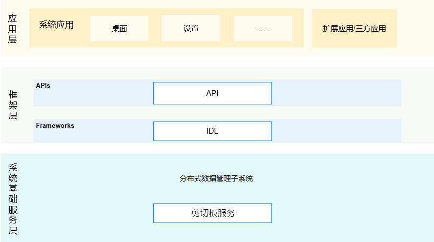

# 剪贴板服务

## 简介

剪贴板服务作为杂散子系统的功能组件，提供管理系统剪贴板的能力，为系统复制、粘贴功能提供支持。系统剪切板支持包文本、超本文、URIs等内容操作。

**图 1**  子系统架构图


剪贴板服务，提供支撑应用开发者方便、高效的使用剪贴板相关业务的功能。其主要组件包括剪贴板管理客户端和剪贴板服务。剪贴板管理客户端负责剪贴板接口管理，提供剪贴板北向JS API给应用；在应用框架侧创建剪贴板数据、请求剪贴板SA执行剪贴板的新建、删除、查询、转换文本、配置等。剪贴板服务负责剪贴板事件管理，管理剪贴板SA的生命周期（启动、销毁、多用户等）；执行应用请求，通知剪贴板数据管理，并将结果返回给剪贴板管理客户端。


## 目录

```
/foundation/distributeddatamgr/pasteboard
├── etc                      # 组件包含的进程的配置文件
├── figures                  # 构架图
├── framework                # innerKit接口
├── interfaces               # 组件对外提供的接口代码
│   └── kits                 # 对应用提供的接口
├── profile                  # 组件包含的系统服务的配置文件
├── services                 # 剪贴板服务实现
│    └── core                # 核心代码实现
│    └── test                # native测试代码
│    └── zidl                # 跨进程通信代码实现
├── utils                    # 测试或服务使用mock的数据
└──README_zh.md              # 使用说明
```

## 说明

### 接口说明

**表 1**   PasteBoard开放的主要方法

<table><thead align="left"><tr id="row143351854201012"><th class="cellrowborder" valign="top" width="50%" id="mcps1.2.3.1.1"><p id="p103351154121010"><a name="p103351154121010"></a><a name="p103351154121010"></a>接口名</p>
</th>
<th class="cellrowborder" valign="top" width="50%" id="mcps1.2.3.1.2"><p id="p1033585416105"><a name="p1033585416105"></a><a name="p1033585416105"></a>描述</p>
</th>
</tr>
</thead>
<tbody>
<tr id="row204321219393"><td class="cellrowborder" valign="top" width="50%" headers="mcps1.2.3.1.1 "><p id="p1893413268144"><a name="p1893413268144"></a>createData(mimeType: string, value: ValueType): PasteData;</p>
</td>
<td class="cellrowborder" valign="top" width="50%" headers="mcps1.2.3.1.2 "><p id="p18761104812149"><a name="p18761104812149"></a><a name="p18761104812149"></a>用MIME类型和值创建一个PasteData 对象</p>
</td>
</tr>
<tr id="row204321219393"><td class="cellrowborder" valign="top" width="50%" headers="mcps1.2.3.1.1 "><p id="p1893413268144"><a name="p1893413268144"></a>createRecord(mimeType: string, value: ValueType): PasteDataRecord;</p>
</td>
<td class="cellrowborder" valign="top" width="50%" headers="mcps1.2.3.1.2 "><p id="p18761104812149"><a name="p18761104812149"></a><a name="p18761104812149"></a>用MIME类型和值创建一个PasteDataRecord对象</p>
</td>
</tr>
<tr id="row204321219393"><td class="cellrowborder" valign="top" width="50%" headers="mcps1.2.3.1.1 "><p id="p1893413268144"><a name="p1893413268144"></a>createHtmlData(htmlText: string): PasteData;</p>
</td>
<td class="cellrowborder" valign="top" width="50%" headers="mcps1.2.3.1.2 "><p id="p18761104812149"><a name="p18761104812149"></a><a name="p18761104812149"></a>为HTML类型的数据创建一个MIMETYPE_TEXT_HTML类型的PasteData 对象</p>
</td>
</tr>
<tr id="row13335054111018"><td class="cellrowborder" valign="top" width="50%" headers="mcps1.2.3.1.1 "><p id="p12832214151418"><a name="p12832214151418"></a><a name="p12832214151418"></a>createWantData(want: Want): PasteData;</p>
</td>
<td class="cellrowborder" valign="top" width="50%" headers="mcps1.2.3.1.2 "><p id="p3335145451011"><a name="p3335145451011"></a><a name="p3335145451011"></a>为want类型的数据创建一个MIMETYPE_TEXT_WANT类型的PasteData对象</p>
</td>
</tr>
<tr id="row204321219393"><td class="cellrowborder" valign="top" width="50%" headers="mcps1.2.3.1.1 "><p id="p1893413268144"><a name="p1893413268144"></a><a name="p1893413268144"></a>createPlainTextData(text: string): PasteData;</p>
</td>
<td class="cellrowborder" valign="top" width="50%" headers="mcps1.2.3.1.2 "><p id="p18761104812149"><a name="p18761104812149"></a><a name="p18761104812149"></a>为纯文本类型的数据创建一个MIMETYPE_TEXT_PLAIN类型的PasteData 对象</p>
</td>
</tr>
<tr id="row204321219393"><td class="cellrowborder" valign="top" width="50%" headers="mcps1.2.3.1.1 "><p id="p1893413268144"><a name="p1893413268144"></a><a name="p1893413268144"></a>createUriData(uri: string): PasteData;</p>
</td>
<td class="cellrowborder" valign="top" width="50%" headers="mcps1.2.3.1.2 "><p id="p18761104812149"><a name="p18761104812149"></a><a name="p18761104812149"></a>为URI类型的数据创建一个MIMETYPE_TEXT_URI类型的PasteData 对象</p></td>
</tr>
<tr id="row204321219393"><td class="cellrowborder" valign="top" width="50%" headers="mcps1.2.3.1.1 "><p id="p1893413268144"><a name="p1893413268144"></a><a name="p1893413268144"></a>createHtmlTextRecord(htmlText: string): PasteDataRecord;</p>
</td>
<td class="cellrowborder" valign="top" width="50%" headers="mcps1.2.3.1.2 "><p id="p18761104812149"><a name="p18761104812149"></a><a name="p18761104812149"></a>为超文本类型的数据创建一个RecordMIMETYPE_TEXT_HTML类型的PasteDataRecord对象</p>
</td>
</tr>
<tr id="row204321219393"><td class="cellrowborder" valign="top" width="50%" headers="mcps1.2.3.1.1 "><p id="p1893413268144"><a name="p1893413268144"></a><a name="p1893413268144"></a>createWantRecord(want: Want): PasteDataRecord;</p>
</td>
<td class="cellrowborder" valign="top" width="50%" headers="mcps1.2.3.1.2 "><p id="p18761104812149"><a name="p18761104812149"></a><a name="p18761104812149"></a>为want类型的数据创建一个MIMETYPE_TEXT_WANT类型的PasteDataRecord对象</p>
</td>
</tr>
<tr id="row204321219393"><td class="cellrowborder" valign="top" width="50%" headers="mcps1.2.3.1.1 "><p id="p1893413268144"><a name="p1893413268144"></a><a name="p1893413268144"></a>createPlainTextRecord(text: string): PasteDataRecord;</p>
</td>
<td class="cellrowborder" valign="top" width="50%" headers="mcps1.2.3.1.2 "><p id="p18761104812149"><a name="p18761104812149"></a><a name="p18761104812149"></a>为纯文本类型的数据创建一个MIMETYPE_TEXT_PLAIN类型的PasteDataRecord对象</p>
</td>
</tr>
<tr id="row204321219393"><td class="cellrowborder" valign="top" width="50%" headers="mcps1.2.3.1.1 "><p id="p1893413268144"><a name="p1893413268144"></a><a name="p1893413268144"></a>createUriRecord(uri: string): PasteDataRecord;</p>
</td>
<td class="cellrowborder" valign="top" width="50%" headers="mcps1.2.3.1.2 "><p id="p18761104812149"><a name="p18761104812149"></a><a name="p18761104812149"></a>为URI类型的数据创建一个MIMETYPE_TEXT_URI类型的PasteDataRecord对象</p></td>
</tr>
<tr id="row204321219393"><td class="cellrowborder" valign="top" width="50%" headers="mcps1.2.3.1.1 "><p id="p1893413268144"><a name="p1893413268144"></a><a name="p1893413268144"></a>getSystemPasteboard(): SystemPasteboard;</p>
</td>
<td class="cellrowborder" valign="top" width="50%" headers="mcps1.2.3.1.2 "><p id="p18761104812149"><a name="p18761104812149"></a><a name="p18761104812149"></a>获取系统剪贴板</p>
</td>
</tr>
</tbody>
</table>


**表 2**  SystemPasteboard开放的主要方法

<table><thead align="left"><tr id="row143351854201012"><th class="cellrowborder" valign="top" width="50%" id="mcps1.2.3.1.1"><p id="p103351154121010"><a name="p103351154121010"></a><a name="p103351154121010"></a>接口名</p>
</th>
<th class="cellrowborder" valign="top" width="50%" id="mcps1.2.3.1.2"><p id="p1033585416105"><a name="p1033585416105"></a><a name="p1033585416105"></a>描述</p>
</th>
</tr>
</thead>
<tbody>
<tr id="row204321219393"><td class="cellrowborder" valign="top" width="50%" headers="mcps1.2.3.1.1 "><p id="p1893413268144"><a name="p1893413268144"></a>clearData(callback: AsyncCallback&lt;void&gt;): void;</p>
</td>
<td class="cellrowborder" valign="top" width="50%" headers="mcps1.2.3.1.2 "><p id="p18761104812149"><a name="p18761104812149"></a>清除剪贴板</p>
</td>
</tr>
<tr id="row204321219393"><td class="cellrowborder" valign="top" width="50%" headers="mcps1.2.3.1.1 "><p id="p1893413268144"><a name="p1893413268144"></a>clearData(): Promise&lt;void&gt;;</p>
</td>
<td class="cellrowborder" valign="top" width="50%" headers="mcps1.2.3.1.2 "><p id="p18761104812149"><a name="p18761104812149"></a>清除剪贴板</p>
</td>
</tr>
<tr id="row204321219393"><td class="cellrowborder" valign="top" width="50%" headers="mcps1.2.3.1.1 "><p id="p1893413268144"><a name="p1893413268144"></a>getData(callback: AsyncCallback&lt;PasteData&gt;): void;</p>
</td>
<td class="cellrowborder" valign="top" width="50%" headers="mcps1.2.3.1.2 "><p id="p18761104812149"><a name="p18761104812149"></a>从系统剪贴板获取pastedata对象</p>
</td>
</tr>
<tr id="row204321219393"><td class="cellrowborder" valign="top" width="50%" headers="mcps1.2.3.1.1 "><p id="p1893413268144"><a name="p1893413268144"></a>getData(): Promise&lt;PasteData&gt;;</p>
</td>
<td class="cellrowborder" valign="top" width="50%" headers="mcps1.2.3.1.2 "><p id="p18761104812149"><a name="p18761104812149"></a>从系统剪贴板获取pastedata对象</p>
</td>
</tr>
<tr id="row204321219393"><td class="cellrowborder" valign="top" width="50%" headers="mcps1.2.3.1.1 "><p id="p1893413268144"><a name="p1893413268144"></a>hasData(callback: AsyncCallback&lt;boolean&gt;): void;</p>
</td>
<td class="cellrowborder" valign="top" width="50%" headers="mcps1.2.3.1.2 "><p id="p18761104812149"><a name="p18761104812149"></a>判断系统剪贴板中的内容</p>
</td>
</tr>
<tr id="row204321219393"><td class="cellrowborder" valign="top" width="50%" headers="mcps1.2.3.1.1 "><p id="p1893413268144"><a name="p1893413268144"></a>hasData(): Promise&lt;boolean&gt;;</p>
</td>
<td class="cellrowborder" valign="top" width="50%" headers="mcps1.2.3.1.2 "><p id="p18761104812149"><a name="p18761104812149"></a>判断系统剪贴板中的内容</p>
</td>
</tr>
<tr id="row204321219393"><td class="cellrowborder" valign="top" width="50%" headers="mcps1.2.3.1.1 "><p id="p1893413268144"><a name="p1893413268144"></a>setData(data: PasteData, callback: AsyncCallback&lt;void&gt;): void;</p>
</td>
<td class="cellrowborder" valign="top" width="50%" headers="mcps1.2.3.1.2 "><p id="p18761104812149"><a name="p18761104812149"></a>向系统剪贴板写入PasteData</p>
</td>
</tr>
<tr id="row204321219393"><td class="cellrowborder" valign="top" width="50%" headers="mcps1.2.3.1.1 "><p id="p1893413268144"><a name="p1893413268144"></a>setData(data: PasteData): Promise&lt;void&gt;;</p>
</td>
<td class="cellrowborder" valign="top" width="50%" headers="mcps1.2.3.1.2 "><p id="p18761104812149"><a name="p18761104812149"></a>向系统剪贴板写入PasteData</p>
</td>
</tr>
<tr id="row204321219393"><td class="cellrowborder" valign="top" width="50%" headers="mcps1.2.3.1.1 "><p id="p1893413268144"><a name="p1893413268144"></a>on(type:'update', callback: () => void): void;</p>
</td>
<td class="cellrowborder" valign="top" width="50%" headers="mcps1.2.3.1.2 "><p id="p18761104812149"><a name="p18761104812149"></a>打开粘贴板内容更改时调用的回调</p>
</td>
</tr>
<tr id="row13335054111018"><td class="cellrowborder" valign="top" width="50%" headers="mcps1.2.3.1.1 "><p id="p12832214151418"><a name="p12832214151418"></a><a name="p12832214151418"></a>off(type: 'update', callback?: () => void): void;</p>
</td>
<td class="cellrowborder" valign="top" width="50%" headers="mcps1.2.3.1.2 "><p id="p3335145451011"><a name="p3335145451011"></a><a name="p3335145451011"></a>关闭粘贴板内容更改时调用的回调</p>
</td>
</tr>
<tr id="row204321219393"><td class="cellrowborder" valign="top" width="50%" headers="mcps1.2.3.1.1 "><p id="p1893413268144"><a name="p1893413268144"></a><a name="p1893413268144"></a>clear(callback: AsyncCallback&lt;void&gt;): void;</p>
</td>
<td class="cellrowborder" valign="top" width="50%" headers="mcps1.2.3.1.2 "><p id="p18761104812149"><a name="p18761104812149"></a><a name="p18761104812149"></a>清除剪贴板</p>
</td>
</tr>
<tr id="row204321219393"><td class="cellrowborder" valign="top" width="50%" headers="mcps1.2.3.1.1 "><p id="p1893413268144"><a name="p1893413268144"></a><a name="p1893413268144"></a>clear(): Promise&lt;void&gt;;</p>
</td>
<td class="cellrowborder" valign="top" width="50%" headers="mcps1.2.3.1.2 "><p id="p18761104812149"><a name="p18761104812149"></a><a name="p18761104812149"></a>清除剪贴板</p>
</td>
</tr>
<tr id="row204321219393"><td class="cellrowborder" valign="top" width="50%" headers="mcps1.2.3.1.1 "><p id="p1893413268144"><a name="p1893413268144"></a><a name="p1893413268144"></a>getPasteData(callback: AsyncCallback&lt;PasteData&gt;): void;</p>
</td>
<td class="cellrowborder" valign="top" width="50%" headers="mcps1.2.3.1.2 "><p id="p18761104812149"><a name="p18761104812149"></a><a name="p18761104812149"></a>获取系统剪贴板数据对象</p>
</td>
</tr>
<tr id="row204321219393"><td class="cellrowborder" valign="top" width="50%" headers="mcps1.2.3.1.1 "><p id="p1893413268144"><a name="p1893413268144"></a><a name="p1893413268144"></a>getPasteData():Promise&lt;PasteData&gt;;</p>
</td>
<td class="cellrowborder" valign="top" width="50%" headers="mcps1.2.3.1.2 "><p id="p18761104812149"><a name="p18761104812149"></a><a name="p18761104812149"></a>获取系统剪贴板数据对象</p>
</td>
</tr>
<tr id="row204321219393"><td class="cellrowborder" valign="top" width="50%" headers="mcps1.2.3.1.1 "><p id="p1893413268144"><a name="p1893413268144"></a><a name="p1893413268144"></a>hasPasteData(callback: AsyncCallback&lt;boolean&gt;:void;</p>
</td>
<td class="cellrowborder" valign="top" width="50%" headers="mcps1.2.3.1.2 "><p id="p18761104812149"><a name="p18761104812149"></a><a name="p18761104812149"></a>检查粘贴板中是否有内容</p>
</td>
</tr>
<tr id="row204321219393"><td class="cellrowborder" valign="top" width="50%" headers="mcps1.2.3.1.1 "><p id="p1893413268144"><a name="p1893413268144"></a><a name="p1893413268144"></a>hasPasteData(): Promise&lt;boolean&gt;;</p>
</td>
<td class="cellrowborder" valign="top" width="50%" headers="mcps1.2.3.1.2 "><p id="p18761104812149"><a name="p18761104812149"></a><a name="p18761104812149"></a>检查粘贴板中是否有内容</p>
</td>
</tr>
<tr id="row204321219393"><td class="cellrowborder" valign="top" width="50%" headers="mcps1.2.3.1.1 "><p id="p1893413268144"><a name="p1893413268144"></a><a name="p1893413268144"></a>setPasteData(data: PasteData, callback: AsyncCallback&lt;void&gt;:void;</p>
</td>
<td class="cellrowborder" valign="top" width="50%" headers="mcps1.2.3.1.2 "><p id="p18761104812149"><a name="p18761104812149"></a><a name="p18761104812149"></a>将 PasteData 写入粘贴板</p>
</td>
</tr>
<tr id="row204321219393"><td class="cellrowborder" valign="top" width="50%" headers="mcps1.2.3.1.1 "><p id="p1893413268144"><a name="p1893413268144"></a><a name="p1893413268144"></a>setPasteData(data: PasteData): Promise&lt;void&gt;;</p>
</td>
<td class="cellrowborder" valign="top" width="50%" headers="mcps1.2.3.1.2 "><p id="p18761104812149"><a name="p18761104812149"></a><a name="p18761104812149"></a>将 PasteData 写入粘贴板</p>
</td>
</tr>
</tbody>
</table>


**表 3**  PasteData开放的主要方法

<table><thead align="left"><tr id="row143351854201012"><th class="cellrowborder" valign="top" width="50%" id="mcps1.2.3.1.1"><p id="p103351154121010"><a name="p103351154121010"></a><a name="p103351154121010"></a>接口名</p>
</th>
<th class="cellrowborder" valign="top" width="50%" id="mcps1.2.3.1.2"><p id="p1033585416105"><a name="p1033585416105"></a><a name="p1033585416105"></a>描述</p>
</th>
</tr>
</thead>
<tbody>
<tr id="row204321219393"><td class="cellrowborder" valign="top" width="50%" headers="mcps1.2.3.1.1 "><p id="p1893413268144"><a name="p1893413268144"></a>addRecord(mimeType: string, value: ValueType): void;</p>
</td>
<td class="cellrowborder" valign="top" width="50%" headers="mcps1.2.3.1.2 "><p id="p18761104812149"><a name="p18761104812149"></a>将mimeType和对应值添加到 PasteData 对象中</p>
</td>
</tr>
<tr id="row204321219393"><td class="cellrowborder" valign="top" width="50%" headers="mcps1.2.3.1.1 "><p id="p1893413268144"><a name="p1893413268144"></a>getRecord(index: number): PasteDataRecord;</p>
</td>
<td class="cellrowborder" valign="top" width="50%" headers="mcps1.2.3.1.2 "><p id="p18761104812149"><a name="p18761104812149"></a>使用PasteData对象中的次序获取PasteDataRecord记录</p>
</td>
</tr>
<tr id="row204321219393"><td class="cellrowborder" valign="top" width="50%" headers="mcps1.2.3.1.1 "><p id="p1893413268144"><a name="p1893413268144"></a>hasType(mimeType: string): boolean;</p>
</td>
<td class="cellrowborder" valign="top" width="50%" headers="mcps1.2.3.1.2 "><p id="p18761104812149"><a name="p18761104812149"></a>判断DataProperty中是否有指定MIME类型的值</p>
</td>
</tr>
<tr id="row204321219393"><td class="cellrowborder" valign="top" width="50%" headers="mcps1.2.3.1.1 "><p id="p1893413268144"><a name="p1893413268144"></a>removeRecord(index: number): void;</p>
</td>
<td class="cellrowborder" valign="top" width="50%" headers="mcps1.2.3.1.2 "><p id="p18761104812149"><a name="p18761104812149"></a>基于PasteData中值的次序删除一条记录</p>
</td>
</tr>
<tr id="row204321219393"><td class="cellrowborder" valign="top" width="50%" headers="mcps1.2.3.1.1 "><p id="p1893413268144"><a name="p1893413268144"></a>replaceRecord(index: number, record: PasteDataRecord): void;</p>
</td>
<td class="cellrowborder" valign="top" width="50%" headers="mcps1.2.3.1.2 "><p id="p18761104812149"><a name="p18761104812149"></a>用PasteDataRecord记录替换PasteData中指定次序的记录</p>
</td>
</tr>
<tr id="row204321219393"><td class="cellrowborder" valign="top" width="50%" headers="mcps1.2.3.1.1 "><p id="p1893413268144"><a name="p1893413268144"></a>addHtmlRecord(htmlText: string): void;</p>
</td>
<td class="cellrowborder" valign="top" width="50%" headers="mcps1.2.3.1.2 "><p id="p18761104812149"><a name="p18761104812149"></a>将 HTML 文本记录添加到 PasteData 对象，并将 MIME 类型更新为 DataProperty 中的 PasteData#MIMETYPE_TEXT_HTML。</p>
</td>
</tr>
<tr id="row13335054111018"><td class="cellrowborder" valign="top" width="50%" headers="mcps1.2.3.1.1 "><p id="p12832214151418"><a name="p12832214151418"></a><a name="p12832214151418"></a>addWantRecord(want: Want): void;</p>
</td>
<td class="cellrowborder" valign="top" width="50%" headers="mcps1.2.3.1.2 "><p id="p3335145451011"><a name="p3335145451011"></a><a name="p3335145451011"></a>将want记录添加到 PasteData 对象，并将 MIME 类型更新为 DataProperty 中的 PasteData#MIMETYPE_TEXT_WANT</p>
</td>
</tr>
<tr id="row204321219393"><td class="cellrowborder" valign="top" width="50%" headers="mcps1.2.3.1.1 "><p id="p1893413268144"><a name="p1893413268144"></a><a name="p1893413268144"></a>addRecord(record: PasteDataRecord): void;</p>
</td>
<td class="cellrowborder" valign="top" width="50%" headers="mcps1.2.3.1.2 "><p id="p18761104812149"><a name="p18761104812149"></a><a name="p18761104812149"></a>将 PasteRecord 添加到粘贴数据对象并更新数据属性中的 MIME 类型</p>
</td>
</tr>
<tr id="row204321219393"><td class="cellrowborder" valign="top" width="50%" headers="mcps1.2.3.1.1 "><p id="p1893413268144"><a name="p1893413268144"></a><a name="p1893413268144"></a>addTextRecord(text: string): void;</p>
</td>
<td class="cellrowborder" valign="top" width="50%" headers="mcps1.2.3.1.2 "><p id="p18761104812149"><a name="p18761104812149"></a><a name="p18761104812149"></a>将纯文本记录添加到 PasteData 对象，并将 MIME 类型更新为 DataProperty 中的 PasteData#MIMETYPE_TEXT_PLAIN</p>
</td>
</tr>
<tr id="row204321219393"><td class="cellrowborder" valign="top" width="50%" headers="mcps1.2.3.1.1 "><p id="p1893413268144"><a name="p1893413268144"></a><a name="p1893413268144"></a>addUriRecord(uri: string): void;</p>
</td>
<td class="cellrowborder" valign="top" width="50%" headers="mcps1.2.3.1.2 "><p id="p18761104812149"><a name="p18761104812149"></a><a name="p18761104812149"></a>将 URI 记录添加到 PasteData 对象，并将 MIME 类型更新为 DataProperty 中的 PasteData#MIMETYPE_TEXT_URI</p></td>
</tr>
<tr id="row204321219393"><td class="cellrowborder" valign="top" width="50%" headers="mcps1.2.3.1.1 "><p id="p1893413268144"><a name="p1893413268144"></a><a name="p1893413268144"></a>getMimeTypes(): Array&lt;string&gt;;</p>
</td>
<td class="cellrowborder" valign="top" width="50%" headers="mcps1.2.3.1.2 "><p id="p18761104812149"><a name="p18761104812149"></a><a name="p18761104812149"></a>粘贴板上所有内容的 MIME 类型</p>
</td>
</tr>
<tr id="row204321219393"><td class="cellrowborder" valign="top" width="50%" headers="mcps1.2.3.1.1 "><p id="p1893413268144"><a name="p1893413268144"></a><a name="p1893413268144"></a>getPrimaryHtml(): string;</p>
</td>
<td class="cellrowborder" valign="top" width="50%" headers="mcps1.2.3.1.2 "><p id="p18761104812149"><a name="p18761104812149"></a><a name="p18761104812149"></a>PasteData 对象中主要记录的 HTML 文本</p>
</td>
</tr>
<tr id="row204321219393"><td class="cellrowborder" valign="top" width="50%" headers="mcps1.2.3.1.1 "><p id="p1893413268144"><a name="p1893413268144"></a><a name="p1893413268144"></a>getPrimaryWant(): Want;</p>
</td>
<td class="cellrowborder" valign="top" width="50%" headers="mcps1.2.3.1.2 "><p id="p18761104812149"><a name="p18761104812149"></a><a name="p18761104812149"></a>PasteData 对象中的主记录的want</p>
</td>
</tr>
<tr id="row204321219393"><td class="cellrowborder" valign="top" width="50%" headers="mcps1.2.3.1.1 "><p id="p1893413268144"><a name="p1893413268144"></a><a name="p1893413268144"></a>getPrimaryMimeType(): string;</p>
</td>
<td class="cellrowborder" valign="top" width="50%" headers="mcps1.2.3.1.2 "><p id="p18761104812149"><a name="p18761104812149"></a><a name="p18761104812149"></a>PasteData 对象中主记录的 MIME 类型。</p>
</td>
</tr>
<tr id="row204321219393"><td class="cellrowborder" valign="top" width="50%" headers="mcps1.2.3.1.1 "><p id="p1893413268144"><a name="p1893413268144"></a><a name="p1893413268144"></a>getPrimaryUri(): string;</p>
</td>
<td class="cellrowborder" valign="top" width="50%" headers="mcps1.2.3.1.2 "><p id="p18761104812149"><a name="p18761104812149"></a><a name="p18761104812149"></a>PasteData 对象中主记录的 URI</p>  </td>
</tr>
<tr id="row204321219393"><td class="cellrowborder" valign="top" width="50%" headers="mcps1.2.3.1.1 "><p id="p1893413268144"><a name="p1893413268144"></a><a name="p1893413268144"></a>getPrimaryPixelMap(): image.PixelMap;</p>
</td>
<td class="cellrowborder" valign="top" width="50%" headers="mcps1.2.3.1.2 "><p id="p18761104812149"><a name="p18761104812149"></a><a name="p18761104812149"></a>PasteData 对象中主记录的 PixelMap。</p>
</td>
</tr>
<tr id="row204321219393"><td class="cellrowborder" valign="top" width="50%" headers="mcps1.2.3.1.1 "><p id="p1893413268144"><a name="p1893413268144"></a><a name="p1893413268144"></a>getProperty(): PasteDataProperty;</p>
</td>
<td class="cellrowborder" valign="top" width="50%" headers="mcps1.2.3.1.2 "><p id="p18761104812149"><a name="p18761104812149"></a><a name="p18761104812149"></a>获取剪贴板数据对象的属性</p>         </td>
</tr>
<tr id="row204321219393"><td class="cellrowborder" valign="top" width="50%" headers="mcps1.2.3.1.1 "><p id="p1893413268144"><a name="p1893413268144"></a><a name="p1893413268144"></a>setProperty(property: PasteDataProperty): void;</p>
</td>
<td class="cellrowborder" valign="top" width="50%" headers="mcps1.2.3.1.2 "><p id="p18761104812149"><a name="p18761104812149"></a><a name="p18761104812149"></a>设置属性描述对象，当前仅支持设置shareOption属性。</p>
</td>
</tr>
<tr id="row204321219393"><td class="cellrowborder" valign="top" width="50%" headers="mcps1.2.3.1.1 "><p id="p1893413268144"><a name="p1893413268144"></a><a name="p1893413268144"></a>getRecordAt(index: number): PasteDataRecord;</p>
</td>
<td class="cellrowborder" valign="top" width="50%" headers="mcps1.2.3.1.2 "><p id="p18761104812149"><a name="p18761104812149"></a><a name="p18761104812149"></a>基于指定索引的记录</p>
</td>
</tr>
<tr id="row204321219393"><td class="cellrowborder" valign="top" width="50%" headers="mcps1.2.3.1.1 "><p id="p1893413268144"><a name="p1893413268144"></a><a name="p1893413268144"></a>getRecordCount(): number;</p>
</td>
<td class="cellrowborder" valign="top" width="50%" headers="mcps1.2.3.1.2 "><p id="p18761104812149"><a name="p18761104812149"></a><a name="p18761104812149"></a>PasteData 对象中的记录数</p>
</td>
</tr>
<tr id="row204321219393"><td class="cellrowborder" valign="top" width="50%" headers="mcps1.2.3.1.1 "><p id="p1893413268144"><a name="p1893413268144"></a><a name="p1893413268144"></a>hasMimeType(mimeType: string): boolean;</p>
</td>
<td class="cellrowborder" valign="top" width="50%" headers="mcps1.2.3.1.2 "><p id="p18761104812149"><a name="p18761104812149"></a><a name="p18761104812149"></a>检查 DataProperty 中是否存在指定的 MIME 类型的数据</p>
</td>
</tr>
<tr id="row204321219393"><td class="cellrowborder" valign="top" width="50%" headers="mcps1.2.3.1.1 "><p id="p1893413268144"><a name="p1893413268144"></a><a name="p1893413268144"></a>removeRecordAt(index: number): boolean;</p>
</td>
<td class="cellrowborder" valign="top" width="50%" headers="mcps1.2.3.1.2 "><p id="p18761104812149"><a name="p18761104812149"></a><a name="p18761104812149"></a>根据指定索引删除记录</p>
</td>
</tr>
<tr id="row204321219393"><td class="cellrowborder" valign="top" width="50%" headers="mcps1.2.3.1.1 "><p id="p1893413268144"><a name="p1893413268144"></a><a name="p1893413268144"></a>replaceRecordAt(index: number, record: PasteDataRecord): boolean;</p>
</td>
<td class="cellrowborder" valign="top" width="50%" headers="mcps1.2.3.1.2 "><p id="p18761104812149"><a name="p18761104812149"></a><a name="p18761104812149"></a>用新记录替换指定记录</p>
</td>
</tr>
</tbody>
</table>


**表 4**  PasteDataRecord开放的主要方法

<table><thead align="left"><tr id="row143351854201012"><th class="cellrowborder" valign="top" width="50%" id="mcps1.2.3.1.1"><p id="p103351154121010"><a name="p103351154121010"></a><a name="p103351154121010"></a>接口名</p>
</th>
<th class="cellrowborder" valign="top" width="50%" id="mcps1.2.3.1.2"><p id="p1033585416105"><a name="p1033585416105"></a><a name="p1033585416105"></a>描述</p>
</th>
</tr>
</thead>
<tbody>
<tr id="row204321219393"><td class="cellrowborder" valign="top" width="50%" headers="mcps1.2.3.1.1 "><p id="p1893413268144"><a name="p1893413268144"></a>convertToTextV9(callback: AsyncCallback&lt;string&gt;): void;</p>
</td>
<td class="cellrowborder" valign="top" width="50%" headers="mcps1.2.3.1.2 "><p id="p18761104812149"><a name="p18761104812149"></a></a>将 PasteData中的数据 转换为文本格式</p>
</td>
</tr>
<tr id="row204321219393"><td class="cellrowborder" valign="top" width="50%" headers="mcps1.2.3.1.1 "><p id="p1893413268144">convertToTextV9(): Promise&lt;string&gt;;</p>
</td>
<td class="cellrowborder" valign="top" width="50%" headers="mcps1.2.3.1.2 "><p id="p18761104812149"><a name="p18761104812149"></a>将 PasteData中的数据 转换为文本格式</p>
</td>
</tr>
<tr id="row204321219393"><td class="cellrowborder" valign="top" width="50%" headers="mcps1.2.3.1.1 "><p id="p1893413268144"><a name="p1893413268144"></a>convertToText(callback: AsyncCallback&lt;string&gt;): void;</p>
</td>
<td class="cellrowborder" valign="top" width="50%" headers="mcps1.2.3.1.2 "><p id="p18761104812149"><a name="p18761104812149"></a><a name="p18761104812149"></a>将 PasteData 转换为文本内容的内容</p>
</td>
</tr>
<tr id="row13335054111018"><td class="cellrowborder" valign="top" width="50%" headers="mcps1.2.3.1.1 "><p id="p12832214151418"><a name="p12832214151418"></a><a name="p12832214151418"></a>convertToText():  Promise&lt;void&gt;;</p>
</td>
<td class="cellrowborder" valign="top" width="50%" headers="mcps1.2.3.1.2 "><p id="p3335145451011"><a name="p3335145451011"></a><a name="p3335145451011"></a>将 PasteData 转换为文本内容的内容</p>
</td>
</tr>
</tbody>
</table>

**表 5**  PasteDataProperty参数说明

<table><thead align="left"><tr id="row143351854201012"><th class="cellrowborder" valign="top" width="30%" id="mcps1.2.3.1.1"><p id="p103351154121010"><a name="p103351154121010"></a><a name="p103351154121010"></a>名称</p>
</th>
<th class="cellrowborder" valign="top" width="30%" id="mcps1.2.3.1.2"><p id="p1033585416105"><a name="p1033585416105"></a><a name="p1033585416105"></a>类型</p>
</th>
<th class="cellrowborder" valign="top" width="40%" id="mcps1.2.3.1.3"><p id="p1033585416105"><a name="p1033585416105"></a><a name="p1033585416105"></a>说明</p>
</th>
</tr>
</thead>
<tbody><tr id="row204321219393"><td class="cellrowborder" valign="top" width="30%" headers="mcps1.2.3.1.1 "><p id="p1893413268144"><a name="p1893413268144"></a><a name="p1893413268144"></a>additions{[key:string]}</p>
</td>
<td class="cellrowborder" valign="top" width="30%" headers="mcps1.2.3.1.2 "><p id="p18761104812149"><a name="p18761104812149"></a><a name="p18761104812149"></a>object</p>
</td>
<td class="cellrowborder" valign="top" width="40%" headers="mcps1.2.3.1.3 "><p id="p18761104812149"><a name="p18761104812149"></a><a name="p18761104812149"></a>附加属性数据键值对</p>
</td>
</tr>
<tr id="row204321219393"><td class="cellrowborder" valign="top" width="30%" headers="mcps1.2.3.1.1 "><p id="p1893413268144"><a name="p1893413268144"></a><a name="p1893413268144"></a>mimeTypes</p>
</td>
<td class="cellrowborder" valign="top" width="30%" headers="mcps1.2.3.1.2 "><p id="p18761104812149"><a name="p18761104812149"></a><a name="p18761104812149"></a>Array<string></p>
</td>
<td class="cellrowborder" valign="top" width="40%" headers="mcps1.2.3.1.3 "><p id="p18761104812149"><a name="p18761104812149"></a><a name="p18761104812149"></a>PasteData 中所有记录的非重复 MIME 类型</p>
</td>
</tr>
<tr id="row204321219393"><td class="cellrowborder" valign="top" width="30%" headers="mcps1.2.3.1.1 "><p id="p1893413268144"><a name="p1893413268144"></a><a name="p1893413268144"></a>tag</p>
</td>
<td class="cellrowborder" valign="top" width="30%" headers="mcps1.2.3.1.2 "><p id="p18761104812149"><a name="p18761104812149"></a><a name="p18761104812149"></a>string</p>
</td>
<td class="cellrowborder" valign="top" width="40%" headers="mcps1.2.3.1.3 "><p id="p18761104812149"><a name="p18761104812149"></a><a name="p18761104812149"></a>PasteData 对象的用户定义标签</p>
</td>
</tr>
<tr id="row204321219393"><td class="cellrowborder" valign="top" width="30%" headers="mcps1.2.3.1.1 "><p id="p1893413268144"><a name="p1893413268144"></a><a name="p1893413268144"></a>timestamp</p>
</td>
<td class="cellrowborder" valign="top" width="30%" headers="mcps1.2.3.1.2 "><p id="p18761104812149"><a name="p18761104812149"></a><a name="p18761104812149"></a>number</p>
</td>
<td class="cellrowborder" valign="top" width="40%" headers="mcps1.2.3.1.3 "><p id="p18761104812149"><a name="p18761104812149"></a><a name="p18761104812149"></a>时间戳，指示何时将数据写入系统粘贴板。</p>
</td>
</tr>
<tr id="row204321219393"><td class="cellrowborder" valign="top" width="30%" headers="mcps1.2.3.1.1 "><p id="p1893413268144"><a name="p1893413268144"></a><a name="p1893413268144"></a>localOnly</p>
</td>
<td class="cellrowborder" valign="top" width="30%" headers="mcps1.2.3.1.2 "><p id="p18761104812149"><a name="p18761104812149"></a><a name="p18761104812149"></a> boolean</p>
</td>
<td class="cellrowborder" valign="top" width="40%" headers="mcps1.2.3.1.3 "><p id="p18761104812149"><a name="p18761104812149"></a><a name="p18761104812149"></a>检查 PasteData 是否设置为仅用于本地访问。</p></td>
</tr>
<tr id="row204321219393"><td class="cellrowborder" valign="top" width="30%" headers="mcps1.2.3.1.1 "><p id="p1893413268144"><a name="p1893413268144"></a><a name="p1893413268144"></a>shareOption</p>
</td>
<td class="cellrowborder" valign="top" width="30%" headers="mcps1.2.3.1.2 "><p id="p18761104812149"><a name="p18761104812149"></a><a name="p18761104812149"></a> [ShareOption](https://gitee.com/openharmony/docs/blob/a4ead7d2fe7ac381133ba47c70c9df8cdfa95325/zh-cn/application-dev/reference/apis/js-apis-pasteboard.md#shareoption9) </p>
</td>
<td class="cellrowborder" valign="top" width="40%" headers="mcps1.2.3.1.3 "><p id="p18761104812149"><a name="p18761104812149"></a><a name="p18761104812149"></a>指示剪贴板数据可以粘贴到的范围 。</p>
</td>
</tr>
</tbody>
</table>


**表 6**  pasteboard主要属性说明

<table><thead align="left"><tr id="row143351854201012"><th class="cellrowborder" valign="top" width="30%" id="mcps1.2.3.1.1"><p id="p103351154121010"><a name="p103351154121010"></a><a name="p103351154121010"></a>名称</p>
</th>
<th class="cellrowborder" valign="top" width="30%" id="mcps1.2.3.1.2"><p id="p1033585416105"><a name="p1033585416105"></a><a name="p1033585416105"></a>类型</p>
</th>
<th class="cellrowborder" valign="top" width="40%" id="mcps1.2.3.1.3"><p id="p1033585416105"><a name="p1033585416105"></a><a name="p1033585416105"></a>说明</p>
</th>
</tr>
</thead>
<tbody><tr id="row204321219393"><td class="cellrowborder" valign="top" width="30%" headers="mcps1.2.3.1.1 "><p id="p1893413268144"><a name="p1893413268144"></a><a name="p1893413268144"></a>MAX_RECORD_NUM</p>
</td>
<td class="cellrowborder" valign="top" width="30%" headers="mcps1.2.3.1.2 "><p id="p18761104812149"><a name="p18761104812149"></a><a name="p18761104812149"></a>number </p>
</td>
<td class="cellrowborder" valign="top" width="40%" headers="mcps1.2.3.1.3 "><p id="p18761104812149"><a name="p18761104812149"></a><a name="p18761104812149"></a>单个PasteData中所能包含的Record的数量上限。</p>
</td>
</tr>
<tr id="row204321219393"><td class="cellrowborder" valign="top" width="30%" headers="mcps1.2.3.1.1 "><p id="p1893413268144"><a name="p1893413268144"></a><a name="p1893413268144"></a>MIMETYPE_TEXT_HTML</p>
</td>
<td class="cellrowborder" valign="top" width="30%" headers="mcps1.2.3.1.2 "><p id="p18761104812149"><a name="p18761104812149"></a><a name="p18761104812149"></a>string <string></p>
</td>
<td class="cellrowborder" valign="top" width="40%" headers="mcps1.2.3.1.3 "><p id="p18761104812149"><a name="p18761104812149"></a><a name="p18761104812149"></a> HTML text文本的MIME类型定义。</p>
</td>
</tr>
<tr id="row204321219393"><td class="cellrowborder" valign="top" width="30%" headers="mcps1.2.3.1.1 "><p id="p1893413268144"><a name="p1893413268144"></a><a name="p1893413268144"></a>MIMETYPE_TEXT_WANT </p>
</td>
<td class="cellrowborder" valign="top" width="30%" headers="mcps1.2.3.1.2 "><p id="p18761104812149"><a name="p18761104812149"></a><a name="p18761104812149"></a>string</p>
</td>
<td class="cellrowborder" valign="top" width="40%" headers="mcps1.2.3.1.3 "><p id="p18761104812149"><a name="p18761104812149"></a><a name="p18761104812149"></a>Want的MIME类型定义。 </p>
</td>
</tr>
<tr id="row204321219393"><td class="cellrowborder" valign="top" width="30%" headers="mcps1.2.3.1.1 "><p id="p1893413268144"><a name="p1893413268144"></a><a name="p1893413268144"></a>MIMETYPE_TEXT_PLAIN </p>
</td>
<td class="cellrowborder" valign="top" width="30%" headers="mcps1.2.3.1.2 "><p id="p18761104812149"><a name="p18761104812149"></a><a name="p18761104812149"></a>string </p>
</td>
<td class="cellrowborder" valign="top" width="40%" headers="mcps1.2.3.1.3 "><p id="p18761104812149"><a name="p18761104812149"></a><a name="p18761104812149"></a>Plain text文本的MIME类型定义。 </p>
</td>
</tr>
<tr id="row204321219393"><td class="cellrowborder" valign="top" width="30%" headers="mcps1.2.3.1.1 "><p id="p1893413268144"><a name="p1893413268144"></a><a name="p1893413268144"></a>MIMETYPE_TEXT_URI </p>
</td>
<td class="cellrowborder" valign="top" width="30%" headers="mcps1.2.3.1.2 "><p id="p18761104812149"><a name="p18761104812149"></a><a name="p18761104812149"></a> string </p>
</td>
<td class="cellrowborder" valign="top" width="40%" headers="mcps1.2.3.1.3 "><p id="p18761104812149"><a name="p18761104812149"></a><a name="p18761104812149"></a>URI文本的MIME类型定义。 </p></td>
</tr>
<tr id="row204321219393"><td class="cellrowborder" valign="top" width="30%" headers="mcps1.2.3.1.1 "><p id="p1893413268144"><a name="p1893413268144"></a><a name="p1893413268144"></a>MIMETYPE_PIXELMAP </p>
</td>
<td class="cellrowborder" valign="top" width="30%" headers="mcps1.2.3.1.2 "><p id="p18761104812149"><a name="p18761104812149"></a><a name="p18761104812149"></a> string </p>
</td>
<td class="cellrowborder" valign="top" width="40%" headers="mcps1.2.3.1.3 "><p id="p18761104812149"><a name="p18761104812149"></a><a name="p18761104812149"></a> PixelMap的MIME类型定义 。 </p>
</td>
</tr>
<tr id="row204321219393"><td class="cellrowborder" valign="top" width="20%" headers="mcps1.2.3.1.1 "><p id="p1893413268144"><a name="p1893413268144"></a>ValueType</p>
</td>
<td class="cellrowborder" valign="top" width="30%" headers="mcps1.2.3.1.2 "><p id="p18761104812149"><a name="p18761104812149"></a> string | image.PixelMap | Want | ArrayBuffer </p>
</td>
<td class="cellrowborder" valign="top" width="40%" headers="mcps1.2.3.1.3 "><p id="p18761104812149"><a name="p18761104812149"></a> value值的类型定义。 </p>
</td>
</tr>
</tbody>
</table>


**表 7**  PasteDataRecord主要属性说明

<table><thead align="left"><tr id="row143351854201012"><th class="cellrowborder" valign="top" width="30%" id="mcps1.2.3.1.1"><p id="p103351154121010"><a name="p103351154121010"></a><a name="p103351154121010"></a>名称</p>
</th>
<th class="cellrowborder" valign="top" width="30%" id="mcps1.2.3.1.2"><p id="p1033585416105"><a name="p1033585416105"></a><a name="p1033585416105"></a>类型</p>
</th>
<th class="cellrowborder" valign="top" width="40%" id="mcps1.2.3.1.3"><p id="p1033585416105"><a name="p1033585416105"></a><a name="p1033585416105"></a>说明</p>
</th>
</tr>
</thead>
<tbody><tr id="row204321219393"><td class="cellrowborder" valign="top" width="30%" headers="mcps1.2.3.1.1 "><p id="p1893413268144"><a name="p1893413268144"></a><a name="p1893413268144"></a>htmlText</p>
</td>
<td class="cellrowborder" valign="top" width="30%" headers="mcps1.2.3.1.2 "><p id="p18761104812149"><a name="p18761104812149"></a><a name="p18761104812149"></a>string </p>
</td>
<td class="cellrowborder" valign="top" width="40%" headers="mcps1.2.3.1.3 "><p id="p18761104812149"><a name="p18761104812149"></a><a name="p18761104812149"></a>HTML文本内容。</p>
</td>
</tr>
<tr id="row204321219393"><td class="cellrowborder" valign="top" width="30%" headers="mcps1.2.3.1.1 "><p id="p1893413268144"><a name="p1893413268144"></a><a name="p1893413268144"></a>want</p>
</td>
<td class="cellrowborder" valign="top" width="30%" headers="mcps1.2.3.1.2 "><p id="p18761104812149"><a name="p18761104812149"></a><a name="p18761104812149"></a>[Want](https://gitee.com/openharmony/docs/blob/master/zh-cn/application-dev/reference/apis/js-apis-application-Want.md) <string></p>
</td>
<td class="cellrowborder" valign="top" width="40%" headers="mcps1.2.3.1.3 "><p id="p18761104812149"><a name="p18761104812149"></a><a name="p18761104812149"></a>Want文本内容。</p>
</td>
</tr>
<tr id="row204321219393"><td class="cellrowborder" valign="top" width="30%" headers="mcps1.2.3.1.1 "><p id="p1893413268144"><a name="p1893413268144"></a><a name="p1893413268144"></a>mimeType</p>
</td>
<td class="cellrowborder" valign="top" width="30%" headers="mcps1.2.3.1.2 "><p id="p18761104812149"><a name="p18761104812149"></a><a name="p18761104812149"></a>string</p>
</td>
<td class="cellrowborder" valign="top" width="40%" headers="mcps1.2.3.1.3 "><p id="p18761104812149"><a name="p18761104812149"></a><a name="p18761104812149"></a>数据类型。</p>
</td>
</tr>
<tr id="row204321219393"><td class="cellrowborder" valign="top" width="30%" headers="mcps1.2.3.1.1 "><p id="p1893413268144"><a name="p1893413268144"></a><a name="p1893413268144"></a>plainText</p>
</td>
<td class="cellrowborder" valign="top" width="30%" headers="mcps1.2.3.1.2 "><p id="p18761104812149"><a name="p18761104812149"></a><a name="p18761104812149"></a>string </p>
</td>
<td class="cellrowborder" valign="top" width="40%" headers="mcps1.2.3.1.3 "><p id="p18761104812149"><a name="p18761104812149"></a><a name="p18761104812149"></a> 文本内容。</p>
</td>
</tr>
<tr id="row204321219393"><td class="cellrowborder" valign="top" width="30%" headers="mcps1.2.3.1.1 "><p id="p1893413268144"><a name="p1893413268144"></a><a name="p1893413268144"></a>uri</p>
</td>
<td class="cellrowborder" valign="top" width="30%" headers="mcps1.2.3.1.2 "><p id="p18761104812149"><a name="p18761104812149"></a><a name="p18761104812149"></a> string </p>
</td>
<td class="cellrowborder" valign="top" width="40%" headers="mcps1.2.3.1.3 "><p id="p18761104812149"><a name="p18761104812149"></a><a name="p18761104812149"></a> URI内容。</p>                                                                                                                                                                       </td>
</tr>
<tr id="row204321219393"><td class="cellrowborder" valign="top" width="30%" headers="mcps1.2.3.1.1 "><p id="p1893413268144"><a name="p1893413268144"></a><a name="p1893413268144"></a>pixelMap </p>
</td>
<td class="cellrowborder" valign="top" width="30%" headers="mcps1.2.3.1.2 "><p id="p18761104812149"><a name="p18761104812149"></a><a name="p18761104812149"></a> [image.PixelMap](https://gitee.com/openharmony/docs/blob/a4ead7d2fe7ac381133ba47c70c9df8cdfa95325/zh-cn/application-dev/reference/apis/js-apis-image.md#pixelmap7) </p>
</td>
<td class="cellrowborder" valign="top" width="40%" headers="mcps1.2.3.1.3 "><p id="p18761104812149"><a name="p18761104812149"></a><a name="p18761104812149"></a>PixelMap内容。 </p>
</td>
</tr>
</tbody>
</table>


**表 8**   ShareOption枚举类型说明 

<table><thead align="left"><tr id="row143351854201012"><th class="cellrowborder" valign="top" width="50%" id="mcps1.2.3.1.1"><p id="p103351154121010"><a name="p103351154121010"></a><a name="p103351154121010"></a>名称</p>
</th>
<th class="cellrowborder" valign="top" width="50%" id="mcps1.2.3.1.2"><p id="p1033585416105"><a name="p1033585416105"></a><a name="p1033585416105"></a>说明</p>
</th>
</tr>
</thead>
<tbody><tr id="row204321219393"><td class="cellrowborder" valign="top" width="50%" headers="mcps1.2.3.1.1 "><p id="p1893413268144"><a name="p1893413268144"></a><a name="p1893413268144"></a>InApp </p>
</td>
<td class="cellrowborder" valign="top" width="50%" headers="mcps1.2.3.1.2 "><p id="p18761104812149"><a name="p18761104812149"></a><a name="p18761104812149"></a>InApp表示仅允许同应用内粘贴。 </p>                                                                                        
</td>
</tr>
<tr id="row204321219393"><td class="cellrowborder" valign="top" width="50%" headers="mcps1.2.3.1.1 "><p id="p1893413268144"><a name="p1893413268144"></a><a name="p1893413268144"></a>LocalDevice </p>
</td>
<td class="cellrowborder" valign="top" width="50%" headers="mcps1.2.3.1.2 "><p id="p18761104812149"><a name="p18761104812149"></a><a name="p18761104812149"></a>LocalDevice表示仅允许在此设备中粘贴。</p>
</td>
</tr>
</tbody>
</table>

### 使用说明

剪贴板模块使用示例：

```
// 导入模块
import pasteboard from '@ohos.pasteboard'

//文本拷贝
console.log('Get SystemPasteboard')
var systemPasteboard = pasteboard.getSystemPasteboard()
systemPasteboard.clear()
        
var textData = 'Hello World!'
console.log('createPlainTextData = ' + textData)
var pasteData = pasteboard.createPlainTextData(textData)
        
console.log('Writes PasteData to the pasteboard')
systemPasteboard.setPasteData(pasteData)
        
console.log('Checks there is content in the pasteboard')
assert.equal(systemPasteboard.hasPasteData(), true)
        
console.log('Checks the number of records')
pasteData = systemPasteboard.getPasteData()
assert.equal(pasteData.getRecordCount(), 1)
        
console.log('Checks the pasteboard content')
assert.equal(pasteData.getPrimaryText(), textData)
        
console.log('Checks there is a MIMETYPE_TEXT_PLAIN MIME type of data')
assert.equal(pasteData.hasMimeType(MIMETYPE_TEXT_PLAIN), true)
assert.equal(pasteData.getPrimaryMimeType(), MIMETYPE_TEXT_PLAIN)

//剪贴板变化监听
console.log('Off the content changes')
var systemPasteboard = pasteboard.getSystemPasteboard()
systemPasteboard.off(contentChanges)
systemPasteboard.clear()
        
var textData = 'Hello World!'
console.log('createUriData = ' + textData)
var pasteData = pasteboard.createUriData(textData)
        
console.log('Writes PasteData to the pasteboard')
systemPasteboard.setPasteData(pasteData)
        
console.log('Checks there is content in the pasteboard')
assert.equal(systemPasteboard.hasPasteData(), true)
        
console.log('Checks the number of records')
pasteData = systemPasteboard.getPasteData()
assert.equal(pasteData.getRecordCount(), 1)
        
console.log('On the content changes')
systemPasteboard.on(contentChanges)
        
console.log('Removes the Record')
assert.equal(pasteData.removeRecordAt(0), true)
        
console.log('Writes PasteData to the pasteboard')
systemPasteboard.setPasteData(pasteData)
        
console.log('Checks the number of records')
pasteData = systemPasteboard.getPasteData()
assert.equal(pasteData.getRecordCount(), 0)
        
console.log('Checks there is  no content in the pasteboard')
assert.equal(systemPasteboard.hasPasteData(), false)
        
var textDataNew = 'Hello World!-New'
console.log('createUriData = ' + textDataNew)
var pasteData = pasteboard.createUriData(textDataNew)
        
console.log('Writes PasteData to the pasteboard')
systemPasteboard.setPasteData(pasteData)
        
console.log('Checks there is content in the pasteboard')
assert.equal(systemPasteboard.hasPasteData(), true)
        
console.log('Checks the number of records')
pasteData = systemPasteboard.getPasteData()
assert.equal(pasteData.getRecordCount(), 1)
        
console.log('Checks the pasteboard content')
assert.equal(pasteData.getRecordAt(0).plainText, textDataNew)

//构建一个自定义类型的剪贴板内容对象
var dataXml = new ArrayBuffer(256);
var pasteData = pasteboard.createData('app/xml', dataXml);

//创建一条自定义数据内容条目
var dataXml = new ArrayBuffer(256);
var pasteDataRecord = pasteboard.createRecord('app/xml', dataXml);

//将一个PasteData中的内容强制转换为文本内容，使用callback异步回调
var record = pasteboard.createUriRecord("dataability:///com.example.myapplication1/user.txt");
record.convertToTextV9((err, data) => {    
    if (err) {        
        console.error('Failed to convert to text. Cause: ' + JSON.stringify(err));        
        return;   
      }
    console.info('Succeeded in converting to text. Data: ' + JSON.stringify(data));
});

//将一个PasteData中的内容强制转换为文本内容，使用Promise异步回调
var record = pasteboard.createUriRecord("dataability:///com.example.myapplication1/user.txt");
record.convertToTextV9().then((data) => {
    console.info('Succeeded in converting to text. Data: ' + JSON.stringify(data));
}).catch((err) => {
    console.error('Failed to convert to text. Cause: ' + JSON.stringify(err));
});

//向当前剪贴板内容中添加一条自定义数据内容条目
var pasteData = pasteboard.createUriData("dataability:///com.example.myapplication1/user.txt");
var dataXml = new ArrayBuffer(256);
pasteData.addRecord('app/xml', dataXml);

//获取剪贴板内容中指定下标的条目
var pasteData = pasteboard.createPlainTextData("hello");
var record = pasteData.getRecord(0);

//检查剪贴板内容中是否有指定的MIME数据类型
var pasteData = pasteboard.createPlainTextData("hello");
var hasType = pasteData.hasType(pasteboard.MIMETYPE_TEXT_PLAIN);

//移除剪贴板内容中指定下标的条目
var pasteData = pasteboard.createPlainTextData("hello");
pasteData.removeRecord(0);

//替换剪贴板内容中指定下标的条目
var pasteData = pasteboard.createPlainTextData("hello");
var record = pasteboard.createUriRecord("dataability:///com.example.myapplication1/user.txt");
pasteData.replaceRecord(0, record);

//清空系统剪贴板内容，使用callback异步回调
systemPasteboard.clearData((err, data) => { 
    if (err) {        
        console.error('Failed to clear the pasteboard. Cause: ' + JSON.stringify(err));
        return;    
    }
    console.info('Succeeded in clearing the pasteboard.');
});

//清空系统剪贴板内容，使用Promise异步回调
systemPasteboard.clearData().then((data) => { 
    console.info('Succeeded in clearing the pasteboard.');
}).catch((err) => {    
    console.error('Failed to clear the pasteboard. Cause: ' + JSON.stringify(err));
});

//读取系统剪贴板内容，使用callback异步回调
var systemPasteboard = pasteboard.getSystemPasteboard();
systemPasteboard.getData((err, pasteData) => {  
    if (err) {
        console.error('Failed to get PasteData. Cause: ' + err.message);
        return;
    }
    var text = pasteData.getPrimaryText();
});

//读取系统剪贴板内容，使用Promise异步回调
var systemPasteboard = pasteboard.getSystemPasteboard();
systemPasteboard.getData().then((pasteData) => { 
    var text = pasteData.getPrimaryText();
}).catch((err) => {
    console.error('Failed to get PasteData. Cause: ' + err.message);
})

//判断系统剪贴板中是否有内容，使用callback异步回调
systemPasteboard.hasData((err, data) => {
    if (err) {
        console.error('Failed to check the PasteData. Cause: ' + JSON.stringify(err));
        return;
    }
    console.info('Succeeded in checking the PasteData. Data: ' + JSON.stringify(data));
});

//判断系统剪贴板中是否有内容，使用Promise异步回调
systemPasteboard.hasData().then((data) => { 
    console.info('Succeeded in checking the PasteData. Data: ' + JSON.stringify(data));
}).catch((err) => {
    console.error('Failed to check the PasteData. Cause: ' + JSON.stringify(err));
});

//将数据写入系统剪贴板，使用callback异步回调
var pasteData = pasteboard.createPlainTextData("content");
var systemPasteboard = pasteboard.getSystemPasteboard();
systemPasteboard.setData(pasteData, (err, data) => { 
    if (err) {
        console.error('Failed to set PasteData. Cause: ' + err.message);
        return;
    }
    console.info('Succeeded in setting PasteData.');
});

//将数据写入系统剪贴板，使用Promise异步回调
var pasteData = pasteboard.createPlainTextData("content");
var systemPasteboard = pasteboard.getSystemPasteboard();
systemPasteboard.setData(pasteData).then((data) => {
    console.info('Succeeded in setting PasteData.');
}).catch((err) => {
    console.error('Failed to set PasteData. Cause: ' + err.message);
});

```

## 相关仓

**分布式数据管理子系统**

[distributeddatamgr\_pasteboard](https://gitee.com/openharmony/distributeddatamgr_pasteboard)

