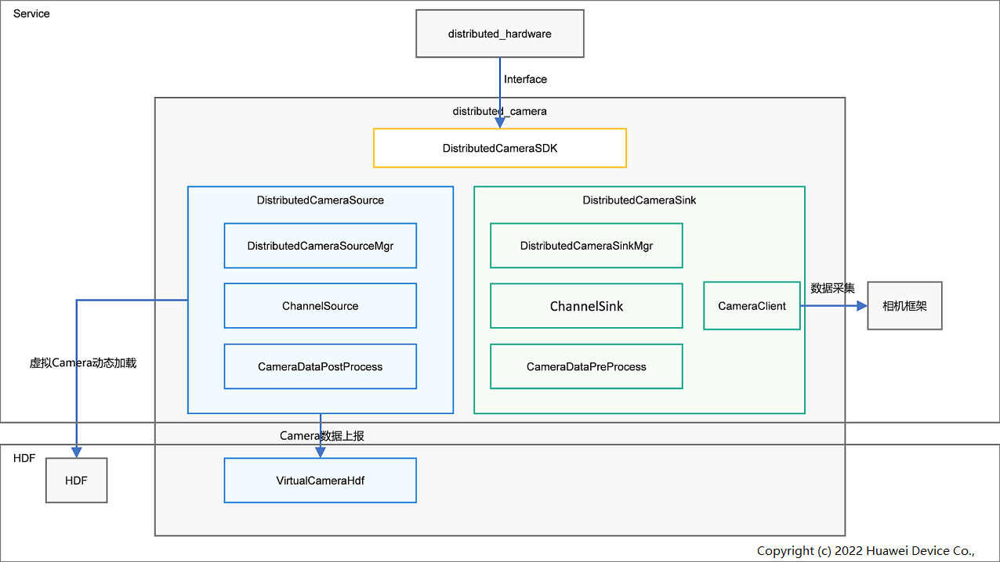

# **分布式相机部件**

## **简介**

分布式相机是多个设备的相机同时协同使用的能力。分布式相机部件是为分布式硬件子系统提供这一能力的部件。本部件不直接对接应用，只向分布式硬件框架子系统提供C++接口。应用可以通过相机框架的接口使用分布式相机部件操作其他设备的Camera，使用方式与本地相机一致。

其系统架构图如下图所示：



**分布式相机接口(DistributedCameraSDK)**：为分布式硬件管理框架提供超级终端虚拟Camera使能/去使能能力，以及相机状态。

**分布式相机主控端生命周期管理(DistributedCameraSourceMgr)**：通过状态机管理主控端Camera状态，负责主控端相关对象的创建销毁，以及两端的参数协商。

**分布式相机被控端生命周期管理(DistributedCameraSinkMgr)**：管理被控端Camera状态，负责被控端相关对象的创建销毁，以及两端的参数协商。

**通道模块(Channel)**：通过软总线连接主控端与被控端，接收发送主控端的相机指令或被控端的图像信息。

**数据处理器(DataProcess)**：对相机框架返回的图像数据做处理（编解码、色彩空间转换、分辨率缩放、帧率调整，角度调整等）。

**分布式相机客户端(CameraClient)**：被控端调用多媒体接口查询操作本地相机（查询相机数量及相关信息；打开、关闭、获取流等操作）。

**虚拟相机HDF层实现(VirtualCameraHdf)**：在HDF层建立的虚拟Camera硬件，能够被多媒体框架发现和加载，像使用本地的Camera一样被使用

## **目录**

```
/foundation/distributedhardware/distributed_camera
├── common                                 # 分布式相机公共模块
├── interfaces                             # 分布式相机对外接口模块
├── sa_profile                             # 分布式相机SA配置模块
├── services                               # 服务模块
│   └── cameraservice                      # 相机服务模块
│       ├── base                           # 分布式相机两端公共部分
│       ├── cameraoperator                 # 分布式相机相机操作模块
│       ├── sinkservice                    # 分布式相机被控端服务模块
│       └── sourceservice                  # 分布式相机主控端服务模块
│   ├── channel                            # 分布式相机通道模块
│   └── data_process                       # 分布式相机数据处理模块
```

## **约束**
**语言限制**：C++语言。
**组网环境**：必须确保设备在同一个局域网中。
**操作系统限制**：OpenHarmony操作系统。

## **说明**
### **概念说明**
#### 主控端（source）：控制端，通过调用分布式相机能力，使用被控端的摄像头进行预览、拍照、录像等功能。
#### 被控端（sink）：被控制端，通过分布式相机接收主控端的命令，使用本地摄像头为主控端提供图像数据。
#### Metadata：又叫元数据，是用于控制相机各种属性的参数。

### **接口说明**
分布式相机组件实现分布式硬件管理框架提供的接口，分布式硬件管理框架统一调用接口实现虚拟硬件驱动注册等功能。

### **场景说明**
被控端设备上线之后，主控端可以使能该设备相机并像使用本地相机一样使用被控端相机，直到被控端设备下线。

### **流程说明**
#### **1. 设备开机启动**
系统拉起分布式相机的SA服务，Source侧被初始化，相关模块被初始化。

#### **2. 设备组网上线**
设备上线后，分布式硬件管理框架同步到上线设备的相机硬件信息并使能，使能成功后在系统中会新增分布式相机驱动并通知到相机框架，相机框架统一管理本地相机和分布式相机驱动；上层应用通过相机框架接口可以查询到分布式相机，并按照和本地相机相同的接口使用分布式相机。

#### **3. 设备下线**
设备下线后，分布式硬件管理框架去使能下线设备的相机硬件，本地移除分布式相机驱动并通知到相机框架，此时下线设备的分布式相机不可用。

## **相关仓**
****
**分布式硬件子系统：**

设备管理
[device_manager](https://gitee.com/openharmony/distributedhardware_device_manager)

分步式硬件管理框架
[distributed_hardware_fwk](https://gitee.com/openharmony/distributedhardware_distributed_hardware_fwk)

**分布式相机
[distributed_camera](https://gitee.com/openharmony/distributedhardware_distributed_camera)**

分布式屏幕
[distributed_screen](https://gitee.com/openharmony/distributedhardware_distributed_screen)