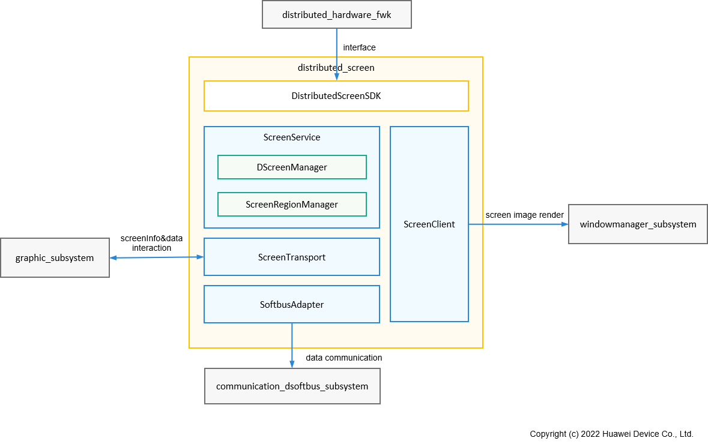

# **分布式屏幕部件**

## **简介**

分布式屏幕是一种屏幕虚拟化能力，支持用户指定组网认证过的其他OpenHarmony设备的屏幕作为Display的显示区域。在分布式硬件子系统中，分布式屏幕组件提供跨设备屏幕能力调用，为OpenHarmony操作系统提供系统投屏、屏幕镜像、屏幕分割等能力的实现。

系统架构如下图所示：



**屏幕区域管理（ScreenRegionManager）**：管理主控端映射在被控端屏幕上的显示区域的状态，包括为显示区域指定显示的display，设置显示区域的宽高，解码类型等参数。

**分布式屏幕管理（DScreenManager）**：管理被控端屏幕的参数和状态，负责主控端相关对象的创建和销毁。

**屏幕服务（ScreenService）**：分布式屏幕主控端SA服务和分布式屏幕被控端SA服务，负责处理分布式硬件管理框架的IPC调用

**软总线适配器（SoftbusAdapter）**：对接软总线传输接口，为屏幕图像、输入事件等提供封装的统一调用接口，实现设备间的流数据、字节数据传输和交互。

**屏幕传输组件（ScreenTransport）**：分布式屏幕传输模块，实现屏幕图像数据编码、解码、发送、接收。

**屏幕代理客户端（ScreenClient）**：屏幕图像显示代理客户端，用于在设备上显示其他设备投射过来的屏幕图像数据。


## **目录**

```
/foundation/distributedhardware/distributed_screen
├── common                                  # 分布式屏幕公共数据定义，包括常量、错误码、日志、工具等
├── interface                               # 分布式屏幕SDK，包含主控端和被控端服务调用接口
├── sa_profile                              # 分布式屏幕的SA配置信息
├── screenhandler                           # 分布式屏幕硬件信息上报、设备状态变化通知，由分布式硬件管理框架加载
├── services                                # 分布式屏幕主控端和被控端功能主体业务实现
│   └── common                              # 分布式屏幕功能主控端、被控端共用功能实现
│       ├── databuffer                      # 屏幕数据存储定义
│       └── screen_channel                  # 屏幕数据传输通道接口定义
│   ├── screenclient                        # 分布式屏幕代理客户端实现
│   ├── screendemo                          # 分布式屏幕demo
│   └── screenservice                       # 分布式屏幕主体功能实现
│       └── sinkservice                     # 分布式屏幕被控端服务功能实现
│           ├── dscreenservice              # 分布式屏幕被控端SA
│           └── screenregionmgr             # 分布式屏幕被控端显示区域管理
│       └── sourceservice                   # 分布式屏幕主控端服务功能实现
│           ├── dscreenmgr                  # 分布式屏幕主控端屏幕管理
│           └── dscreenservice              # 分布式屏幕主控端SA
│       └── screentransport                 # 分布式屏幕传输组件
│           ├── screendatachannel           # 屏幕数据传输通道，用于传输组件和编解码器之间数据传输
│           ├── screensinkprocessor         # 分布式屏幕被控端数据处理模块，包括解码等
│           ├── screensinktrans             # 分布式屏幕被控端数据传输组件，包含数据传输通道channel和数据处理模块processor
│           ├── screensourceprocessor       # 分布式屏幕主控端数据处理模块，包括编码等
│           └── screensourcetrans           # 分布式屏幕主控端数据传输组件，包含数据传输通道channel和数据处理模块processor
│       └── softbusadapter                  # 软总线接口适配器，为屏幕传输、触控事件传输提供统一传输接口
```

## **约束**
**语言限制**：C++语言。
**组网环境**：必须确保设备在同一个局域网中。
**操作系统限制**：OpenHarmony操作系统。

## **说明**
### **概念说明**
主控端（source）：控制端，通过调用分布式屏幕能力，使用被控端的屏幕用于显示主控端设备的屏幕内容。
被控端（sink）：被控制端，通过分布式屏幕接收主控端的控制，在本地对接窗口用于接收和显示主控端设备的屏幕内容。

### **接口说明**
分布式屏幕实现分布式硬件管理框架提供的接口，由分布式硬件管理框架统一调用接口实现虚拟屏幕硬件的创建和注册功能。

### **场景说明**
设备组网认证后，主控端设备可以指定被控端设备的屏幕来显示Display绘制的内容。

### **流程说明**
#### **1. 设备开机启动**
系统拉起分布式屏幕的SA服务，Source侧被初始化，相关模块被初始化。

#### **2. 设备组网上线**
设备上线后，分布式硬件管理框架同步到上线设备的屏幕硬件信息并使能，使能成功后在系统中会新增虚拟屏幕并通知到窗口子系统，窗口子系统统一管理本地屏幕和分布式屏幕；北向应用通过窗口子系统提供的接口可以查询到分布式屏幕，并按照窗口子系统提供的接口来使用分布式屏幕。

#### **3. 屏幕数据流转**
（1）主控端图形子系统将需要发送屏幕数据保存在编码器创建的输入Surface中。
（2）主控端编码器将输入数据进行编码，并将编码结果返回传输组件screensourcetrans。
（3）主控端传输组件screensourcetrans将编码后的数据通过传输通道screendatachannel发送到softbusadapter，并经由软总线子系统发送到被控端端设备。
（4）被控端设备软总线子系统收到屏幕数据后，通过softbusadapter返回给被控端传输通道screendatachannel。
（5）被控端传输通道screendatachannel将获取到的屏幕数据传递给解码器进行解码。
（6）解码器将屏幕数据解码，并将解码后的数据保存到被控端代理显示窗口设置到解码器的Surface中，最终由窗口将画面显示在屏幕上。

#### **4. 设备下线**
设备下线后，分布式硬件管理框架去使能下线设备的屏幕硬件，本地移除对应的虚拟屏幕并通知窗口子系统，此时下线设备的分布式屏幕不可用。

## **相关仓**
****
**分布式硬件子系统：**

设备管理
[distributedhardware_device_manager](https://gitee.com/openharmony/distributedhardware_device_manager)

分步式硬件管理框架
[distributedhardware_distributed_hardware_fwk](https://gitee.com/openharmony/distributedhardware_distributed_hardware_fwk)

分布式相机
[distributedhardware_distributed_camera](https://gitee.com/openharmony/distributedhardware_distributed_camera)

**分布式屏幕
[distributedhardware_distributed_screen](https://gitee.com/openharmony/distributedhardware_distributed_screen)**