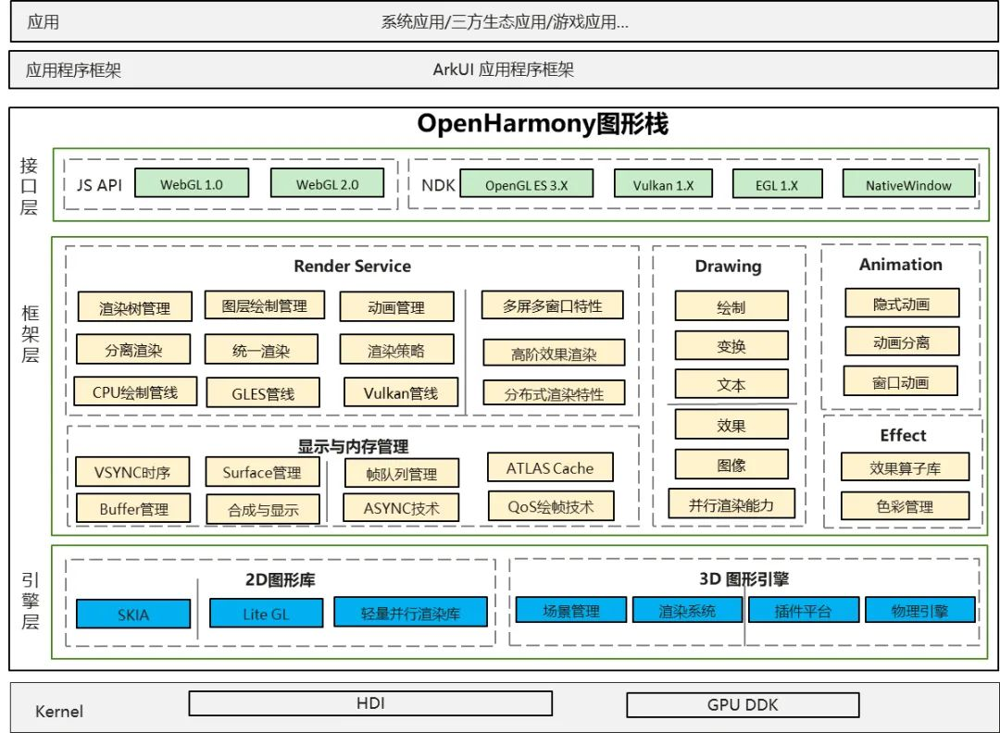

# graphic_graphic_2d

- [Introduction](#Introduction)
- [directory](#directory)
- [Repositories Involved](#RepositoriesInvolved)

## Introduction

**Graphic subsystem** provides graphical interface capabilities.

Its main structure is shown in the following figure:



The layered description of the OpenHarmony graphics stack is as follows:

• Interface layer: Provides native API capabilities for graphics, including: WebGL, Native Drawing drawing capabilities, OpenGL instruction-level drawing capabilities support, etc.

• Framework layer: divided into five modules: Render Service, Drawing, Animation, Effect, Display and Memory Management.
| Module                        | Capability Description                                                                                                                                                                                                                                                                                                                                                            |
|-------------------------------|-----------------------------------------------------------------------------------------------------------------------------------------------------------------------------------------------------------------------------------------------------------------------------------------------------------------------------------------------------------------------------------|
| Render Servicel               | Provides the rendering capabilities of the UI framework. Its core responsibility is to convert ArkUI's control description into drawing tree information, and perform optimal path rendering according to the corresponding rendering strategy. At the same time, it is responsible for the core underlying mechanism of UI sharing in multi-window smoothness and spatial state. |
| Drawing                       | Provides a standardized interface within the graphics subsystem, and mainly completes basic functions such as 2D rendering, 3D rendering and rendering engine management.                                                                                                                                                                                                         |
| Animation                     | Provides related capabilities of the animation engine.                                                                                                                                                                                                                                                                                                                            |
| Effect                        | Mainly completes the ability to process image effects, rendering effects and other effects, including: multi-effect series and parallel processing, adding rendering effects, control interaction effects and other related capabilities during layout.                                                                                                                           |
| Display and Memory Management | This module is the main module for the decoupling of the graphics stack and hardware. It mainly defines the display and memory management capabilities of OpenHarmony. The defined southbound HDI interface requires different OEMs to complete the adaptation of the OpenHarmony graphics stack. match.                                                                          |

• Engine layer: includes two modules, 2D graphics library and 3D graphics engine. The 2D graphics library provides the underlying API for 2D graphics rendering, and supports the underlying capabilities of graphics rendering and text rendering. 3D graphics engine capabilities are still under construction.


## content
```
foundataion/graphic/graphic_2d
├── figures                      # Markdown referenced image catalog
├── frameworks                   # framework code directory
│   ├── animation_server         # animationServer code
│   ├── bootanimation            # Boot animation directory
│   ├── dumper                   # graphic dumper code
│   ├── fence                    # fence code
│   ├── vsync                    # Vsync code
├── rosen                        # framework code directory
│   ├── build                    # build instructions
│   ├── doc                      # doc
│   ├── include                  # external header file code
│   ├── lib                      # lib
│   ├── modules                  # graphic Each module code of the subsystem
│   ├── samples                  # sample code
│   ├── test                     # develop test code
│   ├── tools                    # tool code
├── interfaces                   # graphical interface storage directory
│   ├── innerkits                # internal native interface storage directory
│   └── kits                     # js/napi external interface storage directory
└── utils                        # widget storage directory
```


## Repositories Involved<a name="RepositoriesInvolved"></a>
- **graphic_graphic_2d**
- [ace_ace_engine](https://gitee.com/openharmony/ace_ace_engine)
- [aafwk_standard](https://gitee.com/openharmony/aafwk_standard)
- [multimedia_player_framework](https://gitee.com/openharmony/multimedia_player_framework)
- [multimedia_camera_framework](https://gitee.com/openharmony/multimedia_camera_framework)
- [Windowmanager](https://gitee.com/openharmony/windowmanager)