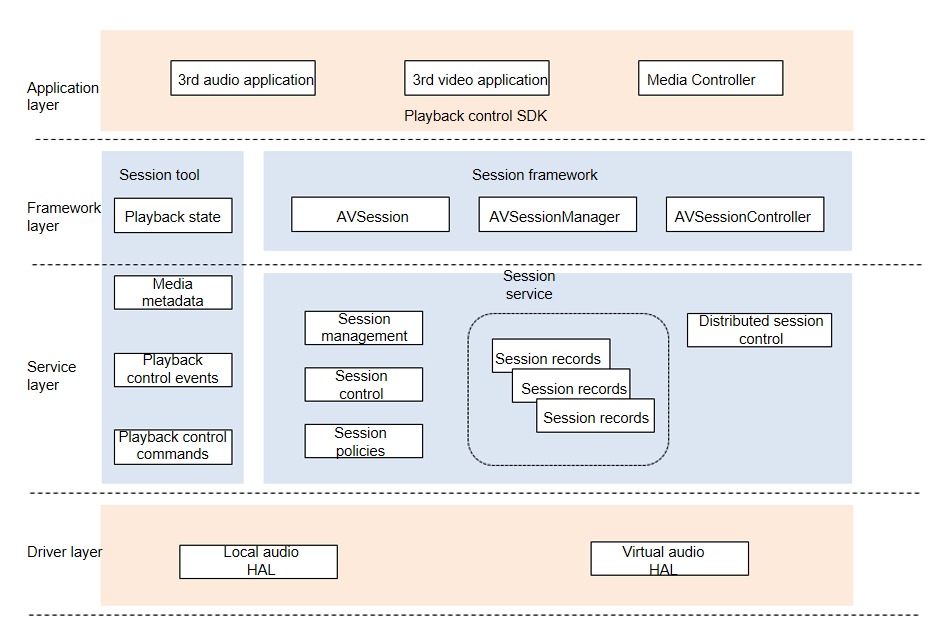

# AVSession Component

## Introduction

The AVSession component provides unified media control capabilities for the system. It enables users to use the system's Media Controller to control the playback behavior of third-party media applications on the local and remote devices and view related playback information.

#### Architecture Objective

The AVSession component aims to provide unified local and distributed media playback control capabilities and experience.

The component uses a global playback control entry to fully present media information and distributed media device information, so users can operate remote media as they operate local media.

The component provides simplified JS APIs for developers to quickly build media applications and easily access Media Controller to use distributed playback control capabilities.

## Logical Architecture



### Introduction to module responsibilities

| module name                                      | responsibilities                                             |
| ------------------------------------------------ | ------------------------------------------------------------ |
| AVSession                                        | A session object that supports configuring session properties and can proactively update playback status and metadata. |
| AVSessionController                              | The controller object can obtain the playback status and metadata of the session, remotely send control commands to the session side, or listen to the update events of the session side by subscribing. |
| AVSessionManager                                 | Provides the ability to query and obtain a specified session controller for basic information about the system's global sessions, and to limit the app's permissions. |
| AVPlaybackCommand(Playback control commands)     | Used to describe the audio and video broadcast command tool class, the encapsulation object of the broadcast command, support setting and obtaining commands. |
| AVSessionEvent(Playback control events)          | A utility class that describes audio and video playback events, encapsulates session events, and is sent and received by the session controller. |
| AVPlaybackState(Playback state)                  | A tool class that describes the status of audio and video playback, supporting cross-process delivery. |
| AVSessionMetadata(Media metadata)                | A utility class that describes session metadata information, represented as key-value pairs, and supports cross-process passing. |
| AVSessionService(Session service)                | The system global session manages the SA service and implements the lifecycle callback of the session service. |
| AVSessionItem(Session records)                   | An object that describes a service-side session record, holds a session label, and updates the record synchronously based on the behavior of the session side. |
| AVSessionStrategy(Session policies)              | Contains system session distribution policies and session sequencing policies, and supports substitution. |
| RemoteSessionSource(Distributed session control) | Used to send local sessions to the remote end and synchronize local session information. |
| RemoteSessionSink(Distributed session control)   | Used to receive remote sessions and synchronize remote session information. |

Data and command interaction between applications and AVSessionService(Session Service) are carried in media sessions(AVSession). Applications store information(Session records) in AVSessionService through sessions. AVSessionService receives control commands(Playback control events and Playback control commands) from system applications or external systems and forwards them to the applications, which then provide the functions as instructed.

- AVSession: An audio and video application applies for a session from AVSessionManager. It is then bound to the session. Through this session, the application and system exchange data and control commands. If an application does not apply for a session, it cannot run in the background.

- AVSessionController: Media Controller applies for a controller from AVSessionManager. Through this controller, Media Controller controls the session, thereby controlling application behavior.

- Distributed session control: After a local session is created, it is synchronized to a remote device, and a remote session is created. The remote session is controlled by sending control commands to the remote device's AVSessionService through its AVSessionController.

## Directory Structure

The structure of the repository directory is as follows:

```
/foundation/multimedia/av_session # Service code of the AVSession component
├── frameworks                             # Framework code
│   ├── common                             # Common framework code
│   ├── js                                 # JS framework implementation
│   └── native                             # Native framework implementation
├── interfaces                             # External APIs
│   ├── inner_api                          # Native external API files
│   └── kits                               # External JS API files
├── sa_profile
├── services                               # Service implementation
│   ├── etc
│   └── session
│       ├── adapter                        # External dependency adaptation
│       ├── ipc                            # IPC implementation
│       └── server                         # Service code implementation
│           └── remote                     # Distributed service implementation
├── utils                                  # Public library
└── bundle.json                            # Compilation file
```

## Repositories Involved

[**multimedia_av_session**](https://gitee.com/openharmony/multimedia_av_session)