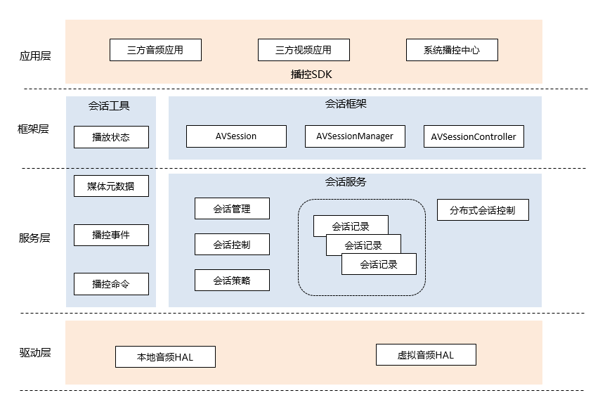

# AVSession部件<a name="ZH-CN_TOPIC_0000001148809513"></a>

## 简介<a name="section1158716411637"></a>

AVSession部件为系统提供了统一的媒体控制能力，当三方应用在OpenHarmony系统上运行时，用户可以通过系统播控中心对本端和组网内的远端音视频应用的播放行为进行控制，展示相关播放信息。

#### 架构目标<a name="avsession_targets"></a>

构建统一的本地和分布式的媒体播控能力及体验，包括：

1、面向用户：提供便捷的全局播控入口，将媒体信息充分展示给用户。同时自动展示分布式媒体设备信息，用户操作远端媒体如同操作本地媒体。

2、面向开发者：向开发者提供精简的JS接口，帮助开发者快速构建媒体应用，并且能够方便的接入系统的播控中心，使用分布式播控能力。

## 逻辑架构<a name="avsession_arch"></a>



### 模块职责介绍

| 模块名称                              | 职责                                                         |
| ------------------------------------- | ------------------------------------------------------------ |
| AVSession                             | 会话对象，支持配置会话属性，并可主动更新播放状态和元数据。   |
| AVSessionController                   | 控制器对象，可获取会话的播放状态和元数据，远程发送控制命令到会话端，也可以通过订阅监听会话端的更新事件。 |
| AVSessionManager                      | 提供系统全局会话基本信息的查询和获取指定会话控制器的能力，并对应用的权限进行限权。 |
| AVPlaybackCommand（播控命令）         | 用于描述音视频播控命令工具类，播控命令的封装对象，支持设置和获取命令。 |
| AVSessionEvent（播控事件）            | 用于描述音视频播放事件的工具类，对会话事件进行封装，由会话控制器发送和接收。 |
| AVPlaybackState（播放状态）           | 用于描述音视频播放状态的工具类，支持跨进程传递。             |
| AVSessionMetadata（媒体元数据）       | 用于描述会话元数据信息的工具类，以键值对的方式表示，支持跨进程传递。 |
| AVSessionService（会话服务）          | 系统全局会话管理SA服务，实现会话服务的生命周期回调。         |
| AVSessionItem（会话记录）             | 用于描述服务侧会话记录的对象，持有会话标签，根据会话端的行为同步更新记录。 |
| AVSessionStrategy（会话策略）         | 包含系统会话分发策略和会话排序策略，支持替换。               |
| RemoteSessionSource（分布式会话控制） | 用于将本地会话发送到远端并同步本地会话信息。                 |
| RemoteSessionSink（分布式会话控制）   | 用于接收远端会话并同步远端会话信息。                         |

媒体会话（AVSession）承载应用与系统服务（会话服务）间的数据和命令交互功能，应用通过会话将信息（会话记录）保存在系统服务内，系统服务接收系统应用或者外部的控制命令（播控事件、播控命令），并转发到应用端，由应用实现对应的功能。

会话：音视频应用向控制中心（AVSessionManager）申请会话，会话与应用绑定。应用通过会话向系统传递信息，系统通过会话向应用传递控制命令，如果应用不申请会话，则无法在后台运行。

控制器（AVSessionController）：系统播控中心向会话控制中心申请控制器，播控中心通过控制器可以控制指定的会话，进而控制应用行为。

分布式会话控制：组网内的设备创建本地会话后，本地会话会同步到远端，生成远端会话，并支持远端控制。需要控制远端会话时，通过远端控制器将控制命令发送到远端会话控制中心。

## 目录结构<a name="section161941989596"></a>

仓目录结构如下：

```
/foundation/multimedia/av_session  # 会话部件业务代码
├── frameworks                             # 框架代码
│   ├── common                             # 框架公共代码
│   ├── js                                 # js框架实现
│   └── native                             # native框架实现
├── interfaces                             # 外部接口层
│   ├── inner_api                          # native外部接口文件
│   └── kits                               # js外部接口文件
├── sa_profile
├── services                               # 服务实现
│   ├── etc
│   └── session
│       ├── adapter                        # 外部依赖适配
│       ├── ipc                            # ipc通信实现
│       └── server                         # 服务端代码实现
│           └── remote                     # 分布式服务实现
├── utils                                  # 会话部件公共库
└── bundle.json                            # 编译文件
```

## 约束<a name="section1533973044317"></a>

详细约束请参考[约束和限制](https://gitee.com/openharmony/docs/blob/master/zh-cn/application-dev/media/avsession-overview.md)

## 说明

详细接口说明请参考[API文档](https://gitee.com/openharmony/docs/blob/master/zh-cn/application-dev/reference/apis/js-apis-avsession.md)

使用说明请参考[开发指导](https://gitee.com/openharmony/docs/blob/master/zh-cn/application-dev/media/avsession-guidelines.md)

## 相关仓<a name="section1533973044317"></a>

[**multimedia_av_session**](https://gitee.com/openharmony/multimedia_av_session)